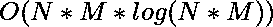
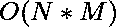

# 矩阵中到达目的地的最小可能修改量

> 原文:[https://www . geeksforgeeks . org/在到达目的地的矩阵中尽可能少的修改/](https://www.geeksforgeeks.org/minimum-possible-modifications-in-the-matrix-to-reach-destination/)

给定一个由整数 **1、2、3** 和 **4** 组成的大小为 **N x M** 的矩阵。
每个值代表该单元格的可能移动:

```
1 -> move left
2 -> move right
3 -> move up
4 -> move down.
```

任务是找到矩阵中所需的最小可能变化，以便存在从 **(0，0)** 到 **(N-1，M-1)** 的路径。

**示例:**

> **输入:** mat[][] = {{2，2，4}，
> {1，1，1}，
> {3，3，2 } }；
> **输出:** 1
> 将 mat[1][2]的值改为 4。所以移动的顺序是
> (0，0) - > (0，1) - > (0，2) - > (1，2) - > (2，2)
> 
> **输入:** mat[][] = {{2，2，1}，
> {4，2，3}，
> {4，3，2}}
> **输出:** 2

**先决条件:**
1。[迪克斯特拉算法](https://www.geeksforgeeks.org/dijkstras-shortest-path-algorithm-greedy-algo-7/)T5】2。 [0-1 BFS](https://www.geeksforgeeks.org/0-1-bfs-shortest-path-binary-graph/)

**方法 1**

*   让我们将 2D 矩阵的每个单元视为加权图的一个节点，并且每个节点最多可以有四个相连的节点(可能有四个方向)。每条边的权重如下:
    *   权重(U，V) = 0，如果节点 U 的移动方向指向 V，否则
    *   重量(单位，体积)= 1
*   现在，这基本上简化为最短路径问题，可以使用[迪克斯特拉算法](https://www.geeksforgeeks.org/dijkstras-shortest-path-algorithm-greedy-algo-7/)来计算

下面是上述方法的实现:

## C++

```
// CPP program to find minimum possible
// changes required in the matrix
#include <bits/stdc++.h>
using namespace std;

// Function to find next possible node
int nextNode(int x, int y, int dir, int N, int M)
{
    if (dir == 1)
        y--;
    else if (dir == 2)
        y++;
    else if (dir == 3)
        x--;
    else
        x++;

    // If node is out of matrix
    if (!(x >= 0 && x < N && y >= 0 && y < M))
        return -1;
    else
        return (x * N + y);
}

// Prints shortest paths from src
// to all other vertices
int dijkstra(vector<pair<int, int> >* adj,
             int src, int dest, int N, int M)
{
    // Create a set to store vertices
    // that are bein preprocessed
    set<pair<int, int> > setds;

    // Create a vector for distances
    // and initialize all distances
    // as infinite (large value)
    vector<int> dist(N * M, INT_MAX);

    // Insert source itself in Set
    // and initialize its distance as 0
    setds.insert(make_pair(0, src));
    dist[src] = 0;

    /* Looping till all shortest
        distance are finalized
        then setds will become empty */
    while (!setds.empty()) {
        // The first vertex in Set
        // is the minimum distance
        // vertex, extract it from set.
        pair<int, int> tmp = *(setds.begin());
        setds.erase(setds.begin());

        // vertex label is stored in second
        // of pair (it has to be done this
        // way to keep the vertices sorted
        // distance (distance must be
        // first item in pair)
        int u = tmp.second;

        // 'i' is used to get all adjacent
        // vertices of a vertex
        vector<pair<int, int> >::iterator i;
        for (i = adj[u].begin();
             i != adj[u].end(); ++i) {
            // Get vertex label and weight
            // of current adjacent of u.
            int v = (*i).first;
            int weight = (*i).second;

            // If there is shorter path from u to v
            if (dist[v] > dist[u] + weight) {
                // If distance of v is not
                // INF then it must be
                // in our set, so removing it
                // and inserting again with
                // updated less distance.
                // Note : We extract only
                // those vertices from Set
                // for which distance is
                // finalized. So for them,
                // we would never reach here
                if (dist[v] != INT_MAX)
                    setds.erase(setds.find(
                        { dist[v], v }));

                // Updating distance of v
                dist[v] = dist[u] + weight;
                setds.insert(make_pair(dist[v], v));
            }
        }
    }

    // Return the distance
    return dist[dest];
}

// Function to find minimum possible
// changes required in the matrix
int MinModifications(vector<vector<int> >& mat)
{
    int N = mat.size(), M = mat[0].size();

    // Converting given matrix to a graph
    vector<pair<int, int> > adj[N * M];

    for (int i = 0; i < N; i++) {
        for (int j = 0; j < M; j++) {
            // Each cell is a node,
            // with label i*N + j
            for (int dir = 1; dir <= 4; dir++) {
                // Label of node if we
                // move in direction dir
                int nextNodeLabel
                    = nextNode(i, j, dir, N, M);

                // If invalid(out of matrix)
                if (nextNodeLabel == -1)
                    continue;

                // If direction is same as mat[i][j]
                if (dir == mat[i][j])
                    adj[i * N + j].push_back(
                        { nextNodeLabel, 0 });
                else
                    adj[i * N + j].push_back(
                        { nextNodeLabel, 1 });
            }
        }
    }

    // Applying dijkstra's algorithm
    return dijkstra(adj, 0,
                    (N - 1) * N + M - 1, N, M);
}

// Driver code
int main()
{
    vector<vector<int> > mat = { { 2, 2, 1 },
                                 { 4, 2, 3 },
                                 { 4, 3, 2 } };

    // Function call
    cout << MinModifications(mat);

    return 0;
}
```

## 蟒蛇 3

```
# Python 3 program to find minimum possible
# changes required in the matrix
import heapq as hq

# Function to find next possible node
def nextNode(x, y, dirn, N, M):
    if (dirn == 1):
        y-=1
    elif (dirn == 2):
        y+=1
    elif (dirn == 3):
        x-=1
    else:
        x+=1

    # If node is out of matrix
    if (not(x >= 0 and x < N and y >= 0 and y < M)):
        return -1
    else:
        return (x * N + y)

# Prints shortest paths from src
# to all other vertices
def dijkstra( adj, src, dest, N, M):
    # Create a set to store vertices
    # that are being preprocessed
    setds=[]

    # Create a vector for distances
    # and initialize all distances
    # as infinite (large value)
    dist=[float('inf')]*(N * M)

    # Insert source itself in Set
    # and initialize its distance as 0
    hq.heappush(setds,(0, src))
    dist[src] = 0

    # Looping till all shortest
    # distance are finalized
    # then setds will become empty
    while (setds) :
        # The first vertex in Set
        # is the minimum distance
        # vertex, extract it from set.
        tmp = hq.heappop(setds)

        # vertex label is stored in second
        # of pair (it has to be done this
        # way to keep the vertices sorted
        # distance (distance must be
        # first item in pair)
        u = tmp[1]

        # 'i' is used to get all adjacent
        # vertices of a vertex
        for i in adj[u] :
            # Get vertex label and weight
            # of current adjacent of u.

            v = i[0]
            weight = i[1]

            # If there is shorter path from u to v
            if (dist[v] > dist[u] + weight):
                # Updating distance of v
                dist[v] = dist[u] + weight
                hq.heappush(setds, (dist[v], v))

    # Return the distance
    return dist[dest]

# Function to find minimum possible
# changes required in the matrix
def MinModifications(mat):
    N = len(mat); M = len(mat[0])

    # Converting given matrix to a graph
    adj=[[] for _ in range(N*M)]

    for i in range(N):
        for j in range(M) :
            # Each cell is a node,
            # with label i*N + j
            for dirn in range(1, 5):
                # Label of node if we
                # move in direction dirn
                nextNodeLabel= nextNode(i, j, dirn, N, M)

                # If invalid(out of matrix)
                if (nextNodeLabel == -1):
                    continue

                # If direction is same as mat[i][j]
                if (dirn == mat[i][j]):
                    adj[i * N + j].append((nextNodeLabel, 0))
                else:
                    adj[i * N + j].append((nextNodeLabel, 1 ))

    # Applying dijkstra's algorithm
    return dijkstra(adj, 0,
                    (N - 1) * N + M - 1, N, M)

# Driver code
if __name__ == '__main__':
    mat = [[2, 2, 1 ,],
        [4, 2, 3 ,],
        [4, 3, 2]] 

    # Function call
    print(MinModifications(mat))
```

**Output:** 

```
2
```

**时间复杂度:** 

**方法二**
这里边权重是 0，只有 1，也就是 0-1 图。使用 [0-1 BFS](https://www.geeksforgeeks.org/0-1-bfs-shortest-path-binary-graph/) 可以找到此类图中的最短路径。

下面是上述方法的实现:

## C++

```
// C++ program to find minimum
// possible changes required
// in the matrix
#include <bits/stdc++.h>
using namespace std;

// Function to find next possible node
int nextNode(int x, int y, int dir,
             int N, int M)
{
    if (dir == 1)
        y--;
    else if (dir == 2)
        y++;
    else if (dir == 3)
        x--;
    else
        x++;

    // If node is out of matrix
    if (!(x >= 0 && x < N && y >= 0 && y < M))
        return -1;
    else
        return (x * N + y);
}

// Prints shortest distance
// from given source to
// every other vertex
int zeroOneBFS(vector<pair<int, int> >* adj,
               int src, int dest, int N, int M)
{
    // Initialize distances
    // from given source
    int dist[N * M];
    for (int i = 0; i < N * M; i++)
        dist[i] = INT_MAX;

    // Double ended queue to do BFS.
    deque<int> Q;
    dist[src] = 0;
    Q.push_back(src);

    while (!Q.empty()) {
        int v = Q.front();
        Q.pop_front();

        for (auto i : adj[v]) {
            // Checking for the optimal distance
            if (dist[i.first] > dist[v]
                                    + i.second) {
                dist[i.first] = dist[v]
                                + i.second;

                // Put 0 weight edges to front
                // and 1 weight edges to back
                // so that vertices are processed
                // in increasing order of weights.
                if (i.second == 0)
                    Q.push_front(i.first);
                else
                    Q.push_back(i.first);
            }
        }
    }

    // Shortest distance to
    // reach destination
    return dist[dest];
}

// Function to find minimum possible
// changes required in the matrix
int MinModifications(vector<vector<int> >& mat)
{
    int N = mat.size(), M = mat[0].size();

    // Converting given matrix to a graph
    vector<pair<int, int> > adj[N * M];

    for (int i = 0; i < N; i++) {
        for (int j = 0; j < M; j++) {
            // Each cell is a node
            // with label i*N + j
            for (int dir = 1; dir <= 4; dir++) {
                // Label of node if we
                // move in direction dir
                int nextNodeLabel = nextNode(i, j,
                                             dir, N, M);

                // If invalid(out of matrix)
                if (nextNodeLabel == -1)
                    continue;

                // If direction is same as mat[i][j]
                if (dir == mat[i][j])
                    adj[i * N + j].push_back(
                        { nextNodeLabel, 0 });
                else
                    adj[i * N + j].push_back(
                        { nextNodeLabel, 1 });
            }
        }
    }

    // Applying dijkstra's algorithm
    return zeroOneBFS(adj, 0,
                      (N - 1) * N + M - 1, N, M);
}

// Driver code
int main()
{
    vector<vector<int> > mat = { { 2, 2, 1 },
                                 { 4, 2, 3 },
                                 { 4, 3, 2 } };

    // Function call
    cout << MinModifications(mat);

    return 0;
}
```

## 蟒蛇 3

```
# Python3 program to find minimum
# possible changes required
# in the matrix
from collections import deque

# Function to find next possible node
def nextNode(x, y, dir, N, M):
    if (dir == 1):
        y -= 1
    elif (dir == 2):
        y += 1
    elif (dir == 3):
        x -= 1
    else:
        x += 1

    # If node is out of matrix
    if (not (x >= 0 and x < N and y >= 0 and y < M)):
        return -1
    else:
        return (x * N + y)

# Prints shortest distance
# from given source to
# every other vertex
def zeroOneBFS(adj, src, dest, N, M):

    # Initialize distances
    # from given source
    dist = [10**8] *(N * M)

    # Double ended queue to do BFS.
    Q = deque()
    dist[src] = 0
    Q.append(src)

    while (len(Q) > 0):
        v = Q.popleft()

        for i in adj[v]:

            # print(i)
            # Checking for the optimal distance
            if (dist[i[0]] > dist[v] + i[1]):
                dist[i[0]] = dist[v] + i[1]

                # Put 0 weight edges to front
                # and 1 weight edges to back
                # so that vertices are processed
                # in increasing order of weights.
                if (i[1] == 0):
                    Q.appendleft(i[0])
                else:
                    Q.append(i[0])

    # Shortest distance to
    # reach destination
    return dist[dest]

# Function to find minimum possible
# changes required in the matrix
def MinModifications(mat):
    N, M = len(mat), len(mat[0])

    # Converting given matrix to a graph
    adj = [[] for i in range(N * M)]

    for i in range(N):
        for j in range(M):

            # Each cell is a node
            # with label i*N + j
            for dir in range(1, 5):

                # Label of node if we
                # move in direction dir
                nextNodeLabel = nextNode(i, j, dir, N, M)

                # If invalid(out of matrix)
                if (nextNodeLabel == -1):
                    continue

                # If direction is same as mat[i][j]
                if (dir == mat[i][j]):
                    adj[i * N + j].append([nextNodeLabel, 0])
                else:
                    adj[i * N + j].append([nextNodeLabel, 1])

    # Applying dijkstra's algorithm
    return zeroOneBFS(adj, 0, (N - 1) * N + M - 1, N, M)

# Driver code
if __name__ == '__main__':
    mat = [ [ 2, 2, 1 ],
             [ 4, 2, 3 ],
             [ 4, 3, 2 ] ]

    # Function call
    print (MinModifications(mat))

# This code is contributed by mohit kumar 29.
```

## java 描述语言

```
<script>

// Javascript program to find minimum
// possible changes required in the matrix

// Function to find next possible node
function nextNode(x, y, dir, N, M)
{
    if (dir == 1)
        y--;
    else if (dir == 2)
        y++;
    else if (dir == 3)
        x--;
    else
        x++;

    // If node is out of matrix
    if (!(x >= 0 && x < N && y >= 0 && y < M))
        return -1;
    else
        return (x * N + y);
}

// Prints shortest distance
// from given source to
// every other vertex
function zeroOneBFS(adj, src, dest, N, M)
{

    // Initialize distances
    // from given source
    let dist = new Array(N * M);
    for(let i = 0; i < N * M; i++)
        dist[i] = Number.MAX_VALUE;

    // Double ended queue to do BFS.
    let Q = [];
    dist[src] = 0;
    Q.push(src);

    while (Q.length != 0)
    {
        let v = Q.shift();

        for(let i = 0; i < adj[v].length; i++)
        {

            // Checking for the optimal distance
            if (dist[adj[v][i][0]] > dist[v] +
                     adj[v][i][1])
            {
                dist[adj[v][i][0]] = dist[v] +
                                      adj[v][i][1];

                // Put 0 weight edges to front
                // and 1 weight edges to back
                // so that vertices are processed
                // in increasing order of weights.
                if (adj[v][i][1] == 0)
                    Q.push(adj[v][i][0]);
                else
                    Q.push(adj[v][i][0]);
            }
        }
    }

    // Shortest distance to
    // reach destination
    return dist[dest];
}

// Function to find minimum possible
// changes required in the matrix
function MinModifications(mat)
{
    let N = mat.length, M = mat[0].length;

    // Converting given matrix to a graph
    let adj = new Array(N * M);
     for(let i = 0; i < (N * M); i++)
    {
        adj[i] = [];
    }

    for(let i = 0; i < N; i++)
    {
        for(let j = 0; j < M; j++)
        {

            // Each cell is a node
            // with label i*N + j
            for(let dir = 1; dir <= 4; dir++)
            {

                // Label of node if we
                // move in direction dir
                let nextNodeLabel = nextNode(i, j,
                                             dir, N, M);

                // If invalid(out of matrix)
                if (nextNodeLabel == -1)
                    continue;

                // If direction is same as mat[i][j]
                if (dir == mat[i][j])
                    adj[i * N + j].push(
                        [nextNodeLabel, 0]);
                else
                    adj[i * N + j].push(
                        [nextNodeLabel, 1]);
            }
        }
    }

    // Applying dijkstra's algorithm
    return zeroOneBFS(adj, 0, (N - 1) * N + M - 1,
                      N, M);
}

// Driver code
let mat = [ [ 2, 2, 1 ],
            [ 4, 2, 3 ],
            [ 4, 3, 2 ] ];

document.write(MinModifications(mat));

// This code is contributed by unknown2108

</script>
```

**Output:** 

```
2
```

**时间复杂度:** 
**辅助空间:** O(N * M)