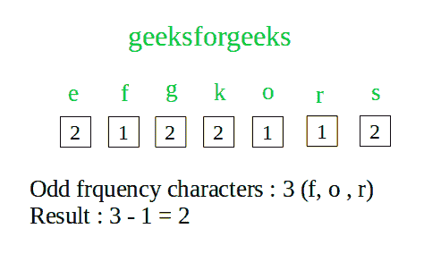

# 进行回文排列的最小去除量

> 原文:[https://www . geesforgeks . org/minimum-remove-make-回文-排列/](https://www.geeksforgeeks.org/minimum-removal-make-palindrome-permutation/)

给定一个字符串 S，我们必须找到我们可以移除的最少字符，以使字符串 S 的任何排列成为回文。
简单来说，问题陈述为:通过移除最小数量的字符，包括尽可能移除 0 个字符，以任何方式重新排列字符串，使其成为回文。
**注**:我们只考虑小字母。
**例:**

```
Input :  geeksforgeeks
Output : 2
Explanation : if we remove 2 characters lets 
say 'f' and 'r',  we remain with "geeksogeeks" 
which can be re-arranged like "skeegogeeks" 
to make it a palindrome. Removal of less than 
2 character wouldn't make this string a 
palindrome.

Input :  shubham
Output : 4
If we remove any 4 characters except 'h' (let's
say 's', 'b', 'a', 'm'),  we remain with "huh" 
which is a palindrome.
```

一种简单的方法将检查字符串的每个排列是否有回文，如果没有找到，则删除一个字符并再次检查。这种方法非常复杂，需要花费大量时间。
一种高效的**方法是注意到我们不需要打印最少的字符，只需要最少的数字。所以，一个有效的想法是关键:回文可以有两种类型，偶数长度和奇数长度回文。我们可以推导出这样一个事实:一个偶数长度的回文必须让每个字符出现偶数次(即每个字符出现的频率是偶数)。同样，奇数回文必须让每个字符出现偶数次，只有一个字符出现奇数次。
从这些事实来看，问题变得相当简单。我们检查每个字符的频率，然后计算这些字符出现奇数次的次数。那么结果是奇数频率字符总数减 1。** 

****

## **C++**

```
// CPP Program to find minimum number of removal to
// make any permutation of the string a palindrome
#include <iostream>
using namespace std;

#define MAX_CHAR 26

// function to find minimum removal of characters
int minRemoval(string str) {

  // hash to store frequency of each character
  int hash[MAX_CHAR];

  // to set hash array to zeros
  memset(hash, 0, sizeof(hash));

  // count frequency of each character
  for (int i = 0; str[i]; i++)
    hash[str[i] - 'a']++;

  // count the odd frequency characters
  int count = 0;
  for (int i = 0; i < MAX_CHAR; i++)
    if (hash[i] % 2)
      count++;

  // if count is -1 return 0
  // otherwise return count
  return (count == 0) ? 0 : count-1;
}

// Driver's Code
int main() {
  string str = "geeksforgeeks";
  cout << minRemoval(str) << endl;
  return 0;
}
```

## **Java 语言(一种计算机语言，尤用于创建网站)**

```
// Java Program to find minimum number of removal to
// make any permutation of the string a palindrome
import java.util.Arrays;
class GFG {
  static final int MAX_CHAR = 26;

  // function to find minimum removal of characters
  static int minRemoval(String str) {

    // hash to store frequency of each character
    int hash[] = new int[MAX_CHAR];

    // to set hash array to zeros
    Arrays.fill(hash, 0);

    // count frequency of each character
    for (int i = 0; i < str.length(); i++)
      hash[str.charAt(i) - 'a']++;

    // count the odd frequency characters
    int count = 0;
    for (int i = 0; i < MAX_CHAR; i++)
      if (hash[i] % 2 == 1)
        count++;

    // if count is -1 return 0
    // otherwise return count
    return (count == 0) ? 0 : count - 1;
  }
  // Driver code
  public static void main(String[] args) {
    String str = "geeksforgeeks";
    System.out.println(minRemoval(str));
  }
}
// This code is contributed by Anant Agarwal.
```

## **计算机编程语言**

```
# Python Program to find minimum number of
# removal to make any permutation of the
# string a palindrome

# function to find minimum removal of
# characters
def minRemoval(strr):

        # hash to store frequency of each character
        # to set hash array to zeros
        hash = [0] * 26

        # count frequency of each character
        for char in strr:
                hash[ord(char)-ord('a')] = hash[ord(char)-ord('a')] + 1

        # count the odd frequency characters
        count = 0
        for i in range(26):
                if hash[i]% 2:
                        count = count + 1

        # if count is 0, return 0
        # otherwise return count
        return 0 if count == 0 else count-1

# Driver's Code
if __name__ == "__main__":

        strr = "geeksforgeeks";

        # minRemoval to find minimum characters to remove
        print(minRemoval(strr))
```

## **C#**

```
// C# Program to find minimum number of
// removal to make any permutation of
// the string a palindrome
using System;

class GFG {

    static int MAX_CHAR = 26;

    // function to find minimum removal
    // of characters
    static int minRemoval(string str) {

        // hash to store frequency of
        // each character
        int []hash = new int[MAX_CHAR];

        // to set hash array to zeros
        for(int i = 0; i < MAX_CHAR; i++)
        hash[i] = 0;

        // count frequency of each character
        for (int i = 0; i < str.Length; i++)
        hash[str[i] - 'a']++;

        // count the odd frequency characters
        int count = 0;
        for (int i = 0; i < MAX_CHAR; i++)
        if (hash[i] % 2 == 1)
            count++;

        // if count is -1 return 0
        // otherwise return count
        return (count == 0) ? 0 : count - 1;
    }

    // Driver code
    public static void Main() {
        string str = "geeksforgeeks";
        Console.Write(minRemoval(str));
    }
}

// This code is contributed by nitin mittal
```

## **服务器端编程语言（Professional Hypertext Preprocessor 的缩写）**

```
<?php
// PHP Program to find minimum
// number of removal to make any
// permutation of the string a palindrome

// function to find minimum
// removal of characters
function minRemoval($str)
{

    // hash to store frequency of each
    // character and to set hash array to zeros
    $hash = array_fill(0, 26, 0);

    // count frequency of each character
    for ($i = 0; $i < strlen($str); $i++)
        $hash[ord($str[$i]) - 97]++;

    // count the odd frequency characters
    $count = 0;
    for ($i = 0; $i < 26; $i++)
        if ($hash[$i] % 2)
        $count++;

    // if count is -1 return 0
    // otherwise return count
    return ($count == 0) ? 0 : $count-1;
}

// Driver Code
$str = "geeksforgeeks";
echo minRemoval($str)."\n";

// This code is contributed by mits
?>
```

## **java 描述语言**

```
<script>
// Javascript Program to find minimum number of removal to
// make any permutation of the string a palindrome

var MAX_CHAR = 26

// function to find minimum removal of characters
function minRemoval( str)
{

  // hash to store frequency of each character
  var hash = Array(MAX_CHAR).fill(0);

  // count frequency of each character
  for (var i = 0; str[i]; i++)
    hash[str[i].charCodeAt(0) - 'a'.charCodeAt(0)]++;

  // count the odd frequency characters
  var count = 0;
  for (var i = 0; i < MAX_CHAR; i++)
    if (hash[i] % 2)
      count++;

  // if count is -1 return 0
  // otherwise return count
  return (count == 0) ? 0 : count-1;
}

// Driver's Code
var str = "geeksforgeeks";
document.write( minRemoval(str));

// This code is contributed by itsok.
</script>
```

****输出:**** 

```
2
```