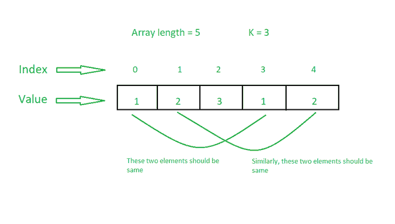

# 使所有 K 长度子阵列的总和相等所需的最小替换量

> 原文:[https://www . geeksforgeeks . org/minimum-replacements-required-make-sum-all-k-length-subarrays-equal/](https://www.geeksforgeeks.org/minimum-replacements-required-to-make-sum-of-all-k-length-subarrays-equal/)

给定一个由 **N** 个正整数和一个整数 **K** 组成的[数组](https://www.geeksforgeeks.org/array-data-structure/) **arr[]** ，任务是通过用任意整数替换最小数量的数组元素，使所有**K**-长度[个子数组](https://www.geeksforgeeks.org/subarraysubstring-vs-subsequence-and-programs-to-generate-them/)的和相等。

**示例:**

> **输入:** arr[] = {3，4，3，5，6}，K = 2
> **输出:** 2
> **解释:**
> 操作 1:用 4 个修改 arr[]替换 arr[3]为{3，4，3，4，6}。
> 操作 2:用 3 替换 arr[4]将 arr[]修改为{3，4，3，4，3}。
> 长度为 2 的所有子阵列为{{3，4}，{4，3}，{3，4}，{4，3}}。所有这些子阵列的总和是 7。因此，所需的最小操作数是 2。
> 
> **输入:** arr[] = {1，2，3，1，2}，K = 3
> **输出:** 0
> **说明:**长度为 3 的所有子阵为{{1，2，3}，{2，3，1}，{3，1，2}}。由于所有这些子阵列的总和为 6，因此所需的运算次数为 0。

**方法:**这个想法是基于这样的观察:所有[子阵](https://www.geeksforgeeks.org/generating-subarrays-using-recursion/)将具有相等的和，当所有被距离隔开的元素 **K** 相等时。



因此，通过计算相隔一段距离 **K** 的元素出现频率，找出出现次数最多的数量，就可以解决这个问题。按照以下步骤解决问题:

*   初始化一个变量**和**来存储需要的结果。
*   [使用变量 **i** 在范围](https://www.geeksforgeeks.org/range-based-loop-c/)**【0，K-1】**中迭代
    *   创建一个[图](https://www.geeksforgeeks.org/map-associative-containers-the-c-standard-template-library-stl/)，freq 来存储从 **i** 开始相隔一段距离 **K** 的元素的频率。
    *   [遍历地图](https://www.geeksforgeeks.org/traversing-a-map-or-unordered_map-in-cpp-stl/)找到出现次数最多的元素。
    *   再次，[遍历地图](https://www.geeksforgeeks.org/traversing-a-map-or-unordered_map-in-cpp-stl/) ，如果元素不等于最大出现元素，则将其频率添加到 **ans** 中。
*   打印**和**的值作为结果。

下面是上述方法的实现:

## C++

```
// C++ program for the above approach
#include <bits/stdc++.h>
using namespace std;

// Function to find minimum number of
// operations required to make sum of
// all subarrays of size K equal
void findMinOperations(int arr[],
                       int N, int K)
{
    // Stores number of operations
    int operations = 0;

    // Iterate in the range [0, K-1]
    for (int i = 0; i < K; i++) {

        // Stores frequency of elements
        // separated by distance K
        unordered_map<int, int> freq;

        for (int j = i; j < N; j += K)
            freq[arr[j]]++;

        // Stores maximum frequency
        // and corresponding element
        int max1 = 0, num;

        // Find max frequency element
        // and its frequency
        for (auto x : freq) {
            if (x.second > max1) {
                max1 = x.second;
                num = x.first;
            }
        }

        // Update the number of operations
        for (auto x : freq) {
            if (x.first != num)
                operations += x.second;
        }
    }

    // Print the result
    cout << operations;
}

// Driver Code
int main()
{
    // Given Input
    int arr[] = { 3, 4, 3, 5, 6 };
    int K = 2;
    int N = sizeof(arr) / sizeof(arr[0]);

    // Function Call
    findMinOperations(arr, N, K);

    return 0;
}
```

## Java 语言(一种计算机语言，尤用于创建网站)

```
// Java program for the above approach
import java.lang.*;
import java.util.*;

class GFG
{

  // Function to find minimum number of
  // operations required to make sum of
  // all subarrays of size K equal
  static void findMinOperations(int arr[],
                                int N, int K)
  {

    // Stores number of operations
    int operations = 0;

    // Iterate in the range [0, K-1]
    for (int i = 0; i < K; i++) {

      // Stores frequency of elements
      // separated by distance K
      Map<Integer, Integer> freq=new HashMap<>();

      for (int j = i; j < N; j += K)
        freq.put(arr[j], freq.getOrDefault(arr[j],0)+1);

      // Stores maximum frequency
      // and corresponding element
      int max1 = 0, num=-1;

      // Find max frequency element
      // and its frequency
      for (Map.Entry<Integer,Integer> x : freq.entrySet()) {
        if (x.getValue() > max1) {
          max1 = x.getValue();
          num = x.getKey();
        }
      }

      // Update the number of operations
      for ( Map.Entry<Integer,Integer> x : freq.entrySet()) {
        if (x.getKey() != num)
          operations += x.getValue();
      }
    }

    // Print the result
    System.out.print(operations);
  }

  // Driver code
  public static void main(String[] args)
  {

    // Given Input
    int arr[] = { 3, 4, 3, 5, 6 };
    int K = 2;
    int N = arr.length;

    // Function Call
    findMinOperations(arr, N, K);
  }

}

// This code is contributed by offbeat
```

## 蟒蛇 3

```
# python 3 program for the above approach

# Function to find minimum number of
# operations required to make sum of
# all subarrays of size K equal
def findMinOperations(arr, N, K):
    # Stores number of operations
    operations = 0

    # Iterate in the range [0, K-1]
    for i in range(K):
        # Stores frequency of elements
        # separated by distance K
        freq = {}

        for j in range(i,N,K):
            if arr[j] in freq:
                freq[arr[j]] += 1
            else:
                freq[arr[j]] = 1

        # Stores maximum frequency
        # and corresponding element
        max1 = 0
        num = 0

        # Find max frequency element
        # and its frequency
        for key,value in freq.items():
            if (value > max1):
                max1 = value
                num = key

        # Update the number of operations
        for key,value in freq.items():
            if (key != num):
                operations += value

    # Print the result
    print(operations)

# Driver Code
if __name__ == '__main__':

    # Given Input
    arr = [3, 4, 3, 5, 6]
    K = 2
    N = len(arr)

    # Function Call
    findMinOperations(arr, N, K)

    # This code is contributed by ipg2016107.
```

## C#

```
// C# program for the above approach
using System;
using System.Collections.Generic;

class GFG{

// Function to find minimum number of
// operations required to make sum of
// all subarrays of size K equal
static void findMinOperations(int []arr,
                              int N, int K)
{

    // Stores number of operations
    int operations = -1;

    // Iterate in the range [0, K-1]
    for(int i = 0; i < K; i++)
    {

        // Stores frequency of elements
        // separated by distance K
        Dictionary<int,
                   int> freq = new Dictionary<int,
                                              int>();

        for(int j = i; j < N; j += K)
        {
            if (freq.ContainsKey(arr[j]))
                freq[arr[j]]++;
            else
                freq.Add(arr[j], 1);
        }

        // Stores maximum frequency
        // and corresponding element
        int max1 = -1, num = 0;

        // Find max frequency element
        // and its frequency
        foreach(KeyValuePair<int, int> entry in freq)
        {
            if (entry.Key > max1)
            {
                max1 = entry.Value;
                num = entry.Key;
            }
        }

        // Update the number of operations
        foreach(KeyValuePair<int, int> entry in freq)
        {
            if (entry.Key != num)
                operations += entry.Value;
        }
    }

    // Print the result
    Console.Write(operations);
}

// Driver Code
public static void Main()
{

    // Given Input
    int []arr = { 3, 4, 3, 5, 6 };
    int K = 2;
    int N = arr.Length;

    // Function Call
    findMinOperations(arr, N, K);
}
}

// This code is contributed by SURENDRA_GANGWAR
```

## java 描述语言

```
<script>

// JavaScript program for the above approach

// Function to find minimum number of
// operations required to make sum of
// all subarrays of size K equal
function findMinOperations(arr, N, K)
{
    // Stores number of operations
    var operations = 0;

    var i,j;
    // Iterate in the range [0, K-1]
    for (i = 0; i < K; i++) {

        // Stores frequency of elements
        // separated by distance K
        var freq = new Map();

        for(j = i; j < N; j += K){
            if(freq.has(arr[j]))
             freq.set(arr[j], freq.get(arr[j])+1);
            else
             freq.set(arr[j],1);
        }

        // Stores maximum frequency
        // and corresponding element
        var max1 = 0, num;

        // Find max frequency element
        // and its frequency

        for (const [key, value] of freq.entries()) {
          if (value > max1) {
                max1 = value;
                num = key;
            }
        }

        // Update the number of operations
       for (const [key, value] of freq.entries()) {
            if (key != num)
                operations += value;
        }
    }

    // Print the result
    document.write(operations);
}

// Driver Code

    // Given Input
    var arr = [3, 4, 3, 5, 6];
    var K = 2;
    var N = arr.length;

    // Function Call
    findMinOperations(arr, N, K);

</script>
```

**Output:** 

```
2
```

***时间复杂度:**O(N)*
T5**辅助空间:** O(N)