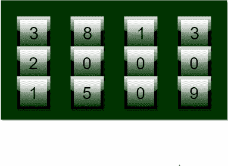

# 解锁圆形锁的最小旋转次数

> 原文:[https://www . geesforgeks . org/minimum-rotations-unlock-circular-lock/](https://www.geeksforgeeks.org/minimum-rotations-unlock-circular-lock/)

给你一把锁，它由 n 个不同的圆环组成，每个圆环上连续印着 0-9 个数字。最初，所有的 n 环一起显示一个 n 位整数，但只有特定的代码可以打开锁。您可以在任一方向上旋转每个环任意次数。你必须找到锁环转动的最小次数才能打开锁。



**例:**

```
Input : Input = 2345, Unlock code = 5432 
Output : Rotations required = 8
Explanation : 1st ring is rotated thrice as 2->3->4->5
              2nd ring is rotated once as 3->4
              3rd ring is rotated once as 4->3
              4th ring is rotated thrice as 5->4->3->2

Input : Input = 1919, Unlock code = 0000 
Output : Rotations required = 4
Explanation : 1st ring is rotated once as 1->0
              2nd ring is rotated once as 9->0
              3rd ring is rotated once as 1->0
              4th ring is rotated once as 9->0
```

对于单个环，我们可以向前或向后两个方向中的任何一个旋转它，如下所示:

*   0->1->2….->9->0
*   9->8->….0->9

但是我们关心所需的最小旋转次数，所以我们应该选择 *min (abs(a-b)，10-abs(a-b))* 作为 *a-b* 表示正向旋转的次数， *10-abs(a-b)* 表示一个环从 a 旋转到 b 的反向旋转次数。此外，我们必须为每个环找到每个数字的最小旋转次数。因此，从最右边的数字开始，我们可以很容易地找到每个环所需的最小旋转次数，并在最左边的数字结束。

## C++

```
// CPP program for min rotation to unlock
#include <bits/stdc++.h>
using namespace std;

// function for min rotation
int minRotation(int input, int unlock_code)
{
    int rotation = 0;
    int input_digit, code_digit;

    // iterate till input and unlock code become 0
    while (input || unlock_code) {

        // input and unlock last digit as reminder
        input_digit = input % 10;
        code_digit = unlock_code % 10;

        // find min rotation
        rotation += min(abs(input_digit - code_digit),
                   10 - abs(input_digit - code_digit));

        // update code and input
        input /= 10;
        unlock_code /= 10;
    }

    return rotation;
}

// driver code
int main()
{
    int input = 28756;
    int unlock_code = 98234;
    cout << "Minimum Rotation = "
        << minRotation(input, unlock_code);
    return 0;
}
```

## Java 语言(一种计算机语言，尤用于创建网站)

```
// Java program for min rotation to unlock
class GFG
{

    // function for min rotation
    static int minRotation(int input, int unlock_code)
    {
        int rotation = 0;
        int input_digit, code_digit;

        // iterate till input and unlock code become 0
        while (input>0 || unlock_code>0) {

            // input and unlock last digit as reminder
            input_digit = input % 10;
            code_digit = unlock_code % 10;

            // find min rotation
            rotation += Math.min(Math.abs(input_digit
                       - code_digit), 10 - Math.abs(
                          input_digit - code_digit));

            // update code and input
            input /= 10;
            unlock_code /= 10;
        }

        return rotation;
    }

    // driver code
    public static void main (String[] args) {
    int input = 28756;
    int unlock_code = 98234;
    System.out.println("Minimum Rotation = "+
                  minRotation(input, unlock_code));
    }
}

/* This code is contributed by Mr. Somesh Awasthi */
```

## 蟒蛇 3

```
# Python3 program for min rotation to unlock

# function for min rotation
def minRotation(input, unlock_code):

    rotation = 0;

    # iterate till input and unlock
    # code become 0
    while (input > 0 or unlock_code > 0):

        # input and unlock last digit
        # as reminder
        input_digit = input % 10;
        code_digit = unlock_code % 10;

        # find min rotation
        rotation += min(abs(input_digit - code_digit),
                    10 - abs(input_digit - code_digit));

        # update code and input
        input = int(input / 10);
        unlock_code = int(unlock_code / 10);

    return rotation;

# Driver Code
input = 28756;
unlock_code = 98234;
print("Minimum Rotation =",
       minRotation(input, unlock_code));

# This code is contributed by mits
```

## C#

```
// C# program for min rotation to unlock
using System;

class GFG {

    // function for min rotation
    static int minRotation(int input,
                           int unlock_code)
    {
        int rotation = 0;
        int input_digit, code_digit;

        // iterate till input and
        // unlock code become 0
        while (input > 0 ||
               unlock_code > 0)
        {

            // input and unlock last
            // digit as reminder
            input_digit = input % 10;
            code_digit = unlock_code % 10;

            // find min rotation
            rotation += Math.Min(Math.Abs(input_digit -
                        code_digit), 10 - Math.Abs(
                        input_digit - code_digit));

            // update code and input
            input /= 10;
            unlock_code /= 10;
        }

        return rotation;
    }

    // Driver Code
    public static void Main ()
    {
        int input = 28756;
        int unlock_code = 98234;
        Console.Write("Minimum Rotation = "+
                         minRotation(input, unlock_code));
    }
}

// This code is contributed by Nitin Mittal
```

## 服务器端编程语言（Professional Hypertext Preprocessor 的缩写）

```
<?php
// PHP program for min
// rotation to unlock

// function for min rotation
function minRotation($input,
                     $unlock_code)
{
    $rotation = 0;
    $input_digit; $code_digit;

    // iterate till input and
    // unlock code become 0
    while ($input || $unlock_code)
    {

        // input and unlock last
        // digit as reminder
        $input_digit = $input % 10;
        $code_digit = $unlock_code % 10;

        // find min rotation
        $rotation += min(abs($input_digit - $code_digit),
                     10 - abs($input_digit - $code_digit));

        // update code and input
        $input /= 10;
        $unlock_code /= 10;
    }

    return $rotation;
}

    // Driver Code
    $input = 28756;
    $unlock_code = 98234;
    echo "Minimum Rotation = "
        , minRotation($input, $unlock_code);

// This code is contributed by vt_m.
?>
```

## java 描述语言

```
<script>
// JavaScript program for min rotation to unlock

    // function for min rotation
    function minRotation(input, unlock_code)
    {
        let rotation = 0;
        let input_digit, code_digit;

        // iterate till input and unlock code become 0
        while (input>0 || unlock_code>0) {

            // input and unlock last digit as reminder
            input_digit = input % 10;
            code_digit = unlock_code % 10;

            // find min rotation
            rotation += Math.min(Math.abs(input_digit
                       - code_digit), 10 - Math.abs(
                          input_digit - code_digit));

            // update code and input
            input = Math.floor(input / 10);
            unlock_code = Math.floor(unlock_code / 10);
        }

        return rotation;
    }

// Driver Code

        let input = 28756;
    let unlock_code = 98234;
    document.write("Minimum Rotation = "+
                  minRotation(input, unlock_code));

</script>
```

**输出:**

```
Minimum Rotation = 12
```

本文由[**Shivam Pradhan(anuj _ charm)**](http://www.facebook.com/ma5ter6it)供稿。如果你喜欢 GeeksforGeeks 并想投稿，你也可以使用[contribute.geeksforgeeks.org](http://www.contribute.geeksforgeeks.org)写一篇文章或者把你的文章邮寄到 contribute@geeksforgeeks.org。看到你的文章出现在极客博客主页上，帮助其他极客。
如果发现有不正确的地方，或者想分享更多关于上述话题的信息，请写评论。