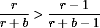
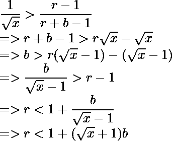

# 所需的最小二进制字符串大小，使得随机删除两个 1 的概率为 1/X

> 原文:[https://www . geesforgeks . org/最小大小-二进制-字符串-必需-这样-随机删除两个 1 的概率是-1-x/](https://www.geeksforgeeks.org/minimum-size-binary-string-required-such-that-probability-of-deleting-two-1s-at-random-is-1-x/)

给定一个值 **X** ，任务是找到一个最小大小的二进制字符串，这样如果任意 2 个字符被随机删除，两个字符都为‘1’的概率是 **1/X** 。打印这种二进制字符串的大小。

**示例:**

> **输入:** X = 2
> **输出:** 4
> **解释:**
> 让二进制字符串为“0111”。
> 从给定字符串中选择 2 个 1 的概率为= 3C2 / 4C2 = 3/6 = 1/2(等于 1/X)。
> 因此，所需尺寸为 4。
> (本例可采用 3 '1 '和 1 '0 '的任意 4 位二进制字符串)。
> **输入:** X = 8
> **输出:** 5

**方法:**我们将尝试寻找一个公式来解决这个问题。

> 让
> r =字符串中 1 的个数
> 和
> b =字符串中 0 的个数。

*   如果随机删除两个字符，那么

> 途径总数= (r + b) <sub>C 2。</sub>

*   如果需要 2 个字符为 1，则合适的案例数= r <sub>C 2</sub> 。

*   因此，P(两者都是 1)= r<sub>C2</sub>/(r+b)<sub>C2</sub>。
    
*   进一步进行计算的一个棘手的观察是:
    
*   将不等式平方，与等式比较，得到
    
*   如果 r > 1，我们在 3 个边上都取平方根。
    
*   取不等式最左边的部分，得到:
    
*   同样，取不等式最右边的部分，我们得到:
    
*   结合推导出的结论，我们得到了 r 的取值范围为 b.
    
*   对于字符串的最小值，我们设置 **b = 1**
    
*   为了得到一个有效的最小值 r，我们取这个范围内 r 的第一个整数值。

> 例如:如果 X = 2
> 
> 
> 
> 因此， **r = 3** 和 **b = 1** 。
> P(两个字符都是 1)= 3c 2/4c 2 = 2/4 = 1/2

下面是上述方法的实现。

## C++

```
// C++ implementation of the
// above approach

#include <bits/stdc++.h>
using namespace std;

// Function returns the minimum
// size of the string
int MinimumString(int x)
{
    // From formula
    int b = 1;

    // Left limit of r
    double left_lim = sqrt(x) + 1.0;

    // Right limit of r
    double right_lim = sqrt(x) + 2.0;

    int r;
    for (int i = left_lim; i <= right_lim; i++) {
        if (i > left_lim and i < right_lim) {
            // Smallest integer in
            // the valid range
            r = i;
            break;
        }
    }

    return b + r;
}

// Driver Code
int main()
{

    int X = 2;
    cout << MinimumString(X);
    return 0;
}
```

## Java 语言(一种计算机语言，尤用于创建网站)

```
// Java implementation of the
// above approach
import java.util.*;

class GFG{

// Function returns the minimum
// size of the String
static int MinimumString(int x)
{

    // From formula
    int b = 1;

    // Left limit of r
    double left_lim = Math.sqrt(x) + 1.0;

    // Right limit of r
    double right_lim = Math.sqrt(x) + 2.0;

    int r = 0;
    for(int i = (int)left_lim; i <= right_lim; i++)
    {
        if (i > left_lim && i < right_lim)
        {

            // Smallest integer in
            // the valid range
            r = i;
            break;
        }
    }
    return b + r;
}

// Driver Code
public static void main(String[] args)
{
    int X = 2;
    System.out.print(MinimumString(X));
}
}

// This code is contributed by PrinciRaj1992
```

## 蟒蛇 3

```
# Python3 implementation of
# the above approach
from math import sqrt

# Function returns the minimum
# size of the string
def MinimumString(x):

    # From formula
    b = 1

    # Left limit of r
    left_lim = sqrt(x) + 1.0

    # Right limit of r
    right_lim = sqrt(x) + 2.0

    for i in range(int(left_lim),
                   int(right_lim) + 1):
        if(i > left_lim and i < right_lim):

            # Smallest integer in
            # the valid range
            r = i
            break

    return b + r

# Driver Code
if __name__ == '__main__':

    X = 2

    print(MinimumString(X))

# This code is contributed by Shivam Singh
```

## C#

```
// C# implementation of the
// above approach
using System;

class GFG{

// Function returns the minimum
// size of the String
static int MinimumString(int x)
{

    // From formula
    int b = 1;

    // Left limit of r
    double left_lim = Math.Sqrt(x) + 1.0;

    // Right limit of r
    double right_lim = Math.Sqrt(x) + 2.0;

    int r = 0;
    for(int i = (int)left_lim; i <= right_lim; i++)
    {
        if (i > left_lim && i < right_lim)
        {

            // Smallest integer in
            // the valid range
            r = i;
            break;
        }
    }
    return b + r;
}

// Driver Code
public static void Main(String[] args)
{
    int X = 2;

    Console.Write(MinimumString(X));
}
}

// This code is contributed by gauravrajput1
```

## java 描述语言

```
<script>

// Javascript program for
// the above approach

// Function returns the minimum
// size of the String
function MinimumString(x)
{

    // From formula
    let b = 1;

    // Left limit of r
    let left_lim = Math.sqrt(x) + 1.0;

    // Right limit of r
    let right_lim = Math.sqrt(x) + 2.0;

    let r = 0;
    for(let i = Math.floor(left_lim); i <= Math.floor(right_lim); i++)
    {
        if (i > left_lim && i < right_lim)
        {

            // Smallest integer in
            // the valid range
            r = i;
            break;
        }
    }
    return b + r;
}

// Driver Code

     let  X = 2;
    document.write(MinimumString(X));

</script>
```

**Output:** 

```
4
```

**时间复杂度:** O(1)，因为 left_lim 和 right_lim 之间的差总是小于 1。
**辅助空间:** O(1)