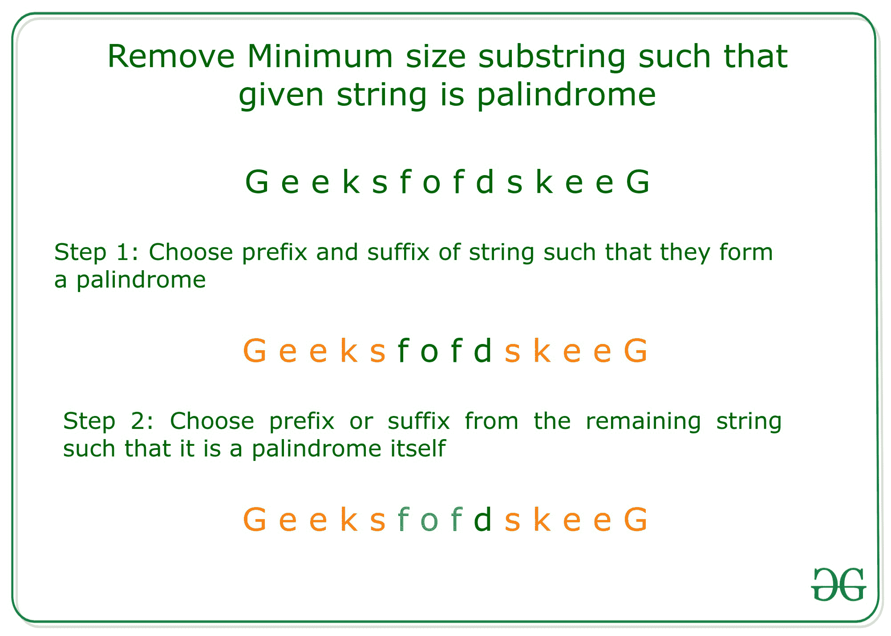

# 要删除的最小大小的子字符串，以使给定的字符串成为回文

> 原文:[https://www . geeksforgeeks . org/最小大小-要移除的子串-制作给定字符串-回文/](https://www.geeksforgeeks.org/minimum-size-substring-to-be-removed-to-make-a-given-string-palindromic/)

给定一个字符串 **S** ，任务是在删除最小尺寸[子字符串](https://www.geeksforgeeks.org/substring-in-java/)后打印该字符串，使得 **S** 是否为[回文](https://www.geeksforgeeks.org/c-program-check-given-string-palindrome/)。

**示例:**

> **输入:** S = "pqrstsuvwrqp"
> **输出:**pqrstsrvqp
> **解释:**
> 子串“uvw”的移除将 S 修改为回文串。
> 
> **输入:** S =【极客 forskeg】
> T3】输出:极客 skeg
> **解释:**
> 去除子串“or”将 S 修饰为回文串。

**方法:**想法是包含给定字符串 **S** 的最大大小[前缀和后缀](https://www.geeksforgeeks.org/string-from-prefix-and-suffix-of-given-two-strings/)，它们的连接形成一个[回文](https://www.geeksforgeeks.org/tag/palindrome/)。然后，从剩余的本身就是回文的字符串中选择最大长度的前缀或后缀。下面是借助图像的方法说明:

> [](https://media.geeksforgeeks.org/wp-content/uploads/20200824224906/explanation.jpg)

下面是上述方法的实现:

## C++

```
// C++ program of the
// above approach

#include <bits/stdc++.h>
using namespace std;

// Function to find palindromic
// prefix of maximum length
string palindromePrefix(string S)
{
    int n = S.size();

    // Finding palindromic prefix of
    // maximum length
    for (int i = n - 1; i >= 0; i--) {
        string curr = S.substr(0, i + 1);

        // Checking if curr substring
        // is palindrome or not.
        int l = 0, r = curr.size() - 1;
        bool is_palindrome = 1;

        while (l < r) {
            if (curr[l] != curr[r]) {
                is_palindrome = 0;
                break;
            }

            l++;
            r--;
        }

        // Condition to check if the
        // prefix is a palindrome
        if (is_palindrome)
            return curr;
    }

    // if no palindrome exist
    return "";
}

// Function to find the maximum size
// palindrome such that after removing
// minimum size substring
string maxPalindrome(string S)
{
    int n = S.size();
    if (n <= 1) {
        return S;
    }

    string pre = "", suff = "";

    // Finding prefix and suffix
    // of same length
    int i = 0, j = n - 1;
    while (S[i] == S[j] && i < j) {
        i++;
        j--;
    }
    // Matching the ranges
    i--;
    j++;

    pre = S.substr(0, i + 1);
    suff = S.substr(j);

    // It is possible that the whole
    // string is palindrome.

    // Case 1: Length is even and
    // whole string is palindrome
    if (j - i == 1) {
        return pre + suff;
    }

    // Case 2: Length is odd and
    // whole string is palindrome
    if (j - i == 2) {
        // Adding that mid character
        string mid_char = S.substr(i + 1, 1);

        return pre + mid_char + suff;
    }

    // Add prefix or suffix of the remaining
    // string or suffix, whichever is longer
    string rem_str
        = S.substr(i + 1, j - i - 1);

    string pre_of_rem_str
        = palindromePrefix(rem_str);

    // Reverse the remaining string to
    // find the palindromic suffix
    reverse(rem_str.begin(), rem_str.end());
    string suff_of_rem_str
        = palindromePrefix(rem_str);

    if (pre_of_rem_str.size()
        >= suff_of_rem_str.size()) {
        return pre + pre_of_rem_str + suff;
    }
    else {
        return pre + suff_of_rem_str + suff;
    }
}

// Driver Code
int main()
{
    string S = "geeksforskeeg";
    cout << maxPalindrome(S);
    return 0;
}
```

## Java 语言(一种计算机语言，尤用于创建网站)

```
// Java program of the
// above approach
import java.util.*;

class GFG{

// Function to find palindromic
// prefix of maximum length
static String palindromePrefix(String S)
{
    int n = S.length();

    // Finding palindromic prefix of
    // maximum length
    for(int i = n - 1; i >= 0; i--)
    {
        String curr = S.substring(0, i + 1);

        // Checking if curr subString
        // is palindrome or not.
        int l = 0, r = curr.length() - 1;
        boolean is_palindrome = true;

        while (l < r)
        {
            if (curr.charAt(l) != curr.charAt(r))
            {
                is_palindrome = false;
                break;
            }
            l++;
            r--;
        }

        // Condition to check if the
        // prefix is a palindrome
        if (is_palindrome)
            return curr;
    }

    // If no palindrome exist
    return "";
}

// Function to find the maximum size
// palindrome such that after removing
// minimum size subString
static String maxPalindrome(String S)
{
    int n = S.length();
    if (n <= 1)
    {
        return S;
    }

    String pre = "", suff = "";

    // Finding prefix and suffix
    // of same length
    int i = 0, j = n - 1;
    while (S.charAt(i) ==
           S.charAt(j) && i < j)
    {
        i++;
        j--;
    }

    // Matching the ranges
    i--;
    j++;

    pre = S.substring(0, i + 1);
    suff = S.substring(j);

    // It is possible that the whole
    // String is palindrome.

    // Case 1: Length is even and
    // whole String is palindrome
    if (j - i == 1)
    {
        return pre + suff;
    }

    // Case 2: Length is odd and
    // whole String is palindrome
    if (j - i == 2)
    {

        // Adding that mid character
        String mid_char = S.substring(i + 1,
                                      i + 2);

        return pre + mid_char + suff;
    }

    // Add prefix or suffix of the remaining
    // String or suffix, whichever is longer
    String rem_str = S.substring(i + 1, j);

    String pre_of_rem_str = palindromePrefix(rem_str);

    // Reverse the remaining String to
    // find the palindromic suffix
    rem_str = reverse(rem_str);

    String suff_of_rem_str = palindromePrefix(rem_str);

    if (pre_of_rem_str.length()    >=
       suff_of_rem_str.length())
    {
        return pre + pre_of_rem_str + suff;
    }
    else
    {
        return pre + suff_of_rem_str + suff;
    }
}

static String reverse(String input)
{
    char[] a = input.toCharArray();
    int l, r = a.length - 1;

    for(l = 0; l < r; l++, r--)
    {
        char temp = a[l];
        a[l] = a[r];
        a[r] = temp;
    }
    return String.valueOf(a);
}

// Driver Code
public static void main(String[] args)
{
    String S = "geeksforskeeg";

    System.out.print(maxPalindrome(S));
}
}

// This code is contributed by Amit Katiyar
```

## 蟒蛇 3

```
# Python3 program of the
# above approach

# Function to find palindromic
# prefix of maximum length
def palindromePrefix(S):

    n = len(S)

    # Finding palindromic prefix
    # of maximum length
    for i in range(n - 1, -1, -1):
        curr = S[0 : i + 1]

        # Checking if curr substring
        # is palindrome or not.
        l = 0
        r = len(curr) - 1
        is_palindrome = 1

        while (l < r):
            if (curr[l] != curr[r]):
                is_palindrome = 0
                break

            l += 1
            r -= 1

        # Condition to check if the
        # prefix is a palindrome
        if (is_palindrome):
            return curr

    # if no palindrome exist
    return ""

# Function to find the maximum
# size palindrome such that
# after removing minimum size
# substring
def maxPalindrome(S):

    n = len(S)
    if (n <= 1):
        return S

    pre = ""
    suff = ""

    # Finding prefix and
    # suffix of same length
    i = 0
    j = n - 1
    while (S[i] == S[j] and
           i < j):
        i += 1
        j -= 1

    # Matching the ranges
    i -= 1
    j += 1

    pre = S[0 : i + 1]
    suff = S[j:]

    # It is possible that the
    # whole string is palindrome.

    # Case 1: Length is even and
    # whole string is palindrome
    if (j - i == 1):
        return pre + suff

    # Case 2: Length is odd and
    # whole string is palindrome
    if (j - i == 2):

        # Adding that mid character
        mid_char = S[i + 1 : i + 2]

        return pre + mid_char + suff

    # Add prefix or suffix of the
    # remaining string or suffix,
    # whichever is longer
    rem_str = S[i + 1 : j]

    pre_of_rem_str = palindromePrefix(rem_str)

    # Reverse the remaining string to
    # find the palindromic suffix
    list1 = list(rem_str)

    list1.reverse()
    rem_str = ''.join(list1)
    suff_of_rem_str = palindromePrefix(rem_str)

    if (len(pre_of_rem_str) >=
        len(suff_of_rem_str)):
        return (pre + pre_of_rem_str +
                suff)
    else:
        return (pre + suff_of_rem_str +
                suff)

# Driver Code
if __name__ == "__main__":

    S = "geeksforskeeg"
    print(maxPalindrome(S))

# This code is contributed by Chitranayal
```

## C#

```
// C# program of the
// above approach
using System;
class GFG{

// Function to find palindromic
// prefix of maximum length
static String palindromePrefix(String S)
{
  int n = S.Length;

  // Finding palindromic prefix of
  // maximum length
  for(int i = n - 1; i >= 0; i--)
  {
    String curr = S.Substring(0, i + 1);

    // Checking if curr subString
    // is palindrome or not.
    int l = 0, r = curr.Length - 1;
    bool is_palindrome = true;

    while (l < r)
    {
      if (curr[l] != curr[r])
      {
        is_palindrome = false;
        break;
      }
      l++;
      r--;
    }

    // Condition to check if the
    // prefix is a palindrome
    if (is_palindrome)
      return curr;
  }

  // If no palindrome exist
  return "";
}

// Function to find the maximum size
// palindrome such that after removing
// minimum size subString
static String maxPalindrome(String S)
{
  int n = S.Length;
  if (n <= 1)
  {
    return S;
  }

  String pre = "", suff = "";

  // Finding prefix and suffix
  // of same length
  int i = 0, j = n - 1;
  while (S[i] == S[j] && i < j)
  {
    i++;
    j--;
  }

  // Matching the ranges
  i--;
  j++;

  pre = S.Substring(0, i + 1);
  suff = S.Substring(j);

  // It is possible that the whole
  // String is palindrome.

  // Case 1: Length is even and
  // whole String is palindrome
  if (j - i == 1)
  {
    return pre + suff;
  }

  // Case 2: Length is odd and
  // whole String is palindrome
  if (j - i == 2)
  {

    // Adding that mid character
    String mid_char = S.Substring(i + 1,
                                  i + 2);

    return pre + mid_char + suff;
  }

  // Add prefix or suffix of the remaining
  // String or suffix, whichever is longer
  String rem_str = S.Substring(i + 1, j);

  String pre_of_rem_str = palindromePrefix(rem_str);

  // Reverse the remaining String to
  // find the palindromic suffix
  rem_str = reverse(rem_str);

  String suff_of_rem_str = palindromePrefix(rem_str);

  if (pre_of_rem_str.Length >=
      suff_of_rem_str.Length)
  {
    return pre + pre_of_rem_str + suff;
  }
  else
  {
    return pre + suff_of_rem_str + suff;
  }
}

static String reverse(String input)
{
  char[] a = input.ToCharArray();
  int l, r = a.Length - 1;

  for(l = 0; l < r; l++, r--)
  {
    char temp = a[l];
    a[l] = a[r];
    a[r] = temp;
  }
  return String.Join("", a);
}

// Driver Code
public static void Main(String[] args)
{
  String S = "geeksforskeeg";
  Console.Write(maxPalindrome(S));
}
}

// This code is contributed by shikhasingrajput
```

## java 描述语言

```
<script>
// javascript program for the
// above approach

// Function to find palindromic
// prefix of maximum length
function palindromePrefix(S)
{
    let n = S.length;

    // Finding palindromic prefix of
    // maximum length
    for(let i = n - 1; i >= 0; i--)
    {
        let curr = S.substr(0, i + 1);

        // Checking if curr subString
        // is palindrome or not.
        let l = 0, r = curr.length - 1;
        let is_palindrome = true;

        while (l < r)
        {
            if (curr[l] != curr[r])
            {
                is_palindrome = false;
                break;
            }
            l++;
            r--;
        }

        // Condition to check if the
        // prefix is a palindrome
        if (is_palindrome)
            return curr;
    }

    // If no palindrome exist
    return "";
}

// Function to find the maximum size
// palindrome such that after removing
// minimum size subString
function maxPalindrome(S)
{
    let n = S.length;
    if (n <= 1)
    {
        return S;
    }

    let pre = "", suff = "";

    // Finding prefix and suffix
    // of same length
    let i = 0, j = n - 1;
    while (S[i] ==
           S[j] && i < j)
    {
        i++;
        j--;
    }

    // Matching the ranges
    i--;
    j++;

    pre = S.substr(0, i + 1);
    suff = S.substr(j);

    // It is possible that the whole
    // String is palindrome.

    // Case 1: Length is even and
    // whole String is palindrome
    if (j - i == 1)
    {
        return pre + suff;
    }

    // Case 2: Length is odd and
    // whole String is palindrome
    if (j - i == 2)
    {

        // Adding that mid character
        let mid_char = S.substr(i + 1,
                                      i + 2);

        return pre + mid_char + suff;
    }

    // Add prefix or suffix of the remaining
    // String or suffix, whichever is longer
    let rem_str = S.substr(i + 1, j);

    let pre_of_rem_str = palindromePrefix(rem_str);

    // Reverse the remaining String to
    // find the palindromic suffix
    rem_str = reverse(rem_str);

    let suff_of_rem_str = palindromePrefix(rem_str);

    if (pre_of_rem_str.length  >=
       suff_of_rem_str.length)
    {
        return pre + pre_of_rem_str + suff;
    }
    else
    {
        return pre + suff_of_rem_str + suff;
    }
}

function reverse(input)
{
    let a = input.split('');
    let l, r = a.length - 1;

    for(l = 0; l < r; l++, r--)
    {
        let temp = a[l];
        a[l] = a[r];
        a[r] = temp;
    }
    return parseInt(a);
}

// Driver Code

     let S = "geeksforskeeg";

    document.write(maxPalindrome(S));

// This code is contributed by avijitmondal1998.
</script>
```

**Output:** 

```
geeksfskeeg
```

**时间复杂度:**O(N<sup>2</sup>)
T5】辅助空间: O(N)