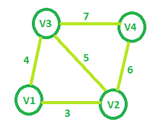

# 给定图的最小生成树代价

> 原文:[https://www . geesforgeks . org/最小生成树给定成本图/](https://www.geeksforgeeks.org/minimum-spanning-tree-cost-of-given-graphs/)

给定一个名为 V <sub>1</sub> 、V <sub>2</sub> 、V <sub>3</sub> 、…、V <sub>n</sub> 的 **V** 节点(V > 2)的无向图。两个节点 **V <sub>i</sub>** 和 **V <sub>j</sub>** 相互连接，当且仅当**0<| I–j |≤2**。任意顶点对 **(V <sub>i</sub> 、V <sub>j</sub> )** 之间的每条边都被赋予一个权重 **i + j** 。任务是找到这种带有 **V** 节点的图的[最小生成树](https://www.geeksforgeeks.org/kruskals-minimum-spanning-tree-algorithm-greedy-algo-2/)的代价。
**举例:**

> **输入:** V = 4
> 
> 
> 
> **输出:**13
> T3】输入:V = 5
> T6】输出: 21

**方法:**从具有最少节点(即 3 个节点)的图开始，最小生成树的代价将是 7。现在对于每个节点 **i** 从可以添加到该图的第四个节点开始， **i <sup>th</sup>** 节点只能连接到**(I–1)<sup>th</sup>**和**(I–2)<sup>th</sup>**节点，最小生成树将只包括具有最小权重的节点，因此新添加的边将具有权重**I+(I–2)**。

> 所以增加第四个节点会增加整体权重为 7 + (4 + 2) = 13
> 同样增加第五个节点，权重= 13+(5+3)= 21
> ……
> 对于第 n <sup>个</sup>节点，**权重=权重+(n+(n–2))**。

这可以概括为**权重= V<sup>2</sup>–V+1**，其中 **V** 是图中的总节点。
以下是上述方法的实现:

## C++

```
// C++ implementation of the approach
#include <bits/stdc++.h>
using namespace std;

// Function that returns the minimum cost
// of the spanning tree for the required graph
int getMinCost(int Vertices)
{
    int cost = 0;

    // Calculating cost of MST
    cost = (Vertices * Vertices) - Vertices + 1;

    return cost;
}

// Driver code
int main()
{
    int V = 5;
    cout << getMinCost(V);

    return 0;
}
```

## Java 语言(一种计算机语言，尤用于创建网站)

```
// Java implementation of the approach
class GfG
{

// Function that returns the minimum cost
// of the spanning tree for the required graph
static int getMinCost(int Vertices)
{
    int cost = 0;

    // Calculating cost of MST
    cost = (Vertices * Vertices) - Vertices + 1;

    return cost;
}

// Driver code
public static void main(String[] args)
{
    int V = 5;
    System.out.println(getMinCost(V));
}
}

// This code is contributed by
// Prerna Saini.
```

## C#

```
// C# implementation of the above approach
using System;

class GfG
{

    // Function that returns the minimum cost
    // of the spanning tree for the required graph
    static int getMinCost(int Vertices)
    {
        int cost = 0;

        // Calculating cost of MST
        cost = (Vertices * Vertices) - Vertices + 1;

        return cost;
    }

    // Driver code
    public static void Main()
    {
        int V = 5;
        Console.WriteLine(getMinCost(V));
    }
}

// This code is contributed by Ryuga
```

## 蟒蛇 3

```
# python3 implementation of the approach

# Function that returns the minimum cost
# of the spanning tree for the required graph
def getMinCost( Vertices):
    cost = 0

    # Calculating cost of MST
    cost = (Vertices * Vertices) - Vertices + 1

    return cost

# Driver code
if __name__ == "__main__":

    V = 5
    print (getMinCost(V))
```

## 服务器端编程语言（Professional Hypertext Preprocessor 的缩写）

```
<?php
// PHP implementation of the approach
// Function that returns the minimum cost
// of the spanning tree for the required graph
function getMinCost($Vertices)
{
    $cost = 0;

    // Calculating cost of MST
    $cost = ($Vertices * $Vertices) - $Vertices + 1;

    return $cost;
}

// Driver code
$V = 5;
echo getMinCost($V);

#This Code is contributed by ajit..
?>
```

## java 描述语言

```
<script>

// Javascript implementation of the approach

// Function that returns the minimum cost
// of the spanning tree for the required graph
function getMinCost(Vertices)
{
    var cost = 0;

    // Calculating cost of MST
    cost = (Vertices * Vertices) - Vertices + 1;

    return cost;
}

// Driver code
var V = 5;
document.write( getMinCost(V));

// This code is contributed by rrrtnx.
</script>
```

**Output:** 

```
21
```