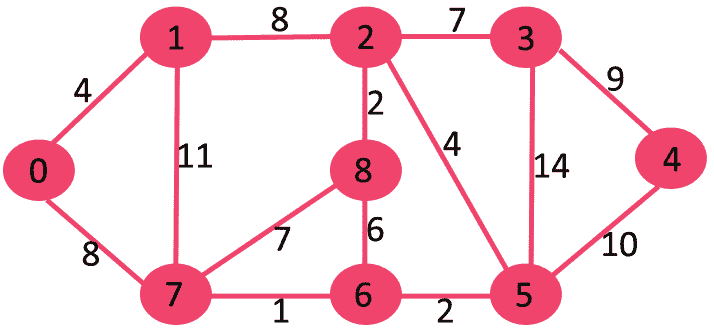

# 使用优先级队列和数组列表的最小生成树

> 原文:[https://www . geesforgeks . org/最小生成树使用优先级队列和阵列列表/](https://www.geeksforgeeks.org/minimum-spanning-tree-using-priority-queue-and-array-list/)

给定一个没有自循环的双向加权(正)图，任务是生成图的[最小生成树](https://www.geeksforgeeks.org/kruskals-minimum-spanning-tree-algorithm-greedy-algo-2/)。
**例:**

> **输入:** N = 9，E = 14，边= {{0，1，4}、{0，7，8}、{1，2，8}、{1，7，11}、{2，3，7}、{2，8，2}、{2，5，4}、{3，4，9}、{3，5，14}、{4，5，10}、{5，6，2}、{6，7，1}、{6，8，6}
> 
> 
> 
> 由所有顶点 V 和(V-1)边组成的无向图已经生成
> **输入:** N = 6，E = 14，边= {{0，2，103}，{0，1，158}，{0，2，2}，{0，5，17}，{1，3，42}，{2，4，187}，{3，0，14}，{3，2，158}，{3，5，106

**接近**T2】

*   首先，在给定的图中找到具有最小成本/权重的边。
*   两个初始顶点(最小成本边的顶点 A、B)被添加到访问/添加集。
*   现在，所有新添加顶点的连通边都被添加到优先级队列中。
*   最小代价顶点(将弹出顶点的所有连接边添加到优先级队列)从优先级队列中弹出，并重复直到边数等于顶点数-1。
*   通过使用优先级队列，时间复杂度将降低到 **(O(E log V))** ，其中 E 是边的数量，V 是顶点的数量。
*   Pair 类也用于存储权重。

以下是上述方法的实现:

## Java 语言(一种计算机语言，尤用于创建网站)

```
// Java implementation of the approach
import java.io.*;
import java.util.*;
import java.lang.Comparable;
public class MST {

    // Pair class with implemented comparable
    static class Pair<U extends Comparable<U>,
                                V extends Comparable<V> >
        implements Comparable<Pair<U, V> > {

        public final U a;
        public final V b;

        private Pair(U a, V b)
        {
            this.a = a;
            this.b = b;
        }

        @Override
        public boolean equals(Object o)
        {
            if (this == o)
                return true;
            if (o == null || getClass() != o.getClass())
                return false;

            Pair<?, ?> pair = (Pair<?, ?>)o;
            if (!a.equals(pair.a))
                return false;
            return b.equals(pair.b);
        }

        // Overriding so that objects in map
        // could find the object key
        @Override
        public int hashCode()
        {
            return 31 * a.hashCode() + b.hashCode();
        }

        @Override
        public String toString()
        {
            return "(" + a + ", " + b + ")";
        }

        @Override
        public int compareTo(Pair<U, V> o)
        {
            return getV().compareTo(o.getV());
        }
        private U getU()
        {
            return a;
        }
        private V getV()
        {
            return b;
        }
    }

    static class Graph {

        int vertices;
        ArrayList[] edges;

        // This variable keeps the least cost edge
        static Pair<Pair<Integer, Integer>,
                    Integer>
            minCostEdge;

        Graph(int vertices)
        {
            minCostEdge = new Pair<>(new Pair<>(1, 1),
                                     Integer.MAX_VALUE);
            this.vertices = vertices;
            edges = new ArrayList[vertices + 1];
            for (int i = 0; i <= vertices; i++) {
                edges[i]
                    = new ArrayList<Pair<Integer, Integer> >();
            }
        }

        void addEdge(int a, int b, int weight)
        {
            edges[a].add(new Pair<>(b, weight));

            // Since its undirected, adding the
            // edges to both the vertices
            edges[b].add(new Pair<>(a, weight));
            if (weight < minCostEdge.b) {
                minCostEdge
                    = new Pair<>(new Pair<>(a, b), weight);
            }
        }

        void MST()
        {

            // Priority queue for applying heap
            PriorityQueue<Pair<Pair<Integer, Integer>,
                               Integer> >
                priorityQueue
                = new PriorityQueue<>();

            // Adding all the connected vertices
            // of MinCostEdge vertex A to PQ
            Iterator<Pair<Integer, Integer> > iterator
                = edges[minCostEdge.a.a].listIterator();
            while (iterator.hasNext()) {
                Pair<Integer, Integer> pair
                    = iterator.next();
                priorityQueue.add(
                    new Pair<>(
                        new Pair<>(minCostEdge.a.a, pair.a),
                        pair.b));
            }

            // Adding all the connected vertices
            // of MinCostEdge vertex B to PQ
            iterator = edges[minCostEdge.a.b].listIterator();
            while (iterator.hasNext()) {
                Pair<Integer, Integer> pair = iterator.next();
                priorityQueue.add(
                    new Pair<>(
                        new Pair<>(minCostEdge.a.b, pair.a),
                        pair.b));
            }

            // Set to check vertex is added or not
            Set<Integer> addedVertices = new HashSet<>();

            // Set contains all the added edges and cost from source
            Set<Pair<Pair<Integer, Integer>, Integer> > addedEdges
                = new HashSet<>();

            // Using the greedy approach to find
            // the least costing edge to the GRAPH
            while (addedEdges.size() < vertices - 1) {

                // Polling from priority queue
                Pair<Pair<Integer, Integer>, Integer> pair
                    = priorityQueue.poll();

                // Checking whether the vertex A is added or not
                if (!addedVertices.contains(pair.a.a)) {
                    addedVertices.add(pair.a.a);
                    addedEdges.add(pair);

                    // Adding all the connected vertices with vertex A
                    iterator = edges[pair.a.a].listIterator();
                    while (iterator.hasNext()) {
                        Pair<Integer, Integer> pair1
                            = iterator.next();
                        priorityQueue.add(
                            new Pair<>(
                                new Pair<>(pair.a.a, pair1.a),
                                pair1.b));
                    }
                }

                // Checking whether the vertex B is added or not
                if (!addedVertices.contains(pair.a.b)) {
                    addedVertices.add(pair.a.b);
                    addedEdges.add(pair);

                    // Adding all the connected vertices with vertex B
                    iterator = edges[pair.a.b].listIterator();
                    while (iterator.hasNext()) {
                        Pair<Integer, Integer> pair1
                            = iterator.next();
                        priorityQueue
                            .add(
                                new Pair<>(
                                    new Pair<>(pair.a.b, pair1.a),
                                    pair1.b));
                    }
                }
            }

            // Printing the MST
            Iterator<Pair<Pair<Integer, Integer>, Integer> > iterator1
                = addedEdges.iterator();
            System.out.println("((A"
                               + ", "
                               + "B)"
                               + ", "
                               + "Cost)");
            while (iterator1.hasNext()) {
                System.out.println(iterator1.next());
            }
        }
    }

    // Driver code
    public static void main(String[] args) throws IOException
    {
        // Initializing the graph
        Graph g = new Graph(9);
        g.addEdge(0, 1, 4);
        g.addEdge(0, 7, 8);
        g.addEdge(1, 2, 8);
        g.addEdge(1, 7, 11);
        g.addEdge(2, 3, 7);
        g.addEdge(2, 8, 2);
        g.addEdge(2, 5, 4);
        g.addEdge(3, 4, 9);
        g.addEdge(3, 5, 14);
        g.addEdge(4, 5, 10);
        g.addEdge(5, 6, 2);
        g.addEdge(6, 7, 1);
        g.addEdge(6, 8, 6);
        g.addEdge(7, 8, 7);

        // Applying MST
        g.MST();
    }
}
```

**Output:** 

```
((A, B), Cost)
((6, 7), 1)
((6, 5), 2)
((1, 0), 4)
((2, 3), 7)
((5, 2), 4)
((3, 4), 9)
((2, 1), 8)
((2, 8), 2)
```