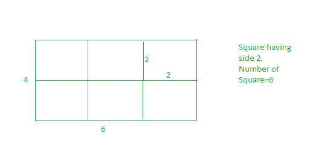

# 均匀切割矩形的最小正方形

> 原文:[https://www . geeksforgeeks . org/最小二乘至均匀切割矩形/](https://www.geeksforgeeks.org/minimum-squares-to-evenly-cut-a-rectangle/)

给定一张长 l、宽 w 的矩形纸，我们需要把这张纸分成正方形纸，这样正方形纸的数量应该尽可能少。
**例:**

> 输入:l= 4 w=6
> 输出:6
> 我们可以形成边长为 1 个单位的正方形，但是正方形的数量将是 24 个，这不是最小值。如果我们用 2 的边做正方形，那么我们有 6 个正方形。这是我们需要的答案。
> 同样我们不能用边 3 做正方形，如果我们选择边 3 做正方形，那么整张纸就不能转换成等长的正方形。
> 
> 
> 
> 输入:l=3 w=5
> 输出:15

正方形边的最佳长度等于两个数
的 [GCD](https://www.geeksforgeeks.org/basic-and-extended-euclidean-algorithms/)

## C++

```
// CPP program to find minimum number of
// squares to make a given rectangle.
#include <bits/stdc++.h>
using namespace std;

int countRectangles(int l, int w)
{
    // if we take gcd(l, w), this
    // will be largest possible
    // side for square, hence minimum
    // number of square.
    int squareSide = __gcd(l, w);

    // Number of squares.
    return (l * w) / (squareSide * squareSide);
}

// Driver code
int main()
{
    int l = 4, w = 6;
    cout << countRectangles(l, w) << endl;
    return 0;
}
```

## Java 语言(一种计算机语言，尤用于创建网站)

```
// Java program to find minimum number of
// squares to make a given rectangle.

class GFG{
static int __gcd(int a, int b) {
   if (b==0) return a;
   return __gcd(b,a%b);
}
static int countRectangles(int l, int w)
{
    // if we take gcd(l, w), this
    // will be largest possible
    // side for square, hence minimum
    // number of square.
    int squareSide = __gcd(l, w);

    // Number of squares.
    return (l * w) / (squareSide * squareSide);
}

// Driver code
public static void main(String[] args)
{
    int l = 4, w = 6;
    System.out.println(countRectangles(l, w));
}
}
// This code is contributed by mits
```

## 蟒蛇 3

```
# Python3 code to find minimum number of
# squares to make a given rectangle.

import math

def countRectangles(l, w):

    # if we take gcd(l, w), this
    # will be largest possible
    # side for square, hence minimum
    # number of square.
    squareSide = math.gcd(l,w)

    # Number of squares.
    return (l*w)/(squareSide*squareSide)

# Driver Code

if __name__ == '__main__':
    l = 4
    w = 6
    ans = countRectangles(l, w)
    print (int(ans))

# this code is contributed by
# SURENDRA_GANGWAR
```

## C#

```
// C# program to find minimum number of
// squares to make a given rectangle.

class GFG{
static int __gcd(int a, int b) {
if (b==0) return a;
return __gcd(b,a%b);
}
static int countRectangles(int l, int w)
{
    // if we take gcd(l, w), this
    // will be largest possible
    // side for square, hence minimum
    // number of square.
    int squareSide = __gcd(l, w);

    // Number of squares.
    return (l * w) / (squareSide * squareSide);
}

// Driver code
public static void Main()
{
    int l = 4, w = 6;
    System.Console.WriteLine(countRectangles(l, w));
}
}
// This code is contributed by mits
```

## 服务器端编程语言（Professional Hypertext Preprocessor 的缩写）

```
<?php
// PHP program to find minimum number
// of squares to make a given rectangle.

function gcd($a, $b)
{
    return $b ? gcd($b, $a % $b) : $a;
}

function countRectangles($l, $w)
{
    // if we take gcd(l, w), this
    // will be largest possible
    // side for square, hence minimum
    // number of square.
    $squareSide = gcd($l, $w);

    // Number of squares.
    return ($l * $w) / ($squareSide *
                        $squareSide);
}

// Driver code
$l = 4;
$w = 6;
echo countRectangles($l, $w) . "\n";

// This code is contributed
// by ChitraNayal
?>
```

## java 描述语言

```
<script>

// Javascript program to find minimum number of
// squares to make a given rectangle.

function __gcd(a, b) {
    if (b==0) return a;
    return __gcd(b,a%b);
}

function countRectangles(l, w)
{
    // if we take gcd(l, w), this
    // will be largest possible
    // side for square, hence minimum
    // number of square.
    let squareSide = __gcd(l, w);

    // Number of squares.
    return parseInt((l * w) / (squareSide * squareSide));
}

// Driver code
    let l = 4, w = 6;
    document.write(countRectangles(l, w));

</script>
```

**Output:** 

```
6
```