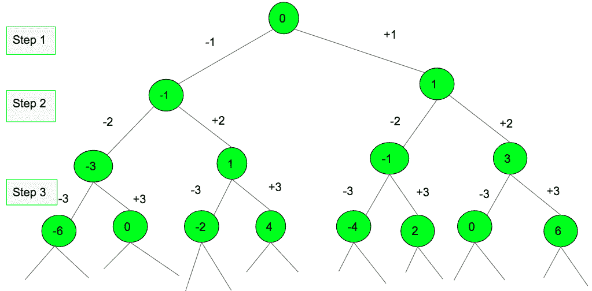

# 在每一步使用加法或减法可以获得 N 的最小步数

> 原文:[https://www . geeksforgeeks . org/每一步使用加法或减法可以获得 n 的最小步数/](https://www.geeksforgeeks.org/minimum-steps-in-which-n-can-be-obtained-using-addition-or-subtraction-at-every-step/)

给定 N，打印最小步数的序列，其中 N 可以通过步数的加法或减法从 0 开始获得。

**注**:每走一步，我们可以从当前位置加减一个等于步数的数字。例如，在第 1 步，我们可以添加 1 或-1。类似地，在第 2 步，我们添加 2 或-2，以此类推。

下图显示了通过执行指定的操作，从 0 开始分 3 步可以到达的所有可能位置。



**示例:**

```
Input: n = -4
Output: Minimum number of Steps: 3
        Step sequence: 1 -2 -3
Explanation: 
Step 1: At step 1 we add 1 to move from 0 to 1.
Step 2: At step 2 we add (-2) to move from 1 to -1.
Step 3: At step 3 we add (-3) to move from -1 to -4.

Input: n = 11
Output: Minimum number of steps = 4 
        Step sequence: 1 -2 3 4 5 
```

**方法:**解决上述问题的方法是在 N 分别为正或负的情况下，在需要相减或相加的地方标注步数。如果 N 为正，每一步都要加数，直到总和超过 N，一旦总和超过 N，检查总和-N 是否为偶数。如果和-N 是偶数，那么在步数(和-N)/2，要做减法。如果和-N 是奇数，那么检查和超过 N 的最后一步是偶数还是奇数。如果很奇怪，再执行一步，否则执行两步。如果任何一步的和= N，那么每一步的加法或减法都会给出答案。

设 N = 11，那么 1+2+3+4+5=15 就超过 11。减去 15-11 得到 4，相当于在第 2 步做减法。因此，步骤的顺序是 1 -2 3 4 5

设 N=12，那么 1+2+3+4+5=15 就超过 11。减去 15-12 得到 3，任何一步都不能做。所以再加两步，一是第 6 <sup>步</sup>步和第 7 <sup>步</sup>步。目标是使和-N 为偶数，因此在第 6 步执行加法，在第 7 步执行减法，这两个步骤结合起来从和中减去 1。现在 sum-N 是偶数，14-12=2，相当于在第 1 步做减法。因此步骤的顺序是-1 2 3 4 5 6 -7

设 N=20，则 1+2+3+4+5+6 超过 20。减去 21-20 得到 1，所以 7 加 21 得到 28。在下一步执行加法就可以了，因为(sum-n)是奇数。sum-N 给出 8，这相当于在步骤 4 执行减法。因此，步骤的顺序是 1234567。

以下是上述方法的图示:

## C++

```
// C++ program to print the sequence
// of minimum steps in which N can be
// obtained from 0 using addition or
// subtraction of the step number.
#include <bits/stdc++.h>
using namespace std;

// Function to return the vector
// which stores the step sequence
vector<int> findSteps(int n)
{
    // Steps sequence
    vector<int> ans;

    // Current sum
    int sum = 0;

    // Sign of the number
    int sign = (n >= 0 ? 1 : -1);
    n = abs(n);

    int i;
    // Basic steps required to get sum >= required value.
    for (i = 1; sum < n; i++) {
        ans.push_back(sign * i);
        sum += i;
    }
    cout << i << endl;

    // Reached ahead of N
    if (sum > sign * n) {

        // If the last step was an odd number
        if (i % 2) {
            sum -= n;

            // sum-n is odd
            if (sum % 2) {
                ans.push_back(sign * i);
                sum += i++;
            }
            // subtract the equivalent sum-n
            ans[(sum / 2) - 1] *= -1;
        }
        else {
            sum -= n;

            // sum-n is odd
            if (sum % 2) {

                // since addition of next step and subtraction
                // at the next next step will give sum = sum-1
                sum--;
                ans.push_back(sign * i);
                ans.push_back(sign * -1 * (i + 1));
            }
            // subtract the equivalent sum-n
            ans[(sum / 2) - 1] *= -1;
        }
    }
    // returns the vector
    return ans;
}

// Function to print the steps
void printSteps(int n)
{
    vector<int> v = findSteps(n);

    // prints the number of steps which is the size of vector
    cout << "Minimum number of Steps: " << v.size() << "\n";

    cout << "Step sequence:";

    // prints the steps stored
    // in the vector
    for (int i = 0; i < v.size(); i++)
        cout << v[i] << " ";
}

// Driver Code
int main()
{
    int n = 20;
    printSteps(n);
    return 0;
}
```

## Java 语言(一种计算机语言，尤用于创建网站)

```
// Java program to print the
// sequence of minimum steps
// in which N can be obtained
// from 0 using addition or
// subtraction of the step
// number.
import java.util.*;

class GFG
{

// Function to return the
// Arraylist which stores
// the step sequence
static ArrayList<Integer> findSteps(int n)
{
    // Steps sequence
    ArrayList<Integer> ans = new ArrayList<Integer>();

    // Current sum
    int sum = 0;

    // Sign of the number
    int sign = (n >= 0 ? 1 : -1);
    n = Math.abs(n);

    int i;
    // Basic steps required to
    // get sum >= required value.
    for (i = 1; sum < n; i++)
    {
        ans.add(sign * i);
        sum += i;
    }
    System.out.println( i );

    // Reached ahead of N
    if (sum > sign * n)
    {

        // If the last step
        // was an odd number
        if (i % 2 != 0)
        {
            sum -= n;

            // sum-n is odd
            if (sum % 2 != 0)
            {
                ans.add(sign * i);
                sum += i++;
            }

            // subtract the
            // equivalent sum-n
            ans.set((sum / 2) - 1,
            ans.get((sum / 2) - 1) * -1);
        }
        else
        {
            sum -= n;

            // sum-n is odd
            if (sum % 2 != 0)
            {

                // since addition of next
                // step and subtraction at
                // the next next step will
                // give sum = sum-1
                sum--;
                ans.add(sign * i);
                ans.add(sign * -1 * (i + 1));
            }

            // subtract the
            // equivalent sum-n
            ans.set((sum / 2) - 1,
            ans.get((sum / 2) - 1) * -1);
        }
    }

    // returns the Arraylist
    return ans;
}

// Function to print the steps
static void printSteps(int n)
{
    ArrayList<Integer> v = findSteps(n);

    // prints the number of steps
    // which is the size of Arraylist
    System.out.println("Minimum number " +
                            "of Steps: " +
                                v.size());

    System.out.print("Step sequence:");

    // prints the steps stored
    // in the Arraylist
    for (int i = 0; i < v.size(); i++)
        System.out.print(v.get(i) + " ");
}

// Driver Code
public static void main(String args[])
{
    int n = 20;
    printSteps(n);
}
}
// This code is contributed
// by Arnab Kundu
```

## C#

```
// C# program to print the
// sequence of minimum steps
// in which N can be obtained
// from 0 using addition or
// subtraction of the step
// number.
using System;
using System.Collections.Generic;

class GFG
{

// Function to return the
// Arraylist which stores
// the step sequence
static List<int> findSteps(int n)
{
    // Steps sequence
    List<int> ans = new List<int>();

    // Current sum
    int sum = 0;

    // Sign of the number
    int sign = (n >= 0 ? 1 : -1);
    n = Math.Abs(n);

    int i;

    // Basic steps required to
    // get sum >= required value.
    for (i = 1; sum < n; i++)
    {
        ans.Add(sign * i);
        sum += i;
    }
    Console.WriteLine( i );

    // Reached ahead of N
    if (sum > sign * n)
    {

        // If the last step
        // was an odd number
        if (i % 2 != 0)
        {
            sum -= n;

            // sum-n is odd
            if (sum % 2 != 0)
            {
                ans.Add(sign * i);
                sum += i++;
            }

            // subtract the
            // equivalent sum-n
            ans[(sum / 2) - 1]=
            ans[(sum / 2) - 1] * -1;
        }
        else
        {
            sum -= n;

            // sum-n is odd
            if (sum % 2 != 0)
            {

                // since addition of next
                // step and subtraction at
                // the next next step will
                // give sum = sum-1
                sum--;
                ans.Add(sign * i);
                ans.Add(sign * -1 * (i + 1));
            }

            // subtract the
            // equivalent sum-n
            ans[(sum / 2) - 1]=
            ans[(sum / 2) - 1] * -1;
        }
    }

    // returns the Arraylist
    return ans;
}

// Function to print the steps
static void printSteps(int n)
{
    List<int> v = findSteps(n);

    // prints the number of steps
    // which is the size of Arraylist
    Console.WriteLine("Minimum number " +
                            "of Steps: " +
                                v.Count);

    Console.Write("Step sequence:");

    // prints the steps stored
    // in the Arraylist
    for (int i = 0; i < v.Count; i++)
        Console.Write(v[i] + " ");
}

// Driver Code
public static void Main(String []args)
{
    int n = 20;
    printSteps(n);
}
}

// This code is contributed by Rajput-Ji
```

## java 描述语言

```
<script>

// Javascript program to print the sequence
// of minimum steps in which N can be
// obtained from 0 using addition or
// subtraction of the step number.

// Function to return the vector
// which stores the step sequence
function findSteps(n)
{
    // Steps sequence
    var ans = [];

    // Current sum
    var sum = 0;

    // Sign of the number
    var sign = (n >= 0 ? 1 : -1);
    n = Math.abs(n);

    var i;
    // Basic steps required to get sum >= required value.
    for (i = 1; sum < n; i++) {
        ans.push(sign * i);
        sum += i;
    }
    document.write( i + "<br>");

    // Reached ahead of N
    if (sum > sign * n) {

        // If the last step was an odd number
        if (i % 2) {
            sum -= n;

            // sum-n is odd
            if (sum % 2) {
                ans.push(sign * i);
                sum += i++;
            }
            // subtract the equivalent sum-n
            ans[(sum / 2) - 1] *= -1;
        }
        else {
            sum -= n;

            // sum-n is odd
            if (sum % 2) {

                // since addition of next step and subtraction
                // at the next next step will give sum = sum-1
                sum--;
                ans.push(sign * i);
                ans.push(sign * -1 * (i + 1));
            }
            // subtract the equivalent sum-n
            ans[(sum / 2) - 1] *= -1;
        }
    }
    // returns the vector
    return ans;
}

// Function to print the steps
function printSteps(n)
{
    var v = findSteps(n);

    // prints the number of steps which is the size of vector
    document.write( "Minimum number of Steps: " + v.length + "<br>");

    document.write( "Step sequence:");

    // prints the steps stored
    // in the vector
    for (var i = 0; i < v.length; i++)
        document.write( v[i] + " ");
}

// Driver Code
var n = 20;
printSteps(n);

// This code is contributed by itsok.
</script>
```

## 蟒蛇 3

```
# Python3  program to pr the sequence
# of minimum steps in which N can be
# obtained from 0 using addition or
# subtraction of the step number.

# Function to return the
# which stores the step sequence
def findSteps( n):
    # Steps sequence
    ans=[]

    # Current sum
    sum = 0

    # Sign of the number
    sign = 1 if n >= 0 else -1
    n = abs(n)
    i=1
    # Basic steps required to get sum >= required value.
    while sum<n :
        ans.append(sign * i)
        sum += i
        i+=1

    print(i)

    # Reached ahead of N
    if (sum > sign * n) :

        # If the last step was an odd number
        if (i % 2) :
            sum -= n

            # sum-n is odd
            if (sum % 2) :
                ans.append(sign * i)
                sum += i
                i+=1

            # subtract the equivalent sum-n
            ans[int((sum / 2) - 1)] *= -1

        else :
            sum -= n

            # sum-n is odd
            if (sum % 2) :

                # since addition of next step and subtraction
                # at the next next step will give sum = sum-1
                sum-=1
                ans.append(sign * i)
                ans.append(sign * -1 * (i + 1))

            # subtract the equivalent sum-n
            ans[int((sum / 2) - 1)] *= -1

    # returns the
    return ans

# Function to pr the steps
def prSteps(n):
    v = findSteps(n)

    # prs the number of steps which is the size of
    print("Minimum number of Steps:",len(v))

    print("Step sequence:",end="")

    # prs the steps stored
    # in the
    for i in range(len(v)):
        print(v[i],end=" ")

# Driver Code
if __name__ == '__main__':
    n = 20
    prSteps(n)
```

**Output :** 

```
7
Minimum number of Steps: 7
Step sequence:1 2 3 -4 5 6 7
```

**时间复杂度:** O(sqrt(N))
**辅助空间:** O(sqrt(N))
**注:** sum = i*(i+1)/2 等于或大于 N，给出 I 为 sqrt(N)。