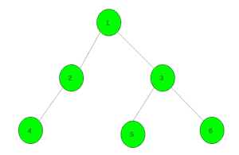

# 用给定颜色给树上色的最少步骤

> 原文:[https://www . geesforgeks . org/给给定颜色的树上色的最小步骤/](https://www.geeksforgeeks.org/minimum-steps-to-color-the-tree-with-given-colors/)

给定一棵树，该树具有最初没有颜色的 **N** 个节点和大小为 **N** 的数组**颜色[]** ，该数组表示着色过程发生后每个节点的颜色。任务是使用尽可能少的步骤将树着色为给定的颜色。每一步都可以选择一个顶点 **v** 和一个颜色 **x** ，然后用颜色 **x** 给 **v** 的子树中的所有顶点(包括 v 本身)上色。**注意**根是 1 号顶点。
**举例:**

> **输入:** color[] = { 1，1，2，1，3，1}
> 
> 
> 
> **输出:** 4
> 用颜色 1 给根在节点 1 的子树上色。
> 那么所有顶点都有颜色 1。
> 现在，用颜色 2 给扎根于 3 的子树上色。
> 最后，用颜色 3 和 1 分别给 5 和 6 的子树上色。
> **输入:** color[] = { 1，2，3，2，2，3}
> 
> 
> 
> **输出:** 3

**方法:**在顶点 1 调用一个 [DFS](https://www.geeksforgeeks.org/depth-first-search-or-dfs-for-a-graph/) 函数，最初保持答案为零。每当子节点和父节点的颜色有差异时，递增答案。
为了更好的理解，请看下面的代码。
以下是上述方法的实施:

## C++

```
// C++ implementation of the approach
#include <bits/stdc++.h>
using namespace std;

// To store the required answer
int ans = 0;

// To store the graph
vector<int> gr[100005];

// Function to add edges
void Add_Edge(int u, int v)
{
    gr[u].push_back(v);
    gr[v].push_back(u);
}

// Dfs function
void dfs(int child, int par, int color[])
{

    // When there is difference in colors
    if (color[child] != color[par])
        ans++;

    // For all it's child nodes
    for (auto it : gr[child]) {
        if (it == par)
            continue;
        dfs(it, child, color);
    }
}

// Driver code
int main()
{

    // Here zero is for parent of node 1
    int color[] = { 0, 1, 2, 3, 2, 2, 3 };

    // Adding edges in the graph
    Add_Edge(1, 2);
    Add_Edge(1, 3);
    Add_Edge(2, 4);
    Add_Edge(2, 5);
    Add_Edge(3, 6);

    // Dfs call
    dfs(1, 0, color);

    // Required answer
    cout << ans;

    return 0;
}
```

## Java 语言(一种计算机语言，尤用于创建网站)

```
// Java implementation of the approach
import java.util.*;

class GFG
{

// To store the required answer
static int ans = 0;

// To store the graph
static Vector<Vector<Integer>> gr = new Vector<Vector<Integer>>();

// Function to add edges
static void Add_Edge(int u, int v)
{
    gr.get(u).add(v);
    gr.get(v).add(u);
}

// Dfs function
static void dfs(int child, int par, int color[])
{

    // When there is difference in colors
    if (color[child] != color[par])
        ans++;

    // For all it's child nodes
    for (int i = 0; i < gr.get(child).size(); i++)
    {
        if (gr.get(child).get(i) == par)
            continue;
        dfs(gr.get(child).get(i), child, color);
    }
}

// Driver code
public static void main(String args[])
{
    for(int i = 0; i <= 10; i++)
    gr.add(new Vector<Integer>());

    // Here zero is for parent of node 1
    int color[] = { 0, 1, 2, 3, 2, 2, 3 };

    // Adding edges in the graph
    Add_Edge(1, 2);
    Add_Edge(1, 3);
    Add_Edge(2, 4);
    Add_Edge(2, 5);
    Add_Edge(3, 6);

    // Dfs call
    dfs(1, 0, color);

    // Required answer
    System.out.println( ans);
}
}

// This code is contributed by Arnab Kundu
```

## 蟒蛇 3

```
# Python3 implementation of the approach

# To store the required answer
ans = 0

# To store the graph
gr = [[] for i in range(100005)]

# Function to add edges
def Add_Edge(u, v):
    gr[u].append(v)
    gr[v].append(u)

# Dfs function
def dfs(child, par, color):
    global ans

    # When there is difference in colors
    if (color[child] != color[par]):
        ans += 1

    # For all it's child nodes
    for it in gr[child]:
        if (it == par):
            continue
        dfs(it, child, color)

# Driver code

# Here zero is for parent of node 1
color = [0, 1, 2, 3, 2, 2, 3]

# Adding edges in the graph
Add_Edge(1, 2)
Add_Edge(1, 3)
Add_Edge(2, 4)
Add_Edge(2, 5)
Add_Edge(3, 6)

# Dfs call
dfs(1, 0, color)

# Required answer
print(ans)

# This code is contributed
# by mohit kumar
```

## C#

```
// C# implementation of the approach
using System;
using System.Collections.Generic;

class GFG
{

    // To store the required answer
    static int ans = 0;

    // To store the graph
    static List<List<int>> gr = new List<List<int>>();

    // Function to add edges
    static void Add_Edge(int u, int v)
    {
        gr[u].Add(v);
        gr[v].Add(u);
    }

    // Dfs function
    static void dfs(int child, int par, int []color)
    {

        // When there is difference in colors
        if (color[child] != color[par])
            ans++;

        // For all it's child nodes
        for (int i = 0; i < gr[child].Count; i++)
        {
            if (gr[child][i] == par)
                continue;
            dfs(gr[child][i], child, color);
        }
    }

    // Driver code
    public static void Main(String []args)
    {
        for(int i = 0; i <= 10; i++)
        gr.Add(new List<int>());

        // Here zero is for parent of node 1
        int []color = { 0, 1, 2, 3, 2, 2, 3 };

        // Adding edges in the graph
        Add_Edge(1, 2);
        Add_Edge(1, 3);
        Add_Edge(2, 4);
        Add_Edge(2, 5);
        Add_Edge(3, 6);

        // Dfs call
        dfs(1, 0, color);

        // Required answer
        Console.WriteLine( ans);
    }
}

// This code has been contributed by 29AjayKumar
```

## java 描述语言

```
<script>
// Javascript implementation of the approach

// To store the required answer
let ans = 0;

// To store the graph
let gr = [];

// Function to add edges
function Add_Edge(u,v)
{
    gr[u].push(v);
    gr[v].push(u);
}

// Dfs function
function dfs(child,par,color)
{
    // When there is difference in colors
    if (color[child] != color[par])
        ans++;

    // For all it's child nodes
    for (let i = 0; i < gr[child].length; i++)
    {
        if (gr[child][i] == par)
            continue;
        dfs(gr[child][i], child, color);
    }
}

// Driver code
for(let i = 0; i <= 10; i++)
    gr.push([]);

    // Here zero is for parent of node 1
    let color = [ 0, 1, 2, 3, 2, 2, 3 ];

    // Adding edges in the graph
    Add_Edge(1, 2);
    Add_Edge(1, 3);
    Add_Edge(2, 4);
    Add_Edge(2, 5);
    Add_Edge(3, 6);

    // Dfs call
    dfs(1, 0, color);

    // Required answer
    document.write( ans);

// This code is contributed by unknown2108
</script>
```

**Output:** 

```
3
```