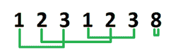

# 使数组的所有元素可被 4 整除的最小步骤

> 原文:[https://www . geeksforgeeks . org/最少步骤使数组的所有元素都被 4 整除/](https://www.geeksforgeeks.org/minimum-steps-to-make-all-the-elements-of-the-array-divisible-by-4/)

给定一个大小为 **n** 的数组，任务是找到使数组的所有元素可被 4 整除所需的最小步数。步骤定义为从数组中移除任意两个元素，并将这些元素的总和添加到数组中。
**例:**

> **输入:**数组= {1，2，3，1，2，3，8}
> **输出:** 3
> **解释:**
> 
> 
> 
> 如图所示，
> 将**阵【0】**和**阵【2】**组合成 4。**阵【1】**和**阵【4】**以及**阵【3】**和**阵【5】**也是如此。**数组[6]** 已经可以被 4 整除。所以通过做 3 步，数组中的所有元素都可以被 4 整除。
> **输入:**数组= {12，31，47，32，93，24，61，29，21，34}
> **输出:** 4

**方法:**这里的思想是将数组中的所有元素转换为模 4。首先，数组中所有元素的和应该能被 4 整除。如果没有，这个任务是不可能的。

*   初始化一个大小为 4 到 0 的数组**模数**。
*   初始化计数器**将**计数到 0，以记录完成的步数。
*   遍历输入数组，取每个元素的模 4。
*   将**模数**数组中 mod 4 值的值增加 1。
*   **模数【0】**是已经被 4 整除的元素个数。因此不需要将它们与任何其他元素配对。
*   **模数【1】**和**模数【3】**元素可以组合得到一个可被 4 整除的数。因此，将**计数**增加到两者的最小值。
*   **模【2】**的每 2 个元素可以组合得到一个可整除为 4 的元素。
*   对于其余元素，将**模量【2】**增加**模量【1】**和**模量【3】**的一半。
*   现在，将**计数**增加一半**模数【2】**。我们拿一半是因为每一个**两个**元素合二为一。
*   **计数**的最终值是将输入数组的所有元素转换为可被 4 整除所需的步数。

下面是上述方法的实现:

## C++

```
#include <bits/stdc++.h>
using namespace std;

int getSteps(int arr[], int n)
{
    // Count to keep track of the
    // number of steps done.
    int count = 0;

    // Modulus array to store all elements mod 4
    int modulus[4] = { 0 };

    // sum to check if given task is possible
    int sum = 0;

    // Loop to store all elements mod 4
    // and calculate sum;
    int i;
    for (i = 0; i < n; i++)
    {
        int mod = arr[i] % 4;
        sum += mod;
        modulus[mod]++;
    }

    // If sum is not divisible by 4,
    // not possible
    if (sum % 4 != 0)
    {
        return -1;
    }
    else
    {

        // Find minimum of modulus[1] and modulus[3]
        // and increment the count by the minimum
        if (modulus[1] > modulus[3])
        {
            count += modulus[3];
        }
        else
        {
            count += modulus[1];
        }

        // Update the values in modulus array.
        modulus[1] -= count;
        modulus[3] -= count;

        // Use modulus[2] to pair remaining elements.
        modulus[2] += modulus[1] / 2;
        modulus[2] += modulus[3] / 2;

        // increment count to half of remaining
        // modulus[1] or modulus of [3] elements.
        count += modulus[1] / 2;
        count += modulus[3] / 2;

        // increment count by half of modulus[2]
        count += modulus[2] / 2;

        return count;
    }
}

// Driver Code
int main()
{
    // size of array
    int n = 7;

    // input array
    int arr[] = { 1, 2, 3, 1, 2, 3, 8 };

    int count = getSteps(arr, n);

    cout << count;
}

// This code is contributed
// by Akanksha Rai
```

## C

```
#include <stdio.h>
#include <string.h>

int getSteps(int arr[], int n)
{
    // Count to keep track of the number of steps done.
    int count = 0;

    // Modulus array to store all elements mod 4
    int modulus[4] = { 0 };

    // sum to check if given task is possible
    int sum = 0;

    // Loop to store all elements mod 4 and calculate sum;
    int i;
    for (i = 0; i < n; i++) {
        int mod = arr[i] % 4;
        sum += mod;
        modulus[mod]++;
    }

    // If sum is not divisible by 4, not possible
    if (sum % 4 != 0) {
        return -1;
    }
    else {

        // Find minimum of modulus[1] and modulus[3]
        // and increment the count by the minimum
        if (modulus[1] > modulus[3]) {
            count += modulus[3];
        }
        else {
            count += modulus[1];
        }
        // Update the values in modulus array.
        modulus[1] -= count;
        modulus[3] -= count;

        // Use modulus[2] to pair remaining elements.
        modulus[2] += modulus[1] / 2;
        modulus[2] += modulus[3] / 2;

        // increment count to half of remaining
        // modulus[1] or modulus of [3] elements.
        count += modulus[1] / 2;
        count += modulus[3] / 2;

        // increment count by half of modulus[2]
        count += modulus[2] / 2;

        return count;
    }
}

// Driver Code
int main()
{
    // size of array
    int n = 7;
    // input array
    int arr[] = { 1, 2, 3, 1, 2, 3, 8 };

    int count = getSteps(arr, n);

    printf("%d", count);
}
```

## Java 语言(一种计算机语言，尤用于创建网站)

```
// Java program for the above approach
class GFG
{

static int getSteps(int arr[], int n)
{
    // Count to keep track of the number of steps done.
    int count = 0;

    // Modulus array to store all elements mod 4
    int modulus[] = new int[4];

    // sum to check if given task is possible
    int sum = 0;

    // Loop to store all elements
    // mod 4 and calculate sum;
    int i;
    for (i = 0; i < n; i++)
    {
        int mod = arr[i] % 4;
        sum += mod;
        modulus[mod]++;
    }

    // If sum is not divisible by 4, not possible
    if (sum % 4 != 0)
    {
        return -1;
    }
    else {

        // Find minimum of modulus[1] and modulus[3]
        // and increment the count by the minimum
        if (modulus[1] > modulus[3])
        {
            count += modulus[3];
        }
        else
        {
            count += modulus[1];
        }
        // Update the values in modulus array.
        modulus[1] -= count;
        modulus[3] -= count;

        // Use modulus[2] to pair remaining elements.
        modulus[2] += modulus[1] / 2;
        modulus[2] += modulus[3] / 2;

        // increment count to half of remaining
        // modulus[1] or modulus of [3] elements.
        count += modulus[1] / 2;
        count += modulus[3] / 2;

        // increment count by half of modulus[2]
        count += modulus[2] / 2;

        return count;
    }
}

// Driver Code
public static void main(String[] args)
{
    // size of array
    int n = 7;

    // input array
    int arr[] = { 1, 2, 3, 1, 2, 3, 8 };

    int count = getSteps(arr, n);
    System.out.printf("%d", count);
}
}

// This code has been contributed by 29AjayKumar
```

## 蟒蛇 3

```
# Python 3 program for the above approach
def getSteps(arr, n):

    # Count to keep track of the
    # number of steps done.
    count = 0

    # Modulus array to store all elements mod 4
    modulus = [0 for i in range(4)]

    # Sum to check if given task is possible
    Sum = 0

    # Loop to store all elements mod 4
    # and calculate Sum
    i = 0
    for i in range(n):
        mod = arr[i] % 4
        Sum += mod
        modulus[mod] += 1

    # If Sum is not divisible by 4,
    # not possible
    if (Sum % 4 != 0):
        return -1
    else:

        # Find minimum of modulus[1] and modulus[3]
        # and increment the count by the minimum
        if (modulus[1] > modulus[3]):
            count += modulus[3]
        else:
            count += modulus[1]

        # Update the values in modulus array.
        modulus[1] -= count
        modulus[3] -= count

        # Use modulus[2] to pair remaining elements.
        modulus[2] += modulus[1] // 2
        modulus[2] += modulus[3] // 2

        # increment count to half of remaining
        # modulus[1] or modulus of [3] elements.
        count += modulus[1] // 2
        count += modulus[3] // 2

        # increment count by half of modulus[2]
        count += modulus[2] // 2

        return count

# Driver Code

# size of array
n = 7

# input array
arr = [1, 2, 3, 1, 2, 3, 8]

count = getSteps(arr, n)
print(count)

# This code is contributed by mohit kumar
```

## C#

```
// C# program for the above approach
using System;

class GFG
{

static int getSteps(int []arr, int n)
{
    // Count to keep track of the number of steps done.
    int count = 0;

    // Modulus array to store all elements mod 4
    int []modulus = new int[4];

    // sum to check if given task is possible
    int sum = 0;

    // Loop to store all elements
    // mod 4 and calculate sum;
    int i;
    for (i = 0; i < n; i++)
    {
        int mod = arr[i] % 4;
        sum += mod;
        modulus[mod]++;
    }

    // If sum is not divisible by 4, not possible
    if (sum % 4 != 0)
    {
        return -1;
    }
    else
    {

        // Find minimum of modulus[1] and modulus[3]
        // and increment the count by the minimum
        if (modulus[1] > modulus[3])
        {
            count += modulus[3];
        }
        else
        {
            count += modulus[1];
        }

        // Update the values in modulus array.
        modulus[1] -= count;
        modulus[3] -= count;

        // Use modulus[2] to pair remaining elements.
        modulus[2] += modulus[1] / 2;
        modulus[2] += modulus[3] / 2;

        // increment count to half of remaining
        // modulus[1] or modulus of [3] elements.
        count += modulus[1] / 2;
        count += modulus[3] / 2;

        // increment count by half of modulus[2]
        count += modulus[2] / 2;

        return count;
    }
}

// Driver Code
public static void Main(String[] args)
{
    // size of array
    int n = 7;

    // input array
    int []arr = { 1, 2, 3, 1, 2, 3, 8 };

    int count = getSteps(arr, n);
    Console.Write("{0}", count);
}
}

// This code contributed by Rajput-Ji
```

## 服务器端编程语言（Professional Hypertext Preprocessor 的缩写）

```
<?php
// PHP program for the above approach

function getSteps($arr, $n)
{
    // Count to keep track of the number
    // of steps done.
    $count = 0;

    // Modulus array to store all elements mod 4
    $modulus = array_fill(0, 4, 0);

    // sum to check if given task is possible
    $sum = 0;

    // Loop to store all elements
    // mod 4 and calculate sum;
    for ($i = 0; $i < $n; $i++)
    {
        $mod = $arr[$i] % 4;
        $sum += $mod;
        $modulus[$mod]++;
    }

    // If sum is not divisible by 4, not possible
    if ($sum % 4 != 0)
    {
        return -1;
    }
    else
    {

        // Find minimum of modulus[1] and modulus[3]
        // and increment the count by the minimum
        if ($modulus[1] > $modulus[3])
        {
            $count += $modulus[3];
        }
        else
        {
            $count += $modulus[1];
        }

        // Update the values in modulus array.
        $modulus[1] -= $count;
        $modulus[3] -= $count;

        // Use modulus[2] to pair remaining elements.
        $modulus[2] += (int)($modulus[1] / 2);
        $modulus[2] += (int)($modulus[3] / 2);

        // increment count to half of remaining
        // modulus[1] or modulus of [3] elements.
        $count += (int)($modulus[1] / 2);
        $count += (int)($modulus[3] / 2);

        // increment count by half of modulus[2]
        $count += (int)($modulus[2] / 2);

        return $count;
    }
}

// Driver Code

// size of array
$n = 7;

// input array
$arr = array( 1, 2, 3, 1, 2, 3, 8 );

$count = getSteps($arr, $n);
print($count);

// This code contributed by mits
?>
```

## java 描述语言

```
<script>

    function getSteps(arr, n)
    {

        // Count to keep track of the
        // number of steps done.
        let count = 0;

        // Modulus array to store all elements mod 4
        let modulus = new Array(4);
        modulus.fill(0);

        // sum to check if given task is possible
        let sum = 0;

        // Loop to store all elements mod 4
        // and calculate sum;
        let i;
        for (i = 0; i < n; i++)
        {
            let mod = arr[i] % 4;
            sum += mod;
            modulus[mod]++;
        }

        // If sum is not divisible by 4,
        // not possible
        if (sum % 4 != 0)
        {
            return -1;
        }
        else
        {

            // Find minimum of modulus[1] and modulus[3]
            // and increment the count by the minimum
            if (modulus[1] > modulus[3])
            {
                count += modulus[3];
            }
            else
            {
                count += modulus[1];
            }

            // Update the values in modulus array.
            modulus[1] -= count;
            modulus[3] -= count;

            // Use modulus[2] to pair remaining elements.
            modulus[2] += parseInt(modulus[1] / 2, 10);
            modulus[2] += parseInt(modulus[3] / 2, 10);

            // increment count to half of remaining
            // modulus[1] or modulus of [3] elements.
            count += parseInt(modulus[1] / 2, 10);
            count += parseInt(modulus[3] / 2, 10);

            // increment count by half of modulus[2]
            count += parseInt(modulus[2] / 2, 10);

            return count;
        }
    }

    // size of array
    let n = 7;

    // input array
    let arr = [ 1, 2, 3, 1, 2, 3, 8 ];
    let count = getSteps(arr, n);
    document.write(count);

    // This code is contributed by divyeshrabadiya07.
</script>
```

**Output:** 

```
3
```