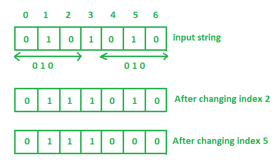

# 从二进制字符串中移除子字符串 010 的最小步骤

> 原文:[https://www . geesforgeks . org/从二进制字符串中移除子字符串的最小步骤-010/](https://www.geeksforgeeks.org/minimum-steps-to-remove-substring-010-from-a-binary-string/)

给定一个二进制字符串，任务是计算从这个二进制字符串中移除子字符串“010”的最小步骤。
**例:**

> **输入:**binary _ string =“0101010”
> **输出:** 2
> 在索引 2 和索引 4 处将 0 切换为 1 将删除子串 010。
> 因此需要的步数是 2。
> 
> 
> 
> **输入:**二进制 _ 字符串=“010”
> **输出:** 1
> 切换 0 到 1 或 1 到 0 中的任何一个都会删除子串 010。
> 因此所需的步数为 1。

**进场:**

1.  从二进制字符串的开头到结尾迭代字符串-2。
2.  如果在二进制字符串中连续有三个字符是' 0 '，' 1 '，' 0 '，那么任何一个字符都可以改变，这样就可以计算一个步长。
3.  将循环计数器增加 2。

以下是上述方法的实现:

## C++

```
// CPP program to calculate steps
// to remove substring 010
// from a binary string

#include <bits/stdc++.h>
using namespace std;

// Function to find the minimum steps
int minSteps(string str)
{

    int count = 0;

    for (int i = 0; i < str.length() - 2; i++) {

        if (str[i] == '0') {
            if (str[i + 1] == '1') {
                if (str[i + 2] == '0') {

                    // substring "010" found
                    count++;
                    i += 2;
                }
            }
        }
    }

    return count;
}

// Driver code
int main()
{

    // Get the binary string
    string str = "0101010";

    // Find the minimum steps
    cout << minSteps(str);

    return 0;
}
```

## Java 语言(一种计算机语言，尤用于创建网站)

```
// Java program to calculate steps
// to remove substring 010
// from a binary string
import java.util.*;

class GFG{

// Function to find the minimum steps
static int minSteps(String str)
{

    int count = 0;

    for (int i = 0; i < str.length() - 2; i++) {

        if (((int)str.charAt(i)) == '0') {
            if (str.charAt(i + 1) == '1') {
                if (str.charAt(i + 2) == '0') {

                    // substring "010" found
                    count++;
                    i += 2;
                }
            }
        }
    }

    return count;
}

// Driver code
public static void main(String args[])
{

    // Get the binary string
    String str = "0101010";

    // Find the minimum steps
    System.out.println(minSteps(str));
}
}
```

## 蟒蛇 3

```
# Python3 program to calculate steps
# to remove substring 010
# from a binary string

# Function to find the minimum steps
def minSteps(str):

    count = 0
    i = 0
    while i < len(str) - 2:
        if str[i] == '0':
            if(str[i + 1] == '1'):
                if(str[i + 2] == '0'):

                    # substring "010" found
                    count = count + 1
                    i = i + 2
        i = i + 1

    return count

# Driver code

# Get the binary string
str = "0101010"

# Find the minimum steps
print(minSteps(str))

# This code is contributed
# by Shashank_Sharma
```

## C#

```
// C# program to calculate steps
// to remove substring 010
// from a binary string
using System;

class GFG
{

// Function to find the minimum steps
static int minSteps(string str)
{
    int count = 0;

    for (int i = 0; i < str.Length - 2; i++)
    {

        if (((int)str[i]) == '0')
        {
            if (str[i + 1] == '1')
            {
                if (str[i + 2] == '0')
                {

                    // substring "010" found
                    count++;
                    i += 2;
                }
            }
        }
    }

    return count;
}

// Driver code
public static void Main()
{

    // Get the binary string
    string str = "0101010";

    // Find the minimum steps
    Console.Write(minSteps(str));
}
}

// This code is contributed by ChitraNayal
```

## 服务器端编程语言（Professional Hypertext Preprocessor 的缩写）

```
<?php
// PHP program to calculate steps to remove
// substring 010 from a binary string

// Function to find the minimum steps
function minSteps($str)
{
    $count = 0;

    for ($i = 0; $i < strlen($str) - 2; $i++)
    {

        if ($str[$i] == '0')
        {
            if ($str[$i + 1] == '1')
            {
                if ($str[$i + 2] == '0')
                {

                    // substring "010" found
                    $count++;
                    $i += 2;
                }
            }
        }
    }

    return $count;
}

// Driver code

// Get the binary string
$str = "0101010";

// Find the minimum steps
echo(minSteps($str));

// This code is contributed
// by Shivi_Aggarwal
?>
```

## java 描述语言

```
<script>

// js program to calculate steps
// to remove substring 010
// from a binary string

// Function to find the minimum steps
function minSteps(str)
{
    let count = 0;

    for (let i = 0; i < str.length - 2; i++)
    {

        if ((str[i]) == '0')
        {
            if (str[i + 1] == '1')
            {
                if (str[i + 2] == '0')
                {

                    // substring "010" found
                    count++;
                    i += 2;
                }
            }
        }
    }

    return count;
}

// Driver code

// Get the binary string
let str = "0101010";

// Find the minimum steps
document.write(minSteps(str));

// This code is contributed by mohit kumar 29.

</script>
```

**Output:** 

```
2
```