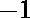

# 从数组元素中减去 k 的倍数后的最小和

> 原文:[https://www . geesforgeks . org/从数组元素中减去 k 的倍数后的最小和/](https://www.geeksforgeeks.org/minimum-sum-after-subtracting-multiples-of-k-from-the-elements-of-the-array/)

给定一个整数和一个整数数组，任务是通过从每个元素中减去一个倍数来找到数组中所有元素被约简后的最小可能和(结果必须是正的，并且数组中的每个元素在此约简后必须相等)。如果阵列无法缩小，则打印。**注意**一个元素在数组的最终状态下可以减少，也可以不减少。
**举例:**

> **输入:** arr[] = {2，3，4，5}，K = 1
> **输出:** 4
> 从 2 中减去 1，arr[] = {1，3，4，5}
> 从 3 中减去 2，arr[] = {1，1，4，5}
> 从 4 中减去 3，arr[] = {1，1，5}
> 从 5 中减去 4，使 arr[] = {1，1，1，1}，从而给出最小可能的和为 4。
> **输入:** arr[] = {5，6，7}，K = 2
> **输出:** -1

**方法:**首先，数组需要排序，因为问题可以使用[贪婪方法](https://www.geeksforgeeks.org/greedy-algorithms/)解决。

*   对数组进行排序，如果**arr【0】<0**则打印 **-1** ，因为每个元素都需要≥ 0。
*   如果 **K == 0** ，则没有元素可以进一步减少。所以为了得到答案，数组的每个元素都必须相等。所以元素之和是 **n * arr[0]** 否则打印 **-1** 。
*   现在对于其余的元素，运行一个从 **1 到 n** 的循环，检查**((arr[I]–arr[0])% K)= = 0**即 **arr[i]** 是否可以减少到 **arr[0]** 。
*   如果任一元素的上述条件失败，打印 **-1** 。
*   否则如果 **k == 1** 那么答案就是 **n** ，也就是说每一个元素都会被简化为 **1** 。
*   否则答案是 **n * (a[0] % k)** 。

以下是上述方法的实现:

## C++

```
// C++ program of the above approach
#include <bits/stdc++.h>
using namespace std;

// function to calculate minimum sum after transformation
int min_sum(int n, int k, int a[])
{

    sort(a, a + n);

    if (a[0] < 0)
        return -1;

    // no element can be reduced further
    if (k == 0) {

        // if all the elements of the array
        // are identical
        if (a[0] == a[n - 1])
            return (n * a[0]);
        else
            return -1;
    }
    else {
        int f = 0;
        for (int i = 1; i < n; i++) {

            int p = a[i] - a[0];

            // check if a[i] can be reduced to a[0]
            if (p % k == 0)
                continue;
            else {
                f = 1;
                break;
            }
        }

        // one of the elements cannot be reduced
        // to be equal to the other elements
        if (f)
            return -1;
        else {

            // if k = 1 then all elements can be reduced to 1
            if (k == 1)
                return n;
            else
                return (n * (a[0] % k));
        }
    }
}

// Driver code
int main()
{
    int arr[] = { 2, 3, 4, 5 };
    int K = 1;
    int N = sizeof(arr) / sizeof(arr[0]);
    cout << min_sum(N, K, arr);

    return 0;
}
```

## Java 语言(一种计算机语言，尤用于创建网站)

```
// Java program of the above approach

import java.io.*;
import java.util.*;
class GFG {

// function to calculate minimum sum after transformation
static int min_sum(int n, int k, int a[])
{

    Arrays.sort(a);

    if (a[0] < 0)
        return -1;

    // no element can be reduced further
    if (k == 0) {

        // if all the elements of the array
        // are identical
        if (a[0] == a[n - 1])
            return (n * a[0]);
        else
            return -1;
    }
    else {
        int f = 0;
        for (int i = 1; i < n; i++) {

            int p = a[i] - a[0];

            // check if a[i] can be reduced to a[0]
            if (p % k == 0)
                continue;
            else {
                f = 1;
                break;
            }
        }

        // one of the elements cannot be reduced
        // to be equal to the other elements
        if (f>0)
            return -1;
        else {

            // if k = 1 then all elements can be reduced to 1
            if (k == 1)
                return n;
            else
                return (n * (a[0] % k));
        }
    }
}

// Driver code

    public static void main (String[] args) {
            int arr[] = { 2, 3, 4, 5 };
    int K = 1;
    int N = arr.length;
    System.out.println(min_sum(N, K, arr));
    }
}
// This code is contributed by shs..
```

## 蟒蛇 3

```
# Python 3 program of the above approach

# function to calculate minimum sum
# after transformation
def min_sum(n, k, a):
    a.sort(reverse = False)

    if (a[0] < 0):
        return -1

    # no element can be reduced further
    if (k == 0):

        # if all the elements of the
        # array are identical
        if (a[0] == a[n - 1]):
            return (n * a[0])
        else:
            return -1

    else:
        f = 0
        for i in range(1, n, 1):
            p = a[i] - a[0]

            # check if a[i] can be
            # reduced to a[0]
            if (p % k == 0):
                continue
            else:
                f = 1
                break

        # one of the elements cannot be reduced
        # to be equal to the other elements
        if (f):
            return -1
        else:

            # if k = 1 then all elements
            # can be reduced to 1
            if (k == 1):
                return n
            else:
                return (n * (a[0] % k))

# Driver code
if __name__ == '__main__':
    arr = [2, 3, 4, 5]
    K = 1
    N = len(arr)
    print(min_sum(N, K, arr))

# This code is contributed by
# Surendra_Gangwar
```

## C#

```
// C# program of the above approach
using System;

class GFG
{

// function to calculate minimum
// sum after transformation
static int min_sum(int n, int k, int[] a)
{

    Array.Sort(a);

    if (a[0] < 0)
        return -1;

    // no element can be reduced further
    if (k == 0)
    {

        // if all the elements of the array
        // are identical
        if (a[0] == a[n - 1])
            return (n * a[0]);
        else
            return -1;
    }
    else
    {
        int f = 0;
        for (int i = 1; i < n; i++)
        {
            int p = a[i] - a[0];

            // check if a[i] can be
            // reduced to a[0]
            if (p % k == 0)
                continue;
            else
            {
                f = 1;
                break;
            }
        }

        // one of the elements cannot be reduced
        // to be equal to the other elements
        if (f > 0)
            return -1;
        else
        {

            // if k = 1 then all elements can
            // be reduced to 1
            if (k == 1)
                return n;
            else
                return (n * (a[0] % k));
        }
    }
}

// Driver code
public static void Main ()
{
    int[] arr = new int[] { 2, 3, 4, 5 };
    int K = 1;
    int N = arr.Length;
    Console.WriteLine(min_sum(N, K, arr));
}
}

// This code is contributed by mits
```

## 服务器端编程语言（Professional Hypertext Preprocessor 的缩写）

```
<?php
// PHP program of the above approach

// function to calculate minimum
// sum after transformation
function min_sum($n, $k, $a)
{

    sort($a);

    if ($a[0] < 0)
        return -1;

    // no element can be reduced further
    if ($k == 0)
    {

        // if all the elements of the array
        // are identical
        if ($a[0] == $a[$n - 1])
            return ($n * $a[0]);
        else
            return -1;
    }
    else
    {
        $f = 0;
        for ($i = 1; $i <$n; $i++)
        {

            $p = $a[$i] - $a[0];

            // check if a[i] can be reduced to a[0]
            if ($p % $k == 0)
                continue;
            else
            {
                $f = 1;
                break;
            }
        }

        // one of the elements cannot be reduced
        // to be equal to the other elements
        if ($f)
            return -1;
        else
        {

            // if k = 1 then all elements can
            // be reduced to 1
            if ($k == 1)
                return $n;
            else
                return ($n * ($a[0] % $k));
        }
    }
}

// Driver code
$arr = array(2, 3, 4, 5 );
$K = 1;
$N = count($arr);
echo min_sum($N, $K, $arr);

// This code is contributed by inder_verma
?>
```

## java 描述语言

```
<script>

// Javascript program of the above approach

// function to calculate minimum sum after transformation
function min_sum(n, k, a)
{

    a.sort();

    if (a[0] < 0)
        return -1;

    // no element can be reduced further
    if (k == 0) {

        // if all the elements of the array
        // are identical
        if (a[0] == a[n - 1])
            return (n * a[0]);
        else
            return -1;
    }
    else {
        let f = 0;
        for (let i = 1; i < n; i++) {

            let p = a[i] - a[0];

            // check if a[i] can be reduced to a[0]
            if (p % k == 0)
                continue;
            else {
                f = 1;
                break;
            }
        }

        // one of the elements cannot be reduced
        // to be equal to the other elements
        if (f>0)
            return -1;
        else {

            // if k = 1 then all elements can be reduced to 1
            if (k == 1)
                return n;
            else
                return (n * (a[0] % k));
        }
    }
}

// Driver code

    let arr = [ 2, 3, 4, 5 ];
    let K = 1;
    let N = arr.length;
    document.write(min_sum(N, K, arr));

</script>
```

**Output:** 

```
4
```

时间复杂度:O(n Log n)
**进一步优化:**
不用对数组进行排序，我们可以在 O(n)时间内找到最小元素。我们也可以在 O(n)时间内检查所有元素是否相同。