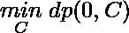
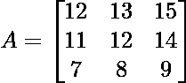

# NxN 网格中的最小和下降路径

> 原文:[https://www . geeksforgeeks . org/最小和下降路径 in-a-nxn-grid/](https://www.geeksforgeeks.org/minimum-sum-falling-path-in-a-nxn-grid/)

给定大小为 **NxN** 的整数的方形数组**。任务是找到通过 **A** 的下降路径的最小和。
下降路径将从第一行的任何元素开始，到最后一行结束。它从下一行中选择一个元素。下一行的选择必须在与上一行的列相差**最多**一列的列中。
示例:** 

```
**Input:** N = 2
mat[2][2] = 
{{5, 10},
{25, 15}}
**Output:** 20
Selected elements are 5, 15.

**Input:** N = 3
mat[3][3] =
{{1, 2, 3},
{ 4, 5, 6},
{ 7, 8, 9}}
Output: 12
Selected elements are 1, 4, 7.
```

****方法:**这个问题有一个**最优子结构**，意思是子问题的解可以用来解决这个问题的更大的实例。这就使得**动态规划**应运而生。
设 **dp[R][C]** 为从第一排 **[R，C]** 开始，到达 a 的最末一排的下降路径的最小总重量。
然后，![dp[R][C] = A[R][C] + min(dp[R+1, C-1], dp[R+1, C], dp[R+1, C+1])     ](img/6cebe1364ac4d358dcc1958b39729fde.png "Rendered by QuickLaTeX.com")，答案为第一排 I 的最小值:e 。
我们会制作一个辅助数组 **dp** 来缓存中间值**DP【R】【C】**。但是，我们将使用 **A** 来缓存这些值。我们的目标是将 **A** 的价值观转化为 **dp** 的价值观。
我们开始处理每一行，从第二个最后一行开始。我们设置![A[R][C] = min(A[R+1, C-1], A[R+1, C], A[R+1, C+1])     ](img/d9294da05ffb547087dea6e390deace0.png "Rendered by QuickLaTeX.com")，优雅地处理边界条件。** 

> ****对上述方法的解释:**
> 让我们再看一下递归，了解它的工作原理。对于像**这样的数组，A = [[1，2，3]，[4，5，6]，[7，8，9]]，**想象你在 **(1，0) (A[1][0] = 4)** 。可以去 **(2，0)** 取 **7** 的重量，也可以去 **(2，1)** 取 **8** 的重量。由于 **7** 较低，我们说 **(1，0)** 处的最小总重为 **dp(1，0) = 5 + 7** (原 A[R][C]为 7)。)
> 在访问 **(1，0)、(1，1)和(1，2)** 后，A【存储我们 dp 的值】，看起来像**[【1，2，3】，【11，12，14】，【7，8，9】]**。我们通过访问 **(0，0)、(0，1)、(0，2)** 再次进行该程序。
> 我们得到，最终答案是 0 到 n 范围内所有 C 的 **min(A[0][C]) = 12** 。**

**下面是上述方法的实现。** 

## **C++**

```
// C++ Program to minimum required sum
#include <bits/stdc++.h>
using namespace std;

const int n = 3;

// Function to return minimum path falling sum
int minFallingPathSum(int (&A)[n][n])
{

    // R = Row and C = Column
    // We begin from second last row and keep
    // adding maximum sum.
    for (int R = n - 2; R >= 0; --R) {
        for (int C = 0; C < n; ++C) {

            // best = min(A[R+1][C-1], A[R+1][C], A[R+1][C+1])
            int best = A[R + 1][C];
            if (C > 0)
                best = min(best, A[R + 1][C - 1]);
            if (C + 1 < n)
                best = min(best, A[R + 1][C + 1]);
            A[R][C] = A[R][C] + best;
        }
    }

    int ans = INT_MAX;
    for (int i = 0; i < n; ++i)
        ans = min(ans, A[0][i]);
    return ans;
}

// Driver program
int main()
{

    int A[n][n] = { { 1, 2, 3 },
                    { 4, 5, 6 },
                    { 7, 8, 9 } };

    // function to print required answer
    cout << minFallingPathSum(A);

    return 0;
}
```

## **Java 语言(一种计算机语言，尤用于创建网站)**

```
// Java Program to minimum required sum

import java.io.*;

class GFG {
static int n = 3;

// Function to return minimum path falling sum
static int minFallingPathSum(int A[][])
{

    // R = Row and C = Column
    // We begin from second last row and keep
    // adding maximum sum.
    for (int R = n - 2; R >= 0; --R) {
        for (int C = 0; C < n; ++C) {

            // best = min(A[R+1][C-1], A[R+1][C], A[R+1][C+1])
            int best = A[R + 1][C];
            if (C > 0)
                best = Math.min(best, A[R + 1][C - 1]);
            if (C + 1 < n)
                best = Math.min(best, A[R + 1][C + 1]);
            A[R][C] = A[R][C] + best;
        }
    }

    int ans = Integer.MAX_VALUE;
    for (int i = 0; i < n; ++i)
        ans = Math.min(ans, A[0][i]);
    return ans;
}

// Driver program
public static void main (String[] args) {
            int A[][] = { { 1, 2, 3 },
                    { 4, 5, 6 },
                    { 7, 8, 9 } };

    // function to print required answer
    System.out.println( minFallingPathSum(A));
    }
}
// This code is contributed by inder_verma..
```

## **蟒蛇 3**

```
# Python3 Program to minimum
# required sum
import sys

n = 3

# Function to return minimum
# path falling sum
def minFallingPathSum(A) :

    # R = Row and C = Column
    # We begin from second last row and keep
    # adding maximum sum.
    for R in range(n - 2, -1, -1) :
        for C in range(n) :

            # best = min(A[R+1][C-1], A[R+1][C],
            # A[R+1][C+1])
            best = A[R + 1][C]
            if C > 0 :
                best = min(best, A[R + 1][C - 1])
            if C + 1 < n :
                best = min(best, A[R + 1][C + 1])

            A[R][C] = A[R][C] + best

    ans = sys.maxsize

    for i in range(n) :
        ans = min(ans, A[0][i])

    return ans

# Driver code
if __name__ == "__main__" :

    A = [ [ 1, 2, 3],
        [ 4, 5, 6],
        [ 7, 8, 9] ]

    # function to print required answer
    print(minFallingPathSum(A))

# This code is contributed by
# ANKITRAI1
```

## **C#**

```
// C# Program to minimum required sum

using System;

class GFG {
static int n = 3;

// Function to return minimum path falling sum
static int minFallingPathSum(int[,] A)
{

    // R = Row and C = Column
    // We begin from second last row and keep
    // adding maximum sum.
    for (int R = n - 2; R >= 0; --R) {
        for (int C = 0; C < n; ++C) {

            // best = min(A[R+1,C-1], A[R+1,C], A[R+1,C+1])
            int best = A[R + 1,C];
            if (C > 0)
                best = Math.Min(best, A[R + 1,C - 1]);
            if (C + 1 < n)
                best = Math.Min(best, A[R + 1,C + 1]);
            A[R,C] = A[R,C] + best;
        }
    }

    int ans = int.MaxValue;
    for (int i = 0; i < n; ++i)
        ans = Math.Min(ans, A[0,i]);
    return ans;
}

// Driver program
public static void Main () {
            int[,] A = { { 1, 2, 3 },
                    { 4, 5, 6 },
                    { 7, 8, 9 } };

    // function to print required answer
    Console.WriteLine( minFallingPathSum(A));
    }
}
// This code is contributed by Subhadeep..
```

## **java 描述语言**

```
<script>
    // Javascript Program to minimum required sum   
    let n = 3;

    // Function to return minimum path falling sum
    function minFallingPathSum(A)
    {

        // R = Row and C = Column
        // We begin from second last row and keep
        // adding maximum sum.
        for (let R = n - 2; R >= 0; --R) {
            for (let C = 0; C < n; ++C) {

                // best = min(A[R+1][C-1], A[R+1][C], A[R+1][C+1])
                let best = A[R + 1][C];
                if (C > 0)
                    best = Math.min(best, A[R + 1][C - 1]);
                if (C + 1 < n)
                    best = Math.min(best, A[R + 1][C + 1]);
                A[R][C] = A[R][C] + best;
            }
        }

        let ans = Number.MAX_VALUE;
        for (let i = 0; i < n; ++i)
            ans = Math.min(ans, A[0][i]);
        return ans;
    }

    let A = [ [ 1, 2, 3 ],
             [ 4, 5, 6 ],
             [ 7, 8, 9 ] ];

    // function to print required answer
    document.write(minFallingPathSum(A));

    // This code is contributed by divyesh072019.
</script>
```

****Output**

```
12
```** 

****时间复杂度:** O(N <sup>2</sup> )**

****自上而下的方法:****

1.  **计算一个函数并跟踪递归解。**
2.  **考虑所有的基本条件。**
3.  **开始向问题中提到的所有可能的方向前进。**
4.  **当到达网格的末端拐角时，只需考虑最小下降路径和。**
5.  **返回最小下降路径和。**

**下面是上述方法的实现:**

## **蟒蛇 3**

```
# Python3 program for the above approach

def fallingpathsum(grid, row, col, Row, Col, dp):

    # Base condition
    if row == Row-1 and col == Col-1: 
        return grid[row][col]

    # Base condition
    if row > Row-1 or col > Col-1: 
        return 0

    # Respective directions
    rightdown = fallingpathsum(grid, row+1, col, Row, Col, dp)
    rdd = fallingpathsum(grid, row+1, col+1, Row, Col, dp)
    ldd = fallingpathsum(grid, row+1, col-1, Row, Col, dp)

     # Checking for duplicates
    if dp[row][col] == -1:
        dp[row][col] = grid[row][col] + min(rightdown, ldd, rdd)
    return dp[row][col]

grid = [[1,2,3], [4,5,6],[7,8,9]]
Row = len(grid)
Col = len(grid[0])
dp = [[-1 for i in range(Row)]for _ in range(Col)]
print(fallingpathsum(grid, 0, 0, Row, Col, dp))
# CODE CONTRIBUTED BY RAMPRASAD KONDOJU
```

****Output**

```
20
```** 

****时间复杂度:** O(N)**