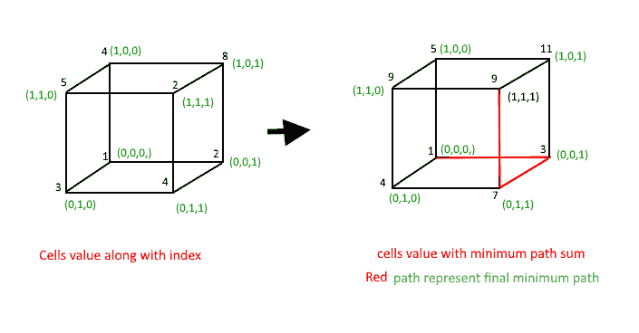

# 三维阵列中的最小和路径

> 原文:[https://www.geeksforgeeks.org/minimum-sum-path-3-d-array/](https://www.geeksforgeeks.org/minimum-sum-path-3-d-array/)

给定一个三维数组 arr[l][m][n]，任务是找到从数组的第一个单元到数组的最后一个单元的最小路径和。我们只能遍历到相邻的元素，即从一个给定的单元格(I，j，k)开始，单元格(i+1，j，k)，(I，j+1，k)和(I，j，k+1)可以遍历，对角遍历是不允许的，我们可以假设所有的代价都是正整数。

**示例:**

```
Input : arr[][][]= { {{1, 2}, {3, 4}},
                     {{4, 8}, {5, 2}} };
Output : 9
Explanation : arr[0][0][0] + arr[0][0][1] + 
              arr[0][1][1] + arr[1][1][1]

Input : { { {1, 2}, {4, 3}},
          { {3, 4}, {2, 1}} };
Output : 7
Explanation : arr[0][0][0] + arr[0][0][1] + 
              arr[0][1][1] + arr[1][1][1] 
```

让我们考虑由长方体表示的三维数组 arr[2][2][2]，其值为:

```
arr[][][] = {{{1, 2}, {3, 4}},
            { {4, 8}, {5, 2}}};
Result = 9 is calculated as:
```



这个问题类似于[最小成本路径。](https://www.geeksforgeeks.org/dynamic-programming-set-6-min-cost-path/)并且可以使用动态规划求解。

```
// Array for storing result
int tSum[l][m][n];

tSum[0][0][0] = arr[0][0][0];

/* Initialize first row of tSum array */
for (i = 1; i < l; i++)
  tSum[i][0][0] = tSum[i-1][0][0] + arr[i][0][0];

/* Initialize first column of tSum array */
for (j = 1; j < m; j++)
  tSum[0][j][0] = tSum[0][j-1][0] + arr[0][j][0];

/* Initialize first width of tSum array */
for (k = 1; k < n; k++)
  tSum[0][0][k] = tSum[0][0][k-1] + arr[0][0][k];

/* Initialize first row- First column of tSum
   array */
for (i = 1; i < l; i++)
  for (j = 1; j < m; j++)
     tSum[i][j][0] = min(tSum[i-1][j][0],
                         tSum[i][j-1][0],
                         INT_MAX)
                        + arr[i][j][0];

/* Initialize first row- First width of tSum
   array */
for (i = 1; i < l; i++)
  for (k = 1; k < n; k++)
    tSum[i][0][k] = min(tSum[i-1][0][k],
                        tSum[i][0][k-1],
                        INT_MAX)
                     + arr[i][0][k];

/* Initialize first width- First column of
   tSum array */
for (k = 1; k < n; k++)
  for (j = 1; j < m; j++)
     tSum[0][j][k] = min(tSum[0][j][k-1],
                         tSum[0][j-1][k],
                         INT_MAX)
                      + arr[0][j][k];

/* Construct rest of the tSum array */
for (i = 1; i < l; i++)
  for (j = 1; j < m; j++)
    for (k = 1; k < n; k++)
       tSum[i][j][k] = min(tSum[i-1][j][k],
                           tSum[i][j-1][k],
                           tSum[i][j][k-1])
                      + arr[i][j][k];

return tSum[l-1][m-1][n-1];
```

## C++

```
// C++ program for Min path sum of 3D-array
#include<bits/stdc++.h>
using namespace std;
#define l 3
#define m 3
#define n 3

// A utility function that returns minimum
// of 3 integers
int min(int x, int y, int z)
{
  return (x < y)? ((x < z)? x : z) :
          ((y < z)? y : z);
}

// function to calculate MIN path sum of 3D array
int minPathSum(int arr[][m][n])
{
  int i, j, k;
  int tSum[l][m][n];

  tSum[0][0][0] = arr[0][0][0];

  /* Initialize first row of tSum array */
  for (i = 1; i < l; i++)
    tSum[i][0][0] = tSum[i-1][0][0] + arr[i][0][0];

  /* Initialize first column of tSum array */
  for (j = 1; j < m; j++)
    tSum[0][j][0] = tSum[0][j-1][0] + arr[0][j][0];

  /* Initialize first width of tSum array */
  for (k = 1; k < n; k++)
    tSum[0][0][k] = tSum[0][0][k-1] + arr[0][0][k];

  /* Initialize first row- First column of
     tSum array */
  for (i = 1; i < l; i++)
    for (j = 1; j < m; j++)
      tSum[i][j][0] = min(tSum[i-1][j][0],
                          tSum[i][j-1][0],
                          INT_MAX)
                    + arr[i][j][0];

  /* Initialize first row- First width of
     tSum array */
  for (i = 1; i < l; i++)
    for (k = 1; k < n; k++)
      tSum[i][0][k] = min(tSum[i-1][0][k],
                          tSum[i][0][k-1],
                          INT_MAX)
                    + arr[i][0][k];

  /* Initialize first width- First column of
     tSum array */
  for (k = 1; k < n; k++)
    for (j = 1; j < m; j++)
      tSum[0][j][k] = min(tSum[0][j][k-1],
                          tSum[0][j-1][k],
                          INT_MAX)
                    + arr[0][j][k];

  /* Construct rest of the tSum array */
  for (i = 1; i < l; i++)
    for (j = 1; j < m; j++)
      for (k = 1; k < n; k++)
        tSum[i][j][k] = min(tSum[i-1][j][k],
                            tSum[i][j-1][k],
                            tSum[i][j][k-1])
                        + arr[i][j][k];

  return tSum[l-1][m-1][n-1];

}

// Driver program
int main()
{
  int arr[l][m][n] = { { {1, 2, 4}, {3, 4, 5}, {5, 2, 1}},
    { {4, 8, 3}, {5, 2, 1}, {3, 4, 2}},
    { {2, 4, 1}, {3, 1, 4}, {6, 3, 8}}
  };
  cout << minPathSum(arr);
  return 0;
}
```

## Java 语言(一种计算机语言，尤用于创建网站)

```
// Java program for Min path sum of 3D-array
import java.io.*;

class GFG {

    static int l =3;
    static int m =3;
    static int n =3;

    // A utility function that returns minimum
    // of 3 integers
    static int min(int x, int y, int z)
    {
         return (x < y)? ((x < z)? x : z) :
                ((y < z)? y : z);
    }

    // function to calculate MIN path sum of 3D array
    static int minPathSum(int arr[][][])
    {
        int i, j, k;
        int tSum[][][] =new int[l][m][n];

        tSum[0][0][0] = arr[0][0][0];

        /* Initialize first row of tSum array */
        for (i = 1; i < l; i++)
            tSum[i][0][0] = tSum[i-1][0][0] + arr[i][0][0];

        /* Initialize first column of tSum array */
        for (j = 1; j < m; j++)
            tSum[0][j][0] = tSum[0][j-1][0] + arr[0][j][0];

        /* Initialize first width of tSum array */
        for (k = 1; k < n; k++)
            tSum[0][0][k] = tSum[0][0][k-1] + arr[0][0][k];

        /* Initialize first row- First column of
            tSum array */
        for (i = 1; i < l; i++)
            for (j = 1; j < m; j++)
            tSum[i][j][0] = min(tSum[i-1][j][0],
                                tSum[i][j-1][0],
                                Integer.MAX_VALUE)
                            + arr[i][j][0];

        /* Initialize first row- First width of
            tSum array */
        for (i = 1; i < l; i++)
            for (k = 1; k < n; k++)
            tSum[i][0][k] = min(tSum[i-1][0][k],
                                tSum[i][0][k-1],
                                Integer.MAX_VALUE)
                            + arr[i][0][k];

        /* Initialize first width- First column of
            tSum array */
        for (k = 1; k < n; k++)
            for (j = 1; j < m; j++)
            tSum[0][j][k] = min(tSum[0][j][k-1],
                                tSum[0][j-1][k],
                                Integer.MAX_VALUE)
                            + arr[0][j][k];

        /* Construct rest of the tSum array */
        for (i = 1; i < l; i++)
            for (j = 1; j < m; j++)
            for (k = 1; k < n; k++)
                tSum[i][j][k] = min(tSum[i-1][j][k],
                                    tSum[i][j-1][k],
                                    tSum[i][j][k-1])
                                + arr[i][j][k];

        return tSum[l-1][m-1][n-1];

    }

    // Driver program
    public static void main (String[] args)
    {
        int arr[][][] = { { {1, 2, 4}, {3, 4, 5}, {5, 2, 1}},
                          { {4, 8, 3}, {5, 2, 1}, {3, 4, 2}},
                          { {2, 4, 1}, {3, 1, 4}, {6, 3, 8}}
                        };
        System.out.println ( minPathSum(arr));

    }
}

// This code is contributed by vt_m
```

## C#

```
// C# program for Min
// path sum of 3D-array
using System;

class GFG
{

    static int l = 3;
    static int m = 3;
    static int n = 3;

    // A utility function
    // that returns minimum
    // of 3 integers
    static int min(int x, int y, int z)
    {
        return (x < y) ? ((x < z) ? x : z) :
              ((y < z) ? y : z);
    }

    // function to calculate MIN
    // path sum of 3D array
    static int minPathSum(int [,,]arr)
    {
        int i, j, k;
        int [ , , ]tSum = new int[l, m, n];

        tSum[0, 0, 0] = arr[0, 0, 0];

        /* Initialize first
        row of tSum array */
        for (i = 1; i < l; i++)
            tSum[i, 0, 0] = tSum[i - 1, 0, 0] +
                             arr[i, 0, 0];

        /* Initialize first column
        of tSum array */
        for (j = 1; j < m; j++)
            tSum[0, j, 0] = tSum[0, j - 1, 0] +
                             arr[0, j, 0];

        /* Initialize first
        width of tSum array */
        for (k = 1; k < n; k++)
            tSum[0, 0, k] = tSum[0, 0, k - 1] +
                             arr[0, 0, k];

        /* Initialize first
        row- First column of
        tSum array */
        for (i = 1; i < l; i++)
            for (j = 1; j < m; j++)
            tSum[i, j, 0] = min(tSum[i - 1, j, 0],
                                tSum[i, j - 1, 0],
                                int.MaxValue) +
                                arr[i, j, 0];

        /* Initialize first
        row- First width of
        tSum array */
        for (i = 1; i < l; i++)
            for (k = 1; k < n; k++)
            tSum[i, 0, k] = min(tSum[i - 1, 0, k],
                                tSum[i, 0, k - 1],
                                int.MaxValue) +
                                arr[i, 0, k];

        /* Initialize first
        width- First column of
        tSum array */
        for (k = 1; k < n; k++)
            for (j = 1; j < m; j++)
            tSum[0, j, k] = min(tSum[0, j, k - 1],
                                tSum[0, j - 1, k],
                                int.MaxValue) +
                                arr[0, j, k];

        /* Construct rest of
        the tSum array */
        for (i = 1; i < l; i++)
            for (j = 1; j < m; j++)
            for (k = 1; k < n; k++)
                tSum[i, j, k] = min(tSum[i - 1, j, k],
                                    tSum[i, j - 1, k],
                                    tSum[i, j, k - 1]) +
                                    arr[i, j, k];

        return tSum[l-1,m-1,n-1];

    }

    // Driver Code
    static public void Main ()
    {
        int [, , ]arr= {{{1, 2, 4}, {3, 4, 5}, {5, 2, 1}},
                        {{4, 8, 3}, {5, 2, 1}, {3, 4, 2}},
                        {{2, 4, 1}, {3, 1, 4}, {6, 3, 8}}};
        Console.WriteLine(minPathSum(arr));

    }
}

// This code is contributed by ajit
```

## java 描述语言

```
<script>

// Javascript program for Min
// path sum of 3D-array
var l = 3;
var m = 3;
var n = 3;

// A utility function
// that returns minimum
// of 3 integers
function min(x, y, z)
{
    return (x < y) ? ((x < z) ? x : z) :
          ((y < z) ? y : z);
}

// function to calculate MIN
// path sum of 3D array
function minPathSum(arr)
{
    var i, j, k;
    var tSum = Array(l);

    for(var i = 0; i<l;i++)
    {
        tSum[i] = Array.from(Array(m), ()=>Array(n));
    }

    tSum[0][0][0] = arr[0][0][0];

    /* Initialize first
    row of tSum array */
    for (i = 1; i < l; i++)
        tSum[i][0][0] = tSum[i - 1][0][0] +
                         arr[i][0][0];

    /* Initialize first column
    of tSum array */
    for (j = 1; j < m; j++)
        tSum[0][j][0] = tSum[0][j - 1][0] +
                         arr[0][j][0];

    /* Initialize first
    width of tSum array */
    for (k = 1; k < n; k++)
        tSum[0][0][k] = tSum[0][0][k - 1] +
                         arr[0][0][k];

    /* Initialize first
    row- First column of
    tSum array */
    for (i = 1; i < l; i++)
        for (j = 1; j < m; j++)
            tSum[i][j][0] = min(tSum[i - 1][j][0],
                            tSum[i][j - 1][0],
                           1000000000) +
                            arr[i][j][0];

    /* Initialize first
    row- First width of
    tSum array */
    for (i = 1; i < l; i++)
        for (k = 1; k < n; k++)
            tSum[i][0][k] = min(tSum[i - 1][0][k],
                            tSum[i][0][k - 1],
                           1000000000) +
                            arr[i][0][k];

    /* Initialize first
    width- First column of
    tSum array */
    for (k = 1; k < n; k++)
        for (j = 1; j < m; j++)
            tSum[0][j][k] = min(tSum[0][j][k - 1],
                            tSum[0][j - 1][k],
                           1000000000) +
                            arr[0][j][k];

    /* Construct rest of
    the tSum array */
    for (i = 1; i < l; i++)
        for (j = 1; j < m; j++)
            for (k = 1; k < n; k++)
                tSum[i][j][k] = min(tSum[i - 1][j][k],
                                tSum[i][j - 1][k],
                                tSum[i][j][k - 1]) +
                                arr[i][j][k];

    return tSum[l-1][m-1][n-1];

}

// Driver Code
var arr= [[[1, 2, 4], [3, 4, 5], [5, 2, 1]],
                [[4, 8, 3], [5, 2, 1], [3, 4, 2]],
                [[2, 4, 1], [3, 1, 4], [6, 3, 8]]];
document.write(minPathSum(arr));

</script>
```

**输出:**

```
20
```

**时间复杂度:**O(l * m * n)
T3】辅助空间: O(l*m*n)

本文由[**Shivam Pradhan(anuj _ charm)**](https://www.facebook.com/anuj.charm)供稿。如果你喜欢 GeeksforGeeks 并想投稿，你也可以使用[write.geeksforgeeks.org](https://write.geeksforgeeks.org)写一篇文章或者把你的文章邮寄到 review-team@geeksforgeeks.org。看到你的文章出现在极客博客主页上，帮助其他极客。
如果发现有不正确的地方，或者想分享更多关于上述话题的信息，请写评论。