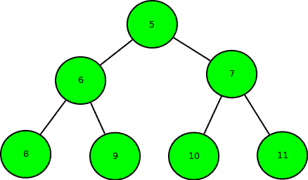
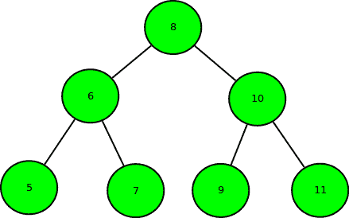
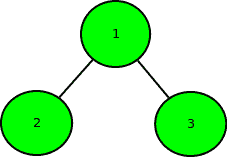
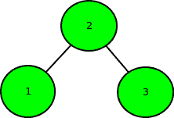

# 将二叉树转换为二叉查找树所需的最小交换量

> 原文:[https://www . geesforgeks . org/minimum-swap-required-convert-binary-tree-binary-search-tree/](https://www.geeksforgeeks.org/minimum-swap-required-convert-binary-tree-binary-search-tree/)

给定完全二叉树的数组表示，即如果索引 I 是父树，索引 2*i + 1 是左子树，索引 2*i + 2 是右子树。任务是找到将其转换为二叉查找树所需的最小交换数量。

示例:

```
Input : arr[] = { 5, 6, 7, 8, 9, 10, 11 }
Output : 3
Binary tree of the given array:
```



```
Swap 1: Swap node 8 with node 5.
Swap 2: Swap node 9 with node 10.
Swap 3: Swap node 10 with node 7.
```



```
So, minimum 3 swaps are required.

Input : arr[] = { 1, 2, 3 }
Output : 1
Binary tree of the given array:
```



```
After swapping node 1 with node 2.
```



```
So, only 1 swap required.
```

这个想法是利用这样一个事实:二叉查找树的有序遍历是按照它们的值的递增顺序进行的。
因此，找到二叉树的有序遍历，并将其存储在数组中，并尝试对数组进行排序。将数组排序所需的最小交换次数就是答案。请参考下面的帖子，找到排序数组所需的最小交换次数。
[对数组进行排序所需的最小交换次数](https://www.geeksforgeeks.org/minimum-number-swaps-required-sort-array/)
**时间复杂度:** O(n log n)。

## C++

```
// C++ program for Minimum swap required
// to convert binary tree to binary search tree
#include<bits/stdc++.h>
using namespace std;

// Inorder Traversal of Binary Tree
void inorder(int a[], std::vector<int> &v,
                        int n, int index)
{
    // if index is greater or equal to vector size
    if(index >= n)
        return;
    inorder(a, v, n, 2 * index + 1);

    // push elements in vector
    v.push_back(a[index]);
    inorder(a, v, n, 2 * index + 2);
}

// Function to find minimum swaps to sort an array
int minSwaps(std::vector<int> &v)
{
    std::vector<pair<int,int> > t(v.size());
    int ans = 0;
    for(int i = 0; i < v.size(); i++)
        t[i].first = v[i], t[i].second = i;

    sort(t.begin(), t.end());
    for(int i = 0; i < t.size(); i++)
    {
        // second element is equal to i
        if(i == t[i].second)
            continue;
        else
        {
            // swaping of elements
            swap(t[i].first, t[t[i].second].first);
            swap(t[i].second, t[t[i].second].second);
        }

        // Second is not equal to i
        if(i != t[i].second)
            --i;
        ans++;
    }
    return ans;
}

// Driver code
int main()
{
    int a[] = { 5, 6, 7, 8, 9, 10, 11 };
    int n = sizeof(a) / sizeof(a[0]);
    std::vector<int> v;
    inorder(a, v, n, 0);
    cout << minSwaps(v) << endl;
}

// This code is contributed by code_freak
```

## 蟒蛇 3

```
# Python3 program for Minimum swap required
# to convert binary tree to binary search tree

# Inorder Traversal of Binary Tree
def inorder(a, n, index):

    global v

    # If index is greater or equal to
    # vector size
    if (index >= n):
        return

    inorder(a, n, 2 * index + 1)

    # Push elements in vector
    v.append(a[index])
    inorder(a, n, 2 * index + 2)

# Function to find minimum swaps
# to sort an array
def minSwaps():

    global v
    t = [[0, 0] for i in range(len(v))]
    ans = -2

    for i in range(len(v)):
        t[i][0], t[i][1] = v[i], i

    t, i = sorted(t), 0

    while i < len(t):

        # break
        # second element is equal to i
        if (i == t[i][1]):
            i += 1
            continue
        else:

            # Swaping of elements
            t[i][0], t[t[i][1]][0] = t[t[i][1]][0], t[i][0]
            t[i][1], t[t[i][1]][1] = t[t[i][1]][1], t[i][1]

        # Second is not equal to i
        if (i == t[i][1]):
            i -= 1

        i += 1

        ans += 1

    return ans

# Driver Code
if __name__ == '__main__':

    v = []
    a = [ 5, 6, 7, 8, 9, 10, 11 ]
    n = len(a)
    inorder(a, n, 0)

    print(minSwaps())

# This code is contributed by mohit kumar 29
```

## java 描述语言

```
<script>
// Javascript program for Minimum swap required
// to convert binary tree to binary search tree

// Inorder Traversal of Binary Tree
function inorder(a, n, index)
{
    // If index is greater or equal to
    // vector size
    if (index >= n)
        return

    inorder(a, n, 2 * index + 1)

    // Push elements in vector
    v.push(a[index])
    inorder(a, n, 2 * index + 2)
}

// Function to find minimum swaps to sort an array
function minSwaps()
{
    let t=new Array(v.length);
    let ans = -2

    for(let i=0;i<v.length;i++)
    {
        t[i]=new Array(2);
        for(let j=0;j<2;j++)
        {
            t[i][j]=0;
        }
    }

    for(let i=0;i<v.length;i++)
    {
        t[i][0]=v[i];
        t[i][1]=i;
    }

    t.sort(function(a,b){return a[0] - b[0];});
    let i=0;

    while(i<t.length)
    {

        // break
        // second element is equal to i
        if (i == t[i][1])
        {    i += 1;
            continue;
        }
        else{

            // Swaping of elements
            t[i][0], t[t[i][1]][0] = t[t[i][1]][0], t[i][0];
            t[i][1], t[t[i][1]][1] = t[t[i][1]][1], t[i][1];
         }
        // Second is not equal to i
        if (i == t[i][1])
            i -= 1;

        i += 1;

        ans += 1;
    }

     return ans;

}
// Driver code
let v=[];
let a=[ 5, 6, 7, 8, 9, 10, 11];
let n=a.length;
inorder(a, n, 0);
document.write(minSwaps());

// This code is contributed by patel2127
</script>
```

## Java 语言(一种计算机语言，尤用于创建网站)

```
// Java program for Minimum swap required
// to convert binary tree to binary search tree
import java.util.*;

public class GFG{

    // Pair class
    static class Pair{
        int first, second;

        Pair(int a, int b){
            first = a;
            second = b;
        }
    }

    // Inorder Traversal of Binary Tree
    static void inorder(int a[], Vector<Integer> v, int n, int index)
    {
        // if index is greater or equal to vector size
        if(index >= n)
            return;

        inorder(a, v, n, 2 * index + 1);

        // push elements in vector
        v.add(a[index]);

        inorder(a, v, n, 2 * index + 2);
    }

    // Function returns the
    // minimum number of swaps
    // required to sort the array
    // Refer :
    // https://www.geeksforgeeks.org/minimum-number-swaps-required-sort-array/
    public static int minSwaps(Vector<Integer> arr)
    {
        int n = arr.size();

        ArrayList < Pair > arrpos = new ArrayList < Pair > ();
        for (int i = 0; i < n; i++)
             arrpos.add(new Pair(arr.get(i), i));

        // Sort the array by array element values to
        // get right position of every element as the
        // elements of second array.
        arrpos.sort(new Comparator<Pair>()
        {
            @Override
            public int compare(Pair o1, Pair o2)
            {
                return o1.first - o2.first;
            }
        });

        // To keep track of visited elements. Initialize
        // all elements as not visited or false.
        Boolean[] vis = new Boolean[n];
        Arrays.fill(vis, false);

        // Initialize result
        int ans = 0;

        // Traverse array elements
        for (int i = 0; i < n; i++)
        {
            // already swapped and corrected or
            // already present at correct pos
            if (vis[i] || arrpos.get(i).first == i)
                continue;

            // find out the number of  node in
            // this cycle and add in ans
            int cycle_size = 0;
            int j = i;
            while (!vis[j])
            {
                vis[j] = true;

                // move to next node
                j = arrpos.get(j).second;
                cycle_size++;
            }

            // Update answer by adding current cycle.
            if(cycle_size > 0)
            {
                ans += (cycle_size - 1);
            }
        }

        // Return result
        return ans;
    }

    // Driver code
    public static void main(String args[])
    {
        int a[] = { 5, 6, 7, 8, 9, 10, 11 };
        int n = a.length;

        Vector<Integer> v = new Vector<Integer>();

        inorder(a, v, n, 0);

        System.out.println(minSwaps(v));
    }
}
```

**Output**

```
3

```

**练习:**我们能不能把这个推广到正常的二叉树，也就是用左右指针表示的二叉树，不一定完整？

本文由 [**Anuj Chauhan**](https://www.facebook.com/anuj0503) 供稿。如果你喜欢 GeeksforGeeks 并想投稿，你也可以使用[write.geeksforgeeks.org](https://write.geeksforgeeks.org)写一篇文章或者把你的文章邮寄到 contribute@geeksforgeeks.org。看到你的文章出现在极客博客主页上，帮助其他极客。
如果发现有不正确的地方，或者想分享更多关于上述话题的信息，请写评论。