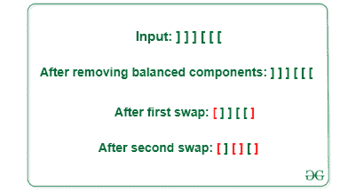

# 在任何指数下平衡给定括号的最小互换量

> 原文:[https://www . geeksforgeeks . org/最小互换以平衡任意指数给定的括号/](https://www.geeksforgeeks.org/minimum-swaps-to-balance-the-given-brackets-at-any-index/)

给定由相等数量的左括号“[”和右括号“]”组成的偶数长度的平衡[字符串](https://www.geeksforgeeks.org/string-class-in-java/)，计算使字符串平衡的最小交换次数。一个不平衡的字符串可以通过交换任意两个括号来平衡。

> 如果一个字符串可以用“[S1]”的形式表示，则称它为平衡字符串，其中 S1 是一个平衡字符串

**示例:**

> **输入:**s =]]][[["
> ]T3]输出: 2
> **说明:**第一次互换:位置 0 和 5 = [ ] ] [ [ ]
> 第二次互换:位置 2 和 3 =[][][][]
> 
> 
> 
> **输入:**s =]]]][][[[["
> ]T3]输出: 2
> **说明:**第一次交换位置 2 和 5 的括号，第二次交换位置 0 和 7 的括号

**方法:**给定的问题可以通过[遍历字符串](https://www.geeksforgeeks.org/iterate-over-the-characters-of-a-string-in-java/)并遵循以下步骤来解决:

*   所有[平衡支架](https://www.geeksforgeeks.org/check-for-balanced-parentheses-in-an-expression/)都被移除，因为它们不需要任何交换来平衡弦
*   因为，左括号“[”和右括号“]”的数量是一样的，去掉平衡成分后，剩下的字符串就变成像]]……..[ [
*   最佳方法是在一次交换中平衡两组括号
*   每两对方括号，交换将使它们平衡。
*   如果不平衡对的数量为奇数，则需要再交换一次。
*   如果 **p** 是不平衡对的数量，那么

> 互换的最小数量= (p + 1) / 2

以下是上述方法的实施

## C++

```
// C++ implementation for the above approach
#include <bits/stdc++.h>
using namespace std;

// Function to balance the given bracket by swap
int BalancedStringBySwapping(string s)
{

    // To count the number of uunbalanced pairs
    int unbalancedPair = 0;
    for (int i = 0; i < s.length(); ++i)
    {

        // if there is an opening bracket and
        // we encounter closing bracket then it will
        // decrement the count of unbalanced bracket.
        if (unbalancedPair > 0 && s[i] == ']')
        {
            --unbalancedPair;
        }

        // else it will increment unbalanced pair count
        else if (s[i] == '[')
        {
            ++unbalancedPair;
        }
    }

    return (unbalancedPair + 1) / 2;
}

// Driver code
int main()
{

    string s = "]]][[[";
    cout << (BalancedStringBySwapping(s));

    return 0;
}

// This code is contributed by Potta Lokesh
```

## Java 语言(一种计算机语言，尤用于创建网站)

```
// Java implementation for the above approach

import java.io.*;
import java.util.*;

class GFG {

// Function to balance the given bracket by swap
    static int BalancedStringBySwapping(String s)
    {

        // To count the number of uunbalanced pairs
        int unbalancedPair = 0;
        for (int i = 0; i < s.length(); ++i) {

            // if there is an opening bracket and
            // we encounter closing bracket then it will
            // decrement the count of unbalanced bracket.
            if (unbalancedPair > 0 && s.charAt(i) == ']') {
                --unbalancedPair;
            }

            // else it will increment unbalanced pair count
            else if (s.charAt(i) == '[') {
                ++unbalancedPair;
            }
        }

        return (unbalancedPair + 1) / 2;
    }

// Driver code
    public static void main(String[] args)
    {

        String s = "]]][[[";
        System.out.println(BalancedStringBySwapping(s));
    }

}
```

## 蟒蛇 3

```
# Python3 implementation for the above approach

# Function to balance the given bracket by swap
def BalancedStringBySwapping(s) :

    # To count the number of uunbalanced pairs
    unbalancedPair = 0;
    for i in range(len(s)) :

        # if there is an opening bracket and
        # we encounter closing bracket then it will
        # decrement the count of unbalanced bracket.
        if (unbalancedPair > 0 and s[i] == ']') :

            unbalancedPair -= 1;

        # else it will increment unbalanced pair count
        elif (s[i] == '[') :

            unbalancedPair += 1;

    return (unbalancedPair + 1) // 2;

# Driver code
if __name__ == "__main__" :

    s = "]]][[[";
    print(BalancedStringBySwapping(s));

    # This code is contributed by AnkThon.
```

## C#

```
// C# implementation for the above approach
using System;

class GFG
{

  // Function to balance the given bracket by swap
  static int BalancedStringBySwapping(String s)
  {

    // To count the number of uunbalanced pairs
    int unbalancedPair = 0;
    for (int i = 0; i < s.Length; ++i) {

      // if there is an opening bracket and
      // we encounter closing bracket then it will
      // decrement the count of unbalanced bracket.
      if (unbalancedPair > 0 && s[i] == ']') {
        --unbalancedPair;
      }

      // else it will increment unbalanced pair count
      else if (s[i] == '[') {
        ++unbalancedPair;
      }
    }

    return (unbalancedPair + 1) / 2;
  }

  // Driver code
  public static void Main(String[] args)
  {

    String s = "]]][[[";
    Console.Write(BalancedStringBySwapping(s));
  }

}

// This code is contributed by shivanisinghss2110
```

## java 描述语言

```
<script>
// javaScript implementation for the above approach

// Function to balance the given bracket by swap
function BalancedStringBySwapping(s)
{

    // To count the number of uunbalanced pairs
    var unbalancedPair = 0;
    for (var i = 0; i < s.length; ++i)
    {

        // if there is an opening bracket and
        // we encounter closing bracket then it will
        // decrement the count of unbalanced bracket.
        if (unbalancedPair > 0 && s[i] == ']')
        {
            --unbalancedPair;
        }

        // else it will increment unbalanced pair count
        else if (s[i] == '[')
        {
            ++unbalancedPair;
        }
    }

    return (unbalancedPair + 1) / 2;
}

    // Driver code
    var s = "]]][[[";
    document.write(BalancedStringBySwapping(s));

// This code is contributed by AnkThon
</script>
```

**Output**

```
2
```

**时间复杂度:**O(N)
T3】辅助空间: O(1)