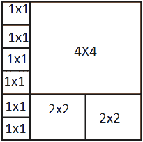

# 覆盖整个区域的最小大小为 2 次方的瓷砖

> 原文:[https://www . geeksforgeeks . org/最小二乘覆盖整个区域/](https://www.geeksforgeeks.org/minimum-tiles-of-sizes-in-powers-of-two-to-cover-whole-area/)

给定面积 **N X M** 。你有无限个大小为 2 <sup>i</sup> X 2 <sup>i</sup> 的瓷砖，其中 i = 0，1，2，…等等。任务是找到用瓷砖填充给定区域所需的最小瓷砖数量。
示例:

```
Input : N = 5, M = 6.
Output : 9
Area of 5 X 6 can be covered with minimum 9 tiles.
6 tiles of 1 X 1, 2 tiles of 2 X 2, 1 tile of 4 X 4.
```



```
Input : N = 10, M = 5.
Output : 14
```

这个想法是把给定的区域分成最近的 2 <sup>i</sup> X 2 <sup>i</sup> 。
我们把问题分成两种情况:
**情况 1:** 如果 N 是奇数，M 是偶数，用 M 个 1×1 的瓦片填充行或列。然后计算 N/2 X M/2 大小的区域的最小切片数。同样，如果 M 是奇数，N 是偶数，将 N 加到我们的答案中，找到 N/2 X M/2 区域的最小瓦片数。
**情况 2:** 如果 N 和 M 都是奇数，则填充一行一列，因此在答案中添加 N+M–1，并找到填充 N/2 X M/2 区域所需的最小瓷砖数。
**情况 3:** 如果 N 和 M 都是偶数，计算用 N/2 X M/2 区域填充该区域所需的最小瓷砖数。因为将两个尺寸减半不会改变所需的瓷砖数量。
以下是本办法的实施情况:

## C++

```
#include<bits/stdc++.h>
using namespace std;

int minTiles(int n, int m)
{
  // base case, when area is 0.
  if (n == 0 || m == 0)
    return 0;

  // If n and m both are even, calculate tiles for n/2 x m/2
  // Halving both dimensions doesn't change the number of tiles
  else if (n%2 == 0 && m%2 == 0)
    return minTiles(n/2, m/2);

  // If n is even and m is odd
  // Use a row of 1x1 tiles
  else if (n%2 == 0 && m%2 == 1)
    return (n + minTiles(n/2, m/2));

  // If n is odd and m is even
  // Use a column of 1x1 tiles
  else if (n%2 == 1 && m%2 == 0)
    return (m + minTiles(n/2, m/2));

  // If n and m are odd
  // add row + column number of tiles
  else
    return (n + m - 1 + minTiles(n/2, m/2));
}

// Driven Program
int main()
{
  int n = 5, m = 6;

  cout << minTiles(n, m) << endl;
  return 0;
}
```

## Java 语言(一种计算机语言，尤用于创建网站)

```
// Java code for Minimum tiles of
// sizes in powers of two to cover
// whole area

class GFG {

    static int minTiles(int n, int m)
    {
    // base case, when area is 0.
    if (n == 0 || m == 0)
        return 0;

    // If n and m both are even,
    // calculate tiles for n/2 x m/2
    // Halving both dimensions doesn't
    // change the number of tiles
    else if (n % 2  == 0 && m % 2 == 0)
        return minTiles(n / 2, m / 2);

    // If n is even and m is odd
    // Use a row of 1x1 tiles
    else if (n % 2 == 0 && m % 2 == 1)
        return (n + minTiles(n / 2, m / 2));

    // If n is odd and m is even
    // Use a column of 1x1 tiles
    else if (n % 2 == 1 && m % 2 == 0)
        return (m + minTiles(n / 2, m / 2));

    // If n and m are odd
    // add row + column number of tiles
    else
        return (n + m - 1 + minTiles(n / 2, m / 2));
    }

    // Driver code
    public static void main (String[] args)
    {
            int n = 5, m = 6;
            System.out.println(minTiles(n, m));
    }
}

// This code is contributed by Anant Agarwal.
```

## 蟒蛇 3

```
def minTiles(n, m):

    # base case, when area is 0.
    if n == 0 or m == 0:
        return 0

    # If n and m both are even, calculate
    # tiles for n/2 x m/2
    # Halfing both dimensions doesn't
    # change the number of tiles
    elif n%2 == 0 and m%2 == 0:
        return minTiles(int(n/2), int(m/2))

    # If n is even and m is odd
    # Use a row of 1x1 tiles
    elif n % 2 == 0 and m % 2 == 1:
        return (n + minTiles(int(n/2), int(m/2)))

    # If n is odd and m is even
    # Use a column of 1x1 tiles
    elif n % 2 == 1 and m % 2 == 0:
        return (m + minTiles(int(n/2), int(m/2)))

    # If n and m are odd add
    # row + column number of tiles
    else:
        return (n + m - 1 + minTiles(int(n/2), int(m/2)))

# Driven Program
n = 5
m = 6
print (minTiles(n, m))

# This code is contributed
# by Shreyanshi Arun.
```

## C#

```
// C# code for Minimum tiles of
// sizes in powers of two to cover
// whole area
using System;

class GFG {

    static int minTiles(int n, int m)
    {

        // base case, when area is 0.
        if (n == 0 || m == 0)
            return 0;

        // If n and m both are even,
        // calculate tiles for n/2 x m/2
        // Halving both dimensions doesn't
        // change the number of tiles
        else if (n % 2 == 0 && m % 2 == 0)
            return minTiles(n / 2, m / 2);

        // If n is even and m is odd
        // Use a row of 1x1 tiles
        else if (n % 2 == 0 && m % 2 == 1)
            return (n + minTiles(n / 2, m / 2));

        // If n is odd and m is even
        // Use a column of 1x1 tiles
        else if (n % 2 == 1 && m % 2 == 0)
            return (m + minTiles(n / 2, m / 2));

        // If n and m are odd
        // add row + column number of tiles
        else
            return (n + m - 1 + minTiles(n / 2, m / 2));
    }

    // Driver code
    public static void Main()
    {
        int n = 5, m = 6;

        Console.WriteLine(minTiles(n, m));
    }
}

// This code is contributed by vt_m.
```

## 服务器端编程语言（Professional Hypertext Preprocessor 的缩写）

```
<?php
// PHP program for Minimum tiles of
// sizes in powers of two to cover
// whole area

function minTiles($n, $m)
{

    // base case, when area is 0.
    if ($n == 0 or $m == 0)
        return 0;

    // If n and m both are even,
    // calculate tiles for n/2 x m/2
    // Halving both dimensions doesn't
    // change the number of tiles
    else if ($n % 2 == 0 and
                $m % 2 == 0)
        return minTiles($n / 2, $m / 2);

    // If n is even and m is odd
    // Use a row of 1x1 tiles
    else if ($n % 2 == 0 and $m % 2 == 1)
        return floor($n + minTiles($n / 2,
                                   $m / 2));

    // If n is odd and m is even
    // Use a column of 1x1 tiles
    else if ($n % 2 == 1 and
             $m % 2 == 0)
        return ($m + minTiles($n / 2,
                              $m / 2));

    // If n and m are odd
    // add row + column number of tiles
    else
        return floor($n + $m - 1 +
                    minTiles($n / 2, $m / 2));
}

// Driver Code
$n = 5; $m = 6;
echo minTiles($n, $m);

// This code is contributed by anuj_67.
?>
```

## java 描述语言

```
<script>
// JavaScript code for Minimum tiles of
// sizes in powers of two to cover
// whole area

    function minTiles(n, m)
    {
    // base case, when area is 0.
    if (n == 0 || m == 0)
        return 0;

    // If n and m both are even,
    // calculate tiles for n/2 x m/2
    // Halving both dimensions doesn't
    // change the number of tiles
    else if (n % 2  == 0 && m % 2 == 0)
        return minTiles((n / 2),(m / 2));

    // If n is even and m is odd
    // Use a row of 1x1 tiles
    else if (n % 2 == 0 && m % 2 == 1)
        return (n + minTiles(Math.floor(n / 2), Math.floor(m / 2)));

    // If n is odd and m is even
    // Use a column of 1x1 tiles
    else if (n % 2 == 1 && m % 2 == 0)
        return (m + minTiles(Math.floor(n / 2), Math.floor(m / 2)));

    // If n and m are odd
    // add row + column number of tiles
    else
        return (n + m - 1 + minTiles(Math.floor(n / 2), Math.floor(m / 2)));
    }

// Driver Code

    let n = 5, m = 6;
    document.write(Math.floor(minTiles(n, m)));

</script>
```

输出:

```
9
```

本文由 **Anuj Chauhan (anuj0503)** 投稿。如果你喜欢 GeeksforGeeks 并想投稿，你也可以使用[contribute.geeksforgeeks.org](http://www.contribute.geeksforgeeks.org)写一篇文章或者把你的文章邮寄到 contribute@geeksforgeeks.org。看到你的文章出现在极客博客主页上，帮助其他极客。
如果你发现任何不正确的地方，或者你想分享更多关于上面讨论的话题的信息，请写评论。