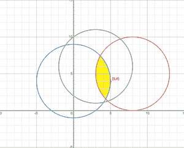
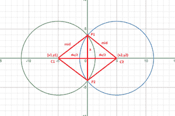

# 每秒扩展 1 个单位的 N 个圆中至少有 K 个重叠的最小时间

> 原文:[https://www . geeksforgeeks . org/最小时间-至少有 k 个圈外-扩展-每秒 1 个单位-重叠/](https://www.geeksforgeeks.org/minimum-time-at-which-at-least-k-out-of-n-circles-expanding-1-unit-per-second-overlap/)

给定一个 **2D** 无限平面上的 **N** 个点，其中每个点代表最初半径为 **0** 的圆的中心，该圆以每秒单位的恒定速率 **1** 扩展，任务是找到至少 **K** 个圆在一个点重叠的最小时间。

**示例:**

> ***输入:*** 分[] = {{8，5}，{0，4}，{3，6}}，K = 3
> ***输出:** 5*
> ***说明:**考虑如下图所示的无限格。该图像显示了 5 秒钟后圆圈的状态。三个圆各自重叠，黄色*高亮*区域的所有点至少有*3 个重叠圆。因此，5 秒后，平面上存在一个点(即(5，4))，使得至少有 3 个圆与该点重叠，并且这是最小可能时间。
> 
> 
> 
> ***输入:*** 分[] = {{0，0}，{1，1}，{2，2}}，K = 2
> ***输出:** 1*

**方法:**给定的问题可以在[二分搜索法](https://www.geeksforgeeks.org/binary-search/)的帮助下使用以下观察结果来解决:

*   在任何给定时间 **t** ，所有圆的半径必须为 **t** 。因此，问题可以转化为寻找最小半径，使得至少 **K** 个圆在给定点重叠。
*   最小所需半径可以通过在范围**【0，∩】**内对其执行[二分搜索法](https://www.geeksforgeeks.org/binary-search/)来计算。

现在，需要的任务是检查给定半径 **r** ，如果任意点的半径 **r** 的重叠圆的计数大于或等于 **K** 。可以使用以下技术完成:

*   [遍历给定圆的所有可能的无序对](https://www.geeksforgeeks.org/find-all-pairs-possible-from-the-given-array/)，检查它们是否相互相交。假设它们彼此相交。那么这种情况可以用下图来解释:



*   任务是计算 **P1** 和 **P2** 的值，可以通过以下程序完成:

> dist =√((x<sub>1</sub>–x<sub>2</sub>)<sup>2</sup>+(y<sub>1</sub>–y<sub>2</sub>)<sup>2</sup>)【使用距离公式】
> h = √((中)<sup>2</sup>–(dist/2)<sup>2</sup>)【使用勾股定理】
> 
> 使用 dist 和 h 的值，P1 和 P2 可以通过以下公式计算:
> =>P1 =(*((x1+x2)+h *(y1–y2))/2、((y1+y2)+h *(x2–x1))/2)和类似的*
> 】T4 =>P2 =((x1+x2)–h *(y1–y2))/2、((y1+y2)–h *(x2–x1))/2)

因此，对于所有可能的相交圆对，计算 **P1** 和 **P2** 的值，并计算圆的计数，使得 **P1** 位于变量 **cnt1** 中的那个圆，并类似地计算圆的计数，使得 **P2** 位于变量 **cnt2** 中的那个圆。如果 **cnt1** 和 **cnt2** 的任何一个值大于 **K** ，这意味着对于给定的 **r = mid** ，平面中存在一个点，使得至少 **K** 圆重叠在该点上。

下面是上述方法的实现:

## C++

```
// C++ implementation of the above approach
#include <bits/stdc++.h>
using namespace std;

struct coord {
    long double x, y;
};

// Function to find the square of the
// distance between  two given points
long double distance(coord a, coord b)
{
    // Distance Formulae
    return (a.x - b.x) * (a.x - b.x)
           + (a.y - b.y) * (a.y - b.y);
}

// Function to check if there exist a
// point having K overlapping circles with
// the radius of each circle as mid
bool check(vector<coord> points, int k,
           long double mid)
{
    // Squaring the value of mid
    // for simplicity of calulation
    mid *= mid;
    for (int i = 0; i < points.size(); i++) {
        for (int j = i + 1; j < points.size(); j++) {

            // Stores the coordinates
            // of 1st circle
            coord C1 = points[i];

            // Stores the coordinates
            // of 2nd circle
            coord C2 = points[j];

            // Calculating dist and h
            // as discussed in approach
            long double dist = distance(C1, C2);
            long double h
                = sqrt((4 * mid - dist)
                       / dist);

            // If Circles do not intersect
            if (dist > 4 * mid)
                continue;

            // Stores two intersection points
            coord P1, P2;

            // By help of formulaes given above
            P1.x = ((C1.x + C2.x)
                    + h * (C1.y - C2.y))
                   / 2;
            P1.y = ((C1.y + C2.y)
                    + h * (C2.x - C1.x))
                   / 2;
            P2.x = ((C1.x + C2.x)
                    - h * (C1.y - C2.y))
                   / 2;
            P2.y = ((C1.y + C2.y)
                    + h * (C2.x - C1.x))
                   / 2;

            // Stores count of overlapping
            // circles over P1 and P2
            int cnt1 = 0, cnt2 = 0;

            // Loop to traverse over all the circles
            for (int k = 0; k < points.size(); k++) {

                // If P1 lies inside Kth circle
                if (distance(P1, points[k]) - mid
                    <= 0.000001)
                    cnt1++;

                // If P2 lies inside Kth circle
                if (distance(P2, points[k]) - mid
                    <= 0.000001)
                    cnt2++;
            }

            // If count of overlapping circles
            // is more than K
            if (cnt1 >= k || cnt2 >= k) {
                return true;
            }
        }
    }

    // If no valid point is found
    return false;
}

// Function to perform the binary
// search over the radius of the
// circles in the range [0, ∞]
int binSearchOnRad(vector<coord>& points, int k)
{
    // Stores the start and end of
    // range of the binary search
    int start = 0, end = 1e6;

    // Loop to perform binary search
    while (start <= end) {

        // Stores the mid if the
        // current range
        int mid = start + (end - start) / 2;

        // If there exist a point having
        // k overlapping circles with the
        // radius of circles as mid
        if (check(points, k, mid)) {
            end = mid - 1;
        }

        // If the required point
        // does not exist
        else {
            start = mid + 1;
        }
    }

    // Return Answer
    return start;
}

// Driver Code
int main()
{
    vector<coord> points = { { 8, 5 },
                             { 0, 4 },
                             { 3, 6 } };
    int K = 3;

    cout << binSearchOnRad(points, K);

    return 0;
}
```

## Java 语言(一种计算机语言，尤用于创建网站)

```
// Java implementation for the above approach
import java.io.*;

class GFG{

// Function to find the square of the
// distance between  two given points
static double distance(double[] a, double[] b)
{

    // Distance Formulae
    return (a[0] - b[0]) * (a[0] - b[0]) +
           (a[1] - b[1]) * (a[1] - b[1]);
}

// Function to check if there exist a
// point having K overlapping circles with
// the radius of each circle as mid
static boolean check(double[][] points, int k,
                     double mid)
{

    // Squaring the value of mid
    // for simplicity of calulation
    mid *= mid;
    for(int i = 0; i < points.length; i++)
    {
        for(int j = i + 1; j < points.length; j++)
        {

            // Stores the coordinates
            // of 1st circle
            double[] C1 = points[i];

            // Stores the coordinates
            // of 2nd circle
            double[] C2 = points[j];

            // Calculating dist and h
            // as discussed in approach
            double dist = distance(C1, C2);
            double h = Math.sqrt((4 * mid - dist) / dist);

            // If Circles do not intersect
            if (dist > 4 * mid)
                continue;

            // Stores two intersection points
            double[] P1 = new double[2];
            double[] P2 = new double[2];

            // By help of formulaes given above
            P1[0] = ((C1[0] + C2[0]) +
                 h * (C1[1] - C2[1])) / 2;
            P1[1] = ((C1[1] + C2[1]) +
                 h * (C2[0] - C1[0])) / 2;
            P2[0] = ((C1[0] + C2[0]) -
                 h * (C1[1] - C2[1])) / 2;
            P2[1] = ((C1[1] + C2[1]) +
                 h * (C2[0] - C1[0])) / 2;

            // Stores count of overlapping
            // circles over P1 and P2
            int cnt1 = 0;
            int cnt2 = 0;

            // Loop to traverse over all the circles
            for(k = 0; k < points.length; k++)
            {

                // If P1 lies inside Kth circle
                if (distance(P1, points[k]) - mid <= 0.000001)
                    cnt1++;

                // If P2 lies inside Kth circle
                if (distance(P2, points[k]) - mid <= 0.000001)
                    cnt2++;
            }

            // If count of overlapping circles
            // is more than K
            if (cnt1 >= k || cnt2 >= k)
            {
                return true;
            }
        }
    }

    // If no valid point is found
    return false;
}

// Function to perform the binary
// search over the radius of the
// circles in the range [0, ∞]
static int binSearchOnRad(double[][] points, int k)
{

    // Stores the start and end of
    // range of the binary search
    int start = 0, end = (int)1e6;

    // Loop to perform binary search
    while (start <= end)
    {

        // Stores the mid if the
        // current range
        int mid = start + (end - start) / 2;

        // If there exist a point having
        // k overlapping circles with the
        // radius of circles as mid
        if (check(points, k, mid))
        {
            end = mid - 1;
        }

        // If the required point
        // does not exist
        else
        {
            start = mid + 1;
        }
    }

    // Return Answer
    return start;
}

// Driver Code
public static void main(String[] args)
{
    double[][] points = { { 8, 5 }, { 0, 4 }, { 3, 6 } };
    int K = 3;

    System.out.println(binSearchOnRad(points, K));
}
}

// This code is contributed by Potta Lokesh
```

## 蟒蛇 3

```
# Python implementation of the above approach

# Function to find the square of the
# distance between two given points
def distance(a, b):

    # Distance Formulae
    return (a[0] - b[0]) * (a[0] - b[0]) + (a[1] - b[1]) * (a[1] - b[1])

# Function to check if there exist a
# point having K overlapping circles with
# the radius of each circle as mid
def check(points, k, mid):

    # Squaring the value of mid
    # for simplicity of calulation
    mid *= mid
    for i in range(len(points)):
        for j in range(i + 1, len(points)):

            # Stores the coordinates
            # of 1st circle
            C1 = points[i]

            # Stores the coordinates
            # of 2nd circle
            C2 = points[j]

            # Calculating dist and h
            # as discussed in approach
            dist = distance(C1, C2)
            h = ((4 * mid - dist) / dist) ** (1 / 2)

            # If Circles do not intersect
            if (dist > 4 * mid):
                continue

            # Stores two intersection points
            P1 = [0] * 2
            P2 = [0] * 2

            # By help of formulaes given above
            P1[0] = ((C1[0] + C2[0]) +
                     h * (C1[1] - C2[1])) // 2
            P1[1] = ((C1[1] + C2[1]) +
                     h * (C2[0] - C1[0])) // 2
            P2[0] = ((C1[0] + C2[0]) -
                     h * (C1[1] - C2[1])) // 2
            P2[1] = ((C1[1] + C2[1]) +
                     h * (C2[0] - C1[0])) // 2

            # Stores count of overlapping
            # circles over P1 and P2
            cnt1 = 0
            cnt2 = 0

            # Loop to traverse over all the circles
            for k in range(len(points)):

                # If P1 lies inside Kth circle
                if (distance(P1, points[k]) - mid <= 0.000001):
                    cnt1 += 1

                # If P2 lies inside Kth circle
                if (distance(P2, points[k]) - mid <= 0.000001):
                    cnt2 += 1

            # If count of overlapping circles
            # is more than K
            if (cnt1 >= k or cnt2 >= k):
                return True

    # If no valid point is found
    return False

# Function to perform the binary
# search over the radius of the
# circles in the range [0, ∞]
def binSearchOnRad(points, k):

    # Stores the start and end of
    # range of the binary search
    start = 0
    end = 1000000

    # Loop to perform binary search
    while (start <= end):

        # Stores the mid if the
        # current range
        mid = start + (end - start) // 2

        # If there exist a point having
        # k overlapping circles with the
        # radius of circles as mid
        if (check(points, k, mid)):
            end = mid - 1

        # If the required point
        # does not exist
        else:
            start = mid + 1

    # Return Answer
    return start

# Driver Code
points = [[8, 5], [0, 4], [3, 6]]
K = 3

print(binSearchOnRad(points, K))

# This code is contributed by Saurabh Jaiswal
```

## C#

```
// C# implementation for the above approach
using System;
class GFG {

  // Function to find the square of the
  // distance between  two given points
  static double distance(double[] a, double[] b)
  {

    // Distance Formulae
    return (a[0] - b[0]) * (a[0] - b[0])
      + (a[1] - b[1]) * (a[1] - b[1]);
  }

  // Function to check if there exist a
  // point having K overlapping circles with
  // the radius of each circle as mid
  static bool check(double[, ] points, int k, double mid)
  {

    // Squaring the value of mid
    // for simplicity of calulation
    mid *= mid;
    for (int i = 0; i < points.GetLength(0); i++) {
      for (int j = i + 1; j < points.GetLength(0);
           j++) {

        // Stores the coordinates
        // of 1st circle
        double[] C1
          = new double[points.GetLength(1)];
        for (int x = 0; x < points.GetLength(1);
             x++)
          C1[x] = points[i, x];

        // Stores the coordinates
        // of 2nd circle
        double[] C2
          = new double[points.GetLength(1)];
        for (int x = 0; x < points.GetLength(1);
             x++)
          C2[x] = points[j, x];

        // Calculating dist and h
        // as discussed in approach
        double dist = distance(C1, C2);
        double h
          = Math.Sqrt((4 * mid - dist) / dist);

        // If Circles do not intersect
        if (dist > 4 * mid)
          continue;

        // Stores two intersection points
        double[] P1 = new double[2];
        double[] P2 = new double[2];

        // By help of formulaes given above
        P1[0] = ((C1[0] + C2[0])
                 + h * (C1[1] - C2[1]))
          / 2;
        P1[1] = ((C1[1] + C2[1])
                 + h * (C2[0] - C1[0]))
          / 2;
        P2[0] = ((C1[0] + C2[0])
                 - h * (C1[1] - C2[1]))
          / 2;
        P2[1] = ((C1[1] + C2[1])
                 + h * (C2[0] - C1[0]))
          / 2;

        // Stores count of overlapping
        // circles over P1 and P2
        int cnt1 = 0;
        int cnt2 = 0;

        // Loop to traverse over all the circles
        for (k = 0; k < points.GetLength(0); k++) {
          double[] P
            = new double[points.GetLength(1)];
          for (int x = 0; x < points.GetLength(1);
               x++)
            P[x] = points[k, x];
          // If P1 lies inside Kth circle
          if (distance(P1, P) - mid <= 0.000001)
            cnt1++;

          // If P2 lies inside Kth circle
          if (distance(P2, P) - mid <= 0.000001)
            cnt2++;
        }

        // If count of overlapping circles
        // is more than K
        if (cnt1 >= k || cnt2 >= k) {
          return true;
        }
      }
    }

    // If no valid point is found
    return false;
  }

  // Function to perform the binary
  // search over the radius of the
  // circles in the range [0, ∞]
  static int binSearchOnRad(double[, ] points, int k)
  {

    // Stores the start and end of
    // range of the binary search
    int start = 0, end = (int)1e6;

    // Loop to perform binary search
    while (start <= end) {

      // Stores the mid if the
      // current range
      int mid = start + (end - start) / 2;

      // If there exist a point having
      // k overlapping circles with the
      // radius of circles as mid
      if (check(points, k, mid)) {
        end = mid - 1;
      }

      // If the required point
      // does not exist
      else {
        start = mid + 1;
      }
    }

    // Return Answer
    return start;
  }

  // Driver Code
  public static void Main(string[] args)
  {
    double[, ] points
      = { { 8, 5 }, { 0, 4 }, { 3, 6 } };
    int K = 3;

    Console.WriteLine(binSearchOnRad(points, K));
  }
}

// This code is contributed by ukasp.
```

## java 描述语言

```
<script>

// JavaScript implementation of the above approach

// Function to find the square of the
// distance between two given points
const distance = (a, b) =>
{

    // Distance Formulae
    return (a[0] - b[0]) * (a[0] - b[0]) +
           (a[1] - b[1]) * (a[1] - b[1]);
}

// Function to check if there exist a
// point having K overlapping circles with
// the radius of each circle as mid
const check = (points, k, mid) =>
{

    // Squaring the value of mid
    // for simplicity of calulation
    mid *= mid;
    for(let i = 0; i < points.length; i++)
    {
        for(let j = i + 1; j < points.length; j++)
        {

            // Stores the coordinates
            // of 1st circle
            let C1 = points[i];

            // Stores the coordinates
            // of 2nd circle
            let C2 = points[j];

            // Calculating dist and h
            // as discussed in approach
            let dist = distance(C1, C2);
            let h = Math.sqrt((4 * mid - dist) / dist);

            // If Circles do not intersect
            if (dist > 4 * mid)
                continue;

            // Stores two intersection points
            let P1 = new Array(2).fill(0),
                P2 = new Array(2).fill(0);

            // By help of formulaes given above
            P1[0] = ((C1[0] + C2[0]) +
                 h * (C1[1] - C2[1])) / 2;
            P1[1] = ((C1[1] + C2[1]) +
                 h * (C2[0] - C1[0])) / 2;
            P2.x = ((C1[0] + C2[0]) -
                h * (C1[1] - C2[1])) / 2;
            P2.y = ((C1[1] + C2[1]) +
                h * (C2[0] - C1[0])) / 2;

            // Stores count of overlapping
            // circles over P1 and P2
            let cnt1 = 0, cnt2 = 0;

            // Loop to traverse over all the circles
            for(let k = 0; k < points.length; k++)
            {

                // If P1 lies inside Kth circle
                if (distance(P1, points[k]) - mid <= 0.000001)
                    cnt1++;

                // If P2 lies inside Kth circle
                if (distance(P2, points[k]) - mid <= 0.000001)
                    cnt2++;
            }

            // If count of overlapping circles
            // is more than K
            if (cnt1 >= k || cnt2 >= k)
            {
                return true;
            }
        }
    }

    // If no valid point is found
    return false;
}

// Function to perform the binary
// search over the radius of the
// circles in the range [0, ∞]
const binSearchOnRad = (points, k) =>
{

    // Stores the start and end of
    // range of the binary search
    let start = 0, end = 1000000;

    // Loop to perform binary search
    while (start <= end)
    {

        // Stores the mid if the
        // current range
        let mid = start + parseInt((end - start) / 2);

        // If there exist a point having
        // k overlapping circles with the
        // radius of circles as mid
        if (check(points, k, mid))
        {
            end = mid - 1;
        }

        // If the required point
        // does not exist
        else
        {
            start = mid + 1;
        }
    }

    // Return Answer
    return start;
}

// Driver Code
let points = [ [ 8, 5 ], [ 0, 4 ], [ 3, 6 ] ];
let K = 3;

document.write(binSearchOnRad(points, K));

// This code is contributed by rakeshsahni

</script>
```

**Output**

```
5
```

***时间复杂度:**O(N<sup>3</sup>* log N)*
***辅助空间:** O(1)*