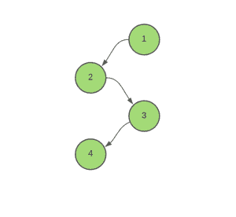
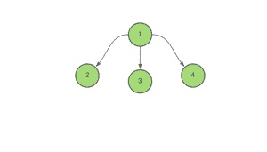

# 给一棵树的所有边缘上色所需的最短时间

> 原文:[https://www . geeksforgeeks . org/对树的所有边进行着色所需的最短时间/](https://www.geeksforgeeks.org/minimum-time-required-to-color-all-edges-of-a-tree/)

给定成对的[数组](https://www.geeksforgeeks.org/sorting-vector-of-pairs-in-c-set-1-sort-by-first-and-second/) **边[][]** ，表示由 **N** 节点组成的[树](https://www.geeksforgeeks.org/binary-tree-data-structure/)中连接顶点的边，任务是基于着色一条边需要 **1** 时间单位的假设，找到着色一棵树的所有边所需的最短时间。

***注意:**多条边可以在特定时刻着色，但一个节点只能是特定日期着色的其中一条边的一部分。*

**示例**

> **输入:**边[][] = ((1，2)，(3，4)，(2，3))
> 
> 
> 
> **输出:** 2
> **说明:**
> 第一步:色边(1，2)和(3，4)
> 第二步:色边(2，3)
> 
> **输入:**边[][] = ((1，2)，(1，3)，(1，4))
> 
> 
> 
> **输出:** 3

**方法:**这个问题可以使用 [DFS(深度优先搜索)](https://www.geeksforgeeks.org/depth-first-search-or-dfs-for-a-graph/)解决。按照以下步骤解决问题:

*   初始化全局变量，比如说**和**为 **0，**来存储给树的所有边着色所需的最短时间。
*   将变量 **current_time** 初始化为 **0，**以存储为当前边缘着色所需的时间。
*   迭代当前节点的子节点，并执行以下步骤:
    *   如果当前边未被访问，即当前节点不等于父节点:
        *   通过 **1** 增加**当前时间**。
        *   检查父边是否同时着色。如果发现为真，则将 **current_time** 增加 **1** ，因为节点不能是同时着色的多条边的一部分。
        *   更新 **ans** 为**T3**ans**和**当前 _ 时间的最大值。****
        *   为当前节点的子节点调用[递归函数](https://www.geeksforgeeks.org/recursive-functions/) **minTimeToColor** 。
*   该功能结束后，打印**和**。

下面是上述方法的代码。

## C++

```
// C++ program for the above approach

#include <bits/stdc++.h>
using namespace std;

// Stores the required answer
int ans = 0;

// Stores the graph
vector<int> edges[100000];

// Function to add edges
void Add_edge(int u, int v)
{
    edges[u].push_back(v);
    edges[v].push_back(u);
}

// Function to calculate the minimum time
// required to color all the edges of a tree
void minTimeToColor(int node, int parent,
                    int arrival_time)
{
    // Starting from time = 0,
    // for all the child edges
    int current_time = 0;

    for (auto x : edges[node]) {

        // If the edge is not visited yet.
        if (x != parent) {

            // Time of coloring of
            // the current edge
            ++current_time;

            // If the parent edge has
            // been colored at the same time
            if (current_time == arrival_time)
                ++current_time;

            // Update the maximum time
            ans = max(ans, current_time);

            // Recursively call the
            // function to its child node
            minTimeToColor(x, node, current_time);
        }
    }
}

// Driver Code
int main()
{

    pair<int, int> A[] = { { 1, 2 },
                           { 2, 3 },
                           { 3, 4 } };

    for (auto i : A) {

        Add_edge(i.first, i.second);
    }

    // Function call
    minTimeToColor(1, -1, 0);

    // Finally, print the answer
    cout << ans << "\n";
}
```

## Java 语言(一种计算机语言，尤用于创建网站)

```
// Java program for the above approach
import java.util.*;

class GFG{

// Stores the required answer
static int ans = 0;

// Stores the graph
@SuppressWarnings("unchecked")
static Vector<Integer> edges[] = new Vector[100000];

// Function to add edges
static void Add_edge(int u, int v)
{
    edges[u].add(v);
    edges[v].add(u);
}

// Function to calculate the minimum time
// required to color all the edges of a tree
static void minTimeToColor(int node, int parent,
                           int arrival_time)
{

    // Starting from time = 0,
    // for all the child edges
    int current_time = 0;

    for(int x = 0; x < edges[node].size(); x++)
    {

        // If the edge is not visited yet.
        if (edges[node].get(x) != parent)
        {

            // Time of coloring of
            // the current edge
            ++current_time;

            // If the parent edge has
            // been colored at the same time
            if (current_time == arrival_time)
                ++current_time;

            // Update the maximum time
            ans = Math.max(ans, current_time);

            // Recursively call the
            // function to its child node
            minTimeToColor(edges[node].get(x), node,
                           current_time);
        }
    }
}

// Driver Code
public static void main(String[] args)
{
    for(int i = 0; i < edges.length; i++)
        edges[i] = new Vector<Integer>();

    int A[][] = { { 1, 2 },
                  { 2, 3 },
                  { 3, 4 } };

    for(int i = 0; i < 3; i++)
    {
        Add_edge(A[i][0], A[i][1]);
    }

    // Function call
    minTimeToColor(1, -1, 0);

    // Finally, print the answer
    System.out.print(ans + "\n");
}
}

// This code is contributed by umadevi9616
```

## 蟒蛇 3

```
# Python3 program for the above approach

# Stores the required answer
ans = 0

# Stores the graph
edges = [[] for i in range(100000)]

# Function to add edges
def Add_edge(u, v):

    global edges
    edges[u].append(v)
    edges[v].append(u)

# Function to calculate the minimum time
# required to color all the edges of a tree
def minTimeToColor(node, parent, arrival_time):

    global ans

    # Starting from time = 0,
    # for all the child edges
    current_time = 0

    for x in edges[node]:

        # If the edge is not visited yet.
        if (x != parent):

            # Time of coloring of
            # the current edge
            current_time += 1

            # If the parent edge has
            # been colored at the same time
            if (current_time == arrival_time):
                current_time += 1

            # Update the maximum time
            ans = max(ans, current_time)

            # Recursively call the
            # function to its child node
            minTimeToColor(x, node, current_time)

# Driver Code
if __name__ == '__main__':

    A = [ [ 1, 2 ],
          [ 2, 3 ],
          [ 3, 4 ] ]

    for i in A:
        Add_edge(i[0], i[1])

    # Function call
    minTimeToColor(1, -1, 0)

    # Finally, print the answer
    print(ans)

# This code is contributed by mohit kumar 29
```

## C#

```
// C# program for the above approach
using System;
using System.Collections.Generic;
class GFG {

    // Stores the required answer
    static int ans = 0;

    // Stores the graph
    static List<List<int>> edges = new List<List<int>>();

    // Function to add edges
    static void Add_edge(int u, int v)
    {
        edges[u].Add(v);
        edges[v].Add(u);
    }

    // Function to calculate the minimum time
    // required to color all the edges of a tree
    static void minTimeToColor(int node, int parent,
                        int arrival_time)
    {
        // Starting from time = 0,
        // for all the child edges
        int current_time = 0;

        for(int x = 0; x < edges[node].Count; x++) {

            // If the edge is not visited yet.
            if (edges[node][x] != parent) {

                // Time of coloring of
                // the current edge
                ++current_time;

                // If the parent edge has
                // been colored at the same time
                if (current_time == arrival_time)
                    ++current_time;

                // Update the maximum time
                ans = Math.Max(ans, current_time);

                // Recursively call the
                // function to its child node
                minTimeToColor(edges[node][x], node, current_time);
            }
        }
    }

  // Driver code
  static void Main() {

    for(int i = 0; i < 100000; i++)
    {
        edges.Add(new List<int>());
    }

    int[,] A = { { 1, 2 }, { 2, 3 }, { 3, 4 } };

    for(int i = 0; i < 3; i++)
    {
        Add_edge(A[i,0], A[i,1]);
    }

    // Function call
    minTimeToColor(1, -1, 0);

    // Finally, print the answer
    Console.WriteLine(ans);
  }
}

// This code is contributed by divyeshrabadiya07.
```

## java 描述语言

```
<script>

// JavaScript program for the above approach

// Stores the required answer
let ans = 0;

// Stores the graph
let edges=new Array(100000);
for(let i=0;i<100000;i++)
    edges[i]=[];

// Function to add edges
function Add_edge(u,v)
{
    edges[u].push(v);
    edges[v].push(u);
}

// Function to calculate the minimum time
// required to color all the edges of a tree   
function minTimeToColor(node,parent,arrival_time)
{
    // Starting from time = 0,
    // for all the child edges
    let current_time = 0;

    for (let x=0;x<edges[node].length;x++) {

        // If the edge is not visited yet.
        if (edges[node][x] != parent) {

            // Time of coloring of
            // the current edge
            ++current_time;

            // If the parent edge has
            // been colored at the same time
            if (current_time == arrival_time)
                ++current_time;

            // Update the maximum time
            ans = Math.max(ans, current_time);

            // Recursively call the
            // function to its child node
            minTimeToColor(edges[node][x], node, current_time);
        }
    }
}

// Driver Code
let A=[[ 1, 2 ],[ 2, 3 ],[ 3, 4 ] ];
for(let i=0;i<A.length;i++)
{
    Add_edge(A[i][0],A[i][1]);
}
// Function call
minTimeToColor(1, -1, 0);

// Finally, print the answer
document.write(ans);

// This code is contributed by patel2127

</script>
```

**Output:** 

```
2
```

***时间复杂度:**O(N)*
T5**辅助空间:** O(N)