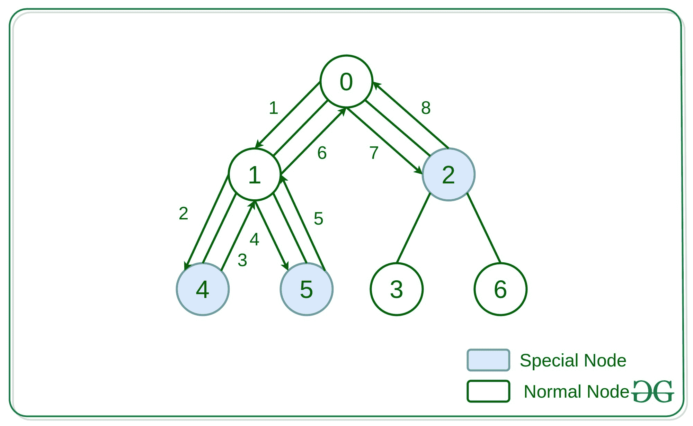
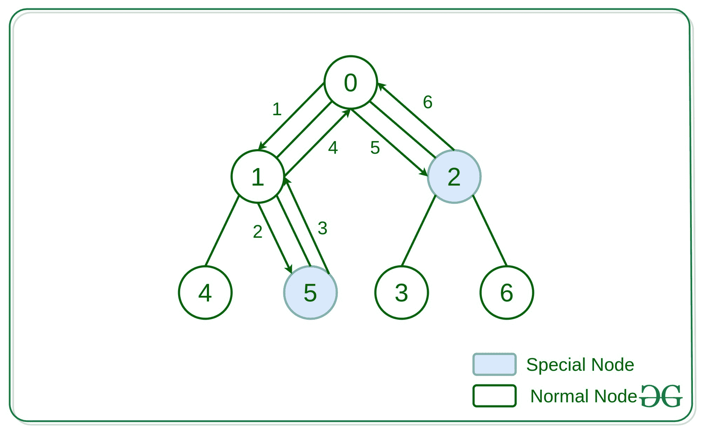

# 访问一棵树的所有特殊节点所需的最短时间

> 原文:[https://www . geesforgeks . org/访问树中所有特殊节点所需的最短时间/](https://www.geeksforgeeks.org/minimum-time-required-to-visit-all-the-special-nodes-of-a-tree/)

给定一个由 **N** 个顶点组成的**无向树**，其中一些节点是特殊节点，任务是在最短时间内从根节点访问所有特殊节点。从一个节点到另一个节点的时间可以假设为单位时间。

> 如果从根到节点的路径由不同的值节点组成，则节点是特殊的。

**示例:**

> **输入:** N = 7，边[] = {(0，1)，(0，2)，(1，4)，(1，5)，(2，3)，(2，6)}
> isSpecial[] = {false，false，true，false，true，false}
> **输出:** 8
> **解释:**
> 
> 
> 
> **输入:** N = 7，边[] = {(0，1)，(0，2)，(1，4)，(1，5)，(2，3)，(2，6)}
> isSpecial[] = {false，false，true，false，false，true，false}
> **输出:** 6
> **解释:**
> 
> 

**方法:**思路是使用[深度优先搜索遍历](https://www.geeksforgeeks.org/depth-first-search-or-dfs-for-a-graph/)并遍历节点。如果任何节点有一个特殊节点的子节点，则在该节点所需的步骤中增加两个步骤。还要将该节点标记为特殊节点，以便在向上移动时考虑这些步骤。

下面是上述方法的实现:

## C++

```
// C++ implementation to find
// the minimum time required to
// visit special nodes of a tree

#include <bits/stdc++.h>
using namespace std;

const int N = 100005;

// Time required to collect
vector<int> ans(N, 0);

vector<int> flag(N, 0);

// Minimum time required to reach
// all the special nodes of tree
void minimumTime(int u, int par,
                 vector<bool>& hasApple,
                 vector<int> adj[])
{

    // Condition to check if
    // the vertex has apple
    if (hasApple[u] == true)
        flag[u] = 1;

    // Iterate all the
    // adjacent of vertex u.
    for (auto it : adj[u]) {

        // if adjacent vertex
        // is it's parent
        if (it != par) {
            minimumTime(it, u, hasApple, adj);

            // if any vertex of subtree
            // it contain apple
            if (flag[it] > 0)
                ans[u] += (ans[it] + 2);

            // flagbit for node u
            // would be on if any vertex
            // in it's subtree contain apple
            flag[u] |= flag[it];
        }
    }
}

// Driver Code
int main()
{
    // Number of the vertex.
    int n = 7;

    vector<bool> hasApple{ false, false,
                           true, false,
                           true, true,
                           false };

    // Store all the edges,
    // any edge represented
    // by pair of vertex
    vector<pair<int, int> > edges;

    // Added all the
    // edge in edges vector.
    edges.push_back(make_pair(0, 1));
    edges.push_back(make_pair(0, 2));
    edges.push_back(make_pair(1, 4));
    edges.push_back(make_pair(1, 5));
    edges.push_back(make_pair(2, 3));
    edges.push_back(make_pair(2, 6));

    // Adjacent list
    vector<int> adj[n];

    for (int i = 0; i < edges.size(); i++) {
        int source_node = edges[i].first;

        int destination_node
            = edges[i].second;

        adj[source_node]
            .push_back(destination_node);

        adj[destination_node]
            .push_back(source_node);
    }

    // Function Call
    minimumTime(0, -1, hasApple, adj);

    cout << ans[0];
    return 0;
}
```

## Java 语言(一种计算机语言，尤用于创建网站)

```
// Java implementation to find
// the minimum time required to
// visit special nodes of a tree
import java.util.*;

@SuppressWarnings("unchecked")
class GFG{

static class pair
{
    int first, second;

    pair(int first, int second)
    {
        this.first = first;
        this.second = second;
    }
}

static final int N = 100005;

// Time required to collect
static ArrayList ans;
static ArrayList flag;

// Minimum time required to reach
// all the special nodes of tree
static void minimumTime(int u, int par,
                        ArrayList hasApple,
                        ArrayList adj[])
{

    // Condition to check if
    // the vertex has apple
    if ((boolean)hasApple.get(u) == true)
        flag.set(u, 1);

    // Iterate all the
    // adjacent of vertex u.
    for(int it : (ArrayList<Integer>)adj[u])
    {

        // If adjacent vertex
        // is it's parent
        if (it != par)
        {
            minimumTime(it, u, hasApple, adj);

            // If any vertex of subtree
            // it contain apple
            if ((int)flag.get(it) > 0)
                ans.set(u, (int)ans.get(u) +
                           (int)ans.get(it) + 2 );

            // flagbit for node u
            // would be on if any vertex
            // in it's subtree contain apple
            flag.set(u, (int)flag.get(u) |
                        (int)flag.get(it));
        }
    }
}

// Driver Code
public static void main(String []args)
{

    // Number of the vertex.
    int n = 7;

    ans = new ArrayList();
    flag = new ArrayList();

    for(int i = 0; i < N; i++)
    {
        ans.add(0);
        flag.add(0);
    }

    ArrayList hasApple = new ArrayList();
    hasApple.add(false);
    hasApple.add(false);
    hasApple.add(true);
    hasApple.add(false);
    hasApple.add(true);
    hasApple.add(true);
    hasApple.add(false);

    // Store all the edges,
    // any edge represented
    // by pair of vertex
    ArrayList edges = new ArrayList();

    // Added all the edge in
    // edges vector.
    edges.add(new pair(0, 1));
    edges.add(new pair(0, 2));
    edges.add(new pair(1, 4));
    edges.add(new pair(1, 5));
    edges.add(new pair(2, 3));
    edges.add(new pair(2, 6));

    // Adjacent list
    ArrayList []adj = new ArrayList[n];

    for(int i = 0; i < n; i++)
    {
        adj[i] = new ArrayList();
    }

    for(int i = 0; i < edges.size(); i++)
    {
        int source_node = ((pair)edges.get(i)).first;
        int destination_node = ((pair)edges.get(i)).second;

        adj[source_node].add(destination_node);
        adj[destination_node].add(source_node);
    }

    // Function Call
    minimumTime(0, -1, hasApple, adj);

    System.out.print(ans.get(0));
}
}

// This code is contributed by pratham76
```

## 蟒蛇 3

```
# Python3 implementation to find
# the minimum time required to
# visit special nodes of a tree
N = 100005

# Time required to collect
ans = [0 for i in range(N)]
flag = [0 for i in range(N)]

# Minimum time required to reach
# all the special nodes of tree
def minimumTime(u, par, hasApple, adj):

    # Condition to check if
    # the vertex has apple
    if (hasApple[u] == True):
        flag[u] = 1

    # Iterate all the
    # adjacent of vertex u.
    for it in adj[u]:

        # if adjacent vertex
        # is it's parent
        if (it != par):
            minimumTime(it, u, hasApple, adj)

            # if any vertex of subtree
            # it contain apple
            if (flag[it] > 0):
                ans[u] += (ans[it] + 2)

            # flagbit for node u
            # would be on if any vertex
            # in it's subtree contain apple
            flag[u] |= flag[it]

# Driver Code
if __name__=='__main__':

    # Number of the vertex.
    n = 7

    hasApple = [ False, False, True,
                 False, True, True, False ]

    # Store all the edges,
    # any edge represented
    # by pair of vertex
    edges = []

    # Added all the
    # edge in edges vector.
    edges.append([0, 1])
    edges.append([0, 2])
    edges.append([1, 4])
    edges.append([1, 5])
    edges.append([2, 3])
    edges.append([2, 6])

    # Adjacent list
    adj = [[] for i in range(n)]

    for i in range(len(edges)):
        source_node = edges[i][0]

        destination_node = edges[i][1]

        adj[source_node].append(destination_node)
        adj[destination_node].append(source_node)

    # Function Call
    minimumTime(0, -1, hasApple, adj);

    print(ans[0])

# This code is contributed by rutvik_56
```

## C#

```
// C# implementation to find
// the minimum time required to
// visit special nodes of a tree
using System;
using System.Collections.Generic;
class GFG {

    static int N = 100005;

    // Time required to collect
    static int[] ans = new int[N];
    static int[] flag = new int[N];

    // Minimum time required to reach
    // all the special nodes of tree
    static void minimumTime(int u, int par,
                            List<bool> hasApple,
                            List<List<int>> adj)
    {

        // Condition to check if
        // the vertex has apple
        if (hasApple[u])
            flag[u] = 1;

        // Iterate all the
        // adjacent of vertex u.
        for(int it = 0; it < adj[u].Count; it++)
        {

            // If adjacent vertex
            // is it's parent
            if (adj[u][it] != par)
            {
                minimumTime(adj[u][it], u, hasApple, adj);

                // If any vertex of subtree
                // it contain apple
                if (flag[adj[u][it]] > 0)
                    ans[u] = ans[u] + ans[adj[u][it]] + 2 ;

                // flagbit for node u
                // would be on if any vertex
                // in it's subtree contain apple
                flag[u] = flag[u] | flag[adj[u][it]];
            }
        }
    }

  static void Main() {
    // Number of the vertex.
    int n = 7;

    List<bool> hasApple = new List<bool>();
    hasApple.Add(false);
    hasApple.Add(false);
    hasApple.Add(true);
    hasApple.Add(false);
    hasApple.Add(true);
    hasApple.Add(true);
    hasApple.Add(false);

    // Store all the edges,
    // any edge represented
    // by pair of vertex
    List<Tuple<int,int>> edges = new List<Tuple<int,int>>();

    // Added all the edge in
    // edges vector.
    edges.Add(new Tuple<int,int>(0, 1));
    edges.Add(new Tuple<int,int>(0, 2));
    edges.Add(new Tuple<int,int>(1, 4));
    edges.Add(new Tuple<int,int>(1, 5));
    edges.Add(new Tuple<int,int>(2, 3));
    edges.Add(new Tuple<int,int>(2, 6));

    // Adjacent list
    List<List<int>> adj = new List<List<int>>();

    for(int i = 0; i < n; i++)
    {
        adj.Add(new List<int>());
    }

    for(int i = 0; i < edges.Count; i++)
    {
        int source_node = edges[i].Item1;
        int destination_node = edges[i].Item2;

        adj[source_node].Add(destination_node);
        adj[destination_node].Add(source_node);
    }

    // Function Call
    minimumTime(0, -1, hasApple, adj);

    Console.Write(ans[0]);
  }
}

// This code is contributed by divyesh072019.
```

## java 描述语言

```
<script>

    // JavaScript implementation to find
    // the minimum time required to
    // visit special nodes of a tree

    let N = 100005;

    // Time required to collect
    let ans = [];
    let flag = [];

    // Minimum time required to reach
    // all the special nodes of tree
    function minimumTime(u, par, hasApple, adj)
    {

        // Condition to check if
        // the vertex has apple
        if (hasApple[u] == true)
            flag[u] = 1;

        // Iterate all the
        // adjacent of vertex u.
        for(let it = 0; it < adj[u].length; it++)
        {

            // If adjacent vertex
            // is it's parent
            if (adj[u][it] != par)
            {
                minimumTime(adj[u][it], u, hasApple, adj);

                // If any vertex of subtree
                // it contain apple
                if (flag[adj[u][it]] > 0)
                    ans[u] = ans[u] + ans[adj[u][it]] + 2 ;

                // flagbit for node u
                // would be on if any vertex
                // in it's subtree contain apple
                flag[u] = flag[u] | flag[adj[u][it]];
            }
        }
    }

    // Number of the vertex.
    let n = 7;

    ans = [];
    flag = [];

    for(let i = 0; i < N; i++)
    {
        ans.push(0);
        flag.push(0);
    }

    let hasApple = [];
    hasApple.push(false);
    hasApple.push(false);
    hasApple.push(true);
    hasApple.push(false);
    hasApple.push(true);
    hasApple.push(true);
    hasApple.push(false);

    // Store all the edges,
    // any edge represented
    // by pair of vertex
    let edges = [];

    // Added all the edge in
    // edges vector.
    edges.push([0, 1]);
    edges.push([0, 2]);
    edges.push([1, 4]);
    edges.push([1, 5]);
    edges.push([2, 3]);
    edges.push([2, 6]);

    // Adjacent list
    let adj = new Array(n);

    for(let i = 0; i < n; i++)
    {
        adj[i] = [];
    }

    for(let i = 0; i < edges.length; i++)
    {
        let source_node = edges[i][0];
        let destination_node = edges[i][1];

        adj[source_node].push(destination_node);
        adj[destination_node].push(source_node);
    }

    // Function Call
    minimumTime(0, -1, hasApple, adj);

    document.write(ans[0]);

</script>
```

**Output:** 

```
8
```