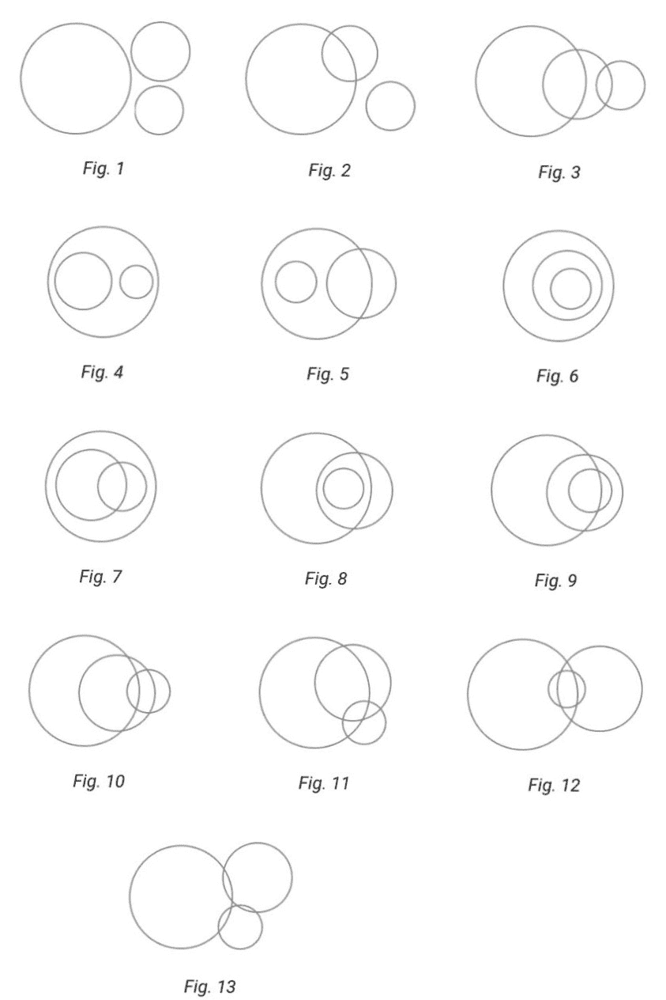

# N 个点重合所需的最短时间

> 原文:[https://www . geeksforgeeks . org/n 点重合所需的最短时间/](https://www.geeksforgeeks.org/minimum-time-taken-for-n-points-to-coincide/)

给定大小为 **N** 的[数组](https://www.geeksforgeeks.org/introduction-to-arrays/) **arr[][]** ，该数组由多对坐标组成，使得 **arr[i][0]** 和 **arr[i][1]** 表示 2D 平面中的 **X** 和 **Y** 坐标。给定另一个数组 **V[]** ，表示任意方向上每个点的最大速度，任务是找到最小时间，使得所有给定点在 2D 平面上的任意点相遇。

**示例:**

> **输入:** N = 4，arr[][] = {{1，2}，{-3，34}，{-1，-2}，{2，-2}}，V[] = {3，2，4，5}
> **输出:** 1.1157499537009508
> 
> **输入:** N = 2，arr[][] = {{1。2}，{-1，-2}}，V[] = {2，3}
> **输出:** 0.894427190999

**方法:**给定的问题可以基于以下观察来解决:

*   坐标轴上给定的 N 个点可以向任何方向移动，如果允许这些点在 **T** 时间内移动，那么它们可以**到达圆**内的任何点(通过相应地减少 V[i])其半径等于 **V[i] * T** 并且中心等于该点的初始位置，其中 **V[i]** 代表第 **i <sup>第</sup>点**的速度。
*   因此，为了使这些 **N 圆**半径的公共区域最小化，需要使**最小化**，并且如果在时间上存在一个公共的会合点 **T** ，则必须存在一个用于**T’>T**的会合点，因为对于**T’**将存在一个更公共的区域。
*   因此，想法是检查公共交汇点的存在，即检查 **N 个圆**T3 的[公共区域的存在。](https://www.geeksforgeeks.org/maximum-points-intersection-n-circles/)
*   下图为 **3 个圆**的所有可能组合，每个都有一个非零的相交区域，则所有 3 个圆都有一个公共的相交区域，如下所示:
    *   在**图 1、2、3、4、5** 中，三个圆中两个圆的半径之和小于它们之间的距离，这意味着三个圆之间没有公共区域。
    *   在**图 6、7、8、9** 中，一个或两个圆位于另一个圆内。
    *   在**图 10、11、12、13 中**找到两个圆的交点，检查这些交点是否在另一个圆内。

[](https://media.geeksforgeeks.org/wp-content/uploads/20210203021757/9c837480b9ca420db09aca71f9eb32c0.jpg)

从以上观察，想法是使用[二分搜索法](https://www.geeksforgeeks.org/binary-search/)为所有给定的 **N 个点**寻找具有唯一交点的最小时间。按照以下步骤解决给定的问题:

*   声明一个函数，比如说**交点(X1，Y1，R1，X2，Y2，R2，X3，Y3，R3)** ，以圆的坐标和半径为参数，执行以下步骤:
    *   如果任意两个圆的半径之和小于它们中心之间的距离之和，则返回 **false** ，因为它们之间不存在任何这样的公共区域。
    *   现在，[检查任意两个圆是否有公共区域](https://www.geeksforgeeks.org/check-two-given-circles-touch-intersect/)。如果发现是**真**，则返回**真**。否则，返回**假**。
*   声明一个[函数](https://www.geeksforgeeks.org/functions-in-c/)，说**是一个好的(中，N，X，Y，V)** ，它以当前可能的时间、 **N 个点**的坐标、每个点的速度为参数，执行以下步骤:
    *   如果 **N** 的值至少为**3**，那么通过调用函数**交集(X1，Y1，R1，X2，Y2，R2，X3，Y3，R3)** 来检查三个圆的所有可能组合，以获得公共区域。如果存在任何没有任何公共区域的此类组合，则返回 **false** 。否则，返回**真**。
    *   如果 **N** 的值为 **2** ，则[检查两个圆是否有公共区域](https://www.geeksforgeeks.org/check-two-given-circles-touch-intersect/)。如果发现**为真**，则返回**为真**。否则，返回**假**。
*   初始化两个变量，分别将**T1**设为 **0.0** 和 **tu** 设为 **100000.0** 作为获得唯一交点所需的最小和最大时间。
*   现在，[迭代范围](https://www.geeksforgeeks.org/range-based-loop-c/)**【0，1000】**以获得结果时间的更好的[精度](https://www.geeksforgeeks.org/precision-of-floating-point-numbers-in-c-floor-ceil-trunc-round-and-setprecision/)，并通过以下步骤执行[二分搜索法](https://www.geeksforgeeks.org/binary-search/):
    *   求中间值，说**中间**为 **(tl + tu)/2.0** 。
    *   现在通过调用**函数 isGood(mid，N，X，Y，V)** 来检查上述时间 **mid** 是否至少有一个公共区域相交。如果发现是**真**，那么更新 **tu** 为**中**。否则，将 **tl** 更新为 **t** 。
*   完成上述步骤后，打印 **tu** 的值，作为在一点相交的所有给定 **N 点**的合成最短时间。

下面是上述方法的实现:

## C++

```
// C++ program for the above approach
#include<bits/stdc++.h>
using namespace std;

// Function to check for common area
// between three circles
bool intersection(int X1, int Y1, double R1,
                  int X2, int Y2, double R2,
                  int X3, int Y3, double R3)
{

  // Find the distance between the
  // centers of circle 1 & circle 2
  double d12 = sqrt((X1 - X2) * (X1 - X2)
                    + (Y1 - Y2) * (Y1 - Y2));

  // Find the distance between the
  // centers of circle 1 & circle 3
  double d13 = sqrt((X1 - X3) * (X1 - X3)
                    + (Y1 - Y3) * (Y1 - Y3));

  // Find the distance between the
  // centers of circle 2 & circle 3
  double d23 = sqrt((X2 - X3) * (X2 - X3)
                    + (Y2 - Y3) * (Y2 - Y3));

  // If sum of radius is less than
  // the distance between their
  // centers then false
  if ((R1 + R2 < d12) || (R1 + R3 < d13)
      || (R2 + R3 < d23)) {

    return false;
  }
  else {

    // If circle 1 lies within
    // circle 2 or if circle
    // 2 lies within circle 1
    if (abs(R1 - R2) >= d12) {

      // If circle 1 lies
      // within circle 2
      if (R1 < R2) {

        // Check whether R1
        // (common area between
        // R1 and R2) and
        // R3 intersect
        return R1 + R3 >= d13;
      }
      else {

        // Check whether R2
        //(common area between
        // R1 and R2) and
        // R3 intersect
        return R2 + R3 >= d23;
      }
    }

    // If circle 1 lies within
    // circle 3 or if circle
    // 3 lies within circle 1
    else if (abs(R1 - R3) >= d13) {

      // If circle 1 lies
      // within circle 3
      if (R1 < R3) {

        // Check whether R1
        // (common area between
        // R1 and R3) and
        // R2 intersect
        return R1 + R2 >= d12;
      }
      else {

        // Check whether R3
        //(common area between
        // R1 and R3) and
        // R2 intersect
        return R2 + R3 >= d23;
      }
    }

    // If circle 2 lies within
    // circle 3 or if circle
    // 3 lies within circle 2
    else if (abs(R2 - R3) >= d23) {

      // If circle 2
      // lies within circle 3
      if (R2 < R3) {

        // Check whether R2
        // (common area between
        // R2 and R3) and
        // R1 intersect
        return R1 + R2 >= d12;
      }
      else {

        // Check whether R3
        // (common area between
        // R2 and R3) and
        // R1 intersect
        return R1 + R3 >= d13;
      }
    }
    else
    {

      double x121, y121, x122,
      y122, x131, y131,
      x132, y132, x231,
      y231, x232, y232,
      a, b;

      // Find the point of
      // intersection for
      // circle 1 & circle 2
      a = (R1 * R1 - R2 * R2)
        / (2 * d12 * d12);

      b = sqrt(2 * (R1 * R1 + R2 * R2)
               / (d12 * d12)
               - (R1 * R1 - R2 * R2)
               * (R1 * R1 - R2 * R2)
               / (pow(d12, 4))
               - 1)
        / 2;

      // First point of
      // intersection (x121, y121)
      x121 = (X1 + X2) / 2.0 + a * (X2 - X1)
        + b * (Y2 - Y1);
      y121 = (Y1 + Y2) / 2.0 + a * (Y2 - Y1)
        + b * (X1 - X2);

      // Check whether the point
      // of intersection lies
      // within circle 3 or not
      if (R3 >= sqrt(
        (x121 - X3) * (x121 - X3)
        + (y121 - Y3) * (y121 - Y3))) {

        return true;
      }

      // Second point of
      // intersection(x122, y122)
      x122 = (X1 + X2) / 2.0 + a * (X2 - X1)
        - b * (Y2 - Y1);

      y122 = (Y1 + Y2) / 2.0 + a * (Y2 - Y1)
        - b * (X1 - X2);

      // Check whether the point
      // of intersection lies
      // within circle 3 or not
      if (R3 >= sqrt(
        (x122 - X3) * (x122 - X3)
        + (y122 - Y3) * (y122 - Y3))) {

        return true;
      }

      // Find the point of
      // intersection for
      // circle 1 & circle 3
      a = (R1 * R1 - R3 * R3) / (2 * d13 * d13);
      b = sqrt(2 * (R1 * R1 + R3 * R3)
               / (d13 * d13)
               - (R1 * R1 - R3 * R3)
               * (R1 * R1 - R3 * R3)
               / (pow(d13, 4))
               - 1)
        / 2;

      // First point of
      // intersection(x131, y131)
      x131 = (X1 + X3) / 2.0 + a * (X3 - X1)
        + b * (Y3 - Y1);
      y131 = (Y1 + Y3) / 2.0 + a * (Y3 - Y1)
        + b * (X1 - X3);

      // Check whether the point
      // of intersection lies
      // within circle 2 or not
      if (R2 >= sqrt(
        (x131 - X2) * (x131 - X2)
        + (y131 - Y2) * (y131 - Y2))) {

        return true;
      }

      // Second point of
      // intersection(x132, y132)
      x132 = (X1 + X3) / 2.0 + a * (X3 - X1)
        - b * (Y3 - Y1);
      y132 = (Y1 + Y3) / 2.0 + a * (Y3 - Y1)
        - b * (X1 - X3);

      // Check whether the point
      // of intersection lies
      // within circle 2 or not
      if (R2 >= sqrt(
        (x132 - X2) * (x132 - X2)
        + (y132 - Y2) * (y132 - Y2))) {

        return true;
      }

      // Find the point of
      // intersection for
      // circle 2 & circle 3
      a = (R2 * R2 - R3 * R3) / (2 * d23 * d23);
      b = sqrt(2 * (R2 * R2 + R3 * R3)
               / (d23 * d23)
               - (R2 * R2 - R3 * R3)
               * (R2 * R2 - R3 * R3)
               / (pow(d23, 4))
               - 1)
        / 2;

      // First point of
      // intersection(x231, y231)
      x231 = (X2 + X3) / 2.0 + a * (X3 - X2)
        + b * (Y3 - Y2);
      y231 = (Y2 + Y3) / 2.0 + a * (Y3 - Y2)
        + b * (X2 - X3);

      // Check whether the point
      // of intersection lies
      // within circle 1 or not
      if (R1 >= sqrt(
        (x231 - X1) * (x231 - X1)
        + (y231 - Y1) * (y231 - Y1))) {
        return true;
      }

      // Second point of
      // intersection(x232, y232)
      x232 = (X2 + X3) / 2.0 + a * (X3 - X2)
        - b * (Y3 - Y2);
      y232 = (Y2 + Y3) / 2.0 + a * (Y3 - Y2)
        - b * (X2 - X3);

      // Check whether the point
      // of intersection lies
      // within circle 1 or not
      return R1 >= sqrt(
        (x232 - X1) * (x232 - X1)
        + (y232 - Y1) * (y232 - Y1));
    }
  }
}

// Function to check if there is
// a common area between N
// circles
bool isGood(double t, int N, int X[],
            int Y[], int V[])
{
  if (N >= 3) {

    // Check for a common area
    // for all combination
    // of 3 circles
    for (int i = 0; i < N; i++) {
      for (int j = i + 1; j < N; j++) {
        for (int k = j + 1; k < N; k++) {

          // t * V give the
          // radius of the circle
          if (intersection(
            X[i], Y[i], t * V[i], X[j],
            Y[j], t * V[j], X[k], Y[k],
            t * V[k]) == false)
            return false;
        }
      }
    }

    return true;
  }

  // For N = 2
  else {

    //(x2 - x1) ^ 2 + (y2 - y1) ^ 2 <=
    //(r1 + r2) ^ 2 for 2 circles
    // to intersect
    return sqrt((X[0] - X[1])
                * (X[0] - X[1])
                + (Y[0] - Y[1])
                * (Y[0] - Y[1]))
      <= t * (V[0] + V[1]);
  }
}

// Function to find minimum time
void binarySearch(int N, int X[], int Y[], int V[])
{

  // Time depends on the area
  // of the 2D plane
  // Area =(Max(X) - Min(X))*
  // (Max(Y) - Min(Y))
  double tl = 0.0, tu = 100000.0, t;

  // Number of iteration
  // depends on the precision
  for (int i = 0; i < 1000; i++) {

    t = (tl + tu) / 2.0;

    // If there is a common area
    // between N circles
    // for time t
    if (isGood(t, N, X, Y, V)) {
      tu = t;
    }

    // If there is no common area
    // between N circles
    // for time t
    else {
      tl = t;
    }
  }

  // Print the minimum time
  cout << fixed << setprecision(16) << tu << endl;
}

// Driver Code
int main()
{
  int N = 4;
  int X[] = { 1, -3, -1, 2 };
  int Y[] = { 2, 4, -2, -2 };
  int V[] = { 3, 2, 4, 5 };

  // Function Call
  binarySearch(N, X, Y, V);
}

// This code is contributed by ipg2016107.
```

## Java 语言(一种计算机语言，尤用于创建网站)

```
// Java program for the above approach

class GFG {

    // Function to check for common area
    // between three circles
    public static boolean
    intersection(int X1, int Y1, double R1,
                 int X2, int Y2, double R2,
                 int X3, int Y3, double R3)
    {

        // Find the distance between the
        // centers of circle 1 & circle 2
        double d12 = Math.sqrt((X1 - X2) * (X1 - X2)
                               + (Y1 - Y2) * (Y1 - Y2));

        // Find the distance between the
        // centers of circle 1 & circle 3
        double d13 = Math.sqrt((X1 - X3) * (X1 - X3)
                               + (Y1 - Y3) * (Y1 - Y3));

        // Find the distance between the
        // centers of circle 2 & circle 3
        double d23 = Math.sqrt((X2 - X3) * (X2 - X3)
                               + (Y2 - Y3) * (Y2 - Y3));

        // If sum of radius is less than
        // the distance between their
        // centers then false
        if ((R1 + R2 < d12) || (R1 + R3 < d13)
            || (R2 + R3 < d23)) {

            return false;
        }
        else {

            // If circle 1 lies within
            // circle 2 or if circle
            // 2 lies within circle 1
            if (Math.abs(R1 - R2) >= d12) {

                // If circle 1 lies
                // within circle 2
                if (R1 < R2) {

                    // Check whether R1
                    // (common area between
                    // R1 and R2) and
                    // R3 intersect
                    return R1 + R3 >= d13;
                }
                else {

                    // Check whether R2
                    //(common area between
                    // R1 and R2) and
                    // R3 intersect
                    return R2 + R3 >= d23;
                }
            }

            // If circle 1 lies within
            // circle 3 or if circle
            // 3 lies within circle 1
            else if (Math.abs(R1 - R3) >= d13) {

                // If circle 1 lies
                // within circle 3
                if (R1 < R3) {

                    // Check whether R1
                    // (common area between
                    // R1 and R3) and
                    // R2 intersect
                    return R1 + R2 >= d12;
                }
                else {

                    // Check whether R3
                    //(common area between
                    // R1 and R3) and
                    // R2 intersect
                    return R2 + R3 >= d23;
                }
            }

            // If circle 2 lies within
            // circle 3 or if circle
            // 3 lies within circle 2
            else if (Math.abs(R2 - R3) >= d23) {

                // If circle 2
                // lies within circle 3
                if (R2 < R3) {

                    // Check whether R2
                    // (common area between
                    // R2 and R3) and
                    // R1 intersect
                    return R1 + R2 >= d12;
                }
                else {

                    // Check whether R3
                    // (common area between
                    // R2 and R3) and
                    // R1 intersect
                    return R1 + R3 >= d13;
                }
            }
            else {

                double x121, y121, x122,
                    y122, x131, y131,
                    x132, y132, x231,
                    y231, x232, y232,
                    a, b;

                // Find the point of
                // intersection for
                // circle 1 & circle 2
                a = (R1 * R1 - R2 * R2)
                    / (2 * d12 * d12);

                b = Math.sqrt(2 * (R1 * R1 + R2 * R2)
                                  / (d12 * d12)
                              - (R1 * R1 - R2 * R2)
                                    * (R1 * R1 - R2 * R2)
                                    / (Math.pow(d12, 4))
                              - 1)
                    / 2;

                // First point of
                // intersection (x121, y121)
                x121 = (X1 + X2) / 2.0 + a * (X2 - X1)
                       + b * (Y2 - Y1);
                y121 = (Y1 + Y2) / 2.0 + a * (Y2 - Y1)
                       + b * (X1 - X2);

                // Check whether the point
                // of intersection lies
                // within circle 3 or not
                if (R3 >= Math.sqrt(
                              (x121 - X3) * (x121 - X3)
                              + (y121 - Y3) * (y121 - Y3))) {

                    return true;
                }

                // Second point of
                // intersection(x122, y122)
                x122 = (X1 + X2) / 2.0 + a * (X2 - X1)
                       - b * (Y2 - Y1);

                y122 = (Y1 + Y2) / 2.0 + a * (Y2 - Y1)
                       - b * (X1 - X2);

                // Check whether the point
                // of intersection lies
                // within circle 3 or not
                if (R3 >= Math.sqrt(
                              (x122 - X3) * (x122 - X3)
                              + (y122 - Y3) * (y122 - Y3))) {

                    return true;
                }

                // Find the point of
                // intersection for
                // circle 1 & circle 3
                a = (R1 * R1 - R3 * R3) / (2 * d13 * d13);
                b = Math.sqrt(2 * (R1 * R1 + R3 * R3)
                                  / (d13 * d13)
                              - (R1 * R1 - R3 * R3)
                                    * (R1 * R1 - R3 * R3)
                                    / (Math.pow(d13, 4))
                              - 1)
                    / 2;

                // First point of
                // intersection(x131, y131)
                x131 = (X1 + X3) / 2.0 + a * (X3 - X1)
                       + b * (Y3 - Y1);
                y131 = (Y1 + Y3) / 2.0 + a * (Y3 - Y1)
                       + b * (X1 - X3);

                // Check whether the point
                // of intersection lies
                // within circle 2 or not
                if (R2 >= Math.sqrt(
                              (x131 - X2) * (x131 - X2)
                              + (y131 - Y2) * (y131 - Y2))) {

                    return true;
                }

                // Second point of
                // intersection(x132, y132)
                x132 = (X1 + X3) / 2.0 + a * (X3 - X1)
                       - b * (Y3 - Y1);
                y132 = (Y1 + Y3) / 2.0 + a * (Y3 - Y1)
                       - b * (X1 - X3);

                // Check whether the point
                // of intersection lies
                // within circle 2 or not
                if (R2 >= Math.sqrt(
                              (x132 - X2) * (x132 - X2)
                              + (y132 - Y2) * (y132 - Y2))) {

                    return true;
                }

                // Find the point of
                // intersection for
                // circle 2 & circle 3
                a = (R2 * R2 - R3 * R3) / (2 * d23 * d23);
                b = Math.sqrt(2 * (R2 * R2 + R3 * R3)
                                  / (d23 * d23)
                              - (R2 * R2 - R3 * R3)
                                    * (R2 * R2 - R3 * R3)
                                    / (Math.pow(d23, 4))
                              - 1)
                    / 2;

                // First point of
                // intersection(x231, y231)
                x231 = (X2 + X3) / 2.0 + a * (X3 - X2)
                       + b * (Y3 - Y2);
                y231 = (Y2 + Y3) / 2.0 + a * (Y3 - Y2)
                       + b * (X2 - X3);

                // Check whether the point
                // of intersection lies
                // within circle 1 or not
                if (R1 >= Math.sqrt(
                              (x231 - X1) * (x231 - X1)
                              + (y231 - Y1) * (y231 - Y1))) {
                    return true;
                }

                // Second point of
                // intersection(x232, y232)
                x232 = (X2 + X3) / 2.0 + a * (X3 - X2)
                       - b * (Y3 - Y2);
                y232 = (Y2 + Y3) / 2.0 + a * (Y3 - Y2)
                       - b * (X2 - X3);

                // Check whether the point
                // of intersection lies
                // within circle 1 or not
                return R1 >= Math.sqrt(
                                 (x232 - X1) * (x232 - X1)
                                 + (y232 - Y1) * (y232 - Y1));
            }
        }
    }

    // Function to check if there is
    // a common area between N
    // circles
    public static boolean isGood(double t, int N, int[] X,
                                 int[] Y, int[] V)
    {
        if (N >= 3) {

            // Check for a common area
            // for all combination
            // of 3 circles
            for (int i = 0; i < N; i++) {
                for (int j = i + 1; j < N; j++) {
                    for (int k = j + 1; k < N; k++) {

                        // t * V give the
                        // radius of the circle
                        if (!intersection(
                                X[i], Y[i], t * V[i], X[j],
                                Y[j], t * V[j], X[k], Y[k],
                                t * V[k]))
                            return false;
                    }
                }
            }

            return true;
        }

        // For N = 2
        else {

            //(x2 - x1) ^ 2 + (y2 - y1) ^ 2 <=
            //(r1 + r2) ^ 2 for 2 circles
            // to intersect
            return Math.sqrt((X[0] - X[1])
                                 * (X[0] - X[1])
                             + (Y[0] - Y[1])
                                   * (Y[0] - Y[1]))
                <= t * (V[0] + V[1]);
        }
    }

    // Function to find minimum time
    public static void binarySearch(int N, int[] X,
                                    int[] Y, int[] V)
    {
        // Time depends on the area
        // of the 2D plane
        // Area =(Max(X) - Min(X))*
        // (Max(Y) - Min(Y))
        double tl = 0.0, tu = 100000.0, t;

        // Number of iteration
        // depends on the precision
        for (int i = 0; i < 1000; i++) {

            t = (tl + tu) / 2.0;

            // If there is a common area
            // between N circles
            // for time t
            if (isGood(t, N, X, Y, V)) {
                tu = t;
            }

            // If there is no common area
            // between N circles
            // for time t
            else {
                tl = t;
            }
        }

        // Print the minimum time
        System.out.println(tu);
    }

    // Driver Code
    public static void main(String[] args)
    {
        int N = 4;
        int[] X = { 1, -3, -1, 2 };
        int[] Y = { 2, 4, -2, -2 };
        int[] V = { 3, 2, 4, 5 };

        // Function Call
        binarySearch(N, X, Y, V);
    }
}
```

## C#

```
// C# program for the above approach
using System;

class GFG{

// Function to check for common area
// between three circles
public static bool intersection(int X1, int Y1, double R1,
                                int X2, int Y2, double R2,
                                int X3, int Y3, double R3)
{

    // Find the distance between the
    // centers of circle 1 & circle 2
    double d12 = Math.Sqrt((X1 - X2) * (X1 - X2) +
                           (Y1 - Y2) * (Y1 - Y2));

    // Find the distance between the
    // centers of circle 1 & circle 3
    double d13 = Math.Sqrt((X1 - X3) * (X1 - X3) +
                           (Y1 - Y3) * (Y1 - Y3));

    // Find the distance between the
    // centers of circle 2 & circle 3
    double d23 = Math.Sqrt((X2 - X3) * (X2 - X3) +
                           (Y2 - Y3) * (Y2 - Y3));

    // If sum of radius is less than
    // the distance between their
    // centers then false
    if ((R1 + R2 < d12) || (R1 + R3 < d13) ||
        (R2 + R3 < d23))
    {
        return false;
    }
    else
    {

        // If circle 1 lies within
        // circle 2 or if circle
        // 2 lies within circle 1
        if (Math.Abs(R1 - R2) >= d12)
        {

            // If circle 1 lies
            // within circle 2
            if (R1 < R2)
            {

                // Check whether R1
                // (common area between
                // R1 and R2) and
                // R3 intersect
                return R1 + R3 >= d13;
            }
            else
            {

                // Check whether R2
                //(common area between
                // R1 and R2) and
                // R3 intersect
                return R2 + R3 >= d23;
            }
        }

        // If circle 1 lies within
        // circle 3 or if circle
        // 3 lies within circle 1
        else if (Math.Abs(R1 - R3) >= d13)
        {

            // If circle 1 lies
            // within circle 3
            if (R1 < R3)
            {

                // Check whether R1
                // (common area between
                // R1 and R3) and
                // R2 intersect
                return R1 + R2 >= d12;
            }
            else
            {

                // Check whether R3
                //(common area between
                // R1 and R3) and
                // R2 intersect
                return R2 + R3 >= d23;
            }
        }

        // If circle 2 lies within
        // circle 3 or if circle
        // 3 lies within circle 2
        else if (Math.Abs(R2 - R3) >= d23)
        {

            // If circle 2
            // lies within circle 3
            if (R2 < R3)
            {

                // Check whether R2
                // (common area between
                // R2 and R3) and
                // R1 intersect
                return R1 + R2 >= d12;
            }
            else
            {

                // Check whether R3
                // (common area between
                // R2 and R3) and
                // R1 intersect
                return R1 + R3 >= d13;
            }
        }
        else
        {

            double x121, y121, x122,
                   y122, x131, y131,
                   x132, y132, x231,
                   y231, x232, y232,
                   a, b;

            // Find the point of
            // intersection for
            // circle 1 & circle 2
            a = (R1 * R1 - R2 * R2) /
                 (2 * d12 * d12);

            b = Math.Sqrt(2 * (R1 * R1 + R2 * R2) /
                (d12 * d12) - (R1 * R1 - R2 * R2) *
                              (R1 * R1 - R2 * R2) /
                         (Math.Pow(d12, 4)) - 1) / 2;

            // First point of
            // intersection (x121, y121)
            x121 = (X1 + X2) / 2.0 + a * (X2 - X1) +
                                     b * (Y2 - Y1);
            y121 = (Y1 + Y2) / 2.0 + a * (Y2 - Y1) +
                                     b * (X1 - X2);

            // Check whether the point
            // of intersection lies
            // within circle 3 or not
            if (R3 >= Math.Sqrt((x121 - X3) * (x121 - X3) +
                                (y121 - Y3) * (y121 - Y3)))
            {
                return true;
            }

            // Second point of
            // intersection(x122, y122)
            x122 = (X1 + X2) / 2.0 + a * (X2 - X1) -
                                     b * (Y2 - Y1);

            y122 = (Y1 + Y2) / 2.0 + a * (Y2 - Y1) -
                                     b * (X1 - X2);

            // Check whether the point
            // of intersection lies
            // within circle 3 or not
            if (R3 >= Math.Sqrt((x122 - X3) * (x122 - X3) +
                                (y122 - Y3) * (y122 - Y3)))
            {
                return true;
            }

            // Find the point of
            // intersection for
            // circle 1 & circle 3
            a = (R1 * R1 - R3 * R3) / (2 * d13 * d13);
            b = Math.Sqrt(2 * (R1 * R1 + R3 * R3) /
                (d13 * d13) - (R1 * R1 - R3 * R3) *
                              (R1 * R1 - R3 * R3) /
                         (Math.Pow(d13, 4)) - 1) / 2;

            // First point of
            // intersection(x131, y131)
            x131 = (X1 + X3) / 2.0 + a * (X3 - X1) +
                                     b * (Y3 - Y1);
            y131 = (Y1 + Y3) / 2.0 + a * (Y3 - Y1) +
                                     b * (X1 - X3);

            // Check whether the point
            // of intersection lies
            // within circle 2 or not
            if (R2 >= Math.Sqrt((x131 - X2) * (x131 - X2) +
                                (y131 - Y2) * (y131 - Y2)))
            {
                return true;
            }

            // Second point of
            // intersection(x132, y132)
            x132 = (X1 + X3) / 2.0 + a * (X3 - X1) -
                                     b * (Y3 - Y1);
            y132 = (Y1 + Y3) / 2.0 + a * (Y3 - Y1) -
                                     b * (X1 - X3);

            // Check whether the point
            // of intersection lies
            // within circle 2 or not
            if (R2 >= Math.Sqrt((x132 - X2) * (x132 - X2) +
                                (y132 - Y2) * (y132 - Y2)))
            {
                return true;
            }

            // Find the point of
            // intersection for
            // circle 2 & circle 3
            a = (R2 * R2 - R3 * R3) / (2 * d23 * d23);
            b = Math.Sqrt(2 * (R2 * R2 + R3 * R3) /
                (d23 * d23) - (R2 * R2 - R3 * R3) *
                              (R2 * R2 - R3 * R3) /
                         (Math.Pow(d23, 4)) - 1) / 2;

            // First point of
            // intersection(x231, y231)
            x231 = (X2 + X3) / 2.0 + a * (X3 - X2) +
                                     b * (Y3 - Y2);
            y231 = (Y2 + Y3) / 2.0 + a * (Y3 - Y2) +
                                     b * (X2 - X3);

            // Check whether the point
            // of intersection lies
            // within circle 1 or not
            if (R1 >= Math.Sqrt((x231 - X1) * (x231 - X1) +
                                (y231 - Y1) * (y231 - Y1)))
            {
                return true;
            }

            // Second point of
            // intersection(x232, y232)
            x232 = (X2 + X3) / 2.0 + a * (X3 - X2) -
                                     b * (Y3 - Y2);
            y232 = (Y2 + Y3) / 2.0 + a * (Y3 - Y2) -
                                     b * (X2 - X3);

            // Check whether the point
            // of intersection lies
            // within circle 1 or not
            return R1 >= Math.Sqrt((x232 - X1) * (x232 - X1) +
                                   (y232 - Y1) * (y232 - Y1));
        }
    }
}

// Function to check if there is
// a common area between N
// circles
public static bool isGood(double t, int N, int[] X,
                                  int[] Y, int[] V)
{
    if (N >= 3)
    {

        // Check for a common area
        // for all combination
        // of 3 circles
        for(int i = 0; i < N; i++)
        {
            for(int j = i + 1; j < N; j++)
            {
                for(int k = j + 1; k < N; k++)
                {

                    // t * V give the
                    // radius of the circle
                    if (!intersection(X[i], Y[i], t * V[i],
                                      X[j], Y[j], t * V[j],
                                      X[k], Y[k], t * V[k]))
                        return false;
                }
            }
        }
        return true;
    }

    // For N = 2
    else
    {

        //(x2 - x1) ^ 2 + (y2 - y1) ^ 2 <=
        //(r1 + r2) ^ 2 for 2 circles
        // to intersect
        return Math.Sqrt((X[0] - X[1]) * (X[0] - X[1]) +
                         (Y[0] - Y[1]) * (Y[0] - Y[1])) <=
                                     t * (V[0] + V[1]);
    }
}

// Function to find minimum time
public static void binarySearch(int N, int[] X,
                                int[] Y, int[] V)
{

    // Time depends on the area
    // of the 2D plane
    // Area =(Max(X) - Min(X))*
    // (Max(Y) - Min(Y))
    double tl = 0.0, tu = 100000.0, t;

    // Number of iteration
    // depends on the precision
    for(int i = 0; i < 1000; i++)
    {
        t = (tl + tu) / 2.0;

        // If there is a common area
        // between N circles
        // for time t
        if (isGood(t, N, X, Y, V))
        {
            tu = t;
        }

        // If there is no common area
        // between N circles
        // for time t
        else
        {
            tl = t;
        }
    }

    // Print the minimum time
    Console.WriteLine(tu);
}

// Driver Code
public static void Main(string[] args)
{
    int N = 4;
    int[] X = { 1, -3, -1, 2 };
    int[] Y = { 2, 4, -2, -2 };
    int[] V = { 3, 2, 4, 5 };

    // Function Call
    binarySearch(N, X, Y, V);
}
}

// This code is contributed by AnkThon
```

**Output:** 

```
1.1157499537009508
```

***时间复杂度:**O(N<sup>3</sup>)*
***辅助空间:** O(1)*