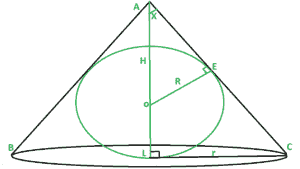
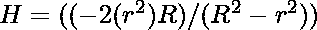
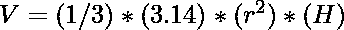
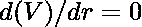
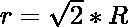

# 可围绕半径为 R 的球体外切的最小圆锥体体积

> 原文:[https://www . geeksforgeeks . org/半径为 r 的最小外接圆锥体积/](https://www.geeksforgeeks.org/minimum-volume-of-cone-that-can-be-circumscribed-about-a-sphere-of-radius-r/)

给定一个半径为 R 的球体，任务是找出可以围绕它外切的圆锥体的最小体积。



**例:**

```
Input: R = 10 
Output: Volume of cone = 8373.33 
Explanation: 
Radius of cone = 14.14 and Height of cone = 40,
Volume of cone = 
So, volume = 8373.33
Input: R = 4 
Output: Volume of cone = 535.89 
```

**方法:**
我们已经给出了一个内接圆锥的半径为 R 的球体。我们需要求出圆锥的半径和高度，才能求出圆锥的体积。

1.  在三角形中，AOE 和 ALC 计算 sin(X)，即对于三角形 AOE 和对于三角形 ALC 

2.  现在，从两者相等，我们得到

3.  在体积中插入 H 值，即，对于最小体积。

4.  从上面的等式中我们得到，把这个值放在 H 中，我们得到T2
5.  因此，应用圆锥体积公式，将和相加，就可以得到预期的结果。

## C++

```
// C++ program to find the minimum
// volume of the cone that can be 
// circumscribed about a sphere
// of radius R
#include<bits/stdc++.h>
using namespace std;

// Function to find the volume
// of the cone
float Volume_of_cone(float R)
{

    // r = radius of cone
    // h = height of cone
    // Volume of cone = (1 / 3) * (3.14) * (r*r) * (h)
    // we get radius of cone from the derivation
    // is root(2) times multiple of R
    // we get height of cone from the derivation
    // is 4 times multiple of R
    float V = (1 / 3.0) * (3.14) * (2 * ( R * R ) ) * (4 * R);

    return V;
}

// Driver code
int main()
{
    float R = 10.0;
    cout << Volume_of_cone(R);
}

// This code is contributed by Samarth
```

## Java 语言(一种计算机语言，尤用于创建网站)

```
// Java program to find the minimum
// volume of the cone that can be
// circumscribed about a sphere
// of radius R
import java.util.*;

class GFG{

// Function to find the volume
// of the cone
static double Volume_of_cone(double R)
{

    // r = radius of cone
    // h = height of cone
    // Volume of cone = (1 / 3) * (3.14) * (r*r) * (h)
    // we get radius of cone from the derivation
    // is root(2) times multiple of R
    // we get height of cone from the derivation
    // is 4 times multiple of R
    double V = (double)((1 / 3.0) * (3.14) * (2 * (R * R)) *
                                                  (4 * R));
    return V;
}

// Driver code
public static void main(String[] args)
{
    double R = 10.0;
    System.out.print(Volume_of_cone(R));
}
}

// This code is contributed by sapnasingh4991
```

## 蟒蛇 3

```
# Python3 program to find the minimum
# Volume of the cone that can be circumscribed
# about a sphere of radius R

import math

# Function to find the volume
# of the cone

def Volume_of_cone(R):

    # r = radius of cone
    # h = height of cone
    # Volume of cone = (1 / 3) * (3.14) * (r**2) * (h)
    # we get radius of cone from the derivation
    # is root(2) times multiple of R
    # we get height of cone from the derivation
    # is 4 times multiple of R

    V = (1 / 3) * (3.14) * (2 * ( R**2 ) ) * (4 * R)

    return V

# Driver code
if __name__ == "__main__":

    R = 10

    print(Volume_of_cone(R))

```

## C#

```
// C# program to find the minimum
// volume of the cone that can be
// circumscribed about a sphere
// of radius R
using System;
class GFG{

// Function to find the volume
// of the cone
static double Volume_of_cone(double R)
{

    // r = radius of cone
    // h = height of cone
    // Volume of cone = (1 / 3) * (3.14) * (r*r) * (h)
    // we get radius of cone from the derivation
    // is root(2) times multiple of R
    // we get height of cone from the derivation
    // is 4 times multiple of R
    double V = (double)((1 / 3.0) * (3.14) *
                    (2 * (R * R)) * (4 * R));
    return V;
}

// Driver code
public static void Main()
{
    double R = 10.0;
    Console.Write(Volume_of_cone(R));
}
}

// This code is contributed by Nidhi_biet
```

## java 描述语言

```
<script>
// Javascript program to find the minimum
// volume of the cone that can be
// circumscribed about a sphere
// of radius R

    // Function to find the volume
    // of the cone
    function Volume_of_cone( R)
    {

        // r = radius of cone
        // h = height of cone
        // Volume of cone = (1 / 3) * (3.14) * (r*r) * (h)
        // we get radius of cone from the derivation
        // is root(2) times multiple of R
        // we get height of cone from the derivation
        // is 4 times multiple of R
        let V =  ((1 / 3.0) * (3.14) * (2 * (R * R)) * (4 * R));
        return V;
    }

    // Driver code
    let R = 10.0;
    document.write(Volume_of_cone(R));

// This code is contributed by 29AjayKumar
</script>
```

**Output:** 

```
8373.333333333332
```