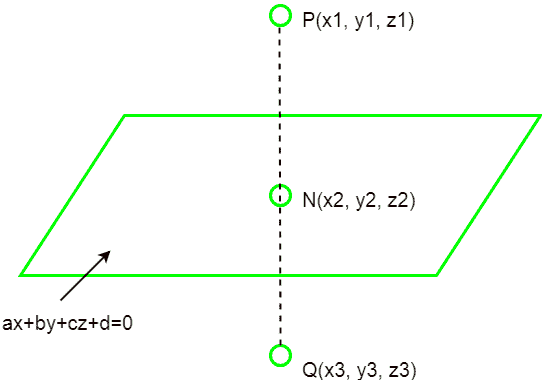

# 通过三维平面的点的镜像

> 原文:[https://www . geeksforgeeks . org/a 点对 a 点对 a 点对 a 点对 a 点对 a 点对 a 点对 a 点对 a 点对 a 点对 a 点对 a 点对 a 点对 a 点对 a 点对 a 点对 a 点对 a 点对 a 点对 a 点对 a 点对 a 点对 a 点对](https://www.geeksforgeeks.org/mirror-of-a-point-through-a-3-d-plane/)

给定三维中的一个点(x，y，z)和平面方程的系数，任务是通过给定的平面找到该点的镜像。
**例:**

> **输入:** a = 1，b = -2，c = 0，d = 0，x = -1，y = 3，z = 4
> **输出:**x3 = 1.799999999998，y3 =-2.599999999999996，z3 = 4.0
> T6】输入: a = 2，b = -1，c = 1，d = 3，x = 4.0



**逼近:**平面方程为 *ax + by + cz + d = 0。*因此，法线与平面的方向比是 **(a，b，c)** 。假设 N 是从给定点到给定平面的垂线的脚，那么，线 PN 具有有向比(a，b，c)，并且它穿过 P(x1，y1，z1)。
PN 线的方程式如下:-

```
(x - x1) / a = (y - y1) / b = (z - z1) / c = k
```

因此，PN 线上的任何点都可以写成:-

```
x = a*k + x1
y = b*k + y1
z = c*k + z1
```

因为 N 位于直线和平面上，所以将满足(ax + by + cz + d = 0)。

```
=>a * (a * k + x1) + b * (b * k + y1) + c * (c * k + z1) + d = 0.
=>a * a * k + a * x1 + b * b * k + b * y1 + c * c * k + c * z1 + d = 0.
=>(a * a + b * b + c * c)k = -a * x1 - b * y1 - c * z1 - d.
=>k = (-a * x1 - b * y1 - c * z1 - d) / (a * a + b * b + c * c).
```

现在，N 点在 k 方面的坐标将是:-

```
x2 = a * k + x1
y2 = b * k + y1
z2 = c * k + z1
```

由于点 N(x2，y2，z2)是点 P(x1，y1，z1)和点 Q(x3，y3，z3)的中点，点 Q 的坐标为:-

```
=> x3 = 2 * x2 - x1
=> y3 = 2 * y2 - y1
=> z3 = 2 * z2 - z1
```

## C++

```
// C++ program to find
// Mirror of a point 
// through a 3 D plane
#include <bits/stdc++.h>
#include<math.h>
#include <iostream>
#include <iomanip>

using namespace std;

// Function to mirror image
void mirror_point(float a, float b, 
                  float c, float d, 
                  float x1, float y1,
                  float z1)
{
    float k = (-a * x1 - b * 
                y1 - c * z1 - d) / 
        (float)(a * a + b * b + c * c);
    float x2 = a * k + x1;
    float y2 = b * k + y1;
    float z2 = c * k + z1;
    float x3 = 2 * x2 - x1;
    float y3 = 2 * y2 - y1;
    float z3 = 2 * z2 - z1;

    std::cout << std::fixed;
    std::cout << std::setprecision(1);
    cout << " x3 = " << x3; 
    cout << " y3 = " << y3; 
    cout << " z3 = " << z3;
}

// Driver Code
int main()
{
    float a = 1;
    float b = -2;
    float c = 0;
    float d = 0;
    float x1 = -1;
    float y1 = 3;
    float z1 = 4;

    // function call
    mirror_point(a, b, c, d, 
                 x1, y1, z1);
    return 0;
}
// This code is contributed
// by Amber_Saxena.
```

## C

```
// C program to find
// Mirror of a point
// through a 3 D plane
#include<stdio.h>

// Function to mirror image
void mirror_point(float a, float b,
                  float c, float d,
                  float x1, float y1,
                  float z1)
{
    float k = (-a * x1 - b *
                y1 - c * z1 - d) /
        (float)(a * a + b * b + c * c);
    float x2 = a * k + x1;
    float y2 = b * k + y1;
    float z2 = c * k + z1;
    float x3 = 2 * x2 - x1;
    float y3 = 2 * y2 - y1;
    float z3 = 2 * z2 - z1;

    printf("x3 = %.1f ", x3);
    printf("y3 = %.1f ", y3);
    printf("z3 = %.1f ", z3);
}

// Driver Code
int main()
{
    float a = 1;
    float b = -2;
    float c = 0;
    float d = 0;
    float x1 = -1;
    float y1 = 3;
    float z1 = 4;

    // function call
    mirror_point(a, b, c, d,
                 x1, y1, z1);
}

// This code is contributed
// by Amber_Saxena.
```

## Java 语言(一种计算机语言，尤用于创建网站)

```
// Java program to find
// Mirror of a point
// through a 3 D plane
import java.io.*;

class GFG
{

// Function to mirror image
static void mirror_point(int a, int b, 
                         int c, int d,
                         int x1, int y1,
                         int z1)
{
    float k = (-a * x1 - b * y1 - c * z1 - d) /
        (float)(a * a + b * b + c * c);
    float x2 = a * k + x1;
    float y2 = b * k + y1;
    float z2 = c * k + z1;
    float x3 = 2 * x2 - x1;
    float y3 = 2 * y2 - y1;
    float z3 = 2 * z2 - z1;

    System.out.print("x3 = " + x3 + " ");
    System.out.print("y3 = " + y3 + " ");
    System.out.print("z3 = " + z3 + " ");
}

// Driver Code
public static void main(String[] args)
{
    int a = 1;
    int b = -2;
    int c = 0;
    int d = 0;
    int x1 = -1;
    int y1 = 3;
    int z1 = 4;

    // function call
    mirror_point(a, b, c, d,
                 x1, y1, z1) ;
}
}

// This code is contributed
// by inder_verma
```

## 计算机编程语言

```
# Function to mirror image
def mirror_point(a, b, c, d, x1, y1, z1):

    k =(-a * x1-b * y1-c * z1-d)/float((a * a + b * b + c * c))
    x2 = a * k + x1
    y2 = b * k + y1
    z2 = c * k + z1
    x3 = 2 * x2-x1
    y3 = 2 * y2-y1
    z3 = 2 * z2-z1
    print "x3 =", x3,
    print "y3 =", y3,
    print "z3 =", z3,

# Driver Code
a = 1
b = -2
c = 0
d = 0
x1 = -1
y1 = 3
z1 = 4

# function call
mirror_point(a, b, c, d, x1, y1, z1) 
```

## C#

```
// C# program to find Mirror of
// a point through a 3 D plane
using System;

class GFG
{

// Function to mirror image
static void mirror_point(int a, int b,
                         int c, int d,
                         int x1, int y1,
                         int z1)
{
    float k = (-a * x1 - b * y1 - c * z1 - d) /
              (float)(a * a + b * b + c * c);
    float x2 = a * k + x1;
    float y2 = b * k + y1;
    float z2 = c * k + z1;
    float x3 = 2 * x2 - x1;
    float y3 = 2 * y2 - y1;
    float z3 = 2 * z2 - z1;

    Console.Write("x3 = " + x3 + " ");
    Console.Write("y3 = " + y3 + " ");
    Console.Write("z3 = " + z3 + " ");
}

// Driver Code
static public void Main ()
{
    int a = 1;
    int b = -2;
    int c = 0;
    int d = 0;
    int x1 = -1;
    int y1 = 3;
    int z1 = 4;

    // function call
    mirror_point(a, b, c, d,
                 x1, y1, z1);
}
}

// This code is contributed by jit_t
```

## 服务器端编程语言（Professional Hypertext Preprocessor 的缩写）

```
<?php
// PHP program to find Mirror of
// a point through a 3 D plane

// Function to mirror image
function mirror_point($a, $b, $c, $d,
                      $x1, $y1, $z1)
{
    $k = (-$a * $x1 - $b *
           $y1 - $c * $z1 - $d) /
          ($a * $a + $b *
           $b + $c * $c);
    $x2 = $a * $k + $x1;
    $y2 = $b * $k + $y1;
    $z2 = $c * $k + $z1;
    $x3 = 2 * $x2 - $x1;
    $y3 = 2 * $y2 - $y1;
    $z3 = 2 * $z2 - $z1;
    echo sprintf("x3 = %.1f ", $x3);
    echo sprintf("y3 = %.1f ", $y3);
    echo sprintf("z3 = %.1f ", $z3);
}

// Driver Code
$a = 1;
$b = -2;
$c = 0;
$d = 0;
$x1 = -1;
$y1 = 3;
$z1 = 4;
// function call
mirror_point($a, $b, $c, $d,
             $x1, $y1, $z1);

// This code is contributed
// by Amber_Saxena.
?>
```

## java 描述语言

```
<script>

      // JavaScript program to find
      // Mirror of a point
      // through a 3 D plane

      // Function to mirror image
      function mirror_point(a, b, c, d, x1, y1, z1)
      {
        var k = parseFloat(
          (-a * x1 - b * y1 -
          c * z1 - d) / parseFloat(a * a + b * b +
          c * c)
        );
        var x2 = parseFloat(a * k + x1);
        var y2 = parseFloat(b * k + y1);
        var z2 = parseFloat(c * k + z1);
        var x3 = parseFloat(2 * x2 - x1).toFixed(1);
        var y3 = parseFloat(2 * y2 - y1).toFixed(1);
        var z3 = parseFloat(2 * z2 - z1).toFixed(1);

        document.write(" x3 = " + x3);
        document.write(" y3 = " + y3);
        document.write(" z3 = " + z3);
      }

      // Driver Code
      var a = 1;
      var b = -2;
      var c = 0;
      var d = 0;
      var x1 = -1;
      var y1 = 3;
      var z1 = 4;

      // function call
      mirror_point(a, b, c, d, x1, y1, z1);

</script>
```

**Output:** 

```
x3 = 1.8 y3 = -2.6 z3 = 4.0
```