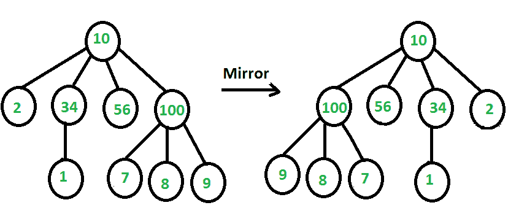

# n 元树的镜像

> 原文:[https://www.geeksforgeeks.org/mirror-of-n-ary-tree/](https://www.geeksforgeeks.org/mirror-of-n-ary-tree/)

给定一个树，其中每个节点包含可变数量的子节点，将树转换为它的镜像。下图显示了一个示例。



**我们强烈建议你尽量减少浏览器，先自己试试这个。**
树的节点被表示为键和可变大小的子指针数组。这个想法类似于二叉树的镜像。对于每个节点，我们首先对其所有子节点进行递归，然后反转子指针数组。我们也可以用其他方式来完成这些步骤，即先反向数组子指针，然后对子指针重复这些步骤。
下面是上面思路的 C++实现。

## C++

```
// C++ program to mirror an n-ary tree
#include <bits/stdc++.h>
using namespace std;

// Represents a node of an n-ary tree
struct Node
{
    int key;
    vector<Node *>child;
};

// Function to convert a tree to its mirror
void mirrorTree(Node * root)
{
    // Base case: Nothing to do if root is NULL
    if (root==NULL)
        return;

    // Number of children of root
    int n = root->child.size();

    // If number of child is less than 2 i.e.
    // 0 or 1 we do not need to do anything
    if (n < 2)
        return;

    // Calling mirror function for each child
    for (int i=0; i<n; i++)
        mirrorTree(root->child[i]);

    // Reverse vector (variable sized array) of child
    // pointers
    reverse(root->child.begin(), root->child.end());
}

// Utility function to create a new tree node
Node *newNode(int key)
{
    Node *temp = new Node;
    temp->key = key;
    return temp;
}

// Prints the n-ary tree level wise
void printNodeLevelWise(Node * root)
{
    if (root==NULL)
        return;

    // Create a queue and enqueue root to it
    queue<Node *>q;
    q.push(root);

    // Do level order traversal. Two loops are used
    // to make sure that different levels are printed
    // in different lines
    while (!q.empty())
    {
        int n = q.size();
        while (n>0)
        {
            // Dequeue an item from queue and print it
            Node * p = q.front();
            q.pop();
            cout << p->key << " ";

            // Enqueue all childrent of the dequeued item
            for (int i=0; i<p->child.size(); i++)
                q.push(p->child[i]);
            n--;
        }

        cout << endl; // Separator between levels
    }
}

// Driver program
int main()
{
    /*   Let us create below tree
    *              10
    *        /   /    \   \
    *        2  34    56   100
    *                 |   /  | \
    *                 1   7  8  9
    */
    Node *root = newNode(10);
    (root->child).push_back(newNode(2));
    (root->child).push_back(newNode(34));
    (root->child).push_back(newNode(56));
    (root->child).push_back(newNode(100));
    (root->child[2]->child).push_back(newNode(1));
    (root->child[3]->child).push_back(newNode(7));
    (root->child[3]->child).push_back(newNode(8));
    (root->child[3]->child).push_back(newNode(9));

    cout << "Level order traversal Before Mirroring\n";
    printNodeLevelWise(root);

    mirrorTree(root);

    cout << "\nLevel order traversal After Mirroring\n";
    printNodeLevelWise(root);

    return 0;
}
```

## 计算机编程语言

```
# Python program to mirror an n-ary tree

# Represents a node of an n-ary tree
class Node :

    # Utility function to create a new tree node
    def __init__(self ,key):
        self.key = key
        self.child = []

# Function to convert a tree to its mirror
def mirrorTree(root):

    # Base Case : nothing to do if root is None
    if root is None:
        return

    # Number of children of root
    n = len(root.child)

    # If number of child is less than 2 i.e.
    # 0 or 1 we don't need to do anything
    if n <2 :
        return

    # Calling mirror function for each child
    for i in range(n):
        mirrorTree(root.child[i]);

    # Reverse variable sized array of child pointers
    root.child.reverse()

# Prints the n-ary tree level wise

def printNodeLevelWise(root):
    if root is None:
        return

    # create a queue and enqueue root to it
    queue = []
    queue.append(root)

    # Do level order traversal. Two loops are used
    # to make sure that different levels are printed
    # in different lines
    while(len(queue) >0):

        n = len(queue)
        while(n > 0) :

            # Dequeue an item from queue and print it
            p = queue[0]
            queue.pop(0)
            print p.key,

            # Enqueue all children of the dequeued item
            for index, value in enumerate(p.child):
                queue.append(value)

            n -= 1
        print "" # Separator between levels

# Driver Program

    """   Let us create below tree
    *              10
    *        /   /    \   \
    *        2  34    56   100
    *                 |   /  | \
    *                 1   7  8  9
    """

root = Node(10)
root.child.append(Node(2))
root.child.append(Node(34))
root.child.append(Node(56))
root.child.append(Node(100))
root.child[2].child.append(Node(1))
root.child[3].child.append(Node(7))
root.child[3].child.append(Node(8))
root.child[3].child.append(Node(9))

print "Level order traversal Before Mirroring"
printNodeLevelWise(root)

mirrorTree(root)

print "\nLevel Order traversal After Mirroring"
printNodeLevelWise(root)
```

## java 描述语言

```
<script>

// Javascript program to mirror an n-ary tree

// Represents a node of an n-ary tree
class Node
{
  constructor()
  {
    this.key = 0;
    this.child = []
  }
};

// Function to convert a tree to its mirror
function mirrorTree(root)
{
    // Base case: Nothing to do if root is null
    if (root==null)
        return;

    // Number of children of root
    var n = root.child.length;

    // If number of child is less than 2 i.e.
    // 0 or 1 we do not need to do anything
    if (n < 2)
        return;

    // Calling mirror function for each child
    for(var i=0; i<n; i++)
        mirrorTree(root.child[i]);

    // Reverse vector (variable sized array) of child
    // pointers
    root.child.reverse();
}

// Utility function to create a new tree node
function newNode(key)
{
    var temp = new Node;
    temp.key = key;
    return temp;
}

// Prints the n-ary tree level wise
function printNodeLevelWise(root)
{
    if (root==null)
        return;

    // Create a queue and enqueue root to it
    var q = [];
    q.push(root);

    // Do level order traversal. Two loops are used
    // to make sure that different levels are printed
    // in different lines
    while (q.length!=0)
    {
        var n = q.length;
        while (n>0)
        {
            // Dequeue an item from queue and print it
            var p = q[0];
            q.shift();
            document.write( p.key + " ");

            // Enqueue all childrent of the dequeued item
            for(var i=0; i<p.child.length; i++)
                q.push(p.child[i]);
            n--;
        }

        document.write("<br>") // Separator between levels
    }
}

// Driver program
/*   Let us create below tree
*              10
*        /   /    \   \
*        2  34    56   100
*                 |   /  | \
*                 1   7  8  9
*/
var root = newNode(10);
(root.child).push(newNode(2));
(root.child).push(newNode(34));
(root.child).push(newNode(56));
(root.child).push(newNode(100));
(root.child[2].child).push(newNode(1));
(root.child[3].child).push(newNode(7));
(root.child[3].child).push(newNode(8));
(root.child[3].child).push(newNode(9));
document.write("Level order traversal Before Mirroring<br>");
printNodeLevelWise(root);
mirrorTree(root);
document.write("<br>Level order traversal After Mirroring<br>");
printNodeLevelWise(root);

// This code is contributed by rrrtnx.
</script>
```

输出:

```
Level order traversal Before Mirroring
10 
2 34 56 100 
1 7 8 9 

Level order traversal After Mirroring
10 
100 56 34 2 
9 8 7 1 
```

感谢 **Nitin Agrawal** 提供初步实施。如果你发现任何不正确的地方，请写评论，或者你想分享更多关于上面讨论的话题的信息