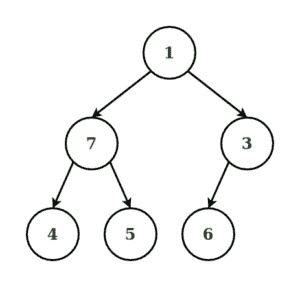

# 二叉树的混合顺序遍历

> 原文:[https://www . geesforgeks . org/二叉树的混合顺序遍历/](https://www.geeksforgeeks.org/mix-order-traversal-of-a-binary-tree/)

给定一个由 **N** 节点组成的[二叉树](https://www.geeksforgeeks.org/binary-tree-data-structure/)，任务是打印它的混合顺序遍历。

> **混合顺序遍历**是一种[树遍历技术](https://www.geeksforgeeks.org/tree-traversals-inorder-preorder-and-postorder/)，它涉及到现有遍历技术中的任意两种，如无序、前序和后序遍历。它们中的任何两个都可以被执行，或者给定树的交替层次和混合遍历可以被获得。

**示例:**

> **输入:** N = 6
> 
> [](https://media.geeksforgeeks.org/wp-content/uploads/20200211120414/Untitled-Diagram171-300x287.jpg)
> 
> **输出:** 7 4 5 1 3 6
> **解释:**
> 有序-预序混合遍历按以下顺序应用于给定的树:
> 有序遍历应用于级别 0
> 预序遍历应用于级别 1
> 有序遍历应用于级别 2。
> 
> [](https://media.geeksforgeeks.org/wp-content/uploads/20200211120414/Untitled-Diagram171-300x287.jpg)
> 
> **输出:** 4 5 7 1 6 3
> **解释:**
> 顺序-顺序混合遍历按以下顺序应用于给定的树:
> 顺序遍历应用于级别 0
> 顺序遍历应用于级别 1
> 顺序遍历应用于级别 2。

**方法:**
可能的混合顺序遍历如下:

**有序-预有序混合遍历**

**到()**的步骤为:

*   在**左子树**上执行[前序遍历](https://www.geeksforgeeks.org/iterative-preorder-traversal/)。
*   打印**当前节点**。
*   在**右子树**上执行**前序遍历**。

**预订单()**的步骤为:

*   打印**当前节点**。
*   在左子树(根- >左侧)上执行[有序遍历](https://www.geeksforgeeks.org/inorder-tree-traversal-without-recursion/)。
*   在**右子树**上执行**有序遍历**。

下面是上述方法的实现:

## C++

```
// C++ Program to implement
// the above approach
#include <bits/stdc++.h>
using namespace std;

void inOrder(struct node* root);
void preOrder(struct node* root);

// Node structure
struct node {
    char data;
    struct node *left, *right;
};

// Creates and initialize a new node
struct node* newNode(char ch)
{
    // Allocating memory to a new node
    struct node* n = (struct node*)
        malloc(sizeof(struct node));
    n->data = ch;
    n->left = NULL;
    n->right = NULL;
    return n;
}

// Perform Inorder Traversal
void inOrder(struct node* root)
{
    if (root) {
        preOrder(root->left);
        cout << root->data << " ";
        preOrder(root->right);
    }
}

// Perform Preorder Traversal
void preOrder(struct node* root)
{
    if (root) {
        cout << root->data << " ";
        inOrder(root->left);
        inOrder(root->right);
    }
}

// Driver Code
int main()
{
    // Given tree
    struct node* root = newNode('1');
    root->left = newNode('7');
    root->right = newNode('3');
    root->left->left = newNode('4');
    root->left->right = newNode('5');
    root->right->left = newNode('6');

    // Perform Mix order traversal
    inOrder(root);

    return 0;
}
```

## Java 语言(一种计算机语言，尤用于创建网站)

```
// Java program to implement
// the above approach
import java.util.*;

class GFG{

// Node structure
static class node
{
    char data;
    node left, right;
};

// Creates and initialize a new node
static node newNode(char ch)
{

    // Allocating memory to a new node
    node n = new node();
    n.data = ch;
    n.left = null;
    n.right = null;
    return n;
}

// Perform Inorder Traversal
static void inOrder(node root)
{
    if (root != null)
    {
        preOrder(root.left);
        System.out.print(root.data + " ");
        preOrder(root.right);
    }
}

// Perform Preorder Traversal
static void preOrder(node root)
{
    if (root != null)
    {
        System.out.print(root.data + " ");
        inOrder(root.left);
        inOrder(root.right);
    }
}

// Driver Code
public static void main(String[] args)
{

    // Given tree
    node root = newNode('1');
    root.left = newNode('7');
    root.right = newNode('3');
    root.left.left = newNode('4');
    root.left.right = newNode('5');
    root.right.left = newNode('6');

    // Perform Mix order traversal
    inOrder(root);
}
}

// This code is contributed by 29AjayKumar
```

## 蟒蛇 3

```
# Python3 program to implement the above approach

# Node structure
class node:
    def __init__(self):
        self.data = 0
        self.left = None
        self.right = None

# Creates and initialize a new node
def newNode(ch):

    # Allocating memory to a new node
    n = node()
    n.data = ch
    n.left = None
    n.right = None
    return n

# Perform Inorder Traversal
def inOrder(root):
    if root != None:
        preOrder(root.left)
        print(root.data, end = " ")
        preOrder(root.right)

# Perform Preorder Traversal
def preOrder(root):
    if root != None:
        print(root.data, end = " ")
        inOrder(root.left)
        inOrder(root.right)

# Driver Code
# Given tree
root = newNode('1')
root.left = newNode('7')
root.right = newNode('3')
root.left.left = newNode('4')
root.left.right = newNode('5')
root.right.left = newNode('6')

# Perform Mix order traversal
inOrder(root)

# This code is contributed by divyeshrabadiya07.
```

## C#

```
// C# program to implement
// the above approach
using System;
class GFG{

// Node structure
class node
{
    public char data;
    public node left, right;
};

// Creates and initialize a new node
static node newNode(char ch)
{

    // Allocating memory to a new node
    node n = new node();
    n.data = ch;
    n.left = null;
    n.right = null;
    return n;
}

// Perform Inorder Traversal
static void inOrder(node root)
{
    if (root != null)
    {
        preOrder(root.left);
        Console.Write(root.data + " ");
        preOrder(root.right);
    }
}

// Perform Preorder Traversal
static void preOrder(node root)
{
    if (root != null)
    {
        Console.Write(root.data + " ");
        inOrder(root.left);
        inOrder(root.right);
    }
}

// Driver Code
public static void Main(String[] args)
{

    // Given tree
    node root = newNode('1');
    root.left = newNode('7');
    root.right = newNode('3');
    root.left.left = newNode('4');
    root.left.right = newNode('5');
    root.right.left = newNode('6');

    // Perform Mix order traversal
    inOrder(root);
}
}

// This code is contributed by sapnasingh4991
```

## java 描述语言

```
<script>

// Javascript program to implement
// the above approach

// Node structure
class node
{
    constructor()
    {
        this.data = 0;
        this.left = null;
        this.right =  null;
    }
};

// Creates and initialize a new node
function newNode(ch)
{

    // Allocating memory to a new node
    var n = new node();
    n.data = ch;
    n.left = null;
    n.right = null;
    return n;
}

// Perform Inorder Traversal
function inOrder(root)
{
    if (root != null)
    {
        preOrder(root.left);
        document.write(root.data + " ");
        preOrder(root.right);
    }
}

// Perform Preorder Traversal
function preOrder(root)
{
    if (root != null)
    {
        document.write(root.data + " ");
        inOrder(root.left);
        inOrder(root.right);
    }
}

// Driver Code
// Given tree
var root = newNode('1');
root.left = newNode('7');
root.right = newNode('3');
root.left.left = newNode('4');
root.left.right = newNode('5');
root.right.left = newNode('6');
// Perform Mix order traversal
inOrder(root);

</script>
```

**Output:** 

```
7 4 5 1 3 6
```

**前序-后序混合遍历**

**预订单()**的步骤如下:

*   打印**当前节点**。
*   在**左子树**上执行[后序遍历](https://www.geeksforgeeks.org/iterative-postorder-traversal/)。
*   在**右子树**上执行**后序遍历**。

**后置()**的步骤如下:

*   在**左子树**上执行[前序遍历](https://www.geeksforgeeks.org/iterative-preorder-traversal/)。
*   对**右子树**进行前序遍历。
*   打印**当前节点。**

下面是上述方法的实现:

## C++

```
// C++ Program to implement
// the above approach
#include <bits/stdc++.h>
using namespace std;

void preOrder(struct node* root);
void postOrder(struct node* root);

// Node structure
struct node {
    char data;
    struct node *left, *right;
};

// Creates and initialize a new node
struct node* newNode(char ch)
{
    // Allocating memory to a new node
    struct node* n = (struct node*)
        malloc(sizeof(struct node));
    n->data = ch;
    n->left = NULL;
    n->right = NULL;
    return n;
}

// Perform Preorder Traversal
void preOrder(struct node* root)
{
    if (root) {
        cout << root->data << " ";
        postOrder(root->left);
        postOrder(root->right);
    }
}

// Perform Postorder Traversal
void postOrder(struct node* root)
{
    if (root) {
        preOrder(root->left);
        preOrder(root->right);
        cout << root->data << " ";
    }
}

// Driver Code
int main()
{
    // Given tree
    struct node* root = newNode('A');
    root->left = newNode('B');
    root->right = newNode('C');
    root->left->left = newNode('F');
    root->left->right = newNode('D');
    root->right->right = newNode('E');

    // Starting Mix order traversal
    preOrder(root);

    return 0;
}
```

## Java 语言(一种计算机语言，尤用于创建网站)

```
// Java Program to implement
// the above approach
class GFG{

// Node structure
static class node
{
    char data;
    node left, right;
};

// Creates and initialize a new node
static node newNode(char ch)
{
    // Allocating memory to a new node
    node n = new node();

    n.data = ch;
    n.left = null;
    n.right = null;
    return n;
}

// Perform Preorder Traversal
static void preOrder(node root)
{
    if (root != null)
    {
        System.out.print(root.data + " ");
        postOrder(root.left);
        postOrder(root.right);
    }
}

// Perform Postorder Traversal
static void postOrder(node root)
{
    if (root != null)
    {
        preOrder(root.left);
        preOrder(root.right);
        System.out.print(root.data + " ");
    }
}

// Driver Code
public static void main(String[] args)
{
    // Given tree
    node root = newNode('A');
    root.left = newNode('B');
    root.right = newNode('C');
    root.left.left = newNode('F');
    root.left.right = newNode('D');
    root.right.right = newNode('E');

    // Starting Mix order traversal
    preOrder(root);
}
}

// This code is contributed by Rajput-Ji
```

## 蟒蛇 3

```
# Python3 Program to implement the above approach

# Node structure
class node:
    def __init__(self):
        self.data = '0'
        self.left = None
        self.right = None

# Creates and initialize a new node
def newNode(ch):
    # Allocating memory to a new node
    n = node()

    n.data = ch
    n.left = None
    n.right = None
    return n

# Perform Preorder Traversal
def preOrder(root):
    if root != None:
        print(root.data,  end = " ")
        postOrder(root.left)
        postOrder(root.right)

# Perform Postorder Traversal
def postOrder(root):
    if root != None:
        preOrder(root.left)
        preOrder(root.right)
        print(root.data, end = " ")

# Given tree
root = newNode('A')
root.left = newNode('B')
root.right = newNode('C')
root.left.left = newNode('F')
root.left.right = newNode('D')
root.right.right = newNode('E')

# Starting Mix order traversal
preOrder(root)

# This code is contributed by divyesh072019.
```

## C#

```
// C# Program to implement
// the above approach
using System;
class GFG{

// Node structure
class node
{
    public char data;
    public node left, right;
};

// Creates and initialize a new node
static node newNode(char ch)
{
    // Allocating memory to a new node
    node n = new node();

    n.data = ch;
    n.left = null;
    n.right = null;
    return n;
}

// Perform Preorder Traversal
static void preOrder(node root)
{
    if (root != null)
    {
        Console.Write(root.data + " ");
        postOrder(root.left);
        postOrder(root.right);
    }
}

// Perform Postorder Traversal
static void postOrder(node root)
{
    if (root != null)
    {
        preOrder(root.left);
        preOrder(root.right);
        Console.Write(root.data + " ");
    }
}

// Driver Code
public static void Main(String[] args)
{
    // Given tree
    node root = newNode('A');
    root.left = newNode('B');
    root.right = newNode('C');
    root.left.left = newNode('F');
    root.left.right = newNode('D');
    root.right.right = newNode('E');

    // Starting Mix order traversal
    preOrder(root);
}
}

// This code is contributed by Rohit_ranjan
```

## java 描述语言

```
<script>
    // Javascript Program to implement the above approach

    // Node structure
    class node
    {
        constructor() {
           this.left;
           this.right;
           this.data;
        }
    }

    // Creates and initialize a new node
    function newNode(ch)
    {
        // Allocating memory to a new node
        let n = new node();

        n.data = ch;
        n.left = null;
        n.right = null;
        return n;
    }

    // Perform Preorder Traversal
    function preOrder(root)
    {
        if (root != null)
        {
            document.write(root.data + " ");
            postOrder(root.left);
            postOrder(root.right);
        }
    }

    // Perform Postorder Traversal
    function postOrder(root)
    {
        if (root != null)
        {
            preOrder(root.left);
            preOrder(root.right);
            document.write(root.data + " ");
        }
    }

    // Given tree
    let root = newNode('A');
    root.left = newNode('B');
    root.right = newNode('C');
    root.left.left = newNode('F');
    root.left.right = newNode('D');
    root.right.right = newNode('E');

    // Starting Mix order traversal
    preOrder(root);

    // This code is contributed by rameshtravel07.
</script>
```

**Output:** 

```
A F D B E C
```

**顺序-顺序混合遍历**

**为了()**的步骤如下:

*   在**左子树**上执行**后序遍历**。
*   打印**当前节点**。
*   在右子树上执行**后序遍历**。

**后置()**的步骤为:

*   在**左子树**上执行**有序遍历**。
*   在**右子树**上执行**有序遍历**。
*   打印**当前节点**。

下面是上述方法的实现:

## C++

```
// C++ Program to implement
// the above approach
#include <bits/stdc++.h>
using namespace std;

void inOrder(struct node* root);
void postOrder(struct node* root);

// Node structure
struct node {
    char data;
    struct node *left, *right;
};

// Creates and initialize a new node
struct node* newNode(char ch)
{

    // Allocating memory to a new node
    struct node* n = (struct node*)
        malloc(sizeof(struct node));
    n->data = ch;
    n->left = NULL;
    n->right = NULL;
    return n;
}

// Perform Inorder Traversal
void inOrder(struct node* root)
{
    if (root) {
        postOrder(root->left);
        cout << root->data << " ";
        postOrder(root->right);
    }
}

// Perform Postorder Traversal
void postOrder(struct node* root)
{
    if (root) {
        inOrder(root->left);
        inOrder(root->right);
        cout << root->data << " ";
    }
}

// Driver Code
int main()
{
    // Given tree
    struct node* root = newNode('A');
    root->left = newNode('B');
    root->right = newNode('C');
    root->left->left = newNode('F');
    root->left->right = newNode('D');
    root->right->right = newNode('E');

    // Starting Mix order traversal
    inOrder(root);

    return 0;
}
```

## Java 语言(一种计算机语言，尤用于创建网站)

```
// Java Program to implement
// the above approach
import java.util.*;
class GFG{

// Node structure
static class node
{
    char data;
    node left, right;
};

// Creates and initialize a new node
static node newNode(char ch)
{

    // Allocating memory to a new node
    node n = new node();
    n.data = ch;
    n.left = null;
    n.right = null;
    return n;
}

// Perform Inorder Traversal
static void inOrder(node root)
{
    if (root != null)
    {
        postOrder(root.left);
        System.out.print(root.data + " ");
        postOrder(root.right);
    }
}

// Perform Postorder Traversal
static void postOrder(node root)
{
    if (root != null)
    {
        inOrder(root.left);
        inOrder(root.right);
        System.out.print(root.data + " ");
    }
}

// Driver Code
public static void main(String[] args)
{
    // Given tree
    node root = newNode('A');
    root.left = newNode('B');
    root.right = newNode('C');
    root.left.left = newNode('F');
    root.left.right = newNode('D');
    root.right.right = newNode('E');

    // Starting Mix order traversal
    inOrder(root);
}
}

// This code is contributed by sapnasingh4991
```

## 蟒蛇 3

```
# Python3 Program to implement the above approach

# Node structure
class node:
    def __init__(self):
        self.data = '0'
        self.left = None
        self.right = None

# Creates and initialize a new node
def newNode(ch):
    # Allocating memory to a new node
    n = node()
    n.data = ch
    n.left = None
    n.right = None
    return n

# Perform Inorder Traversal
def inOrder(root):
    if root != None:
        postOrder(root.left)
        print(root.data, end = " ")
        postOrder(root.right)

# Perform Postorder Traversal
def postOrder(root):
    if root != None:
        inOrder(root.left)
        inOrder(root.right)
        print(root.data, end = " ")

# Given tree
root = newNode('A')
root.left = newNode('B')
root.right = newNode('C')
root.left.left = newNode('F')
root.left.right = newNode('D')
root.right.right = newNode('E')

# Starting Mix order traversal
inOrder(root)

# This code is contributed by decode2207.
```

## C#

```
// C# Program to implement
// the above approach
using System;
class GFG{

// Node structure
class node
{
    public char data;
    public node left, right;
};

// Creates and initialize a new node
static node newNode(char ch)
{

    // Allocating memory to a new node
    node n = new node();
    n.data = ch;
    n.left = null;
    n.right = null;
    return n;
}

// Perform Inorder Traversal
static void inOrder(node root)
{
    if (root != null)
    {
        postOrder(root.left);
        Console.Write(root.data + " ");
        postOrder(root.right);
    }
}

// Perform Postorder Traversal
static void postOrder(node root)
{
    if (root != null)
    {
        inOrder(root.left);
        inOrder(root.right);
        Console.Write(root.data + " ");
    }
}

// Driver Code
public static void Main(String[] args)
{
    // Given tree
    node root = newNode('A');
    root.left = newNode('B');
    root.right = newNode('C');
    root.left.left = newNode('F');
    root.left.right = newNode('D');
    root.right.right = newNode('E');

    // Starting Mix order traversal
    inOrder(root);
}
}

// This code is contributed by sapnasingh4991
```

## java 描述语言

```
<script>
    // Javascript Program to implement the above approach

    // Node structure
    class node
    {
        constructor() {
           this.left;
           this.right;
           this.data;
        }
    }

    // Creates and initialize a new node
    function newNode(ch)
    {

        // Allocating memory to a new node
        let n = new node();
        n.data = ch;
        n.left = null;
        n.right = null;
        return n;
    }

    // Perform Inorder Traversal
    function inOrder(root)
    {
        if (root != null)
        {
            postOrder(root.left);
            document.write(root.data + " ");
            postOrder(root.right);
        }
    }

    // Perform Postorder Traversal
    function postOrder(root)
    {
        if (root != null)
        {
            inOrder(root.left);
            inOrder(root.right);
            document.write(root.data + " ");
        }
    }

    // Given tree
    let root = newNode('A');
    root.left = newNode('B');
    root.right = newNode('C');
    root.left.left = newNode('F');
    root.left.right = newNode('D');
    root.right.right = newNode('E');

    // Starting Mix order traversal
    inOrder(root);

  // This code is contributed by mukesh07.
</script>
```

**Output:** 

```
F D B A E C
```

***时间复杂度:** O(N)*
***辅助空间:** O(N)*