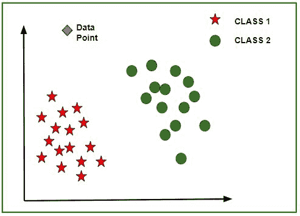
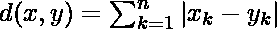

# ML |特征缩放–第 1 部分

> 原文:[https://www.geeksforgeeks.org/ml-feature-scaling-part-1/](https://www.geeksforgeeks.org/ml-feature-scaling-part-1/)

**特征缩放**是一种在固定范围内标准化数据中存在的独立特征的技术。它是在数据预处理期间执行的。

**工作:**
给定一个有特征的数据集- *年龄**工资**BHK 公寓*数据量 5000 人，每个人都有这些独立的数据特征。

每个数据点标记为:

*   **Class1- YES** (表示在给定的*年龄*、*工资*、 *BHK 公寓*特征价值的情况下，可以购买该房产)
*   **Class2- NO** (指以给定的*年龄*、*工资*、 *BHK 公寓*的特征值一个人买不到的房产)。

使用数据集来训练模型，目的是建立一个模型，可以预测是否可以用给定的特征值购买房产。

一旦模型经过训练，就可以创建一个包含给定数据集数据点的 N 维(其中 N 是数据集中存在的要素数量)图。下图是模型的理想表示。



如图所示，星形数据点属于**类 1–是**，圆圈代表**类 2–否**标签，使用这些数据点训练模型。现在给出一个新的数据点(如图菱形)，它对于上面提到的 3 个特征(*年龄*、*工资*、 *BHK 公寓*)有不同的独立值。模型必须预测这个数据点属于是还是不是

**新数据点类别的预测:**
模型计算该数据点距离每个类别组质心的距离。最后，该数据点将属于该类，该类与该数据点的质心距离最小。
使用这些方法可以计算质心和数据点之间的距离-

*   **欧氏距离:**是每个类的数据点和质心的坐标(特征值–*年龄*、*工资*、 *BHK 公寓*)之差平方和的平方根。这个公式是毕达哥拉斯定理给出的。
    ![d(x, y)=\sqrt[r]{\sum_{k=1}^{n}\left(x_{k}-y_{k}\right)^{r}}  ](img/d80f6d7581016926968b53a90b0dbb79.png "Rendered by QuickLaTeX.com")
    其中 x 为数据点值，y 为质心值，k 为特征值个数，例:给定数据集 k = 3
*   **曼哈顿距离:**计算为各类数据点坐标(特征值)与质心绝对差之和。
    

*   **闵可夫斯基距离:**是以上两种方法的推广。如图所示，可以使用不同的值来查找 r。

**特征缩放需求:**
给定的数据集包含 3 个特征–*年龄*、*工资*、 *BHK 公寓*。考虑*年龄*10-60，工资*1-40，平*BHK*1-5。所有这些特征都是相互独立的。
假设类 1 的质心为[40，22 Lacs，3]，待预测的数据点为[57，33 Lacs，2]。*

使用曼哈顿方法，

```
Distance = (|(40 - 57)| + |(2200000 - 3300000)| + |(3 - 2)|)
```

可以看出，在预测给定数据点的类别时，工资特征将支配所有其他特征，并且由于所有特征彼此独立，即一个人的工资与他/她的年龄或他/她对公寓的要求无关。这意味着模型总是会预测错误。

因此，这个问题的简单解决方案是特征缩放。特征缩放算法将在固定范围内缩放年龄、工资、BHK，比如【-1，1】或【0，1】。然后没有特征可以支配别人。