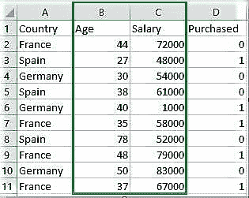

# ML |特征缩放–第 2 部分

> 原文:[https://www.geeksforgeeks.org/ml-feature-scaling-part-2/](https://www.geeksforgeeks.org/ml-feature-scaling-part-2/)

要素缩放是一种在固定范围内标准化数据中存在的独立要素的技术。它在数据预处理期间执行，以处理高度变化的幅度、值或单位。如果没有进行特征缩放，则机器学习算法倾向于加权更大的值、更高的值，并将更小的值视为更低的值，而不考虑值的单位。

**示例:**如果算法没有使用特征缩放方法，那么它可以认为 3000 米的值大于 5 公里，但这实际上是不正确的，在这种情况下，算法会给出错误的预测。因此，我们使用特征缩放使所有值达到相同的大小，从而解决这个问题。

**执行特征缩放的技术**
考虑两个最重要的技术:

*   **最小-最大归一化:**该技术重新缩放分布值介于 0 和 1 之间的特征或观察值。

    <center></center>

*   **标准化:**这是一种非常有效的技术，它重新缩放特征值，使其具有均值为 0、方差等于 1 的分布。

    <center></center>

**下载数据集:**
前往链接下载[Data _ for _ Feature _ scaling . CSV](https://drive.google.com/open?id=1n8uQ0sPkjLuBxeGDzNVzB_YxcbgEKVqx)



 **代码:Python 代码，解释特征缩放对数据的作用**

```
# Python code explaining How to
# perform Feature Scaling

""" PART 1
    Importing Libraries """

import numpy as np
import matplotlib.pyplot as plt
import pandas as pd

# Sklearn library 
from sklearn import preprocessing

""" PART 2
    Importing Data """

data_set = pd.read_csv('C:\\Users\\dell\\Desktop\\Data_for_Feature_Scaling.csv')
data_set.head()

# here Features - Age and Salary columns 
# are taken using slicing
# to handle values with varying magnitude
x = data_set.iloc[:, 1:3].values
print ("\nOriginal data values : \n",  x)

""" PART 4
    Handling the missing values """

from sklearn import preprocessing

""" MIN MAX SCALER """

min_max_scaler = preprocessing.MinMaxScaler(feature_range =(0, 1))

# Scaled feature
x_after_min_max_scaler = min_max_scaler.fit_transform(x)

print ("\nAfter min max Scaling : \n", x_after_min_max_scaler)

""" Standardisation """

Standardisation = preprocessing.StandardScaler()

# Scaled feature
x_after_Standardisation = Standardisation.fit_transform(x)

print ("\nAfter Standardisation : \n", x_after_Standardisation)
```

**输出:**

```
   Country  Age  Salary  Purchased
0   France   44   72000          0
1    Spain   27   48000          1
2  Germany   30   54000          0
3    Spain   38   61000          0
4  Germany   40    1000          1

Original data values : 
 [[   44 72000]
 [   27 48000]
 [   30 54000]
 [   38 61000]
 [   40  1000]
 [   35 58000]
 [   78 52000]
 [   48 79000]
 [   50 83000]
 [   37 67000]]

After min max Scaling : 
 [[ 0.33333333  0.86585366]
 [ 0\.          0.57317073]
 [ 0.05882353  0.64634146]
 [ 0.21568627  0.73170732]
 [ 0.25490196  0\.        ]
 [ 0.15686275  0.69512195]
 [ 1\.          0.62195122]
 [ 0.41176471  0.95121951]
 [ 0.45098039  1\.        ]
 [ 0.19607843  0.80487805]]

After Standardisation : 
 [[ 0.09536935  0.66527061]
 [-1.15176827 -0.43586695]
 [-0.93168516 -0.16058256]
 [-0.34479687  0.16058256]
 [-0.1980748  -2.59226136]
 [-0.56487998  0.02294037]
 [ 2.58964459 -0.25234403]
 [ 0.38881349  0.98643574]
 [ 0.53553557  1.16995867]
 [-0.41815791  0.43586695]]

```