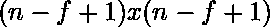
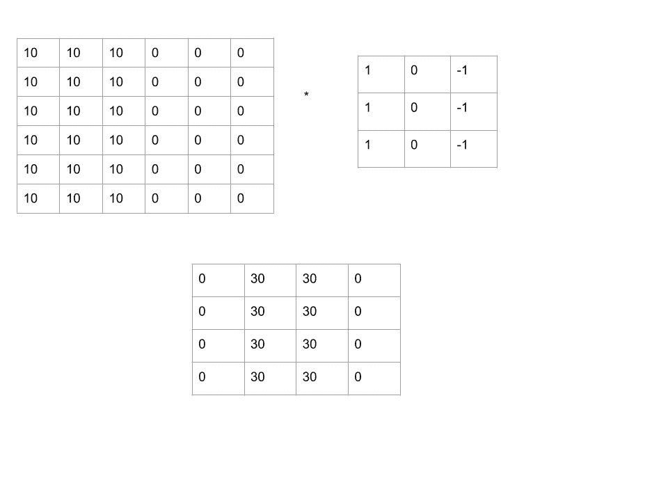
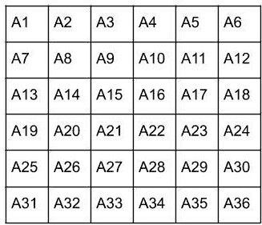
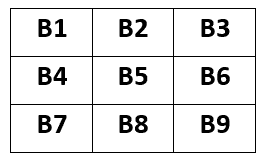
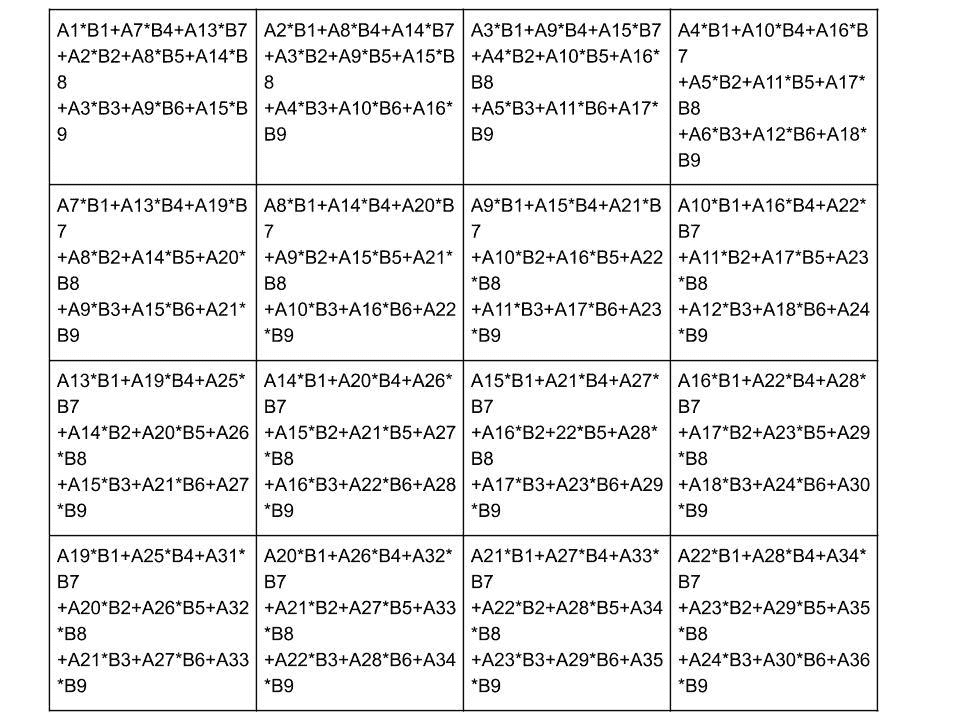
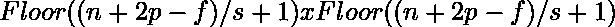
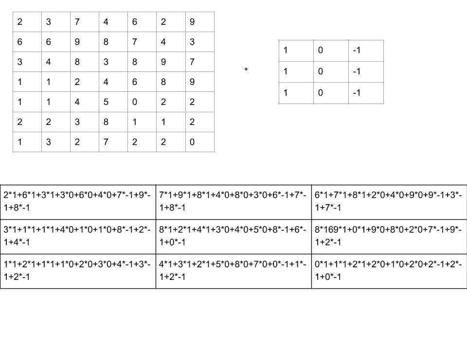

# ML |条纹卷积简介

> 原文:[https://www . geeksforgeeks . org/ml-入门-跨步-回旋/](https://www.geeksforgeeks.org/ml-introduction-to-strided-convolutions/)

让我们从一个基本问题开始这篇文章——“为什么需要填充和条纹卷积？”

假设我们有一个尺寸为*n×n*的图像。如果用 *f x f* 滤波器进行卷积，则获得的图像尺寸为。

**示例:**
考虑一个*6×6 的图像*如下图所示。用*3×3*过滤器进行旋绕。卷积是使用逐元素乘法完成的。

**图 1:*6×6*图像与 *3×3* 滤波器和*s = 0***

 **卷积后获得的图像图 2:6×6 滤波器**

**图 3:3×3 滤镜**

**图 4:元素乘法**
但是这种卷积有两个缺点:

1.  通过每次应用卷积滤波器，原始图像下沉。即输出图像具有比原始输入图像更小的尺寸，这可能导致信息丢失。
2.  仅在一个输出中使用的图像角的像素比中间的像素多，这导致巨大的信息损失。

为了避免它，需要填充。此外，有时我们有一个非常大的输入图像要用一个 *f x f* 滤波器进行卷积，这在计算上可能非常昂贵。在这种情况下，使用大踏步。这就是为什么填充和跨步是卷积神经网络最基本的组成部分之一

**输出图像尺寸:**

让一个 *n x n* 图像用 *f x f* 滤镜进行卷积。假设填充边界为 *p* 像素，步长为 *s* ，则获得的输出图像的尺寸为

应当选择步幅量，使得需要相对较少的计算，并且信息损失应当最小。
**图 5:6×6 图像与 3×3 滤波器卷积后得到的图像，步长为 2**

