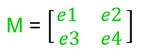
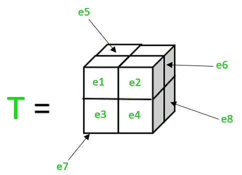

# ML |线性代数运算

> 原文:[https://www.geeksforgeeks.org/ml-linear-algebra-operations/](https://www.geeksforgeeks.org/ml-linear-algebra-operations/)

线性代数原理对于理解机器学习以及深度学习背后的概念至关重要，即使许多想法都在努力创建精确的数学模型，线性代数仍然是研究它们的重要工具。代数让你更好地理解算法实际上是如何在幕后运行的，这样开发人员就可以做出更好的选择，如果你想成为机器学习或深度学习的专业人员，你就不能逃避学习其中的一些技术。

**什么是线性代数？**
它是数学的一个分支，允许以简洁的方式定义和执行高维坐标和平面相互作用的运算。线性代数是对不确定维数的代数扩展。线性代数关注线性方程系统。它是一种连续类型的数学，适用于科学和工程，因为它有助于人们建模和有效地模拟自然现象。

**在进入线性代数概念之前，我们必须了解以下属性:**

*   **联想性质:**它是数学中的一个性质，说明如果 *a* 、 *b* 和 *c* 是数学对象，那么 *a + (b + c) = (a + b) + c* 其中 *+* 是二元运算。
*   **可交换性质:**它是数学中的一个性质，说明如果 *a* 和 *b* 是数学对象，那么 *a + b = b + a* 其中 *+* 是二进制运算。
*   **分配性质:**它是数学中的一个性质，说明如果 *a* 、 *b* 和 *c* 是数学对象，那么 *a * (b + c)= (a * b) + (a * c)* 其中 *** 和 *+* 是二元运算符。

**以下是机器学习实现中最常用的一些线性代数概念:**

*   **标量:**是用单个元素描述的物理量，只有大小，没有方向。基本上，标量只是一个数字。

    ```
    Example: 
    17 and 256
    ```

*   **Vector:** It is a geometric object having both magnitude and direction, it is an ordered number array, and are always in a row or column. A Vector has just one index, which can refer to a particular value within the Vector.
    
    Here *V* is a vector in which *e1*, *e2*, *e3* and *e4* are its elements, and *V[2]* is *e3*.

    ```
    Example: 
    [2, 3, 4] and [34, 53]
    ```

    **操作:**

*   **Scalar-Vector Multiplication:

    ```
    p = [e1, e2, e3]
    ```

    标量和矢量的乘积给出了下面的结果-

    ```
    p * 2 = [2 * e1, 2 * e2, 2 * e3]
    ```

    当标量 *2* 乘以向量 *p* 时，向量 *p* 的所有元素都乘以该标量。这个操作满足交换性。

    ```
    Example:
    x = [1, 2]
    x * 4 = [4, 8]
    ```** 

*   ****Matrix:** It is an ordered 2D array of numbers, symbols or expressions arranged in rows and columns. It has two indices, the first index points to the row, and the second index points to the column. A Matrix can have multiple numbers of rows and columns.
    
    Above *M* is a 2D matrix having *e1*, *e2*, *e3* and *e4* as elements, and *M[1][0]* is *e3*.

    ```
    Example:
    2 3 6  and 56 12 
    4 5 8      45 78
               34 67 
    ```

    左对角线元素为 1，其他元素为 0 的矩阵为**单位矩阵**。

    ```
    Example:
    1 0 
    0 1 is 2D Identity Matrix.

    1 0 0
    0 1 0
    0 0 1 is 3D Identity Matrix.
    ```

    **操作:**

    *   **Scalar-Matrix Multiplication:**

        ```
        p = e1 e2 
            e3 e4
        *a* is a scalar.
        p * a = (a * e1)  (a * e2)
                (a * e3)  (a * e4)
        ```

        当标量 *a* 乘以矩阵 *p* 时，矩阵 *p* 的所有元素都乘以该标量。标量矩阵乘法是联合的、分配的和交换的。

        ```
        Example:
        x = 1 2 3
            4 5 6
        x * 4 = 4  8  12
                16 20 24
        ```

    *   **Vector-Matrix Multiplication:**

        ```
        p = e1 e2
            e3 e4
            e5 e6
        q = a
            b
        ```

        将矩阵 *p* 与向量 *q* 相乘，得到以下乘积-

        ```
        p * q = (e1 * a) + (e2 * b)
                (e3 * a) + (e4 * b)
                (e5 * a) + (e6 * b)
        ```

        矩阵的行数应该等于向量的元素数，然后只有它们可以相乘。向量-矩阵乘法是联合的和分配的，但不是交换的。

        ```
        Example:
        m = 1 2  and n = 1
            3 4          2 
            5 6
        then m * n = 5
                     11
                     17
        ```

    *   **Matrix-Matrix Addition:**

        ```
        m1 = a b  and m2 = p q 
             c d           r s
        ```

        为了添加矩阵，矩阵的行和列应该相等。矩阵 *m1* 和 *m2* 相加得到如下结果-

        ```
        m1 + m2 = (a + p) (b + q)
                  (c + r) (d + s)
        ```

        第一矩阵的每个元素与另一矩阵的相应元素相加，这两个元素都具有相同的行和列值。矩阵-矩阵加法是结合的、分配的和交换的。

        ```
        Example:
        1 2   5 5   6 7
        2 1 + 5 5 = 7 6
        1 2   5 5   6 7 
        ```

    *   **Matrix-Matrix Subtraction:**

        ```
        m1 = a b  and m2 = p q 
             c d           r s
        ```

        为了减去矩阵，矩阵的行和列应该相等。矩阵 *m1* 和 *m2* 相减得到如下结果-

        ```
        m1 - m2 = (a - p) (b - q)
                  (c - r) (d - s)
        ```

        第一矩阵的每个元素被减去另一个矩阵的相应元素，这两个元素都具有相同的行和列值。矩阵-矩阵加法是结合的、分配的和交换的。

        ```
        Example:
        1 2   5 5   -4 -3
        2 1 - 5 5 = -3 -4
        1 2   5 5   -4 -3
        ```

    *   **Matrix-Matrix Multiplication:**

        ```
        m1 = a b  and m2 = p q 
             c d           r s
        ```

        两个矩阵相乘，第一个矩阵的列数应该等于第二个矩阵的行数，矩阵 *m1* 和 *m2* 的乘积如下-

        ```
        m1 * m2 = ((a * p) + (b * r))   ((a * q) + (b * s))  
                  ((c * p) + (d * r))   ((c * q) + (d * s))
        ```

        矩阵-矩阵乘法是联合的和分配的，但不是交换的。

        ```
        Example:
        1 3 2   1 3    11 10
        4 0 1 * 0 1 =  9  14
                5 2
        1 3 2   1    11
        4 0 1 * 0 =  9 
                5 
        1 3 2   3    10
        4 0 1 * 1 =  14
                2 
        ```

        让 *x1* 、 *x2* 和 *x3* 成为矩阵，使得 *x1* 具有 *a* 的行数和 *b* 的列数，并且 *x2* 具有 *b* 的行数和 *c* 的列数，并且 *x3* 是 *x1* 和 *x2【的乘积 *x1 * x2 = x3* 其中 *x3* 有 *a* 行和 *c* 列。*

    *   **Transpose:**
        The transpose of a matrix generates a new matrix in which the rows become columns and columns become rows of the original matrix.

        ```
        m = a b
            c d
        Transpose(m) = a c 
                       b d  
        ```

        如果 *A* 是矩阵， *B* 是矩阵 A 的转置，那么矩阵 *B* 的转置就是原矩阵 *A* 。
        *B =转置(A)* 那么，*转置(B)=转置(转置(A)) = A*

        ```
        Example:
        x = 1 2 3
        Transpose of matrix x is 1
                                 2 
                                 3
        ```

        一个 *m*n* 矩阵的转置将给出一个 *n*m* 矩阵。

    *   **逆矩阵:**
        矩阵的逆矩阵是矩阵与原矩阵相乘时给出的恒等式矩阵的乘积。如果 *m* 是矩阵， *n* 是 *m* 的逆矩阵，那么 *m*n = I* ，其中 *I* 代表恒等式矩阵。

        ```
        Example:
        m = 4 7 and inverse(m) =  0.6 -0.7  
            2 6                  -0.2 0.4
        4 7  *  0.6 -0.7 = 1 0 
        2 6    -0.2  0.4   0 1 
        ```** *   ****Tensor:** It is an algebraic object representing a linear mapping of algebraic objects from one set to another. It is actually a 3D array of numbers with a variable number of axes, arranged on a regular grid. A tensor has three indices, first index points to the row, the second index points to the column and the third index points to the axis.

    

    这里张量 *T* 有 8 个元素 *e1* 、 *e2* 、 *e3* 、 *e4* 、 *e5* 、 *e6* 、 *e7* 和 *e8* 其中*T【0】【3】【1】*为 *e8* 。**