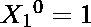
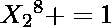
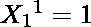
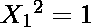
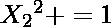
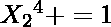
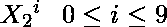

# 手机数字小键盘问题|设置 2

> 原文:[https://www . geesforgeks . org/mobile-数字键-问题集-2/](https://www.geeksforgeeks.org/mobile-numeric-keypad-problem-set-2/)

给定移动数字键盘。您只能按下当前按钮的向上、向左、向右或向下按钮，或者可以选择再次按下同一个按钮。圆角按钮(即*和#)是无效的移动。


给定一个数字 **N** ，你必须找到长度 N 的不同数字，你可以从 0-9 之间的任何一个数字开始拨号，条件是你只能从你最后按下的数字开始向上、向左、向右或向下移动，或者你可以选择再次按下同一个按钮。

**示例:**

> **输入:** N = 1
> **输出:** 10
> 0、1、2、3、4、5、6、7、8、9 是可能的数字。
> 
> **输入:** N = 2
> **输出:** 36
> 所有可能的数字都是 00，08，11，12，14，21，22，23，25，…
> 
> **输入:**N = 6
> T3】输出: 7990

**进场:**我们看到了很多解决这个问题的方案[这里](https://www.geeksforgeeks.org/mobile-numeric-keypad-problem/)。

让 **X <sub>n</sub> <sup>i</sup>** 成为以 **i** 结尾的 **n** 位数的个数。
所以，通过这个符号，

> X <sub>1</sub> <sup>0</sup> = 1 即{0}
> X <sub>1</sub> <sup>1</sup> = 1 即{ 1 }
> X<sub>1</sub><sup>2</sup>= 1 即{ 2 }
> X<sub>1</sub><sup>3</sup>= 1 即{3}
> 和
> X<sub>2<sup>0</sup></sub>

中心思想是，如果你知道 **X <sub>n</sub> <sup>i</sup>** ，你能得到哪些关于**X<sub>n+1</sub>T9】jT11】的信息**

让我们借助一个例子来看看:

> 假设我们知道， **X <sub>2</sub> <sup>1</sup> = 3** 它们是 **{11，21，41}**
> 因为所有这些数字的最后一位数字是 **1** ，让我们看看从 **1** 我们可以有哪些可能的招式:
> 
> 1.  再次按 1。
> 2.  按 2(向右移动)。
> 3.  按 4(向下移动)
> 
> 现在我们可以从我们的集合 **{11，21，41}** 中选择任何元素，并进行任何有效的移动:
> 
> 1.  {111，211，411}可以通过第一步实现。
> 2.  {112，212，412}随着第二次移动。
> 3.  第三个是{114，214，414}。

我们可以看到，做任何可能的移动，我们每次移动都会得到相同大小的集合。也就是说，在以 1 结尾的两位数集合中有 3 个元素，我们得到了从 1 开始的每个可能的移动的相同大小(3)的集合。

所以，可以看到 X <sub>2</sub> <sup>1</sup> 贡献了如下 3 位数:

> X<sub>3</sub>T2】1+= X<sub>2</sub>T6】1T8】X<sub>3</sub>T11】2+= X<sub>2</sub>T15】1T17】X<sub>3</sub>T20】4+= X<sub>2</sub>T24】1

所以，一般来说，如果我们知道 X <sub>n</sub> <sup>i</sup> ，我们就知道它对 X <sub>n+1</sub> <sup>j</sup> 的贡献数，其中 j 是从 I

的每一个可能的移动，其中 0 < =j < =9，从 j 我们可以有一个有效的 to i

其思想是首先枚举每个给定键的所有可能方向，并维护一个 10 个元素的数组，其中每个索引处的元素存储以该索引结尾的数字计数。
例如，数组的初始值为:

> 数值 1 1 1 1 1 1 1 1 1
> 指数 0 1 2 3 4 5 6 7 8 9

n = 1 的初始结果是数组中所有元素的和，即 1+1+1+1+1+1+1+1+1+1+1 = 10，可以拨打 10 个 1 位数的号码。

**如何更新 n > 1 的数组？**
我们先来列举所有给定数字的所有方向:

> 8
> 
> | 【从 | 【可能的移动】到 |
> | --- | --- |
> | 【0】 |
> | 【6】 | 【6，3，5，9】 |
> |  | 【7，4，8】 |

上面列出的表格的第一行表明，如果数字的最后一位是零，我们可以移动到 0 或 8。
让我们详细看看 N = 2 的方法

> 对于 N = 1，Arr[10]是{1，1，1，1，1，1，1，1，1}表示存在以索引 i
> 
> 结尾的 Arr[i]数字让我们创建一个新数组，比如 Arr2[10] = {0，0，0，0，0，0，0，0，0，0}
> 现在，对于 0，可能的移动是 0 和 8。
> 我们已经知道
> 
> 会对{0，8}贡献 1，即
> 
> 
> arr 2[10]= {1，0，0，0，0，0，0，1，0}
> 对于 1，可能的移动是 1，2，4
> 我们已经知道
> 
> 会对{ 1，2，4}贡献 1，即
>  可能的招式有 2、1、3、4
> 我们已经知道
> 
> 会对{2、1、3、4 }
> 
> 
> 
> 
> 贡献 1 arr 2【10】= { 1、2、2、1、0、0、1、0}
> 等等。
> Arr2[10] = {2，3，4，3，4，5，4，3，5，3 }
> Sum = 2+3+4+3+4+5+4+3+5+3 = 36(对于 N=2)
> Arr2 现在保存了的值，可以认为是 n=3 的起点，过程继续。

下面是上述方法的实现:

## C++

```
// C++ implementation of the approach
#include <iostream>
#include <list>
using namespace std;
#define MAX 10

// Function to return the count of numbers possible
int getCount(int n)
{
    // Array of list storing possible direction
    // for each number from 0 to 9
    // mylist[i] stores possible moves from index i
    list<int> mylist[MAX];

    // Initializing list
    mylist[0].assign({ 0, 8 });
    mylist[1].assign({ 1, 2, 4 });
    mylist[2].assign({ 2, 1, 3, 5 });
    mylist[3].assign({ 3, 6, 2 });
    mylist[4].assign({ 4, 1, 7, 5 });
    mylist[5].assign({ 5, 4, 6, 2, 8 });
    mylist[6].assign({ 6, 3, 5, 9 });
    mylist[7].assign({ 7, 4, 8 });
    mylist[8].assign({ 8, 5, 0, 7, 9 });
    mylist[9].assign({ 9, 6, 8 });

    // Storing values for n = 1
    int Arr[MAX] = { 1, 1, 1, 1, 1, 1, 1, 1, 1, 1 };

    for (int i = 2; i <= n; i++) {

        // To store the values for n = i
        int Arr2[MAX] = { 0 };

        // Loop to iterate through each index
        for (int j = 0; j < MAX; j++) {

            // For each move possible from j
            // Increment the value of possible
            // move positions by Arr[j]
            for (int x : mylist[j]) {
                Arr2[x] += Arr[j];
            }
        }

        // Update Arr[] for next iteration
        for (int j = 0; j < MAX; j++)
            Arr[j] = Arr2[j];
    }

    // Find the count of numbers possible
    int sum = 0;
    for (int i = 0; i < MAX; i++)
        sum += Arr[i];

    return sum;
}

// Driver code
int main()
{
    int n = 2;

    cout << getCount(n);

    return 0;
}
```

## Java 语言(一种计算机语言，尤用于创建网站)

```
// Java implementation of the approach
class GFG
{
    static int MAX = 10;

    // Function to return the count of numbers possible
    static int getCount(int n)
    {
        // Array of list storing possible direction
        // for each number from 0 to 9
        // list[i] stores possible moves from index i

        int [][] list = new int[MAX][];

        // Initializing list
        list[0] = new int [] { 0, 8 };
        list[1] = new int [] { 1, 2, 4 };
        list[2] = new int [] { 2, 1, 3, 5 };
        list[3] = new int [] { 3, 6, 2 };
        list[4] = new int [] { 4, 1, 7, 5 };
        list[5] = new int [] { 5, 4, 6, 2, 8 };
        list[6] = new int [] { 6, 3, 5, 9 };
        list[7] = new int [] { 7, 4, 8 };
        list[8] = new int [] { 8, 5, 0, 7, 9 };
        list[9] = new int [] { 9, 6, 8 };

        // Storing values for n = 1
        int Arr[] = new int [] { 1, 1, 1, 1, 1, 1, 1, 1, 1, 1 };

        for (int i = 2; i <= n; i++)
        {

            // To store the values for n = i
            int Arr2[] = new int [MAX];

            // Loop to iterate through each index
            for (int j = 0; j < MAX; j++)
            {

                // For each move possible from j
                // Increment the value of possible
                // move positions by Arr[j]
                for (int x = 0; x < list[j].length; x++)
                {
                    Arr2[list[j][x]] += Arr[j];
                }
            }

            // Update Arr[] for next iteration
            for (int j = 0; j < MAX; j++)
                Arr[j] = Arr2[j];
        }

        // Find the count of numbers possible
        int sum = 0;
        for (int i = 0; i < MAX; i++)
            sum += Arr[i];

        return sum;
    }

    // Driver code
    public static void main (String[] args)
    {

        int n = 2;

        System.out.println(getCount(n));
    }
}

// This code is contributed by ihritik
```

## C#

```
// C# implementation of the approach
using System;

class GFG
{
    static int MAX = 10;

    // Function to return the count of numbers possible
    static int getCount(int n)
    {
        // Array of list storing possible direction
        // for each number from 0 to 9
        // list[i] stores possible moves from index i
        int [][] list = new int[MAX][];

        // Initializing list
        list[0] = new int [] { 0, 8 };
        list[1] = new int [] { 1, 2, 4 };
        list[2] = new int [] { 2, 1, 3, 5 };
        list[3] = new int [] { 3, 6, 2 };
        list[4] = new int [] { 4, 1, 7, 5 };
        list[5] = new int [] { 5, 4, 6, 2, 8 };
        list[6] = new int [] { 6, 3, 5, 9 };
        list[7] = new int [] { 7, 4, 8 };
        list[8] = new int [] { 8, 5, 0, 7, 9 };
        list[9] = new int [] { 9, 6, 8 };

        // Storing values for n = 1
        int [] Arr = new int [] { 1, 1, 1, 1, 1, 1, 1, 1, 1, 1 };

        for (int i = 2; i <= n; i++)
        {

            // To store the values for n = i
            int [] Arr2 = new int [MAX];

            // Loop to iterate through each index
            for (int j = 0; j < MAX; j++)
            {

                // For each move possible from j
                // Increment the value of possible
                // move positions by Arr[j]
                for (int x = 0; x < list[j].Length; x++)
                {
                    Arr2[list[j][x]] += Arr[j];
                }
            }

            // Update Arr[] for next iteration
            for (int j = 0; j < MAX; j++)
                Arr[j] = Arr2[j];
        }

        // Find the count of numbers possible
        int sum = 0;
        for (int i = 0; i < MAX; i++)
            sum += Arr[i];

        return sum;
    }

    // Driver code
    public static void Main ()
    {

        int n = 2;

        Console.WriteLine(getCount(n));
    }
}

// This code is contributed by ihritik
```

**Output:** 

```
36
```

**时间复杂度:**O(N)
T3】空间复杂度: O(1)