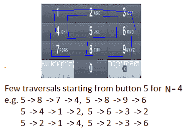

# 手机数字小键盘问题

> 原文:[https://www . geesforgeks . org/mobile-数字键-问题/](https://www.geeksforgeeks.org/mobile-numeric-keypad-problem/)

给定移动数字键盘。您只能按下当前按钮的上、左、右或下按钮。不允许按下底部行的角按钮(即*和#)。


给定一个数 N，找出给定长度的可能数的个数。
**例如:**
对于 N=1，可能的数的数目是 10 (0，1，2，3，…。，9)
对于 N=2，可能的数字数将是 36
可能的数字:00，08 11，12，14 22，21，23，25 等等。
如果从 0 开始，有效数字将是 00，08(计数:2)
如果从 1 开始，有效数字将是 11，12，14(计数:3)
如果从 2 开始，有效数字将是 22，21，23，25(计数:4)
如果从 3 开始，有效数字将是 33，32，36(计数:3)
如果从 4 开始，有效数字将是 44，41，

N = 1 是平凡的情况，可能数字的个数是 10 (0，1，2，3，…，9)
对于 N > 1，我们需要从某个按钮开始，然后移动到四个方向(上、左、右或下)中的任何一个，这将导致一个有效的按钮(不应该转到*，#)。继续这样做，直到获得 N 个长度数(深度优先遍历)。

**递归解决方案:**
移动键盘是一个 4X3 的矩形网格(4 行 3 列)
假设 Count(i，j，N)代表从位置(I，j)开始的 N 个长度数字的计数

```
If N = 1
  Count(i, j, N) = 10  
Else
  Count(i, j, N) = Sum of all Count(r, c, N-1) where (r, c) is new 
                   position after valid move of length 1 from current 
                   position (i, j)
```

下面是上述递归公式的实现。

## C++

```
// A Naive Recursive C program to count number of possible numbers
// of given length
#include <stdio.h>

// left, up, right, down move from current location
int row[] = {0, 0, -1, 0, 1};
int col[] = {0, -1, 0, 1, 0};

// Returns count of numbers of length n starting from key position
// (i, j) in a numeric keyboard.
int getCountUtil(char keypad[][3], int i, int j, int n)
{
    if (keypad == NULL || n <= 0)
        return 0;

    // From a given key, only one number is possible of length 1
    if (n == 1)
        return 1;

    int k=0, move=0, ro=0, co=0, totalCount = 0;

    // move left, up, right, down from current location and if
    // new location is valid, then get number count of length
    // (n-1) from that new position and add in count obtained so far
    for (move=0; move<5; move++)
    {
        ro = i + row[move];
        co = j + col[move];
        if (ro >= 0 && ro <= 3 && co >=0 && co <= 2 &&
           keypad[ro][co] != '*' && keypad[ro][co] != '#')
        {
            totalCount += getCountUtil(keypad, ro, co, n-1);
        }
    }

    return totalCount;
}

// Return count of all possible numbers of length n
// in a given numeric keyboard
int getCount(char keypad[][3], int n)
{
    // Base cases
    if (keypad == NULL || n <= 0)
        return 0;
    if (n == 1)
        return 10;

    int i=0, j=0, totalCount = 0;
    for (i=0; i<4; i++)  // Loop on keypad row
    {
        for (j=0; j<3; j++)   // Loop on keypad column
        {
            // Process for 0 to 9 digits
            if (keypad[i][j] != '*' && keypad[i][j] != '#')
            {
                // Get count when number is starting from key
                // position (i, j) and add in count obtained so far
                totalCount += getCountUtil(keypad, i, j, n);
            }
        }
    }
    return totalCount;
}

// Driver program to test above function
int main(int argc, char *argv[])
{
   char keypad[4][3] = {{'1','2','3'},
                        {'4','5','6'},
                        {'7','8','9'},
                        {'*','0','#'}};
   printf("Count for numbers of length %d: %dn", 1, getCount(keypad, 1));
   printf("Count for numbers of length %d: %dn", 2, getCount(keypad, 2));
   printf("Count for numbers of length %d: %dn", 3, getCount(keypad, 3));
   printf("Count for numbers of length %d: %dn", 4, getCount(keypad, 4));
   printf("Count for numbers of length %d: %dn", 5, getCount(keypad, 5));

   return 0;
}
```

## Java 语言(一种计算机语言，尤用于创建网站)

```
// A Naive Recursive Java program
// to count number of possible
// numbers of given length
class GfG
{

// left, up, right, down
// move from current location
static int row[] = {0, 0, -1, 0, 1};
static int col[] = {0, -1, 0, 1, 0};

// Returns count of numbers of length
// n starting from key position
// (i, j) in a numeric keyboard.
static int getCountUtil(char keypad[][],
                        int i, int j, int n)
{
    if (keypad == null || n <= 0)
        return 0;

    // From a given key, only one
    // number is possible of length 1
    if (n == 1)
        return 1;

    int k = 0, move = 0, ro = 0, co = 0, totalCount = 0;

    // move left, up, right, down
    // from current location and if
    // new location is valid, then
    // get number count of length
    // (n-1) from that new position
    // and add in count obtained so far
    for (move=0; move<5; move++)
    {
        ro = i + row[move];
        co = j + col[move];
        if (ro >= 0 && ro <= 3 && co >=0 && co <= 2 &&
        keypad[ro][co] != '*' && keypad[ro][co] != '#')
        {
            totalCount += getCountUtil(keypad, ro, co, n - 1);
        }
    }
    return totalCount;
}

// Return count of all possible numbers of length n
// in a given numeric keyboard
static int getCount(char keypad[][], int n)
{
    // Base cases
    if (keypad == null || n <= 0)
        return 0;
    if (n == 1)
        return 10;

    int i = 0, j = 0, totalCount = 0;
    for (i = 0; i < 4; i++) // Loop on keypad row
    {
        for (j=0; j<3; j++) // Loop on keypad column
        {
            // Process for 0 to 9 digits
            if (keypad[i][j] != '*' && keypad[i][j] != '#')
            {
                // Get count when number is starting from key
                // position (i, j) and add in count obtained so far
                totalCount += getCountUtil(keypad, i, j, n);
            }
        }
    }
    return totalCount;
}

// Driver code
public static void main(String[] args)
{
    char keypad[][] = {{'1','2','3'},
                        {'4','5','6'},
                        {'7','8','9'},
                        {'*','0','#'}};
    System.out.printf("Count for numbers of"+
                    " length %d: %d", 1, getCount(keypad, 1));
    System.out.printf("\nCount for numbers of" +
                    "length %d: %d", 2, getCount(keypad, 2));
    System.out.printf("\nCount for numbers of" +
                    "length %d: %d", 3, getCount(keypad, 3));
    System.out.printf("\nCount for numbers of" +
                    "length %d: %d", 4, getCount(keypad, 4));
    System.out.printf("\nCount for numbers of" +
                    "length %d: %d", 5, getCount(keypad, 5));
}
}

// This code has been contributed by 29AjayKumar
```

## 蟒蛇 3

```
# A Naive Recursive Python program to count number of possible numbers
# of given length

# left, up, right, down move from current location
row = [0, 0, -1, 0, 1]
col = [0, -1, 0, 1, 0]

# Returns count of numbers of length n starting from key position
# (i, j) in a numeric keyboard.
def getCountUtil(keypad, i, j, n):
    if (keypad == None or n <= 0):
        return 0

    # From a given key, only one number is possible of length 1
    if (n == 1):
        return 1
    k = 0
    move = 0
    ro = 0
    co = 0
    totalCount = 0

    # move left, up, right, down from current location and if
    # new location is valid, then get number count of length
    # (n-1) from that new position and add in count obtained so far
    for move in range(5):
        ro = i + row[move]
        co = j + col[move]
        if (ro >= 0 and ro <= 3 and co >= 0 and co <= 2 and
                keypad[ro][co] != '*' and keypad[ro][co] != '#'):
            totalCount += getCountUtil(keypad, ro, co, n - 1)
    return totalCount

# Return count of all possible numbers of length n
# in a given numeric keyboard
def getCount(keypad, n):

    # Base cases
    if (keypad == None or n <= 0):
        return 0
    if (n == 1):
        return 10
    i = 0
    j = 0
    totalCount = 0
    for i in range(4):  # Loop on keypad row
        for j in range(3):   # Loop on keypad column

            # Process for 0 to 9 digits
            if (keypad[i][j] != '*' and keypad[i][j] != '#'):

              # Get count when number is starting from key
                # position (i, j) and add in count obtained so far
                totalCount += getCountUtil(keypad, i, j, n)
    return totalCount

# Driver code
keypad = [['1', '2', '3'],
          ['4', '5', '6'],
          ['7', '8', '9'],
          ['*', '0', '#']]
print("Count for numbers of length 1:", getCount(keypad, 1))
print("Count for numbers of length 2:", getCount(keypad, 2))
print("Count for numbers of length 3:", getCount(keypad, 3))
print("Count for numbers of length 4:", getCount(keypad, 4))
print("Count for numbers of length 5:", getCount(keypad, 5))

# This code is contributed by subhammahato348
```

## C#

```
// A Naive Recursive C# program
// to count number of possible
// numbers of given length
using System;

class GfG
{

// left, up, right, down
// move from current location
static int []row = {0, 0, -1, 0, 1};
static int []col = {0, -1, 0, 1, 0};

// Returns count of numbers of length
// n starting from key position
// (i, j) in a numeric keyboard.
static int getCountUtil(char [,]keypad,
                        int i, int j, int n)
{
    if (keypad == null || n <= 0)
        return 0;

    // From a given key, only one
    // number is possible of length 1
    if (n == 1)
        return 1;

    int k = 0, move = 0, ro = 0, co = 0, totalCount = 0;

    // move left, up, right, down
    // from current location and if
    // new location is valid, then
    // get number count of length
    // (n-1) from that new position
    // and add in count obtained so far
    for (move=0; move<5; move++)
    {
        ro = i + row[move];
        co = j + col[move];
        if (ro >= 0 && ro <= 3 && co >=0 && co <= 2 &&
        keypad[ro,co] != '*' && keypad[ro,co] != '#')
        {
            totalCount += getCountUtil(keypad, ro, co, n - 1);
        }
    }
    return totalCount;
}

// Return count of all possible numbers of length n
// in a given numeric keyboard
static int getCount(char [,]keypad, int n)
{
    // Base cases
    if (keypad == null || n <= 0)
        return 0;
    if (n == 1)
        return 10;

    int i = 0, j = 0, totalCount = 0;
    for (i = 0; i < 4; i++) // Loop on keypad row
    {
        for (j = 0; j < 3; j++) // Loop on keypad column
        {
            // Process for 0 to 9 digits
            if (keypad[i, j] != '*' && keypad[i, j] != '#')
            {
                // Get count when number is starting from key
                // position (i, j) and add in count obtained so far
                totalCount += getCountUtil(keypad, i, j, n);
            }
        }
    }
    return totalCount;
}

// Driver code
public static void Main()
{
    char [,]keypad = {{'1','2','3'},
                        {'4','5','6'},
                        {'7','8','9'},
                        {'*','0','#'}};
    Console.Write("Count for numbers of"+
                    " length {0}: {1}", 1, getCount(keypad, 1));
    Console.Write("\nCount for numbers of" +
                    "length {0}: {1}", 2, getCount(keypad, 2));
    Console.Write("\nCount for numbers of" +
                    "length {0}: {1}", 3, getCount(keypad, 3));
    Console.Write("\nCount for numbers of" +
                    "length {0}: {1}", 4, getCount(keypad, 4));
    Console.Write("\nCount for numbers of" +
                    "length {0}: {1}", 5, getCount(keypad, 5));
}
}

/* This code contributed by PrinciRaj1992 */
```

## 服务器端编程语言（Professional Hypertext Preprocessor 的缩写）

```
<?php
// A Naive Recursive PHP program
// to count number of possible
// numbers of given length
// left, up, right, down
// move from current location
// static $row = array(0, 0, -1, 0, 1);
//static $col = array(0, -1, 0, 1, 0);

// Returns count of numbers of length
// n starting from key position
// (i, j) in a numeric keyboard.
function getCountUtil($keypad,
                        $i, $j, $n)
{
    static $row= array(0,0,-1,0,1);
    static $col= array(0,-1,0,1,0);
    if ($keypad == null || $n <= 0)
        return 0;

    // From a given key, only one
    // number is possible of length 1
    if ($n == 1)
        return 1;

    $k = 0; $move = 0; $ro = 0; $co = 0; $totalCount = 0;

    // move left, up, right, down
    // from current location and if
    // new location is valid, then
    // get number count of length
    // (n-1) from that new position
    // and add in count obtained so far
    for ($move = 0; $move < 5; $move++)
    {
        $ro = $i + $row[$move];
        $co = $j + $col[$move];
        if ($ro >= 0 && $ro <= 3 && $co >=0 && $co <= 2 &&
        $keypad[$ro][$co] != '*' && $keypad[$ro][$co] != '#')
        {
            $totalCount += getCountUtil($keypad, $ro, $co, $n - 1);
        }
    }
    return $totalCount;
}

// Return count of all possible numbers of length n
// in a given numeric keyboard
function getCount($keypad, $n)
{
    // Base cases
    if ($keypad == null || $n <= 0)
        return 0;
    if ($n == 1)
        return 10;

    $i = 0; $j = 0; $totalCount = 0;
    for ($i = 0; $i < 4; $i++) // Loop on keypad row
    {
        for ($j = 0; $j < 3; $j++) // Loop on keypad column
        {
            // Process for 0 to 9 digits
            if ($keypad[$i][$j] != '*' && $keypad[$i][$j] != '#')
            {
                // Get count when number is starting from key
                // position (i, j) and add in count obtained so far
                $totalCount += getCountUtil($keypad, $i, $j, $n);
            }
        }
    }
    return $totalCount;
}

// Driver code
{
    $keypad = array(array('1','2','3'),
                        array('4','5','6'),
                        array('7','8','9'),
                        array('*','0','#'));
    echo("Count for numbers of"." length". getCount($keypad, 1));
    echo("\nCount for numbers of" .
                    " length ". getCount($keypad, 2));
    echo("\nCount for numbers of" .
                    " length ".getCount($keypad, 3));
    echo("\nCount for numbers of" .
                    " length ".getCount($keypad, 4));
    echo("\nCount for numbers of" .
                    " length ".getCount($keypad, 5));
}

// This code has been contributed by Code_Mech.
```

## java 描述语言

```
<script>

// A Naive Recursive Javascript program
// to count number of possible
// numbers of given length

    // left, up, right, down
    // move from current location
    let row=[0, 0, -1, 0, 1];
    let col=[0, -1, 0, 1, 0];

    // Returns count of numbers of length
    // n starting from key position
    // (i, j) in a numeric keyboard.
    function getCountUtil(keypad,i,j,n)
    {
        if (keypad == null || n <= 0)
        {return 0;}

        // From a given key, only one
        // number is possible of length 1
        if (n == 1)
            return 1;

        let k = 0, move = 0, ro = 0, co = 0, totalCount = 0;

        // move left, up, right, down
        // from current location and if
        // new location is valid, then
        // get number count of length
        // (n-1) from that new position
        // and add in count obtained so far
        for (move=0; move<5; move++)
        {
            ro = i + row[move];
            co = j + col[move];
            if (ro >= 0 && ro <= 3 && co >=0 && co <= 2 &&
            keypad[ro][co] != '*' && keypad[ro][co] != '#')
            {
                totalCount += getCountUtil(keypad, ro, co, n - 1);
            }
        }
        return totalCount;
    }

    // Return count of all possible numbers of length n
    // in a given numeric keyboard 
    function getCount(keypad,n)
    {
        // Base cases
        if (keypad == null || n <= 0)
            return 0;
        if (n == 1)
            return 10;

        let i = 0, j = 0, totalCount = 0;
        for (i = 0; i < 4; i++) // Loop on keypad row
        {
            for (j=0; j<3; j++) // Loop on keypad column
            {
                // Process for 0 to 9 digits
                if (keypad[i][j] != '*' && keypad[i][j] != '#')
                {
                    // Get count when number is starting from key
                    // position (i, j) and add in count obtained so far
                    totalCount += getCountUtil(keypad, i, j, n);
                }
            }
        }
        return totalCount;
    }

    // Driver code
    let keypad=[['1','2','3'],['4','5','6'],['7','8','9'],['*','0','#']];
    document.write("Count for numbers of"+
                    " length ", 1,": ", getCount(keypad, 1));
    document.write("<br>Count for numbers of" +
                    "length ", 2,": ", getCount(keypad, 2));
    document.write("<br>Count for numbers of" +
                    "length ", 3,": ", getCount(keypad, 3));
    document.write("<br>Count for numbers of" +
                    "length ", 4,": ", getCount(keypad, 4));
    document.write("<br>Count for numbers of" +
                    "length ", 5,": ", getCount(keypad, 5));

    // This code is contributed by avanitrachhadiya2155

</script>
```

**输出:**

```
Count for numbers of length 1: 10
Count for numbers of length 2: 36
Count for numbers of length 3: 138
Count for numbers of length 4: 532
Count for numbers of length 5: 2062
```

**动态规划**
在较小的路径上有很多重复的遍历(较小 N 的遍历)来寻找所有可能的较长路径(较大 N 的遍历)。例如，请参见下面两个图表。在这个遍历中，对于从两个起始位置(按钮‘4’和‘8’)开始的 N = 4，我们可以看到对于 N = 2 的重复遍历很少(例如 4 - > 1，6 - > 3，8 - > 9，8 - > 7 等)。




由于该问题具有两个性质:[最优子结构](https://www.geeksforgeeks.org/dynamic-programming-set-2-optimal-substructure-property/)和[重叠子问题](https://www.geeksforgeeks.org/dynamic-programming-set-1/)，因此可以使用动态规划来有效地解决该问题。

下面是动态编程实现的程序。

## C++

```
// A Dynamic Programming based C program to count number of
// possible numbers of given length
#include <stdio.h>

// Return count of all possible numbers of length n
// in a given numeric keyboard
int getCount(char keypad[][3], int n)
{
    if(keypad == NULL || n <= 0)
        return 0;
    if(n == 1)
        return 10;

    // left, up, right, down move from current location
    int row[] = {0, 0, -1, 0, 1};
    int col[] = {0, -1, 0, 1, 0};

    // taking n+1 for simplicity - count[i][j] will store
    // number count starting with digit i and length j
    int count[10][n+1];
    int i=0, j=0, k=0, move=0, ro=0, co=0, num = 0;
    int nextNum=0, totalCount = 0;

    // count numbers starting with digit i and of lengths 0 and 1
    for (i=0; i<=9; i++)
    {
        count[i][0] = 0;
        count[i][1] = 1;
    }

    // Bottom up - Get number count of length 2, 3, 4, ... , n
    for (k=2; k<=n; k++)
    {
        for (i=0; i<4; i++)  // Loop on keypad row
        {
            for (j=0; j<3; j++)   // Loop on keypad column
            {
                // Process for 0 to 9 digits
                if (keypad[i][j] != '*' && keypad[i][j] != '#')
                {
                    // Here we are counting the numbers starting with
                    // digit keypad[i][j] and of length k keypad[i][j]
                    // will become 1st digit, and we need to look for
                    // (k-1) more digits
                    num = keypad[i][j] - '0';
                    count[num][k] = 0;

                    // move left, up, right, down from current location
                    // and if new location is valid, then get number
                    // count of length (k-1) from that new digit and
                    // add in count we found so far
                    for (move=0; move<5; move++)
                    {
                        ro = i + row[move];
                        co = j + col[move];
                        if (ro >= 0 && ro <= 3 && co >=0 && co <= 2 &&
                           keypad[ro][co] != '*' && keypad[ro][co] != '#')
                        {
                            nextNum = keypad[ro][co] - '0';
                            count[num][k] += count[nextNum][k-1];
                        }
                    }
                }
            }
        }
    }

    // Get count of all possible numbers of length "n" starting
    // with digit 0, 1, 2, ..., 9
    totalCount = 0;
    for (i=0; i<=9; i++)
        totalCount += count[i][n];
    return totalCount;
}

// Driver program to test above function
int main(int argc, char *argv[])
{
   char keypad[4][3] = {{'1','2','3'},
                        {'4','5','6'},
                        {'7','8','9'},
                        {'*','0','#'}};
   printf("Count for numbers of length %d: %dn", 1, getCount(keypad, 1));
   printf("Count for numbers of length %d: %dn", 2, getCount(keypad, 2));
   printf("Count for numbers of length %d: %dn", 3, getCount(keypad, 3));
   printf("Count for numbers of length %d: %dn", 4, getCount(keypad, 4));
   printf("Count for numbers of length %d: %dn", 5, getCount(keypad, 5));

   return 0;
}
```

## Java 语言(一种计算机语言，尤用于创建网站)

```
// A Dynamic Programming based Java program to
// count number of possible numbers of given length
class GFG
{

// Return count of all possible numbers of length n
// in a given numeric keyboard
static int getCount(char keypad[][], int n)
{
    if(keypad == null || n <= 0)
        return 0;
    if(n == 1)
        return 10;

    // left, up, right, down move from current location
    int row[] = {0, 0, -1, 0, 1};
    int col[] = {0, -1, 0, 1, 0};

    // taking n+1 for simplicity - count[i][j] will store
    // number count starting with digit i and length j
    int [][]count = new int[10][n + 1];
    int i = 0, j = 0, k = 0, move = 0,
             ro = 0, co = 0, num = 0;
    int nextNum = 0, totalCount = 0;

    // count numbers starting with digit i
    // and of lengths 0 and 1
    for (i = 0; i <= 9; i++)
    {
        count[i][0] = 0;
        count[i][1] = 1;
    }

    // Bottom up - Get number count of length 2, 3, 4, ... , n
    for (k = 2; k <= n; k++)
    {
        for (i = 0; i < 4; i++) // Loop on keypad row
        {
            for (j = 0; j < 3; j++) // Loop on keypad column
            {
                // Process for 0 to 9 digits
                if (keypad[i][j] != '*' &&
                    keypad[i][j] != '#')
                {
                    // Here we are counting the numbers starting with
                    // digit keypad[i][j] and of length k keypad[i][j]
                    // will become 1st digit, and we need to look for
                    // (k-1) more digits
                    num = keypad[i][j] - '0';
                    count[num][k] = 0;

                    // move left, up, right, down from current location
                    // and if new location is valid, then get number
                    // count of length (k-1) from that new digit and
                    // add in count we found so far
                    for (move = 0; move < 5; move++)
                    {
                        ro = i + row[move];
                        co = j + col[move];
                        if (ro >= 0 && ro <= 3 && co >= 0 &&
                            co <= 2 && keypad[ro][co] != '*' &&
                                       keypad[ro][co] != '#')
                        {
                            nextNum = keypad[ro][co] - '0';
                            count[num][k] += count[nextNum][k - 1];
                        }
                    }
                }
            }
        }
    }

    // Get count of all possible numbers of length "n"
    // starting with digit 0, 1, 2, ..., 9
    totalCount = 0;
    for (i = 0; i <= 9; i++)
        totalCount += count[i][n];
    return totalCount;
}

// Driver Code
public static void main(String[] args)
{
    char keypad[][] = {{'1','2','3'},
                       {'4','5','6'},
                       {'7','8','9'},
                       {'*','0','#'}};
    System.out.printf("Count for numbers of length %d: %d\n", 1,
                                           getCount(keypad, 1));
    System.out.printf("Count for numbers of length %d: %d\n", 2,
                                           getCount(keypad, 2));
    System.out.printf("Count for numbers of length %d: %d\n", 3,
                                           getCount(keypad, 3));
    System.out.printf("Count for numbers of length %d: %d\n", 4,
                                           getCount(keypad, 4));
    System.out.printf("Count for numbers of length %d: %d\n", 5,
                                           getCount(keypad, 5));
}
}

// This code is contributed by Rajput-Ji
```

## 蟒蛇 3

```
# A Dynamic Programming based C program to count number of
# possible numbers of given length

# Return count of all possible numbers of length n
# in a given numeric keyboard
def getCount(keypad, n):
    if (keypad == None or n <= 0):
        return 0
    if (n == 1):
        return 10

    # left, up, right, down move from current location
    row = [0, 0, -1, 0, 1]
    col = [0, -1, 0, 1, 0]

    # taking n+1 for simplicity - count[i][j] will store
    # number count starting with digit i and length j
    # count[10][n+1]
    count = [[0]*(n + 1)]*10
    i = 0
    j = 0
    k = 0
    move = 0
    ro = 0
    co = 0
    num = 0
    nextNum = 0
    totalCount = 0

    # count numbers starting with
    # digit i and of lengths 0 and 1
    for i in range(10):
        count[i][0] = 0
        count[i][1] = 1

    # Bottom up - Get number
    # count of length 2, 3, 4, ... , n
    for k in range(2, n + 1):
        for i in range(4):  # Loop on keypad row
            for j in range(3):   # Loop on keypad column

                # Process for 0 to 9 digits
                if (keypad[i][j] != '*' and keypad[i][j] != '#'):

                    # Here we are counting the numbers starting with
                    # digit keypad[i][j] and of length k keypad[i][j]
                    # will become 1st digit, and we need to look for
                    # (k-1) more digits
                    num = ord(keypad[i][j]) - 48
                    count[num][k] = 0

                    # move left, up, right, down from current location
                    # and if new location is valid, then get number
                    # count of length (k-1) from that new digit and
                    # add in count we found so far
                    for move in range(5):
                        ro = i + row[move]
                        co = j + col[move]
                        if (ro >= 0 and ro <= 3 and co >= 0 and co <= 2 and
                                keypad[ro][co] != '*' and keypad[ro][co] != '#'):
                            nextNum = ord(keypad[ro][co]) - 48
                            count[num][k] += count[nextNum][k - 1]

    # Get count of all possible numbers of length "n" starting
    # with digit 0, 1, 2, ..., 9
    totalCount = 0
    for i in range(10):
        totalCount += count[i][n]
    return totalCount

# Driver code
if __name__ == "__main__":
    keypad = [['1','2','3'],
            ['4','5','6'],
            ['7','8','9'],
            ['*','0','#']]

    print("Count for numbers of length", 1, ":", getCount(keypad, 1))
    print("Count for numbers of length", 2, ":", getCount(keypad, 2))
    print("Count for numbers of length", 3, ":", getCount(keypad, 3))
    print("Count for numbers of length", 4, ":", getCount(keypad, 4))
    print("Count for numbers of length", 5, ":", getCount(keypad, 5))

    # This code is contributed by subhammahato348
```

## C#

```
// A Dynamic Programming based C# program to
// count number of possible numbers of given Length
using System;

class GFG
{

// Return count of all possible numbers of Length n
// in a given numeric keyboard
static int getCount(char [,]keypad, int n)
{
    if(keypad == null || n <= 0)
        return 0;
    if(n == 1)
        return 10;

    // left, up, right, down move
    // from current location
    int []row = {0, 0, -1, 0, 1};
    int []col = {0, -1, 0, 1, 0};

    // taking n+1 for simplicity - count[i,j]
    // will store number count starting with
    // digit i and.Length j
    int [,]count = new int[10,n + 1];
    int i = 0, j = 0, k = 0, move = 0,
              ro = 0, co = 0, num = 0;
    int nextNum = 0, totalCount = 0;

    // count numbers starting with digit i
    // and of.Lengths 0 and 1
    for (i = 0; i <= 9; i++)
    {
        count[i, 0] = 0;
        count[i, 1] = 1;
    }

    // Bottom up - Get number count of
    // Length 2, 3, 4, ... , n
    for (k = 2; k <= n; k++)
    {
        for (i = 0; i < 4; i++) // Loop on keypad row
        {
            for (j = 0; j < 3; j++) // Loop on keypad column
            {
                // Process for 0 to 9 digits
                if (keypad[i, j] != '*' &&
                    keypad[i, j] != '#')
                {
                    // Here we are counting the numbers starting with
                    // digit keypad[i,j] and of.Length k keypad[i,j]
                    // will become 1st digit, and we need to look for
                    // (k-1) more digits
                    num = keypad[i, j] - '0';
                    count[num, k] = 0;

                    // move left, up, right, down from current location
                    // and if new location is valid, then get number
                    // count of.Length (k-1) from that new digit and
                    //.Add in count we found so far
                    for (move = 0; move < 5; move++)
                    {
                        ro = i + row[move];
                        co = j + col[move];
                        if (ro >= 0 && ro <= 3 && co >= 0 &&
                            co <= 2 && keypad[ro, co] != '*' &&
                                       keypad[ro, co] != '#')
                        {
                            nextNum = keypad[ro, co] - '0';
                            count[num, k] += count[nextNum, k - 1];
                        }
                    }
                }
            }
        }
    }

    // Get count of all possible numbers of.Length "n"
    // starting with digit 0, 1, 2, ..., 9
    totalCount = 0;
    for (i = 0; i <= 9; i++)
        totalCount += count[i, n];
    return totalCount;
}

// Driver Code
public static void Main(String[] args)
{
    char [,]keypad = {{'1', '2', '3'},
                      {'4', '5', '6'},
                      {'7', '8', '9'},
                      {'*', '0', '#'}};
    Console.Write("Count for numbers of.Length {0}: {1}\n", 1,
                                        getCount(keypad, 1));
    Console.Write("Count for numbers of.Length {0}: {1}\n", 2,
                                        getCount(keypad, 2));
    Console.Write("Count for numbers of.Length {0}: {1}\n", 3,
                                        getCount(keypad, 3));
    Console.Write("Count for numbers of.Length {0}: {1}\n", 4,
                                        getCount(keypad, 4));
    Console.Write("Count for numbers of.Length {0}: {1}\n", 5,
                                        getCount(keypad, 5));
}
}

// This code is contributed by Rajput-Ji
```

## java 描述语言

```
<script>

// A Dynamic Programming based Javascript program to
// count number of possible numbers of given length

// Return count of all possible numbers of length n
// in a given numeric keyboard
function getCount(keypad, n)
{
    if (keypad == null || n <= 0)
        return 0;

    if (n == 1)
        return 10;

    // left, up, right, down move
    // from current location   
    let row = [ 0, 0, -1, 0, 1 ];
    let col = [ 0, -1, 0, 1, 0 ];

    // Taking n+1 for simplicity - count[i][j]
    // will store number count starting with
    // digit i and length j
    let count = new Array(10);
    for(let i = 0; i < 10; i++)
    {
        count[i] = new Array(n + 1);
        for(let j = 0; j < n + 1; j++)
        {
            count[i][j] = 0;
        }
    }

    let i = 0, j = 0, k = 0, move = 0,
         ro = 0, co = 0, num = 0;
    let nextNum = 0, totalCount = 0;

    // count numbers starting with digit i
    // and of lengths 0 and 1
    for(i = 0; i <= 9; i++)
    {
        count[i][0] = 0;
        count[i][1] = 1;
    }

    // Bottom up - Get number count
    // of length 2, 3, 4, ... , n
    for(k = 2; k <= n; k++)
    {

        // Loop on keypad row
        for(i = 0; i < 4; i++)
        {

            // Loop on keypad column
            for(j = 0; j < 3; j++)
            {

                // Process for 0 to 9 digits
                if (keypad[i][j] != '*' &&
                    keypad[i][j] != '#')
                {

                    // Here we are counting the numbers starting with
                    // digit keypad[i][j] and of length k keypad[i][j]
                    // will become 1st digit, and we need to look for
                    // (k-1) more digits
                    num = keypad[i][j].charCodeAt(0) -
                                   '0'.charCodeAt(0);
                    count[num][k] = 0;

                    // Move left, up, right, down from current location
                    // and if new location is valid, then get number
                    // count of length (k-1) from that new digit and
                    // add in count we found so far
                    for(move = 0; move < 5; move++)
                    {
                        ro = i + row[move];
                        co = j + col[move];
                        if (ro >= 0 && ro <= 3 && co >= 0 &&
                            co <= 2 && keypad[ro][co] != '*' &&
                                       keypad[ro][co] != '#')
                        {
                            nextNum = keypad[ro][co].charCodeAt(0) -
                                                 '0'.charCodeAt(0);
                            count[num][k] += count[nextNum][k - 1];
                        }
                    }
                }
            }
        }
    }

    // Get count of all possible numbers of length "n"
    // starting with digit 0, 1, 2, ..., 9
    totalCount = 0;
    for(i = 0; i <= 9; i++)
        totalCount += count[i][n];

    return totalCount;

}

// Driver Code
let keypad = [ [ '1','2','3' ],
               [ '4','5','6' ],
               [ '7','8','9' ],
               [ '*','0','#' ] ];

document.write("Count for numbers of length " +
         1 + " : " + getCount(keypad, 1) + "<br>")
document.write("Count for numbers of length " +
         2 + " : " + getCount(keypad, 2) + "<br>")
document.write("Count for numbers of length " +
         3 + " : " + getCount(keypad, 3) + "<br>")
document.write("Count for numbers of length " +
         4 + " : " + getCount(keypad, 4) + "<br>")
document.write("Count for numbers of length " +
         5 + " : " + getCount(keypad, 5) + "<br>")

// This code is contributed by rag2127

</script>
```

**输出:**

```
Count for numbers of length 1: 10
Count for numbers of length 2: 36
Count for numbers of length 3: 138
Count for numbers of length 4: 532
Count for numbers of length 5: 2062
```

**一个空间优化的解决方案:**
上述动态规划方法也在 O(n)个时间内运行，并且需要 O(n)个辅助空间，因为只有一个用于循环运行 n 次，其他用于循环运行恒定时间。我们可以看到，第 n 次迭代只需要来自第(n-1)次迭代的数据，所以我们不需要保留来自旧迭代的数据。我们可以有一个空间高效的动态编程方法，只有两个大小为 10 的数组。感谢 Nik 提出这个解决方案。

## C++

```
// A Space Optimized C++ program to count number of possible numbers
// of given length
#include <bits/stdc++.h>
using namespace std;

// Return count of all possible numbers of length n
// in a given numeric keyboard
int getCount(char keypad[][3], int n)
{
    if (keypad == NULL || n <= 0)
        return 0;
    if (n == 1)
        return 10;

    // odd[i], even[i] arrays represent count of numbers starting
    // with digit i for any length j
    int odd[10], even[10];
    int i = 0, j = 0, useOdd = 0, totalCount = 0;

    for (i = 0; i <= 9; i++)
        odd[i] = 1; // for j = 1

    for (j = 2; j <= n; j++) // Bottom Up calculation from j = 2 to n
    {
        useOdd = 1 - useOdd;

        // Here we are explicitly writing lines for each number 0
        // to 9\. But it can always be written as DFS on 4X3 grid
        // using row, column array valid moves
        if (useOdd == 1)
        {
            even[0] = odd[0] + odd[8];
            even[1] = odd[1] + odd[2] + odd[4];
            even[2] = odd[2] + odd[1] + odd[3] + odd[5];
            even[3] = odd[3] + odd[2] + odd[6];
            even[4] = odd[4] + odd[1] + odd[5] + odd[7];
            even[5] = odd[5] + odd[2] + odd[4] + odd[8] + odd[6];
            even[6] = odd[6] + odd[3] + odd[5] + odd[9];
            even[7] = odd[7] + odd[4] + odd[8];
            even[8] = odd[8] + odd[0] + odd[5] + odd[7] + odd[9];
            even[9] = odd[9] + odd[6] + odd[8];
        }
        else
        {
            odd[0] = even[0] + even[8];
            odd[1] = even[1] + even[2] + even[4];
            odd[2] = even[2] + even[1] + even[3] + even[5];
            odd[3] = even[3] + even[2] + even[6];
            odd[4] = even[4] + even[1] + even[5] + even[7];
            odd[5] = even[5] + even[2] + even[4] + even[8] + even[6];
            odd[6] = even[6] + even[3] + even[5] + even[9];
            odd[7] = even[7] + even[4] + even[8];
            odd[8] = even[8] + even[0] + even[5] + even[7] + even[9];
            odd[9] = even[9] + even[6] + even[8];
        }
    }

    // Get count of all possible numbers of length "n" starting
    // with digit 0, 1, 2, ..., 9
    totalCount = 0;
    if (useOdd == 1)
    {
        for (i = 0; i <= 9; i++)
            totalCount += even[i];
    }
    else
    {
        for (i = 0; i <= 9; i++)
            totalCount += odd[i];
    }
    return totalCount;
}

// Driver program to test above function
int main()
{
    char keypad[4][3] = {{'1', '2', '3'},
                         {'4', '5', '6'},
                         {'7', '8', '9'},
                         {'*', '0', '#'}};
    cout << "Count for numbers of length 1: " << getCount(keypad, 1) << endl;
    cout << "Count for numbers of length 2: " << getCount(keypad, 2) << endl;
    cout << "Count for numbers of length 3: " << getCount(keypad, 3) << endl;
    cout << "Count for numbers of length 4: " << getCount(keypad, 4) << endl;
    cout << "Count for numbers of length 5: " << getCount(keypad, 5) << endl;

    return 0;
}

//This code is contributed by Mayank Tyagi
```

## C

```
// A Space Optimized C program to count number of possible numbers
// of given length
#include <stdio.h>

// Return count of all possible numbers of length n
// in a given numeric keyboard
int getCount(char keypad[][3], int n)
{
    if(keypad == NULL || n <= 0)
        return 0;
    if(n == 1)
        return 10;

    // odd[i], even[i] arrays represent count of numbers starting
    // with digit i for any length j
    int odd[10], even[10];
    int i = 0, j = 0, useOdd = 0, totalCount = 0;

    for (i=0; i<=9; i++)
        odd[i] = 1;  // for j = 1

    for (j=2; j<=n; j++) // Bottom Up calculation from j = 2 to n
    {
        useOdd = 1 - useOdd;

        // Here we are explicitly writing lines for each number 0
        // to 9\. But it can always be written as DFS on 4X3 grid
        // using row, column array valid moves
        if(useOdd == 1)
        {
            even[0] = odd[0] + odd[8];
            even[1] = odd[1] + odd[2] + odd[4];
            even[2] = odd[2] + odd[1] + odd[3] + odd[5];
            even[3] = odd[3] + odd[2] + odd[6];
            even[4] = odd[4] + odd[1] + odd[5] + odd[7];
            even[5] = odd[5] + odd[2] + odd[4] + odd[8] + odd[6];
            even[6] = odd[6] + odd[3] + odd[5] + odd[9];
            even[7] = odd[7] + odd[4] + odd[8];
            even[8] = odd[8] + odd[0] + odd[5] + odd[7] + odd[9];
            even[9] = odd[9] + odd[6] + odd[8];
        }
        else
        {
            odd[0] = even[0] + even[8];
            odd[1] = even[1] + even[2] + even[4];
            odd[2] = even[2] + even[1] + even[3] + even[5];
            odd[3] = even[3] + even[2] + even[6];
            odd[4] = even[4] + even[1] + even[5] + even[7];
            odd[5] = even[5] + even[2] + even[4] + even[8] + even[6];
            odd[6] = even[6] + even[3] + even[5] + even[9];
            odd[7] = even[7] + even[4] + even[8];
            odd[8] = even[8] + even[0] + even[5] + even[7] + even[9];
            odd[9] = even[9] + even[6] + even[8];
        }
    }

    // Get count of all possible numbers of length "n" starting
    // with digit 0, 1, 2, ..., 9
    totalCount = 0;
    if(useOdd == 1)
    {
        for (i=0; i<=9; i++)
            totalCount += even[i];
    }
    else
    {
        for (i=0; i<=9; i++)
            totalCount += odd[i];
    }
    return totalCount;
}

// Driver program to test above function
int main()
{
    char keypad[4][3] = {{'1','2','3'},
        {'4','5','6'},
        {'7','8','9'},
        {'*','0','#'}
    };
    printf("Count for numbers of length %d: %dn", 1, getCount(keypad, 1));
    printf("Count for numbers of length %d: %dn", 2, getCount(keypad, 2));
    printf("Count for numbers of length %d: %dn", 3, getCount(keypad, 3));
    printf("Count for numbers of length %d: %dn", 4, getCount(keypad, 4));
    printf("Count for numbers of length %d: %dn", 5, getCount(keypad, 5));

    return 0;
}
```

## Java 语言(一种计算机语言，尤用于创建网站)

```
// A Space Optimized Java program to
// count number of possible numbers
// of given length
class GFG
{

// Return count of all possible numbers of
// length n in a given numeric keyboard
static int getCount(char keypad[][], int n)
{
    if(keypad == null || n <= 0)
        return 0;
    if(n == 1)
        return 10;

    // odd[i], even[i] arrays represent count of
    // numbers starting with digit i for any length j
    int []odd = new int[10];
    int []even = new int[10];
    int i = 0, j = 0, useOdd = 0, totalCount = 0;

    for (i = 0; i <= 9; i++)
        odd[i] = 1; // for j = 1

    // Bottom Up calculation from j = 2 to n
    for (j = 2; j <= n; j++)
    {
        useOdd = 1 - useOdd;

        // Here we are explicitly writing lines
        // for each number 0 to 9\. But it can always be
        // written as DFS on 4X3 grid using row,
        // column array valid moves
        if(useOdd == 1)
        {
            even[0] = odd[0] + odd[8];
            even[1] = odd[1] + odd[2] + odd[4];
            even[2] = odd[2] + odd[1] +
                      odd[3] + odd[5];
            even[3] = odd[3] + odd[2] + odd[6];
            even[4] = odd[4] + odd[1] +
                      odd[5] + odd[7];
            even[5] = odd[5] + odd[2] + odd[4] +
                               odd[8] + odd[6];
            even[6] = odd[6] + odd[3] +
                      odd[5] + odd[9];
            even[7] = odd[7] + odd[4] + odd[8];
            even[8] = odd[8] + odd[0] + odd[5] +
                               odd[7] + odd[9];
            even[9] = odd[9] + odd[6] + odd[8];
        }
        else
        {
            odd[0] = even[0] + even[8];
            odd[1] = even[1] + even[2] + even[4];
            odd[2] = even[2] + even[1] +
                     even[3] + even[5];
            odd[3] = even[3] + even[2] + even[6];
            odd[4] = even[4] + even[1] +
                     even[5] + even[7];
            odd[5] = even[5] + even[2] + even[4] +
                               even[8] + even[6];
            odd[6] = even[6] + even[3] +
                     even[5] + even[9];
            odd[7] = even[7] + even[4] + even[8];
            odd[8] = even[8] + even[0] + even[5] +
                               even[7] + even[9];
            odd[9] = even[9] + even[6] + even[8];
        }
    }

    // Get count of all possible numbers of
    // length "n" starting with digit 0, 1, 2, ..., 9
    totalCount = 0;
    if(useOdd == 1)
    {
        for (i = 0; i <= 9; i++)
            totalCount += even[i];
    }
    else
    {
        for (i = 0; i <= 9; i++)
            totalCount += odd[i];
    }
    return totalCount;
}

// Driver Code
public static void main(String[] args)
{
    char keypad[][] = {{'1','2','3'},
                       {'4','5','6'},
                       {'7','8','9'},
                       {'*','0','#'}};
    System.out.printf("Count for numbers of length %d: %d\n", 1,
                                           getCount(keypad, 1));
    System.out.printf("Count for numbers of length %d: %d\n", 2,
                                           getCount(keypad, 2));
    System.out.printf("Count for numbers of length %d: %d\n", 3,
                                           getCount(keypad, 3));
    System.out.printf("Count for numbers of length %d: %d\n", 4,
                                           getCount(keypad, 4));
    System.out.printf("Count for numbers of length %d: %d\n", 5,
                                           getCount(keypad, 5));
}
}

// This code is contributed by PrinciRaj1992
```

## 蟒蛇 3

```
# A Space Optimized Python program to count
# number of possible numbers
# of given length

# Return count of all possible numbers
# of length n
# in a given numeric keyboard
def getCount(keypad, n):

    if(not keypad or n <= 0):
        return 0
    if(n == 1):
        return 10

    # odd[i], even[i] arrays represent
    # count of numbers starting
    # with digit i for any length j
    odd = [0]*10
    even = [0]*10
    i = 0
    j = 0
    useOdd = 0
    totalCount = 0

    for i in range(10):
        odd[i] = 1 # for j = 1

    for j in range(2,n+1): # Bottom Up calculation from j = 2 to n

        useOdd = 1 - useOdd

        # Here we are explicitly writing lines for each number 0
        # to 9\. But it can always be written as DFS on 4X3 grid
        # using row, column array valid moves
        if(useOdd == 1):

            even[0] = odd[0] + odd[8]
            even[1] = odd[1] + odd[2] + odd[4]
            even[2] = odd[2] + odd[1] + odd[3] + odd[5]
            even[3] = odd[3] + odd[2] + odd[6]
            even[4] = odd[4] + odd[1] + odd[5] + odd[7]
            even[5] = odd[5] + odd[2] + odd[4] + odd[8] + odd[6]
            even[6] = odd[6] + odd[3] + odd[5] + odd[9]
            even[7] = odd[7] + odd[4] + odd[8]
            even[8] = odd[8] + odd[0] + odd[5] + odd[7] + odd[9]
            even[9] = odd[9] + odd[6] + odd[8]

        else:

            odd[0] = even[0] + even[8]
            odd[1] = even[1] + even[2] + even[4]
            odd[2] = even[2] + even[1] + even[3] + even[5]
            odd[3] = even[3] + even[2] + even[6]
            odd[4] = even[4] + even[1] + even[5] + even[7]
            odd[5] = even[5] + even[2] + even[4] + even[8] + even[6]
            odd[6] = even[6] + even[3] + even[5] + even[9]
            odd[7] = even[7] + even[4] + even[8]
            odd[8] = even[8] + even[0] + even[5] + even[7] + even[9]
            odd[9] = even[9] + even[6] + even[8]

    # Get count of all possible numbers of length "n" starting
    # with digit 0, 1, 2, ..., 9
    totalCount = 0
    if(useOdd == 1):
        for i in range(10):
            totalCount += even[i]

    else:
        for i in range(10):
            totalCount += odd[i]

    return totalCount

# Driver program to test above function
if __name__ == "__main__":
    keypad = [['1','2','3'],
            ['4','5','6'],
            ['7','8','9'],
            ['*','0','#']]

    print("Count for numbers of length ",1,": ", getCount(keypad, 1))
    print("Count for numbers of length ",2,": ", getCount(keypad, 2))
    print("Count for numbers of length ",3,": ", getCount(keypad, 3))
    print("Count for numbers of length ",4,": ", getCount(keypad, 4))
    print("Count for numbers of length ",5,": ", getCount(keypad, 5))

# This code is contributed by
# ChitraNayal
```

## C#

```
// A Space Optimized C# program to
// count number of possible numbers
// of given length
using System;

class GFG
{

// Return count of all possible numbers of
// length n in a given numeric keyboard
static int getCount(char [,]keypad, int n)
{
    if(keypad == null || n <= 0)
        return 0;
    if(n == 1)
        return 10;

    // odd[i], even[i] arrays represent count of
    // numbers starting with digit i for any length j
    int []odd = new int[10];
    int []even = new int[10];
    int i = 0, j = 0, useOdd = 0, totalCount = 0;

    for (i = 0; i <= 9; i++)
        odd[i] = 1; // for j = 1

    // Bottom Up calculation from j = 2 to n
    for (j = 2; j <= n; j++)
    {
        useOdd = 1 - useOdd;

        // Here we are explicitly writing lines
        // for each number 0 to 9\. But it can always be
        // written as DFS on 4X3 grid using row,
        // column array valid moves
        if(useOdd == 1)
        {
            even[0] = odd[0] + odd[8];
            even[1] = odd[1] + odd[2] + odd[4];
            even[2] = odd[2] + odd[1] +
                      odd[3] + odd[5];
            even[3] = odd[3] + odd[2] + odd[6];
            even[4] = odd[4] + odd[1] +
                      odd[5] + odd[7];
            even[5] = odd[5] + odd[2] + odd[4] +
                               odd[8] + odd[6];
            even[6] = odd[6] + odd[3] +
                      odd[5] + odd[9];
            even[7] = odd[7] + odd[4] + odd[8];
            even[8] = odd[8] + odd[0] + odd[5] +
                               odd[7] + odd[9];
            even[9] = odd[9] + odd[6] + odd[8];
        }
        else
        {
            odd[0] = even[0] + even[8];
            odd[1] = even[1] + even[2] + even[4];
            odd[2] = even[2] + even[1] +
                     even[3] + even[5];
            odd[3] = even[3] + even[2] + even[6];
            odd[4] = even[4] + even[1] +
                     even[5] + even[7];
            odd[5] = even[5] + even[2] + even[4] +
                               even[8] + even[6];
            odd[6] = even[6] + even[3] +
                     even[5] + even[9];
            odd[7] = even[7] + even[4] + even[8];
            odd[8] = even[8] + even[0] + even[5] +
                               even[7] + even[9];
            odd[9] = even[9] + even[6] + even[8];
        }
    }

    // Get count of all possible numbers of
    // length "n" starting with digit 0, 1, 2, ..., 9
    totalCount = 0;
    if(useOdd == 1)
    {
        for (i = 0; i <= 9; i++)
            totalCount += even[i];
    }
    else
    {
        for (i = 0; i <= 9; i++)
            totalCount += odd[i];
    }
    return totalCount;
}

// Driver Code
public static void Main(String[] args)
{
    char [,]keypad = {{'1','2','3'},
                      {'4','5','6'},
                      {'7','8','9'},
                      {'*','0','#'}};
    Console.Write("Count for numbers of length {0}: {1}\n", 1,
                                        getCount(keypad, 1));
    Console.Write("Count for numbers of length {0}: {1}\n", 2,
                                        getCount(keypad, 2));
    Console.Write("Count for numbers of length {0}: {1}\n", 3,
                                        getCount(keypad, 3));
    Console.Write("Count for numbers of length {0}: {1}\n", 4,
                                        getCount(keypad, 4));
    Console.Write("Count for numbers of length {0}: {1}\n", 5,
                                        getCount(keypad, 5));
}
}

// This code is contributed by 29AjayKumar
```

## java 描述语言

```
<script>

// A Space Optimized javascript program to
// count number of possible numbers
// of given length

// Return count of all possible numbers of
// length n in a given numeric keyboard
function getCount(keypad , n)
{
    if(keypad == null || n <= 0)
        return 0;
    if(n == 1)
        return 10;

    // odd[i], even[i] arrays represent count of
    // numbers starting with digit i for any length j
    var odd = Array.from({length: 10}, (_, i) => 0);
    var even = Array.from({length: 10}, (_, i) => 0);
    var i = 0, j = 0, useOdd = 0, totalCount = 0;

    for (i = 0; i <= 9; i++)
        odd[i] = 1; // for j = 1

    // Bottom Up calculation from j = 2 to n
    for (j = 2; j <= n; j++)
    {
        useOdd = 1 - useOdd;

        // Here we are explicitly writing lines
        // for each number 0 to 9\. But it can always be
        // written as DFS on 4X3 grid using row,
        // column array valid moves
        if(useOdd == 1)
        {
            even[0] = odd[0] + odd[8];
            even[1] = odd[1] + odd[2] + odd[4];
            even[2] = odd[2] + odd[1] +
                      odd[3] + odd[5];
            even[3] = odd[3] + odd[2] + odd[6];
            even[4] = odd[4] + odd[1] +
                      odd[5] + odd[7];
            even[5] = odd[5] + odd[2] + odd[4] +
                               odd[8] + odd[6];
            even[6] = odd[6] + odd[3] +
                      odd[5] + odd[9];
            even[7] = odd[7] + odd[4] + odd[8];
            even[8] = odd[8] + odd[0] + odd[5] +
                               odd[7] + odd[9];
            even[9] = odd[9] + odd[6] + odd[8];
        }
        else
        {
            odd[0] = even[0] + even[8];
            odd[1] = even[1] + even[2] + even[4];
            odd[2] = even[2] + even[1] +
                     even[3] + even[5];
            odd[3] = even[3] + even[2] + even[6];
            odd[4] = even[4] + even[1] +
                     even[5] + even[7];
            odd[5] = even[5] + even[2] + even[4] +
                               even[8] + even[6];
            odd[6] = even[6] + even[3] +
                     even[5] + even[9];
            odd[7] = even[7] + even[4] + even[8];
            odd[8] = even[8] + even[0] + even[5] +
                               even[7] + even[9];
            odd[9] = even[9] + even[6] + even[8];
        }
    }

    // Get count of all possible numbers of
    // length "n" starting with digit 0, 1, 2, ..., 9
    totalCount = 0;
    if(useOdd == 1)
    {
        for (i = 0; i <= 9; i++)
            totalCount += even[i];
    }
    else
    {
        for (i = 0; i <= 9; i++)
            totalCount += odd[i];
    }
    return totalCount;
}

// Driver Code

var keypad = [['1','2','3'],
                   ['4','5','6'],
                   ['7','8','9'],
                   ['*','0','#']];

document.write("Count for numbers of length "+ 1+": "+
                                       getCount(keypad, 1));
document.write("<br>Count for numbers of length  "+ 2+": "+
                                       getCount(keypad, 2));
document.write("<br>Count for numbers of length "+ 3+": "+
                                       getCount(keypad, 3));
document.write("<br>Count for numbers of length "+ 4+": "+
                                       getCount(keypad, 4));
document.write("<br>Count for numbers of length "+ 5+": "+
                                       getCount(keypad, 5));

// This code is contributed by 29AjayKumar

</script>
```

**输出:**

```
Count for numbers of length 1: 10
Count for numbers of length 2: 36
Count for numbers of length 3: 138
Count for numbers of length 4: 532
Count for numbers of length 5: 2062
```

本文由**阿努拉格·辛格**供稿。如果你发现任何不正确的地方，或者你想分享更多关于上面讨论的话题的信息，请写评论。