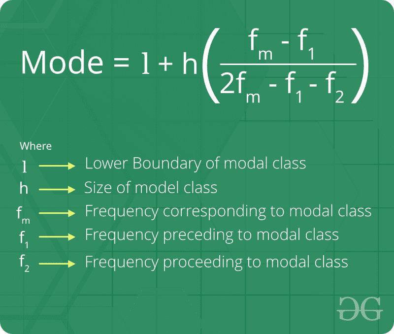

# 模式

> 原文:[https://www.geeksforgeeks.org/mode/](https://www.geeksforgeeks.org/mode/)

模式是在一组观察中最频繁出现的值。例如，{6，3，9，6，6，5，9，3}模式是 6，因为它出现的频率最高。

**关于模式的事实:**

1.  有时可以有多种模式。有两种模式称为*双峰*。有两种以上模式的称为*多模式*。
2.  均值、中位数和众数之间存在经验关系。
    **均值–模式= 3【均值–中位数】**

## 蟒蛇 3

```
import numpy as np
from scipy import stats

l1 = [12, 15, 12, 78, 54, 56, 45, 45, 18, 19, 12, 35, 67, 48, 9, 2, 45, 68]
print(f"List: {l1}")
print(f"Mean: {np.mean(l1)}")
print(f"Median: {np.median(l1)}")
print(f"Mode: {stats.mode(l1)[0]}")

lhs = np.mean(l1) - stats.mode(l1)[0]
rhs = 3 * (np.mean(l1) - np.median(l1))

print(f"LHS == RHS: {lhs == rhs}")
```

1.  模式对于定性数据很有用。
2.  模式可以用图形定位。
3.  模式可以在开放式频率表中计算。
4.  模式不受极大或极小值的影响。

**分组数据模式公式:**



**如何找到模式？**
**天真解:**
给定一个 *n* 大小的未排序数组，使用[计数排序](https://www.geeksforgeeks.org/counting-sort/)技巧找到中位数和模式。当数组元素在有限的范围内时，这很有用。

**示例:**

```
Input : array a[] = {1, 1, 1, 2, 7, 1}
Output : Mode = 1

Input : array a[] = {9, 9, 9, 9, 9}
Output : Mode = 9       
```

*   辅助(计数)数组在对其之前的计数求和之前，c[]:
    索引:0 1 2 3 4 5 6 7 8 9 10
    计数:0 4 1 0 0 1 0 0 0 0 0 0
*   Mode =具有最大计数值的索引。
    模式= 1(上例)

**方法:**
假设输入数组的大小为 **n** :
**步骤#1:** 取计数数组，然后将其先前的计数加到下一个索引中。
**步骤#2:** 存储最大值的索引是给定数据的模式。
**第三步:**如果有多个最大值的索引，都是模式的结果，所以我们可以取任意一个。
**步骤#4:** 将该索引处的值存储在一个名为模式的单独变量中。

下面是实现:

## C++

```
// C++ Program for Mode using
// Counting Sort technique
#include <bits/stdc++.h>
using namespace std;

// Function that sort input array a[] and
// calculate mode and median using counting
// sort.
void printMode(int a[], int n)
{
    // The output array b[] will
    // have sorted array
    int b[n];

    // variable to store max of
    // input array which will
    // to have size of count array
    int max = *max_element(a, a + n);

    // auxiliary(count) array to
    // store count. Initialize
    // count array as 0\. Size
    // of count array will be
    // equal to (max + 1).
    int t = max + 1;
    int count[t];
    for (int i = 0; i < t; i++)
        count[i] = 0;

    // Store count of each element
    // of input array
    for (int i = 0; i < n; i++)
        count[a[i]]++;

    // mode is the index with maximum count
    int mode = 0;
    int k = count[0];
    for (int i = 1; i < t; i++) {
        if (count[i] > k) {
            k = count[i];
            mode = i;
        }
    }

    cout << "mode = " << mode;
}

// Driver Code
int main()
{
    int a[] = { 1, 4, 1, 2, 7, 1, 2, 5, 3, 6 };
    int n = sizeof(a) / sizeof(a[0]);
    printMode(a, n);
    return 0;
}
```

## Java 语言(一种计算机语言，尤用于创建网站)

```
// Java Program for Mode using
// Counting Sort technique
import java.util.Arrays;

class GFG
{

    // Function that sort input array a[] and
    // calculate mode and median using counting
    // sort.
    static void printMode(int[] a, int n)
    {
        // The output array b[] will
        // have sorted array
        //int []b = new int[n];

        // variable to store max of
        // input array which will
        // to have size of count array
        int max = Arrays.stream(a).max().getAsInt();

        // auxiliary(count) array to
        // store count. Initialize
        // count array as 0\. Size
        // of count array will be
        // equal to (max + 1).
        int t = max + 1;
        int[] count = new int[t];
        for (int i = 0; i < t; i++)
        {
            count[i] = 0;
        }

        // Store count of each element
        // of input array
        for (int i = 0; i < n; i++)
        {
            count[a[i]]++;
        }

        // mode is the index with maximum count
        int mode = 0;
        int k = count[0];
        for (int i = 1; i < t; i++)
        {
            if (count[i] > k)
            {
                k = count[i];
                mode = i;
            }
        }

        System.out.println("mode = " + mode);
    }

    // Driver Code
    public static void main(String[] args)
    {
        int[] a = {1, 4, 1, 2, 7, 1, 2, 5, 3, 6};
        int n = a.length;
        printMode(a, n);
    }
}

// This code is contributed by Rajput-Ji
```

## 蟒蛇 3

```
# Python3 Program for Mode using
# Counting Sort technique

# Function that sort input array a[] and
# calculate mode and median using counting
# sort.
def printMode(a, n) :

    # variable to store max of
    # input array which will
    # to have size of count array
    max_element = max(a)

    # auxiliary(count) array to store count.
    # Initialize count array as 0\. Size
    # of count array will be equal to (max + 1).
    t = max_element + 1
    count = [0] * t

    for i in range(t) :
        count[i] = 0

    # Store count of each element
    # of input array
    for i in range(n) :
        count[a[i]] += 1

    # mode is the index with maximum count
    mode = 0
    k = count[0]
    for i in range(1, t) :
        if (count[i] > k) :
            k = count[i]
            mode = i

    print("mode = ", mode)

# Driver Code
if __name__ == "__main__" :

    a = [ 1, 4, 1, 2, 7,
          1, 2, 5, 3, 6 ]
    n = len(a)
    printMode(a, n)

# This code is contributed by Ryuga
```

## C#

```
// C# Program for Mode using
// Counting Sort technique
using System;
using System.Linq;
public class GFG{

// Function that sort input array a[] and
// calculate mode and median using counting
// sort.
 static void printMode(int []a, int n)
{
    // The output array b[] will
    // have sorted array
    //int []b = new int[n];

    // variable to store max of
    // input array which will
    // to have size of count array
    int max =a.Max();

    // auxiliary(count) array to
    // store count. Initialize
    // count array as 0\. Size
    // of count array will be
    // equal to (max + 1).
    int t = max + 1;
    int []count = new int[t];
    for (int i = 0; i < t; i++)
        count[i] = 0;

    // Store count of each element
    // of input array
    for (int i = 0; i < n; i++)
        count[a[i]]++;

    // mode is the index with maximum count
    int mode = 0;
    int k = count[0];
    for (int i = 1; i < t; i++) {
        if (count[i] > k) {
            k = count[i];
            mode = i;
        }
    }

    Console.WriteLine( "mode = " + mode);
}

// Driver Code

    static public void Main (){
    int []a = { 1, 4, 1, 2, 7, 1, 2, 5, 3, 6 };
    int n =a.Length;
    printMode(a, n);
    }
}
// This code is contributed by inder_verma
```

## java 描述语言

```
<script>
    // Javascript Program for Mode using Counting Sort technique

    // Function that sort input array a[] and
    // calculate mode and median using counting
    // sort.
      function printMode(a, n)
    {

        // The output array b[] will
        // have sorted array
        //int []b = new int[n];

        // variable to store max of
        // input array which will
        // to have size of count array
        let max = Number.MIN_VALUE;

        for (let i = 0; i < a.length; i++)
        {
            max = Math.max(max, a[i]);
        }

        // auxiliary(count) array to
        // store count. Initialize
        // count array as 0\. Size
        // of count array will be
        // equal to (max + 1).
        let t = max + 1;
        let count = new Array(t);
        for (let i = 0; i < t; i++)
            count[i] = 0;

        // Store count of each element
        // of input array
        for (let i = 0; i < n; i++)
            count[a[i]]++;

        // mode is the index with maximum count
        let mode = 0;
        let k = count[0];
        for (let i = 1; i < t; i++) {
            if (count[i] > k) {
                k = count[i];
                mode = i;
            }
        }

        document.write( "mode = " + mode);
    }

    let a = [ 1, 4, 1, 2, 7, 1, 2, 5, 3, 6 ];
    let n =a.length;
    printMode(a, n);

     // This code is contributed by surehs07.
</script>
```

**输出:**

```
mode = 1
```

**时间复杂度** = O(N + P)，其中 N 为输入数组的大小，P 为计数数组的大小或输入数组中的最大值。
**辅助空间** = O(P)，其中 P 的值为辅助阵的大小。
当数组元素值较小时，上述解决方案效果良好。请参考下面的帖子，了解高效的解决方案。
[数组中最常见的元素](https://www.geeksforgeeks.org/frequent-element-array/)

**与模式相关的基本程序:**

*   [在没有库的 Python 中查找平均值、中值、模式](https://www.geeksforgeeks.org/finding-mean-median-mode-in-python-without-libraries/)
*   [使用计数排序的中值和模式](https://www.geeksforgeeks.org/median-and-mode-using-counting-sort/)