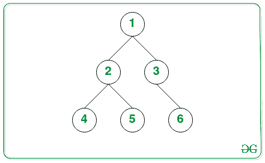
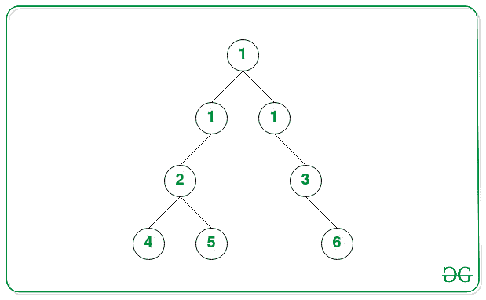

# 通过在指定级别添加一级给定值的节点来修改二叉树

> 原文:[https://www . geeksforgeeks . org/通过在指定级别添加具有给定值的节点级别来修改二叉树/](https://www.geeksforgeeks.org/modify-a-binary-tree-by-adding-a-level-of-nodes-with-given-value-at-a-specified-level/)

给定一个由 **N** 节点和两个整数 **K** 和 **L** 组成的[二叉树](https://www.geeksforgeeks.org/binary-tree-data-structure/)，任务是在**L**级添加一行值为 **K** 的节点，这样原树的方向保持不变。

**示例:**

> **输入:** K = 1，L = 2
> 
> 
> 
> **输出:**
> 1
> 1 1
> 2 3
> 4 5 6
> **说明:**
> 下图为 K(= 2)级插入值为 1 的节点后的树。
> 
> 
> 
> **输入:** K = 1，L = 1
> 
> 
> 
> **输出:**T2 1
> 1
> 2 3
> 4 5 6

**方法:**使用[广度优先搜索](https://www.geeksforgeeks.org/breadth-first-traversal-for-a-graph/)遍历树，在**(L–1)**级的节点与其左右子树的根之间添加给定值的节点，即可解决给定的问题。按照以下步骤解决问题:

*   如果 **L** 为 **1** ，则用值 **K** 创建新节点，然后在新节点左侧加入**当前根**，使新节点成为根节点。
*   初始化一个[队列](https://www.geeksforgeeks.org/queue-data-structure/)，说 **Q** ，用来[使用 BFS 遍历树。](https://www.geeksforgeeks.org/level-order-tree-traversal/)
*   初始化一个变量，比如**current level**，它存储一个节点的当前级别。
*   当 [**Q** 不为空()](https://www.geeksforgeeks.org/data-structure-gq/queue-gq/)和 **CurrLevel** 小于**(L–1)**时迭代，执行以下步骤:
    *   将队列的大小 **Q** 存储在一个变量中，比如 **len** 。
    *   当 **len** 大于 **0** 时迭代，然后 [**弹出队列的前元素**](https://www.geeksforgeeks.org/queuepush-and-queuepop-in-cpp-stl/) ，推送 **Q** 中的左右子树。
    *   将**电流等级**的值增加 **1** 。
*   现在再次迭代当[**Q** 不为空时()](https://www.geeksforgeeks.org/data-structure-gq/queue-gq/)并执行以下步骤:
    *   将 **Q** 的前节点存储在一个变量中，比如**温度**，弹出前元素。
    *   将 **temp** 节点的左右子树存储在变量中，分别说 **temp1** 和 **temp2** 。
    *   用值 **K** 创建一个新节点，然后通过将节点值分配给**温度左侧**将当前节点连接到节点**温度**左侧
    *   再次创建一个值为 **K** 的新节点，然后通过将节点值分配给**temp right**将当前节点连接到节点 **temp** 右侧。
    *   然后将新节点左边的 **temp1** 即 **temp 左**和新节点右边的 **temp2** 即 **temp 右**连接起来
*   完成以上步骤后，[按层级顺序遍历](https://www.geeksforgeeks.org/level-order-tree-traversal/)打印树。

下面是上述方法的实现:

## C++

```
// C++ program for the above approach
#include <bits/stdc++.h>

using namespace std;

// Class of TreeNode
struct TreeNode {
    int val;
    TreeNode *left;
    TreeNode *right;

  // Constructor
    TreeNode(int v)
    {
        val = v;
        left = right = NULL;
    }
};

// Function to add one row to a
// binary tree
TreeNode *addOneRow(TreeNode *root, int K, int L)
{
    // If L is 1
    if (L == 1) {

        // Store the node having
        // the value K
        TreeNode *t = new TreeNode(K);

        // Join node t with the
        // root node
        t->left = root;
        return t;
    }

    // Stores the current Level
    int currLevel = 1;

    // For performing BFS traversal
    queue<TreeNode*> Q;

    // Add root node to Queue Q
    Q.push(root);

    // Traversal while currLevel
    // is less than L - 1
    while (Q.size() > 0 && currLevel < L - 1)
    {

        // Stores the count of the
        // total nodes at the
        // currLevel
        int len = Q.size();

        // Iterate while len
        // is greater than 0
        while (len > 0)
        {

            // Pop the front
            // element of Q
            TreeNode *node = Q.front();
            Q.pop();

            // If node.left is
            // not NULL
            if (node->left != NULL)
                Q.push(node->left);

            // If node.right is
            // not NULL
            if (node->right != NULL)
                Q.push(node->right);

            // Decrement len by 1
            len--;
        }

        // Increment currLevel by 1
        currLevel++;
    }

    // Iterate while Q is
    // non empty()
    while (Q.size() > 0)
    {

        // Stores the front node
        // of the Q queue
        TreeNode *temp = Q.front();
        Q.pop();

        // Stores its left sub-tree
        TreeNode *temp1 = temp->left;

        // Create a new Node with
        // value K and assign to
        // temp.left
        temp->left = new TreeNode(K);

        // Assign temp1 to the
        // temp.left.left
        temp->left->left = temp1;

        // Store its right subtree
        TreeNode *temp2 = temp->right;

        // Create a new Node with
        // value K and assign to
        // temp.right
        temp->right = new TreeNode(K);

        // Assign temp2 to the
        // temp.right.right
        temp->right->right = temp2;
    }

    // Return the updated root
    return root;
}

// Function to print the tree in
// the level order traversal
void levelOrder(TreeNode *root)
{
    queue<TreeNode*> Q;

    if (root == NULL) {
        cout<<("Null")<<endl;
        return;
    }

    // Add root node to Q
    Q.push(root);

    while (Q.size() > 0) {

        // Stores the total nodes
        // at current level
        int len = Q.size();

        // Iterate while len
        // is greater than 0
        while (len > 0) {

            // Stores the front Node
            TreeNode *temp = Q.front();
            Q.pop();

            // Print the value of
            // the current node
            cout << temp->val << " ";

            // If reference to left
            // subtree is not NULL
            if (temp->left != NULL)

                // Add root of left
                // subtree to Q
                Q.push(temp->left);

            // If reference to right
            // subtree is not NULL
            if (temp->right != NULL)

                // Add root of right
                // subtree to Q
                Q.push(temp->right);

            // Decrement len by 1
            len--;
        }

        cout << endl;
    }
}

// Driver Code
int main()
{

    // Given Tree
    TreeNode *root = new TreeNode(1);
    root->left = new TreeNode(2);
    root->left->left = new TreeNode(4);
    root->left->right = new TreeNode(5);
    root->right = new TreeNode(3);
    root->right->right = new TreeNode(6);

    int L = 2;
    int K = 1;

    levelOrder(addOneRow(root, K, L));
}

// This code is contributed by mohit kumar 29.
```

## Java 语言(一种计算机语言，尤用于创建网站)

```
// Java program for the above approach

import java.io.*;
import java.util.*;

class GFG {

    // Class of TreeNode
    public static class TreeNode {
        int val;
        TreeNode left;
        TreeNode right;
        TreeNode() {}

        // Constructor
        TreeNode(int val)
        {
            this.val = val;
        }
    }

    // Function to add one row to a
    // binary tree
    public static TreeNode addOneRow(
        TreeNode root, int K, int L)
    {
        // If L is 1
        if (L == 1) {

            // Store the node having
            // the value K
            TreeNode t = new TreeNode(K);

            // Join node t with the
            // root node
            t.left = root;
            return t;
        }

        // Stores the current Level
        int currLevel = 1;

        // For performing BFS traversal
        Queue<TreeNode> Q
            = new LinkedList<TreeNode>();

        // Add root node to Queue Q
        Q.add(root);

        // Traversal while currLevel
        // is less than L - 1
        while (!Q.isEmpty()
               && currLevel < L - 1) {

            // Stores the count of the
            // total nodes at the
            // currLevel
            int len = Q.size();

            // Iterate while len
            // is greater than 0
            while (len > 0) {

                // Pop the front
                // element of Q
                TreeNode node = Q.poll();

                // If node.left is
                // not null
                if (node.left != null)
                    Q.add(node.left);

                // If node.right is
                // not null
                if (node.right != null)
                    Q.add(node.right);

                // Decrement len by 1
                len--;
            }

            // Increment currLevel by 1
            currLevel++;
        }

        // Iterate while Q is
        // non empty()
        while (!Q.isEmpty()) {

            // Stores the front node
            // of the Q queue
            TreeNode temp = Q.poll();

            // Stores its left sub-tree
            TreeNode temp1 = temp.left;

            // Create a new Node with
            // value K and assign to
            // temp.left
            temp.left = new TreeNode(K);

            // Assign temp1 to the
            // temp.left.left
            temp.left.left = temp1;

            // Store its right subtree
            TreeNode temp2 = temp.right;

            // Create a new Node with
            // value K and assign to
            // temp.right
            temp.right = new TreeNode(K);

            // Assign temp2 to the
            // temp.right.right
            temp.right.right = temp2;
        }

        // Return the updated root
        return root;
    }

    // Function to print the tree in
    // the level order traversal
    public static void levelOrder(
        TreeNode root)
    {
        Queue<TreeNode> Q
            = new LinkedList<>();

        if (root == null) {
            System.out.println("Null");
            return;
        }

        // Add root node to Q
        Q.add(root);

        while (!Q.isEmpty()) {

            // Stores the total nodes
            // at current level
            int len = Q.size();

            // Iterate while len
            // is greater than 0
            while (len > 0) {

                // Stores the front Node
                TreeNode temp = Q.poll();

                // Print the value of
                // the current node
                System.out.print(
                    temp.val + " ");

                // If reference to left
                // subtree is not null
                if (temp.left != null)

                    // Add root of left
                    // subtree to Q
                    Q.add(temp.left);

                // If reference to right
                // subtree is not null
                if (temp.right != null)

                    // Add root of right
                    // subtree to Q
                    Q.add(temp.right);

                // Decrement len by 1
                len--;
            }

            System.out.println();
        }
    }

    // Driver Code
    public static void main(String[] args)
    {
        // Given Tree
        TreeNode root = new TreeNode(1);
        root.left = new TreeNode(2);
        root.left.left = new TreeNode(4);
        root.left.right = new TreeNode(5);
        root.right = new TreeNode(3);
        root.right.right = new TreeNode(6);

        int L = 2;
        int K = 1;

        levelOrder(addOneRow(root, K, L));
    }
}
```

## java 描述语言

```
<script>

// JavaScript program for the above approach

// Class of TreeNode
class TreeNode
{
    constructor(val)
    {
        this.val=val;
        this.left=this.right=null;
    }
}

// Function to add one row to a
    // binary tree
function addOneRow(root,K,L)
{
    // If L is 1
        if (L == 1) {

            // Store the node having
            // the value K
            let t = new TreeNode(K);

            // Join node t with the
            // root node
            t.left = root;
            return t;
        }

        // Stores the current Level
        let currLevel = 1;

        // For performing BFS traversal
        let Q =[];

        // Add root node to Queue Q
        Q.push(root);

        // Traversal while currLevel
        // is less than L - 1
        while (Q.length!=0
               && currLevel < L - 1) {

            // Stores the count of the
            // total nodes at the
            // currLevel
            let len = Q.length;

            // Iterate while len
            // is greater than 0
            while (len > 0) {

                // Pop the front
                // element of Q
                let node = Q.shift();

                // If node.left is
                // not null
                if (node.left != null)
                    Q.push(node.left);

                // If node.right is
                // not null
                if (node.right != null)
                    Q.push(node.right);

                // Decrement len by 1
                len--;
            }

            // Increment currLevel by 1
            currLevel++;
        }

        // Iterate while Q is
        // non empty()
        while (Q.length!=0) {

            // Stores the front node
            // of the Q queue
            let temp = Q.shift();

            // Stores its left sub-tree
            let temp1 = temp.left;

            // Create a new Node with
            // value K and assign to
            // temp.left
            temp.left = new TreeNode(K);

            // Assign temp1 to the
            // temp.left.left
            temp.left.left = temp1;

            // Store its right subtree
            let temp2 = temp.right;

            // Create a new Node with
            // value K and assign to
            // temp.right
            temp.right = new TreeNode(K);

            // Assign temp2 to the
            // temp.right.right
            temp.right.right = temp2;
        }

        // Return the updated root
        return root;
}

// Function to print the tree in
    // the level order traversal
function levelOrder(root)
{
    let Q= [];

        if (root == null) {
            document.write("Null<br>");
            return;
        }

        // Add root node to Q
        Q.push(root);

        while (Q.length!=0) {

            // Stores the total nodes
            // at current level
            let len = Q.length;

            // Iterate while len
            // is greater than 0
            while (len > 0) {

                // Stores the front Node
                let temp = Q.shift();

                // Print the value of
                // the current node
                document.write(
                    temp.val + " ");

                // If reference to left
                // subtree is not null
                if (temp.left != null)

                    // Add root of left
                    // subtree to Q
                    Q.push(temp.left);

                // If reference to right
                // subtree is not null
                if (temp.right != null)

                    // Add root of right
                    // subtree to Q
                    Q.push(temp.right);

                // Decrement len by 1
                len--;
            }

            document.write("<br>");
        }
}

// Driver Code
let root = new TreeNode(1);
root.left = new TreeNode(2);
root.left.left = new TreeNode(4);
root.left.right = new TreeNode(5);
root.right = new TreeNode(3);
root.right.right = new TreeNode(6);

let L = 2;
let K = 1;

levelOrder(addOneRow(root, K, L));

// This code is contributed by unknown2108

</script>
```

**Output:** 

```
1 
1 1 
2 3 
4 5 6
```

***时间复杂度:**O(N)*
T5**辅助空间:** O(N)