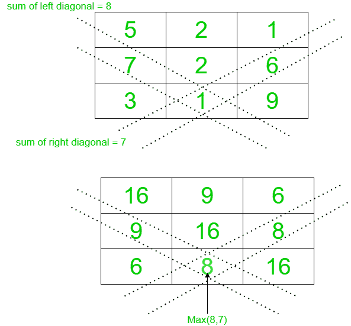

# 通过用矩阵的左对角线和或右对角线和的最大值替换每个元素来修改矩阵

> 原文:[https://www . geesforgeks . org/modify-a-matrix-by-将每个元素替换为其左对角线或右对角线总和的最大值/](https://www.geeksforgeeks.org/modify-a-matrix-by-replacing-each-element-with-the-maximum-of-its-left-or-right-diagonal-sum/)

给定一个矩阵 **mat[][]** ，其维数为 **M * N** ，任务是用其左对角线或右对角线的最大和替换每个矩阵元素。

**示例:**

> **输入:** mat[][] = {{5，2，1}，{7，2，6}，{3，1，9}}
> **输出:**
> 16 9 6
> 9 16 8
> 6 8 16
> **解释:**
> 将每个元素替换为 max(右对角线之和，左对角线之和)。
> 按照下图理解更清楚。
> 
> [](https://media.geeksforgeeks.org/wp-content/uploads/20201226181855/gfg2.png)
> 
> **输入:** mat[][] = {{1，2}，{3，4 } }
> T3】输出:T5】5 5
> 5 5

**方法:**主要思想是基于以下观察的事实:

*   右对角线元素的行和列索引之和相等。
*   左对角线元素的行索引和列索引之间的差异相等。
*   使用以上两个属性，使用[映射](https://www.geeksforgeeks.org/map-associative-containers-the-c-standard-template-library-stl/)存储每个元素的左右对角线之和。
*   [遍历矩阵](https://www.geeksforgeeks.org/traverse-a-given-matrix-using-recursion/)，用左对角线和或右对角线和的最大值替换每个元素。
*   打印获得的最终矩阵。

下面是上述方法的实现:

## C++

```
// C++ program for the above approach
#include <bits/stdc++.h>
using namespace std;

// Function to update given matrix with
// maximum of left and right diagonal sum
void updateMatrix(int mat[][3])
{

  // Stores the total sum
  // of right diagonal
  map<int, int> right;

  // Stores the total sum
  // of left diagonal
  map<int, int> left;

  for (int i = 0; i < 3; i++) {
    for (int j = 0; j < 3; j++) {

      // Update the map storing
      // right diagonal sums
      if (right.find(i + j) == right.end())
        right[i + j] = mat[i][j];
      else
        right[i + j] += mat[i][j];

      // Update the map storing
      // left diagonal sums
      if (left.find(i - j) == left.end())
        left[i - j] = mat[i][j];
      else
        left[i - j] += mat[i][j];
    }
  }

  // Traverse the matrix
  for (int i = 0; i < 3; i++) {
    for (int j = 0; j < 3; j++) {

      // Update the matrix
      mat[i][j] = max(right[i + j], left[i - j]);
    }
  }

  // Print the matrix
  for (int i = 0; i < 3; i++) {
    for (int j = 0; j < 3; j++) {
      cout << mat[i][j] << " ";
    }
    cout << endl;
  }
}

// Driver code
int main()
{
  int mat[][3]
    = { { 5, 2, 1 }, { 7, 2, 6 }, { 3, 1, 9 } };
  updateMatrix(mat);
  return 0;
}

// This code is contributed by ukasp.
```

## Java 语言(一种计算机语言，尤用于创建网站)

```
// Java program for the above approach

// Function to update given matrix with
// maximum of left and right diagonal sum
import java.io.*;
import java.util.*;

class GFG {

    static void updateMatrix(int mat[][])
    {
        Map<Integer, Integer> right
            = new HashMap<Integer, Integer>(); 

        Map<Integer, Integer> left
            = new HashMap<Integer, Integer>();     

        for(int i = 0; i < 3; i++)
    {
        for(int j = 0; j < 3; j++)
        {

            // Update the map storing
            // right diagonal sums
            if (!right.containsKey(i + j))
                right.put(i + j, mat[i][j]);
            else
                right.put(i + j,
                right.get(i + j) + mat[i][j]);

            // Update the map storing
            // left diagonal sums
            if (!left.containsKey(i - j))
                left.put(i - j, mat[i][j]);

            else
                left.put(i - j,
                left.get(i - j) + mat[i][j]);
        }
    }

    // Traverse the matrix
    for(int i = 0; i < 3; i++)
    {
        for(int j = 0; j < 3; j++)
        {

            // Update the matrix
            mat[i][j] = Math.max(right.get(i + j),
                                  left.get(i - j));
        }
    }

    // Print the matrix
    for(int i = 0; i < 3; i++)
    {
        for(int j = 0; j < 3; j++)
        {
            System.out.print(mat[i][j] + " ");
        }
        System.out.print("\n");
    }   
    }

    // Driver code
    public static void main (String[] args) {
        int[][] mat = {{ 5, 2, 1 },
            { 7, 2, 6 },
            { 3, 1, 9 }};
            updateMatrix(mat);
    }
}

// This code is contributed by avanitrachhadiya2155
```

## 蟒蛇 3

```
# Python3 program for the above approach

# Function to update given matrix with
# maximum of left and right diagonal sum
def updateMatrix(mat):

    # Stores the total sum
    # of right diagonal
    right = {}

    # Stores the total sum
    # of left diagonal
    left = {}

    for i in range(len(mat)):
        for j in range(len(mat[0])):

            # Update the map storing
            # right diagonal sums
            if i + j not in right:
                right[i + j] = mat[i][j]
            else:
                right[i + j] += mat[i][j]

            # Update the map storing
            # left diagonal sums
            if i-j not in left:
                left[i-j] = mat[i][j]
            else:
                left[i-j] += mat[i][j]

    # Traverse the matrix
    for i in range(len(mat)):
        for j in range(len(mat[0])):

            # Update the matrix
            mat[i][j] = max(right[i + j], left[i-j])

    # Print the matrix
    for i in mat:
        print(*i)

# Given matrix
mat = [[5, 2, 1], [7, 2, 6], [3, 1, 9]]
updateMatrix(mat)
```

## C#

```
// C# program for the above approach
using System;
using System.Collections;
using System.Collections.Generic;
class GFG
{
    // Function to update given matrix with
    // maximum of left and right diagonal sum
    static void updateMatrix(int[,] mat)
    {

      // Stores the total sum
      // of right diagonal
      Dictionary<int, int> right = new Dictionary<int, int>();

      // Stores the total sum
      // of left diagonal
      Dictionary<int, int> left = new Dictionary<int, int>();

      for (int i = 0; i < 3; i++) {
        for (int j = 0; j < 3; j++) {

          // Update the map storing
          // right diagonal sums
          if (!right.ContainsKey(i + j))
            right[i + j] = mat[i,j];
          else
            right[i + j] += mat[i,j];

          // Update the map storing
          // left diagonal sums
          if (!left.ContainsKey(i - j))
            left[i - j] = mat[i,j];
          else
            left[i - j] += mat[i,j];
        }
      }

      // Traverse the matrix
      for (int i = 0; i < 3; i++) {
        for (int j = 0; j < 3; j++) {

          // Update the matrix
          mat[i,j] = Math.Max(right[i + j], left[i - j]);
        }
      }

      // Print the matrix
      for (int i = 0; i < 3; i++) {
        for (int j = 0; j < 3; j++) {
          Console.Write(mat[i,j] + " ");
        }
        Console.WriteLine();
      }
    }

  static void Main ()
  {
    int[,] mat = { { 5, 2, 1 }, { 7, 2, 6 }, { 3, 1, 9 } };
    updateMatrix(mat);
  }
}

// This code is contributed by suresh07.
```

## java 描述语言

```
<script>

// Javascript program for the above approach

// Function to update given matrix with
// maximum of left and right diagonal sum
function updateMatrix(mat)
{

    // Stores the total sum
    // of right diagonal
    let right = new Map();

    // Stores the total sum
    // of left diagonal
    let left = new Map();

    for(let i = 0; i < 3; i++)
    {
        for(let j = 0; j < 3; j++)
        {

            // Update the map storing
            // right diagonal sums
            if (!right.has(i + j))
                right.set(i + j, mat[i][j]);
            else
                right.set(i + j,
                right.get(i + j) + mat[i][j]);

            // Update the map storing
            // left diagonal sums
            if (!left.has(i - j))
                left.set(i - j, mat[i][j]);

            else
                left.set(i - j,
                left.get(i - j) + mat[i][j]);
        }
    }

    // Traverse the matrix
    for(let i = 0; i < 3; i++)
    {
        for(let j = 0; j < 3; j++)
        {

            // Update the matrix
            mat[i][j] = Math.max(right.get(i + j),
                                  left.get(i - j));
        }
    }

    // Print the matrix
    for(let i = 0; i < 3; i++)
    {
        for(let j = 0; j < 3; j++)
        {
            document.write(mat[i][j] + " ");
        }
        document.write("<br>");
    }
}

// Driver code
let mat = [ [ 5, 2, 1 ],
            [ 7, 2, 6 ],
            [ 3, 1, 9 ] ];
updateMatrix(mat);

// This code is contributed by gfgking.

</script>
```

**Output:** 

```
16 9 6
9 16 8
6 8 16
```

***时间复杂度:** O(N * M)*
***辅助空间:** O(N * M)*