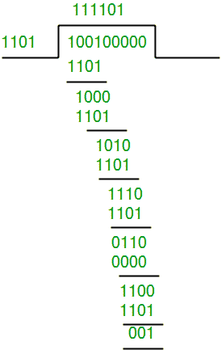
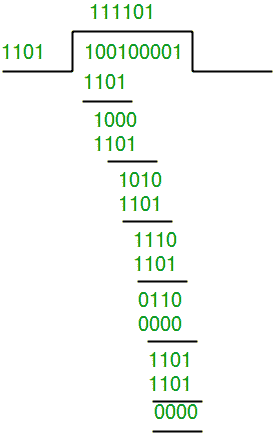
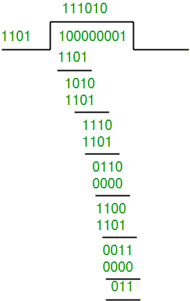

# 循环冗余校验和模 2 除法

> 原文:[https://www.geeksforgeeks.org/modulo-2-binary-division/](https://www.geeksforgeeks.org/modulo-2-binary-division/)

循环冗余校验是一种检测通信信道中意外变化/错误的方法。
循环冗余校验使用发送方和接收方均可用的**生成多项式**。生成多项式的一个例子是类似 x <sup>3</sup> + x + 1 的形式。这个生成多项式表示密钥 1011。另一个例子是代表键 101 的 x <sup>2</sup> + 1。

```
n : Number of bits in data to be sent 
    from sender side.  
k : Number of bits in the key obtained 
    from generator polynomial.
```

**发送方(从数据和生成多项式(或密钥)生成编码数据):**

1.  二进制数据首先通过在数据末尾添加 k-1 个零来扩充
2.  使用 ***模 2 二进制除法*** 将二进制数据除以密钥并存储除法余数。
3.  将剩余部分附加在数据的末尾，形成编码数据并发送

**接收端(检查传输中是否有错误)**
再次执行模 2 除法，如果余数为 0，则没有错误。

在本文中，我们将只关注寻找剩余部分，即检查词和码字。

**模 2 除法:**
模 2 二进制除法的过程与我们熟悉的十进制数的除法过程相同。只是这里用异或代替减法。

*   在每一步中，除数(或数据)的副本与被除数(或密钥)的 k 位异或。
*   异或运算(余数)的结果是(n-1)位，在下拉 1 个额外的位使其为 n 位长后，用于下一步。
*   当没有比特可以下拉时，我们就有了结果。发送端附加的(n-1)位余数。

**图解:**
**例 1(传输无错误):**

```
Data word to be sent - 100100
Key - 1101 [ Or generator polynomial x3 + x2 + 1]

Sender Side:
```



```
Therefore, the remainder is 001 and hence the encoded 
data sent is 100100001.

Receiver Side:
Code word received at the receiver side  100100001
```



```
Therefore, the remainder is all zeros. Hence, the
data received has no error.
```

**例 2:(传输错误)**

```
Data word to be sent - 100100
Key - 1101

Sender Side:
```


```
Therefore, the remainder is 001 and hence the 
code word sent is 100100001.

Receiver Side
Let there be an error in transmission media
Code word received at the receiver side - 100000001
```



由于余数不全为零，在接收器端检测到错误
。

**实现**
下面的实现用于从给定的二进制数据和密钥生成码字。

## C++

```
#include<bits/stdc++.h>
using namespace std;

// Returns XOR of 'a' and 'b'
// (both of same length)
string xor1(string a, string b)
{

    // Initialize result
    string result = "";

    int n = b.length();

    // Traverse all bits, if bits are
    // same, then XOR is 0, else 1
    for(int i = 1; i < n; i++)
    {
        if (a[i] == b[i])
            result += "0";
        else
            result += "1";
    }
    return result;
}

// Performs Modulo-2 division
string mod2div(string divident, string divisor)
{

    // Number of bits to be XORed at a time.
    int pick = divisor.length();

    // Slicing the divident to appropriate
    // length for particular step
    string tmp = divident.substr(0, pick);

    int n = divident.length();

    while (pick < n)
    {
        if (tmp[0] == '1')

            // Replace the divident by the result
            // of XOR and pull 1 bit down
            tmp = xor1(divisor, tmp) + divident[pick];
        else

            // If leftmost bit is '0'.
            // If the leftmost bit of the dividend (or the
            // part used in each step) is 0, the step cannot
            // use the regular divisor; we need to use an
            // all-0s divisor.
            tmp = xor1(std::string(pick, '0'), tmp) +
                  divident[pick];

        // Increment pick to move further
        pick += 1;
    }

    // For the last n bits, we have to carry it out
    // normally as increased value of pick will cause
    // Index Out of Bounds.
    if (tmp[0] == '1')
        tmp = xor1(divisor, tmp);
    else
        tmp = xor1(std::string(pick, '0'), tmp);

    return tmp;
}

// Function used at the sender side to encode
// data by appending remainder of modular division
// at the end of data.
void encodeData(string data, string key)
{
    int l_key = key.length();

    // Appends n-1 zeroes at end of data
    string appended_data = (data +
                            std::string(
                                l_key - 1, '0'));

    string remainder = mod2div(appended_data, key);

    // Append remainder in the original data
    string codeword = data + remainder;
    cout << "Remainder : "
         << remainder << "\n";
    cout << "Encoded Data (Data + Remainder) :"
         << codeword << "\n";
}

// Driver code
int main()
{
    string data = "100100";
    string key = "1101";

    encodeData(data, key);

    return 0;
}

// This code is contributed by MuskanKalra1
```

## 蟒蛇 3

```
# Returns XOR of 'a' and 'b'
# (both of same length)
def xor(a, b):

    # initialize result
    result = []

    # Traverse all bits, if bits are
    # same, then XOR is 0, else 1
    for i in range(1, len(b)):
        if a[i] == b[i]:
            result.append('0')
        else:
            result.append('1')

    return ''.join(result)

# Performs Modulo-2 division
def mod2div(divident, divisor):

    # Number of bits to be XORed at a time.
    pick = len(divisor)

    # Slicing the divident to appropriate
    # length for particular step
    tmp = divident[0 : pick]

    while pick < len(divident):

        if tmp[0] == '1':

            # replace the divident by the result
            # of XOR and pull 1 bit down
            tmp = xor(divisor, tmp) + divident[pick]

        else:   # If leftmost bit is '0'
            # If the leftmost bit of the dividend (or the
            # part used in each step) is 0, the step cannot
            # use the regular divisor; we need to use an
            # all-0s divisor.
            tmp = xor('0'*pick, tmp) + divident[pick]

        # increment pick to move further
        pick += 1

    # For the last n bits, we have to carry it out
    # normally as increased value of pick will cause
    # Index Out of Bounds.
    if tmp[0] == '1':
        tmp = xor(divisor, tmp)
    else:
        tmp = xor('0'*pick, tmp)

    checkword = tmp
    return checkword

# Function used at the sender side to encode
# data by appending remainder of modular division
# at the end of data.
def encodeData(data, key):

    l_key = len(key)

    # Appends n-1 zeroes at end of data
    appended_data = data + '0'*(l_key-1)
    remainder = mod2div(appended_data, key)

    # Append remainder in the original data
    codeword = data + remainder
    print("Remainder : ", remainder)
    print("Encoded Data (Data + Remainder) : ",
          codeword)

# Driver code
data = "100100"
key = "1101"
encodeData(data, key)
```

**输出:**

```
Remainder :  001
Encoded Data (Data + Remainder) :  100100001
```

请注意，循环冗余校验主要用于防止通信信道上的常见错误，而不适用于防止有意更改数据(原因见这里的)

**使用比特操纵的实现:**
CRC 码字的生成也可以使用如下的比特操纵方法来完成:

## C++

```
// C++ Program to generate CRC codeword
#include<stdio.h>
#include<iostream>
#include<math.h>

using namespace std;

// function to convert integer to binary string
string toBin(long long int num){
    string bin = "";
    while (num){
        if (num & 1)
            bin = "1" + bin;
        else
            bin = "0" + bin;
        num = num>>1;
    }
    return bin;
}

// function to convert binary string to decimal
long long int toDec(string bin){
    long long int num = 0;
    for (int i=0; i<bin.length(); i++){
        if (bin.at(i)=='1')
            num += 1 << (bin.length() - i - 1);
    }
    return num;
}

// function to compute CRC and codeword
void CRC(string dataword, string generator){
    int l_gen = generator.length();
    long long int gen = toDec(generator);

    long long int dword = toDec(dataword);

     // append 0s to dividend
    long long int dividend = dword << (l_gen-1);      

    // shft specifies the no. of least
    // significant bits not being XORed
    int shft = (int) ceill(log2l(dividend+1)) - l_gen; 
    long long int rem;

    while ((dividend >= gen) || (shft >= 0)){

        // bitwise XOR the MSBs of dividend with generator
        // replace the operated MSBs from the dividend with
        // remainder generated
        rem = (dividend >> shft) ^ gen;               
        dividend = (dividend & ((1 << shft) - 1)) | (rem << shft);

        // change shft variable
        shft = (int) ceill(log2l(dividend + 1)) - l_gen;
    }

    // finally, AND the initial dividend with the remainder (=dividend)
    long long int codeword = (dword << (l_gen - 1)) | dividend;
    cout << "Remainder: " << toBin(dividend) << endl;
    cout << "Codeword : " << toBin(codeword) << endl;
}

int main(){
    string dataword, generator;
    dataword = "10011101";
    generator = "1001";
    CRC(dataword, generator);
    return 0;
}
```

## 蟒蛇 3

```
# Python3 program to generate CRC codeword
from math import log, ceil

def CRC(dataword, generator):
    dword = int(dataword, 2)
    l_gen = len(generator)

    # append 0s to dividend
    dividend = dword << (l_gen - 1)   

    # shft specifies the no. of least significant
    # bits not being XORed
    shft = ceil(log(dividend + 1, 2)) - l_gen    

    # ceil(log(dividend+1 , 2)) is the no. of binary
    # digits in dividend
    generator = int(generator, 2)

    while dividend >= generator or shft >= 0:

        # bitwise XOR the MSBs of dividend with generator
        # replace the operated MSBs from the dividend with
        # remainder generated
        rem = (dividend >> shft) ^ generator   
        dividend = (dividend & ((1 << shft) - 1)) | (rem << shft)

        # change shft variable
        shft = ceil(log(dividend+1, 2)) - l_gen

    # finally, AND the initial dividend with the remainder (=dividend)
    codeword = dword << (l_gen-1)|dividend
    print("Remainder:", bin(dividend).lstrip("-0b"))
    print("Codeword :", bin(codeword).lstrip("-0b"))

# Driver code
dataword = "10011101"
generator = "1001"
CRC(dataword, generator)
```

**Output:**

```
Remainder: 100
Codeword : 10011101100
```

**参考文献:**
[https://en.wikipedia.org/wiki/Cyclic_redundancy_check](https://en.wikipedia.org/wiki/Cyclic_redundancy_check)

本文由**杰伊·帕特尔**供稿。如果你喜欢极客博客并想投稿，你也可以写一篇文章并把你的文章邮寄到 contribute@geeksforgeeks.org。看到你的文章出现在极客博客主页上，帮助其他极客。

如果您发现任何不正确的地方，或者您想分享更多关于上面讨论的主题的信息，请写评论