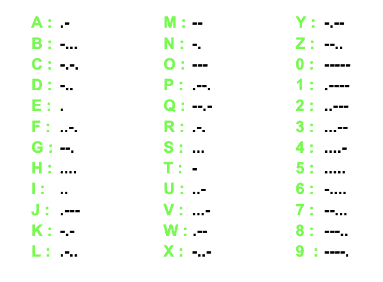

# 莫尔斯电码实现

> 原文:[https://www.geeksforgeeks.org/morse-code-implementation/](https://www.geeksforgeeks.org/morse-code-implementation/)

**莫尔斯电码**是一种通过一系列开关音、灯光或点击来传递文本信息的方法，熟练的听者或观察者无需特殊设备即可直接理解。它是以电报发明者塞缪尔·莫尔斯的名字命名的。
算法很简单。英语中的每个字符都被一系列的“点”和“破折号”替代，或者有时只是单个的“点”或“破折号”，反之亦然。
每一个文本串都转换成点划线的序列。为此，每个字符都被转换成莫尔斯电码，并附加在编码信息中。这里我们复制了空间的本来面目。我们考虑了数字和字母。



**示例:**

```
Input :  geeksforgeeks
Output : --...-.-.....-.---.-.--...-.-...

Input :  program
Output : .--..-.-----..-..---
```

## C++

```
// CPP program to demonstrate Morse code
#include <iostream>
using namespace std;

// function to encode a alphabet as
// Morse code
string morseEncode(char x)
{

    // refer to the Morse table
    // image attached in the article
    switch (x) {
    case 'a':
        return ".-";
    case 'b':
        return "-...";
    case 'c':
        return "-.-.";
    case 'd':
        return "-..";
    case 'e':
        return ".";
    case 'f':
        return "..-.";
    case 'g':
        return "--.";
    case 'h':
        return "....";
    case 'i':
        return "..";
    case 'j':
        return ".---";
    case 'k':
        return "-.-";
    case 'l':
        return ".-..";
    case 'm':
        return "--";
    case 'n':
        return "-.";
    case 'o':
        return "---";
    case 'p':
        return ".--.";
    case 'q':
        return "--.-";
    case 'r':
        return ".-.";
    case 's':
        return "...";
    case 't':
        return "-";
    case 'u':
        return "..-";
    case 'v':
        return "...-";
    case 'w':
        return ".--";
    case 'x':
        return "-..-";
    case 'y':
        return "-.--";
    case 'z':
        return "--..";
    case '1':
        return ".----";
    case '2':
        return "..---";
    case '3':
        return "...--";
    case '4':
        return "....-";
    case '5':
        return ".....";
    case '6':
        return "-....";
    case '7':
        return "--...";
    case '8':
        return "---..";
    case '9':
        return "----.";
    case '0':
        return "-----";
    default:
        cerr << "Found invalid character: " << x << ' '
             << std::endl;
        exit(0);
    }
}

void morseCode(string s)
{

    // character by character print
    // Morse code
    for (int i = 0; s[i]; i++)
        cout << morseEncode(s[i]);
    cout << endl;
}

// Driver's code
int main()
{
    string s = "geeksforgeeks";
    morseCode(s);
    return 0;
}
```

## Java 语言(一种计算机语言，尤用于创建网站)

```
// Java program to demonstrate Morse code
class GFG
{
    // function to encode a alphabet as
    // Morse code
    static String morseEncode(char x)
    {

        // refer to the Morse table
        // image attached in the article
        switch (x)
        {
            case 'a':
                return ".-";
            case 'b':
                return "-...";
            case 'c':
                return "-.-.";
            case 'd':
                return "-..";
            case 'e':
                return ".";
            case 'f':
                return "..-.";
            case 'g':
                return "--.";
            case 'h':
                return "....";
            case 'i':
                return "..";
            case 'j':
                return ".---";
            case 'k':
                return "-.-";
            case 'l':
                return ".-..";
            case 'm':
                return "--";
            case 'n':
                return "-.";
            case 'o':
                return "---";
            case 'p':
                return ".--.";
            case 'q':
                return "--.-";
            case 'r':
                return ".-.";
            case 's':
                return "...";
            case 't':
                return "-";
            case 'u':
                return "..-";
            case 'v':
                return "...-";
            case 'w':
                return ".--";
            case 'x':
                return "-..-";
            case 'y':
                return "-.--";
            // for space
            case 'z':
                return "--..";
            case '1':
                return ".----";
            case '2':
                return "..---";
            case '3':
                return "...--";
            case '4':
                return "....-";
            case '5':
                return ".....";
            case '6':
                return "-....";
            case '7':
                return "--...";
            case '8':
                return "---..";
            case '9':
                return "----.";
           case '0':
                return "-----";
        }
        return "";
    }

    static void morseCode(String s)
    {
        // character by character print
        // Morse code
        for (int i = 0;i<s.length(); i++)
            System.out.print(morseEncode(s.charAt(i)));
            System.out.println();
    }

    // Driver code
    public static void main (String[] args)
    {
        String s = "geeksforgeeks";
        morseCode(s);
    }
}

// This code is contributed by Anant Agarwal.
```

## 蟒蛇 3

```
# Python3 program to demonstrate Morse code

# function to encode a alphabet as
# Morse code
def morseEncode(x):

    # refer to the Morse table
    # image attached in the article
    if x is 'a':
        return ".-"
    elif x is 'b':
        return "-..."
    elif x is 'c':
        return "-.-."
    elif x is 'd':
        return "-.."
    elif x is 'e':
        return "."
    elif x is 'f':
        return "..-."
    elif x is 'g':
        return "--."
    elif x is 'h':
        return "...."
    elif x is 'i':
        return ".."
    elif x is 'j':
        return ".---"
    elif x is 'k':
        return "-.-"
    elif x is 'l':
        return ".-.."
    elif x is 'm':
        return "--"
    elif x is 'n':
        return "-."
    elif x is 'o':
        return "---"
    elif x is 'p':
        return ".--."
    elif x is 'q':
        return "--.-"
    elif x is 'r':
        return ".-."
    elif x is 's':
        return "..."
    elif x is 't':
        return "-"
    elif x is 'u':
        return "..-"
    elif x is 'v':
        return "...-"
    elif x is 'w':
        return ".--"
    elif x is 'x':
        return "-..-"
    elif x is 'y':
        return "-.--"
    elif x is 'z':
        return "--.."
    elif x is '1':
        return ".----";
    elif x is '2':
        return "..---";
    elif x is '3':
        return "...--";
    elif x is '4':
        return "....-";
    elif x is '5':
        return ".....";
    elif x is '6':
        return "-....";
    elif x is '7':
        return "--...";
    elif x is '8':
        return "---..";
    elif x is '9':
        return "----.";
    elif x is '0':
        return "-----";

# character by character print
# Morse code
def morseCode(s):
    for character in s:
        print(morseEncode(character), end = "")

# Driver Code
if __name__ == "__main__":
    s = "geeksforgeeks"
    morseCode(s)

# This code is contributed
# by Vivek Kumar Singh
```

## C#

```
// C# program to demonstrate Morse code
using System;

class GFG
{
    // function to encode a alphabet as
    // Morse code
    static string morseEncode(char x)
    {

        // refer to the Morse table
        // image attached in the article
        switch (x)
        {
            case 'a':
                return ".-";
            case 'b':
                return "-...";
            case 'c':
                return "-.-.";
            case 'd':
                return "-..";
            case 'e':
                return ".";
            case 'f':
                return "..-.";
            case 'g':
                return "--.";
            case 'h':
                return "....";
            case 'i':
                return "..";
            case 'j':
                return ".---";
            case 'k':
                return "-.-";
            case 'l':
                return ".-..";
            case 'm':
                return "--";
            case 'n':
                return "-.";
            case 'o':
                return "---";
            case 'p':
                return ".--.";
            case 'q':
                return "--.-";
            case 'r':
                return ".-.";
            case 's':
                return "...";
            case 't':
                return "-";
            case 'u':
                return "..-";
            case 'v':
                return "...-";
            case 'w':
                return ".--";
            case 'x':
                return "-..-";
            case 'y':
                return "-.--";
            // for space
            case 'z':
                return "--..";

            case '1':
                return ".----";
            case '2':
                return "..---";
            case '3':
                return "...--";
            case '4':
                return "....-";
            case '5':
                return ".....";
            case '6':
                return "-....";
            case '7':
                return "--...";
            case '8':
                return "---..";
            case '9':
                return "----.";
           case '0':
                return "-----";
        }
        return "";
    }

    static void morseCode(string s)
    {
        // character by character print
        // Morse code
        for (int i = 0;i<s.Length; i++)
            Console.Write(morseEncode(s[i]));
            Console.WriteLine();
    }

    // Driver code
    public static void Main ()
    {
        string s = "geeksforgeeks";
        morseCode(s);
    }
}

// This code is contributed by vt_m.
```

## 服务器端编程语言（Professional Hypertext Preprocessor 的缩写）

```
<?php
// php program to demonstrate
// Morse code

// function to encode a 
// alphabet as Morse code
function morseEncode($x)
{

  // refer to the Morse table
  // image attached in the article
  switch ($x) {
    case 'a':
        return ".-";
    case 'b':
        return "-...";
    case 'c':
        return "-.-.";
    case 'd':
        return "-..";
    case 'e':
        return ".";
    case 'f':
        return "..-.";
    case 'g':
        return "--.";
    case 'h':
        return "....";
    case 'i':
        return "..";
    case 'j':
        return ".---";
    case 'k':
        return "-.-";
    case 'l':
        return ".-..";
    case 'm':
        return "--";
    case 'n':
        return "-.";
    case 'o':
        return "---";
    case 'p':
        return ".--.";
    case 'q':
        return "--.-";
    case 'r':
        return ".-.";
    case 's':
        return "...";
    case 't':
        return "-";
    case 'u':
        return "..-";
    case 'v':
        return "...-";
    case 'w':
        return ".--";
    case 'x':
        return "-..-";
    case 'y':
        return "-.--";
    case '1':
     return ".----";
    case '2':
     return "..---";
    case '3':
     return "...--";
    case '4':
     return "....-";
    case '5':
     return ".....";
    case '6':
     return "-....";
    case '7':
      return "--...";
    case '8':
      return "---..";
    case '9':
     return "----.";
    case '0':
     return "-----";

    // for space
    case 'z':
        return "--..";
  }
}

function morseCode($s)
{

  // Character by character
  // print  Morse code
  for ($i = 0; $i<strlen($s); $i++)
      echo morseEncode($s[$i]);
  echo "\n";
}

// Driver code
$s = "geeksforgeeks";
morseCode($s);

// This code is contributed by mits
?>
```

**输出:**

```
--...-.-.....-.---.-.--...-.-...
```