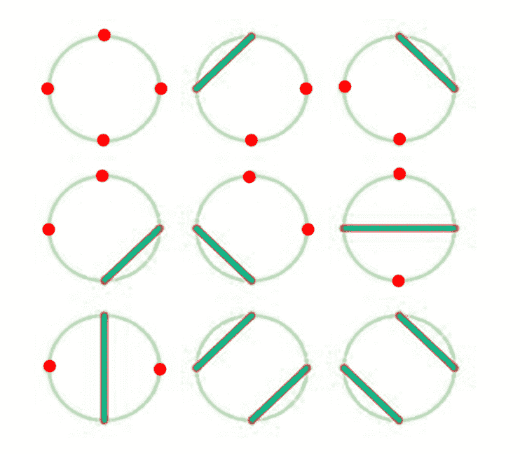
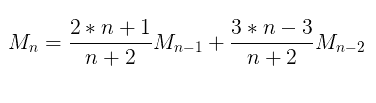
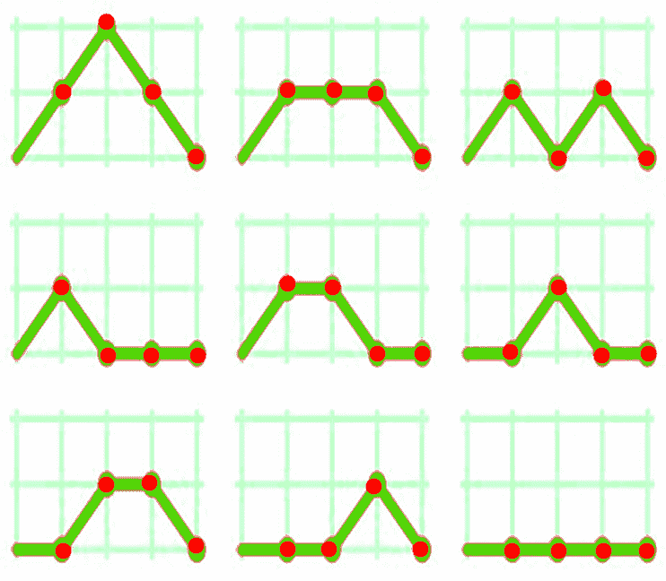

# 莫兹金号

> 原文:[https://www.geeksforgeeks.org/motzkin-number/](https://www.geeksforgeeks.org/motzkin-number/)

在数学中，给定数 *n* 的一个**莫茨金数**是画圆上 n 个点之间不相交弦的不同方法的数(不一定每个点都被一个弦所接触)。
例如 n = 3，M <sub>4</sub> = 9。



第 N <sup>个</sup> Motzkin 数的递推关系为:



Motzkin 编号可用于查找:

*   长度为 n–1 的正整数序列的个数，其中开始和结束元素是 1 或 2，任意两个连续元素之间的差是-1、0 或 1。
*   从坐标(0，0)到坐标(n，0)的网格右上象限上的路线数，以 n 步为单位，前提是每一步只允许向右(向上、向下或直线)移动，但禁止低于 y = 0 轴。

例如

下图显示了从(0，0)到(4，0)的 9 个有效 Motzkin 路径。



**示例:**

```
Input : n = 4
Output : 9

Input : n = 5
Output : 21
```

下面是查找第 n 个 Motzkin 号的程序:

## C++

```
// CPP Program to find Nth Motzkin Number.
#include <bits/stdc++.h>
using namespace std;

// Return the nth Motzkin Number.
int motzkin(int n)
{
    // Base Case
    if (n == 0 || n == 1)
        return 1;

    // Recursive step
    return ((2 * n + 1) * motzkin(n - 1) +
            (3 * n - 3) * motzkin(n - 2)) / (n + 2);
}

// Driven Program
int main()
{
    int n = 8;
    cout << motzkin(n) << endl;
    return 0;
}
```

## Java 语言(一种计算机语言，尤用于创建网站)

```
// Java Program to find Nth Motzkin Number.
import java.util.*;

class Digits
{
    // Return the nth Motzkin Number.
    public static int motzkin(int n)
    {
        // Base Case
        if (n == 0 || n == 1)
            return 1;

        // Recursive step
        return ((2 * n + 1) * motzkin(n - 1) +
                (3 * n - 3) * motzkin(n - 2)) / (n + 2);
    }

    // driver code   
    public static void main(String[] args)
    {
        int n = 8;
        System.out.print( motzkin(n) );
    }
}

// This code is contributed by rishabh_jain
```

## 蟒蛇 3

```
# Python3 program to find Nth Motzkin Number.

# Return the nth Motzkin Number.
def motzkin(n) :

    # Base Case
    if (n == 0 or n == 1) :
        return 1

    # Recursive step
    return ((2 * n + 1) * motzkin(n - 1) +
            (3 * n - 3) * motzkin(n - 2)) / (n + 2)

# Driver code
n = 8
print( motzkin(n) )

# This code is contributed by rishabh_jain
```

## C#

```
// C# Program to find Nth Motzkin Number.
using System;

class GFG {

    // Return the nth Motzkin Number.
    public static int motzkin(int n)
    {

        // Base Case
        if (n == 0 || n == 1)
            return 1;

        // Recursive step
        return ((2 * n + 1) * motzkin(n - 1) +
            (3 * n - 3) * motzkin(n - 2)) / (n + 2);
    }

    // driver code
    public static void Main()
    {
        int n = 8;

        Console.WriteLine( motzkin(n) );
    }
}

// This code is contributed by vt_m
```

## 服务器端编程语言（Professional Hypertext Preprocessor 的缩写）

```
<?php
// PHP Program to find
// Nth Motzkin Number.

// Return the nth Motzkin Number.
function motzkin($n)
{
    // Base Case
    if ($n == 0 || $n == 1)
        return 1;

    // Recursive step
    return ((2 * $n + 1) *
             motzkin($n - 1) +
            (3 * $n - 3) *
             motzkin($n - 2)) /
            ($n + 2);
}

// Driven Code
$n = 8;
echo(motzkin($n));

// This code is contributed by Ajit.
?>
```

## java 描述语言

```
<script>

// javascript Program to find Nth Motzkin Number.

    // Return the nth Motzkin Number.
    function motzkin( n)
    {

        // Base Case
        if (n == 0 || n == 1)
            return 1;

        // Recursive step
        return ((2 * n + 1) * motzkin(n - 1) +
            (3 * n - 3) * motzkin(n - 2)) / (n + 2);
    }

    // driver code

        var n = 8;

        document.write( motzkin(n) );

</script>
```

**输出:**

```
323
```

**使用动态编程:**

下面是求第 n 个 Motzkin 数的动态规划解:

## C++

```
// CPP Program to find Nth Motzkin Number.
#include <bits/stdc++.h>
using namespace std;

// Return the nth Motzkin Number.
int motzkin(int n)
{
    int dp[n + 1];

    // Base case
    dp[0] = dp[1] = 1;

    // Finding i-th Motzkin number.
    for (int i = 2; i <= n; i++)
        dp[i] = ((2 * i + 1) * dp[i - 1] +
                  (3 * i - 3) * dp[i - 2]) / (i + 2);

    return dp[n];
}
// Driven Program
int main()
{
    int n = 8;
    cout << motzkin(n) << endl;
    return 0;
}
```

## Java 语言(一种计算机语言，尤用于创建网站)

```
// Java Program to find Nth Motzkin Number.
import java.util.*;

class Digits
{
    // Return the nth Motzkin Number.
    public static int motzkin(int n)
    {
        int[] dp = new int[n+1];

        // Base case
        dp[0] = dp[1] = 1;

        // Finding i-th Motzkin number.
        for (int i = 2; i <= n; i++)
            dp[i] = ((2 * i + 1) * dp[i - 1] +
                (3 * i - 3) * dp[i - 2]) / (i + 2);

        return dp[n];
    }

    // driver code   
    public static void main(String[] args)
    {
        int n = 8;
        System.out.print( motzkin(n) );
    }
}

// This code is contributed by rishabh_jain
```

## 蟒蛇 3

```
# Python3 program to find Nth Motzkin Number.

# Return the nth Motzkin Number.
def motzkin(n) :

    dp = [None] * (n+1)

    # Base case
    dp[0] = dp[1] = 1;

    i = 2
    # Finding i-th Motzkin number.
    while i <= n :
        dp[i] = ((2 * i + 1) * dp[i - 1] +
                (3 * i - 3) * dp[i - 2]) / (i + 2);
        i = i + 1
    return dp[n];

# Driver code
n = 8
print( motzkin(n) )

# This code is contributed by rishabh_jain
```

## C#

```
// C# Program to find Nth Motzkin Number.
using System;

class GFG {

    // Return the nth Motzkin Number.
    public static int motzkin(int n)
    {
        int[] dp = new int[n+1];

        // Base case
        dp[0] = dp[1] = 1;

        // Finding i-th Motzkin number.
        for (int i = 2; i <= n; i++)
            dp[i] = ((2 * i + 1) * dp[i - 1] +
             (3 * i - 3) * dp[i - 2]) / (i + 2);

        return dp[n];
    }

    // driver code
    public static void Main()
    {
        int n = 8;

        Console.WriteLine( motzkin(n) );
    }
}

// This code is contributed by vt_m
```

## 服务器端编程语言（Professional Hypertext Preprocessor 的缩写）

```
<?php
// PHP Program to find
// Nth Motzkin Number.

// Return the nth Motzkin Number.
function motzkin($n)
{

    // Base case
    $dp[0] = $dp[1] = 1;

    // Finding i-th Motzkin number.
    for ($i = 2; $i <= $n; $i++)
        $dp[$i] = ((2 * $i + 1) *
                    $dp[$i - 1] +
                   (3 * $i - 3) *
                   $dp[$i - 2]) /
                   ($i + 2);

    return $dp[$n];
}
// Driven Code
$n = 8;
echo(motzkin($n));

// This code is contributed by Ajit.
?>
```

**输出:**

```
323
```