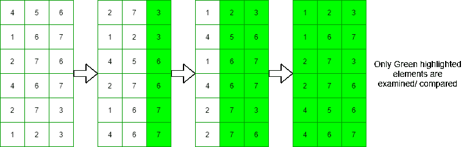
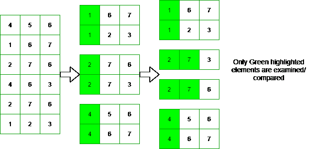
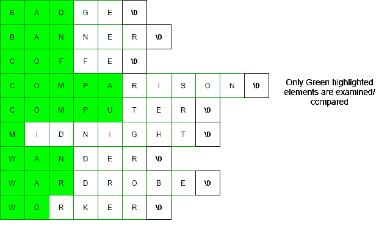

# MSD(最高有效位)基数排序

> 原文:[https://www . geesforgeks . org/MSD-最高有效数字-基数-排序/](https://www.geeksforgeeks.org/msd-most-significant-digit-radix-sort/)

本文讨论了两种类型的[基数排序](https://www.geeksforgeeks.org/radix-sort/):

*   **LSD 基数排序:**它从字符串的末尾开始排序([最低有效数字](https://www.geeksforgeeks.org/print-kth-least-significant-bit-number/))。
*   **MSD 基数排序:**从字符串的开头开始排序([最高有效位](https://www.geeksforgeeks.org/find-significant-set-bit-number/))。

本文的任务是讨论 MSD 基数排序，并将其与 LSD 基数排序进行比较。

**方法:**想法是对每个数字 **i** 执行以下步骤，其中 **i** 的值从最高有效数字变化到最低有效数字:

*   根据元素的**I<sup>th</sup>T3【数字】将元素存储在不同的桶中。**
*   [递归](https://www.geeksforgeeks.org/recursion/)对每个包含多个元素的桶进行排序。

### <u>最高有效位与最低有效位基数排序</u>:

*   其思想是对固定长度的整数进行排序，MSD 比 LSD 更有效，因为它可能不必检查每个整数的每个数字:

<u>LSD 基数排序:</u>

> 

<u>MSD 基数排序</u>:

> 
> 
> MSD cardinality sorting

*   与 LSD 不同，MSD 可以用来对可变长度的字符串进行排序。LSD 必须稳定才能正常工作，但是 MSD 可以稳定也可以不稳定，MSD 可以使用随机字符串。



MSD 基数排序可变长度字符串

*   **时间复杂度:**
    *   **LSD 基数排序:** [最佳和最坏情况时间复杂度](https://www.geeksforgeeks.org/analysis-of-algorithms-set-2-asymptotic-analysis/)是 ***O(N*M)*** ，其中 M =最长字符串的长度。
        **MSD 基数排序:** [最佳情况时间复杂度](https://www.geeksforgeeks.org/analysis-of-algorithms-set-2-asymptotic-analysis/)为***O(N)***[最坏情况时间复杂度](https://www.geeksforgeeks.org/analysis-of-algorithms-set-2-asymptotic-analysis/)为 ***O(N*M)*** 其中 M =字符串的平均长度。
*   **辅助空间:**
    *   **LSD 基数排序:** ***O(N + B)***
    *   **MSD 基数排序:** ***O(N + MB*** ，其中 M =最长字符串的长度，B =基数的大小(B=10 个可能的数字或 B=256 个字符或 B=2 表示二进制)。
*   MSD 使用[递归](https://www.geeksforgeeks.org/recursion/)，所以比 LSD 需要更多的空间。这意味着当使用少量输入时，MSD 比 LSD 慢得多。

**<u>实现 MSD 基数排序</u> :**

**使用** [**链表**](https://www.geeksforgeeks.org/data-structures/linked-list/) **:** 这个实现是针对使用链表的整数。每个节点的固定长度阵列将占用大量存储空间。

下面是使用链表实现 MSD 基数排序:

## C++

```
// C++ program for the implementation
// of MSD Radix Sort using linked list
#include <iostream>
#include <vector>

using namespace std;

// Linked list node structure
struct node {
    vector<int> arr;
    struct node* nxt[10];
};

// Function to create a new node of
// the Linked List
struct node* new_node(void)
{
    struct node* tempNode = new node;

    for (int i = 0; i < 10; i++) {
        tempNode->nxt[i] = NULL;
    }

    // Return the created node
    return tempNode;
}

// Function to sort the given array
// using MSD Radix Sort recursively
void msd_sort(struct node* root, int exp,
              vector<int>& sorted_arr)
{
    if (exp <= 0) {
        return;
    }

    int j;

    // Stores the numbers in different
    // buckets according their MSD
    for (int i = 0;
         i < root->arr.size();
         i++) {

        // Get the MSD in j
        j = (root->arr[i] / exp) % 10;

        // If j-th index in the node
        // array is empty create and
        // link a new node in index
        if (root->nxt[j] == NULL) {
            root->nxt[j] = new_node();
        }

        // Store the number in j-th node
        root->nxt[j]->arr.push_back(
            root->arr[i]);
    }

    // Sort again every child node that
    // has more than one number
    for (int i = 0; i < 10; i++) {

        // If root->next is NULL
        if (root->nxt[i] != NULL) {

            if (root->nxt[i]->arr.size()
                > 1) {

                // Sort recursively
                msd_sort(root->nxt[i],
                         exp / 10,
                         sorted_arr);
            }

            // If any node have only
            // one number then it means
            // the number is sorted
            else {
                sorted_arr.push_back(
                    root->nxt[i]->arr[0]);
            }
        }
    }
}

// Function to calculate the MSD of the
// maximum  value in the array
int get_max_exp(vector<int> arr)
{
    // Stores the maximum element
    int mx = arr[0];

    // Traverse the given array
    for (int i = 1; i < arr.size(); i++) {

        // Update the value of maximum
        if (arr[i] > mx) {
            mx = arr[i];
        }
    }

    int exp = 1;

    while (mx > 10) {
        mx /= 10;
        exp *= 10;
    }

    // Return the resultant value
    return exp;
}

// Function to print an array
void print(vector<int> arr)
{
    for (int i = 0; i < arr.size(); i++)
        cout << arr[i] << " ";

    cout << endl;
}

// Driver Code
int main()
{
    // create the root node
    struct node* root = new_node();

    // Stores the unsorted array
    // in the root node
    root->arr.insert(root->arr.end(),
                     { 9330, 9950, 718,
                       8977, 6790, 95,
                       9807, 741, 8586,
                       5710 });

    cout << "Unsorted array : ";

    // Print the unsorted array
    print(root->arr);

    // Find the optimal longest exponent
    int exp = get_max_exp(root->arr);

    // Stores the sorted numbers
    vector<int> sorted_arr;

    // Function Call
    msd_sort(root, exp, sorted_arr);

    cout << "Sorted array : ";

    // Print the sorted array
    print(sorted_arr);

    return 0;
}
```

## C

```
// C program for the implementation
// of MSD Radix Sort using linked list
// Linked list node structure
#include <stdio.h>
#include <stdlib.h> // For using malloc
#include <string.h> // For using memset

// Output array filled length
int sorted_array_length = 0;

struct node {
    int arr[100];
    int arr_length;
    struct node* nxt[10];
};

// Function to create a new node of
// the Linked List
struct node* new_node(void)
{
    struct node* tempNode
        = (struct node*)malloc(sizeof(struct node));

    tempNode->arr_length = 0;

    for (int i = 0; i < 10; i++) {
        tempNode->nxt[i] = NULL;
    }

    // Return the created node
    return tempNode;
}

// Function to sort the given array
// using MSD Radix Sort recursively
void msd_sort(struct node* root, int exp, int* sorted_arr)
{
    if (exp <= 0) {
        return;
    }

    int j;

    // Stores the numbers in different
    // buckets according their MSD
    for (int i = 0; i < root->arr_length; i++) {

        // Get the MSD in j
        j = (root->arr[i] / exp) % 10;

        // If j-th index in the node
        // array is empty create and
        // link a new node in index
        if (root->nxt[j] == NULL) {
            root->nxt[j] = new_node();
        }

        // Store the number in j-th node
        root->nxt[j]->arr[root->nxt[j]->arr_length++]
            = root->arr[i];
    }

    // Sort again every child node that
    // has more than one number
    for (int i = 0; i < 10; i++) {

        // If root->next is NULL
        if (root->nxt[i] != NULL) {

            if (root->nxt[i]->arr_length > 1) {

                // Sort recursively
                msd_sort(root->nxt[i], exp / 10,
                         sorted_arr);
            }

            // If any node have only
            // one number then it means
            // the number is sorted
            else {
                sorted_arr[sorted_array_length++]
                    = root->nxt[i]->arr[0];
            }
        }
    }
}

// Function to calculate the MSD of the
// maximum value in the array
int get_max_exp(int* arr, int n)
{
    // Stores the maximum element
    int mx = arr[0];

    // Traverse the given array
    for (int i = 1; i < n; i++) {

        // Update the value of maximum
        if (arr[i] > mx) {
            mx = arr[i];
        }
    }

    int exp = 1;

    while (mx > 10) {
        mx /= 10;
        exp *= 10;
    }

    // Return the resultant value
    return exp;
}

// Function to print an array
void print(int* arr, int n)
{
    for (int i = 0; i < n; i++)
        printf("%d ", arr[i]);

    printf("\n");
}

// Driver Code
int main()
{
    // Unsorted array
    int array[] = { 9330, 9950, 718, 8977, 6790,
                    95,   9807, 741, 8586, 5710 };

    // Input array length
    int n = sizeof(array) / sizeof(array[0]);

    // create the root node
    struct node* root = new_node();

    // Stores the unsorted array
    // in the root node and
    // set arr_length
    memcpy(root->arr, array, sizeof(array));
    root->arr_length = n;

    printf("Unsorted array : ");

    // Print the unsorted array
    print(root->arr, n);

    // Find the optimal longest exponent
    int exp = get_max_exp(root->arr, root->arr_length);

    // Stores the sorted numbers
    int output[n];
    int* sorted_arr = &output[0];

    // Function Call
    msd_sort(root, exp, sorted_arr);

    printf("Sorted array : ");

    // Print the sorted array
    print(sorted_arr, n);

    return 0;
}
```

## Java 语言(一种计算机语言，尤用于创建网站)

```
// Java implementation of MSD Radix Sort
// of MSD Radix Sort using counting sort()
import java.util.*;

class GFG{

// A utility function to print an array
static void print(int[] arr, int n)
{
    for (int i = 0; i < n; i++) {
        System.out.print(arr[i]+ " ");
    }
    System.out.println();
}

// A utility function to get the digit
// at index d in a integer
static int digit_at(int x, int d)
{
    return (int)(x / Math.pow(10, d - 1)) % 10;
}

// The main function to sort array using
// MSD Radix Sort recursively
static int[] MSD_sort(int[] arr, int lo, int hi, int d)
{

    // recursion break condition
    if (hi <= lo) {
        return arr;
    }

    int count[] = new int[10 + 2];

    // temp is created to easily swap Strings in arr[]
    HashMap<Integer,Integer> temp = new HashMap<>();

    // Store occurrences of most significant character
    // from each integer in count[]
    for (int i = lo; i <= hi; i++) {
        int c = digit_at(arr[i], d);
        count++;
    }

    // Change count[] so that count[] now contains actual
    //  position of this digits in temp[]
    for (int r = 0; r < 10 + 1; r++)
        count[r + 1] += count[r];

    // Build the temp
    for (int i = lo; i <= hi; i++) {
        int c = digit_at(arr[i], d);
        if(temp.containsKey(count+1))
            temp.put(count++, arr[i]);
        else
        temp.put(count++, arr[i]);
    }

    // Copy all integers of temp to arr[], so that arr[] now
    // contains partially sorted integers
    for (int i = lo; i <= hi; i++)
        if(temp.containsKey(i-lo))
        arr[i] = temp.get(i - lo);

    // Recursively MSD_sort() on each partially sorted
    // integers set to sort them by their next digit
    for (int r = 0; r < 10; r++)
        arr = MSD_sort(arr, lo + count[r], lo + count[r + 1] - 1,
                 d - 1);
    return arr;
}

// function find the largest integer
static int getMax(int arr[], int n)
{
    int mx = arr[0];
    for (int i = 1; i < n; i++)
        if (arr[i] > mx)
            mx = arr[i];
    return mx;
}

// Main function to call MSD_sort
static int[] radixsort(int[] arr, int n)
{
    // Find the maximum number to know number of digits
    int m = getMax(arr, n);

    // get the length of the largest integer
    int d = (int)Math.floor(Math.log10(Math.abs(m))) + 1;

    // function call
    return MSD_sort(arr, 0, n - 1, d);
}

// Driver Code
public static void main(String[] args)
{
    // Input array
    int arr[] = { 9330, 9950, 718, 8977, 6790,
                  95,   9807, 741, 8586, 5710 };

    // Size of the array
    int n = arr.length;

    System.out.printf("Unsorted array : ");

    // Print the unsorted array
    print(arr, n);

    // Function Call
   arr =  radixsort(arr, n);

    System.out.printf("Sorted array : ");

    // Print the sorted array
    print(arr, n);

}
}

// This code is contributed by gauravrajput1
```

**Output**

```
Unsorted array : 9330 9950 718 8977 6790 95 9807 741 8586 5710 
Sorted array : 95 718 741 5710 6790 8586 8977 9330 9807 9950 
```

**使用计数排序()方法:**该实现是针对基于[计数排序()](https://www.geeksforgeeks.org/counting-sort/)方法的字符串。作为 [C 风格 ASCII 字符](https://www.geeksforgeeks.org/strings-in-c-2/)是 **1 字节**。因此， **256 大小数组**用于[统计字符](https://www.geeksforgeeks.org/program-count-occurrence-given-character-string/)的出现次数，并按字典顺序对字符串进行排序。

下面是使用计数排序()方法实现的 MSD 基数排序:

#### 对于字符串:

## C++

```
// C++ implementation of MSD Radix Sort
#include <iostream>
#include <unordered_map>

using namespace std;

// A utility function to print an array
void print(string* str, int n)
{
    for (int i = 0; i < n; i++) {
        cout << str[i] << " ";
    }
    cout << endl;
}

// A utility function to get the ASCII value
// of the character at index d in a string
int char_at(string str, int d)
{
    if (str.size() <= d)
        return -1;
    else
        return str.at(d);
}

// The main function to sort array using
// MSD Radix Sort recursively
void MSD_sort(string* str, int lo, int hi, int d)
{

    // recursion break condition
    if (hi <= lo) {
        return;
    }

    int count[256 + 2] = { 0 };

    // temp is created to easily swap strings in str[]
    // int temp[n] can also be used but,
    // it will take more space.
    unordered_map<int, string> temp;

    // Store occurrences of most significant character
    // from each string in count[]
    for (int i = lo; i <= hi; i++) {
        int c = char_at(str[i], d);
        count++;
    }

    // Change count[] so that count[] now contains actual
    //  position of this digits in temp[]
    for (int r = 0; r < 256 + 1; r++)
        count[r + 1] += count[r];

    // Build the temp
    for (int i = lo; i <= hi; i++) {
        int c = char_at(str[i], d);
        temp[count++] = str[i];
    }

    // Copy all strings of temp to str[], so that str[] now
    // contains partially sorted strings
    for (int i = lo; i <= hi; i++)
        str[i] = temp[i - lo];

    // Recursively MSD_sort() on each partially sorted
    // strings set to sort them by their next character
    for (int r = 0; r < 256; r++)
        MSD_sort(str, lo + count[r], lo + count[r + 1] - 1,
                 d + 1);
}

int main()
{
    string str[] = { "midnight", "badge",  "bag",
                     "worker",   "banner", "wander" };

    int n = sizeof(str) / sizeof(str[0]);

    cout << "Unsorted array : ";
    // print the unsorted array
    print(str, n);

    // Function call
    MSD_sort(str, 0, n - 1, 0);

    cout << "Sorted array : ";
    // print the sorted array
    print(str, n);

    return 0;
}
```

## C

```
// C program for the implementation
// of MSD Radix Sort using counting sort()
#include <stdio.h>
#include <string.h>

// A utility function to get the ASCII value
// of the character at index d in a string
int char_at(char* str, int d)
{
    if (sizeof(str) / sizeof(str[0]) <= d)
        return -1;
    else
        return str[d];
}

int n;

// The main function to sort array using
// MSD Radix Sort recursively
void MSD_sort(char** str, int lo, int hi, int d)
{

    // recursion break condition
    if (hi <= lo + 1) {
        return;
    }

    int count[256 + 2] = { 0 };

    // temp is created to easily swap strings in str[]
    char temp[n][100];

    // Store occurrences of most significant character
    // from each string in count[]
    for (int i = lo; i <= hi; i++) {
        int c = char_at(str[i], d);
        count++;
    }

    // Change count[] so that count[] now contains actual
    //  position of this digits in temp[]
    for (int r = 0; r < 256 + 1; r++)
        count[r + 1] += count[r];

    // Build the temp
    for (int i = lo; i <= hi; i++) {
        int c = char_at(str[i], d);
        memcpy(temp[count++], str[i],
               strlen(str[i]) + 1);
    }

    // Copy all strings of temp to str[], so that str[] now
    // contains partially sorted strings
    for (int i = lo; i <= hi; i++) {
        str[i] = strdup(temp[i - lo]);
    }

    // Recursively MSD_sort() on each partially sorted
    // strings set to sort them by their next character
    for (int r = 0; r < 256; r++)
        MSD_sort(str, lo + count[r], lo + count[r + 1] - 1,
                 d + 1);
}

// Function to print an array
void print(char** str, int n)
{
    for (int i = 0; i < n; i++) {
        printf("%s ", str[i]);
    }
    printf("\n");
}

// Driver Code
int main()
{
    // Input String
    char* str[] = { (char*)"midnight", (char*)"badge",
                    (char*)"bag",      (char*)"worker",
                    (char*)"banner",   (char*)"wander" };

    // Size of the string
    n = sizeof(str) / sizeof(str[0]);

    printf("Unsorted array : ");

    // Print the unsorted array
    print(str, n);

    // Function Call
    MSD_sort(str, 0, n - 1, 0);

    printf("Sorted array : ");

    // Print the sorted array
    print(str, n);

    return 0;
}
```

## Java 语言(一种计算机语言，尤用于创建网站)

```
// Java program for the above approach
import java.io.*;
import java.lang.*;
import java.util.*;

public class GFG {

    // Utility function to get the ASCII
    // value of the character at index d
    // in the string
    static int char_at(String str, int d)
    {
        if (str.length() <= d)
            return -1;
        else
            return (int)(str.charAt(d));
    }

    // Function to sort the array using
    // MSD Radix Sort recursively
    static void MSD_sort(String str[], int lo, int hi,
                         int d)
    {
        // Recursive break condition
        if (hi <= lo) {
            return;
        }

        // Stores the ASCII Values
        int count[] = new int[256 + 1];

        // Temp is created to easily
        // swap strings in str[]
        HashMap<Integer, String> temp = new HashMap<>();

        // Store the occurrences of the most
        // significant character from
        // each string in count[]
        for (int i = lo; i <= hi; i++) {
            int c = char_at(str[i], d);
            count++;
        }

        // Change count[] so that count[]
        // now contains actual position
        // of this digits in temp[]
        for (int r = 0; r < 256; r++)
            count[r + 1] += count[r];

        // Build the temp
        for (int i = lo; i <= hi; i++) {
            int c = char_at(str[i], d);
            temp.put(count++, str[i]);
        }

        // Copy all strings of temp to str[],
        // so that str[] now contains
        // partially sorted strings
        for (int i = lo; i <= hi; i++)
            str[i] = temp.get(i - lo);

        // Recursively MSD_sort() on each
        // partially sorted strings set to
        // sort them by their next character
        for (int r = 0; r < 256; r++)
            MSD_sort(str, lo + count[r],
                     lo + count[r + 1] - 1, d + 1);
    }

    // Function to print an array
    static void print(String str[], int n)
    {
        for (int i = 0; i < n; i++) {
            System.out.print(str[i] + " ");
        }
        System.out.println();
    }

    // Driver Code
    public static void main(String[] args)
    {

        // Input String
        String str[] = { "midnight", "badge",  "bag",
                         "worker",   "banner", "wander" };

        // Size of the string
        int n = str.length;

        System.out.print("Unsorted array : ");

        // Print the unsorted array
        print(str, n);

        // Function Call
        MSD_sort(str, 0, n - 1, 0);

        System.out.print("Sorted array : ");

        // Print the sorted array
        print(str, n);
    }
}

// This code is contributed by Kingash.
```

## C#

```
// C# program for the above approach
using System;
using System.Collections.Generic;

class GFG{

// Utility function to get the ASCII
// value of the character at index d
// in the string
static int char_at(String str, int d)
{
    if (str.Length <= d)
        return -1;
    else
        return(int)(str[d]);
}

// Function to sort the array using
// MSD Radix Sort recursively
static void MSD_sort(String []str, int lo,
                           int hi, int d)
{

    // Recursive break condition
    if (hi <= lo)
    {
        return;
    }

    // Stores the ASCII Values
    int []count = new int[256 + 1];

    // Temp is created to easily
    // swap strings in []str
    Dictionary<int,
               String> temp = new Dictionary<int,
                                             String>();

    // Store the occurrences of the most
    // significant character from
    // each string in []count
    for(int i = lo; i <= hi; i++)
    {
        int c = char_at(str[i], d);
        count++;
    }

    // Change []count so that []count
    // now contains actual position
    // of this digits in []temp
    for(int r = 0; r < 256; r++)
        count[r + 1] += count[r];

    // Build the temp
    for(int i = lo; i <= hi; i++)
    {
        int c = char_at(str[i], d);
        temp.Add(count++, str[i]);
    }

    // Copy all strings of temp to []str,
    // so that []str now contains
    // partially sorted strings
    for(int i = lo; i <= hi; i++)
        str[i] = temp[i - lo];

    // Recursively MSD_sort() on each
    // partially sorted strings set to
    // sort them by their next character
    for(int r = 0; r < 256; r++)
        MSD_sort(str, lo + count[r],
                      lo + count[r + 1] - 1,
                       d + 1);
}

// Function to print an array
static void print(String []str, int n)
{
    for(int i = 0; i < n; i++)
    {
        Console.Write(str[i] + " ");
    }
    Console.WriteLine();
}

// Driver Code
public static void Main(String[] args)
{

    // Input String
    String []str = { "midnight", "badge", "bag",
                     "worker", "banner", "wander" };

    // Size of the string
    int n = str.Length;

    Console.Write("Unsorted array : ");

    // Print the unsorted array
    print(str, n);

    // Function Call
    MSD_sort(str, 0, n - 1, 0);

    Console.Write("Sorted array : ");

    // Print the sorted array
    print(str, n);
}
}

// This code is contributed by shikhasingrajput
```

**Output**

```
Unsorted array : midnight badge bag worker banner wander 
Sorted array : badge bag banner midnight wander worker 
```

#### 对于整数:

## C++

```
// C++ implementation of MSD Radix Sort
// of MSD Radix Sort using counting sort()
#include <iostream>
#include <math.h>
#include <unordered_map>

using namespace std;

// A utility function to print an array
void print(int* arr, int n)
{
    for (int i = 0; i < n; i++) {
        cout << arr[i] << " ";
    }
    cout << endl;
}

// A utility function to get the digit
// at index d in a integer
int digit_at(int x, int d)
{
    return (int)(x / pow(10, d - 1)) % 10;
}

// The main function to sort array using
// MSD Radix Sort recursively
void MSD_sort(int* arr, int lo, int hi, int d)
{

    // recursion break condition
    if (hi <= lo) {
        return;
    }

    int count[10 + 2] = { 0 };

    // temp is created to easily swap strings in arr[]
    unordered_map<int, int> temp;

    // Store occurrences of most significant character
    // from each integer in count[]
    for (int i = lo; i <= hi; i++) {
        int c = digit_at(arr[i], d);
        count++;
    }

    // Change count[] so that count[] now contains actual
    //  position of this digits in temp[]
    for (int r = 0; r < 10 + 1; r++)
        count[r + 1] += count[r];

    // Build the temp
    for (int i = lo; i <= hi; i++) {
        int c = digit_at(arr[i], d);
        temp[count++] = arr[i];
    }

    // Copy all integers of temp to arr[], so that arr[] now
    // contains partially sorted integers
    for (int i = lo; i <= hi; i++)
        arr[i] = temp[i - lo];

    // Recursively MSD_sort() on each partially sorted
    // integers set to sort them by their next digit
    for (int r = 0; r < 10; r++)
        MSD_sort(arr, lo + count[r], lo + count[r + 1] - 1,
                 d - 1);
}

// function find the largest integer
int getMax(int arr[], int n)
{
    int mx = arr[0];
    for (int i = 1; i < n; i++)
        if (arr[i] > mx)
            mx = arr[i];
    return mx;
}

// Main function to call MSD_sort
void radixsort(int* arr, int n)
{
    // Find the maximum number to know number of digits
    int m = getMax(arr, n);

    // get the length of the largest integer
    int d = floor(log10(abs(m))) + 1;

    // function call
    MSD_sort(arr, 0, n - 1, d);
}

// Driver Code
int main()
{
    // Input array
    int arr[] = { 9330, 9950, 718, 8977, 6790,
                  95,   9807, 741, 8586, 5710 };

    // Size of the array
    int n = sizeof(arr) / sizeof(arr[0]);

    printf("Unsorted array : ");

    // Print the unsorted array
    print(arr, n);

    // Function Call
    radixsort(arr, n);

    printf("Sorted array : ");

    // Print the sorted array
    print(arr, n);

    return 0;
}
```

## C

```
// C program for the implementation
// of MSD Radix Sort using counting sort()
#include <math.h>
#include <stdio.h>
#include <stdlib.h>
#include <string.h>

// A utility function to print an array
void print(int* arr, int n)
{
    for (int i = 0; i < n; i++) {
        printf("%d, ", arr[i]);
    }
    printf("\n");
}

// A utility function to get the digit
// at index d in a integer
int digit_at(int x, int d)
{
    return (int)(x / pow(10, d - 1)) % 10;
}

// array length
int n;

// function to sort array using
// MSD Radix Sort recursively
void MSD_sort(int* arr, int lo, int hi, int d)
{

    // recursion break condition
    if (hi <= lo || d < 1) {
        return;
    }

    int count[10 + 2] = { 0 };

    // temp is created to easily swap strings in arr[]
    int temp[n];

    // Store occurrences of most significant character
    // from each integer in count[]
    for (int i = lo; i <= hi; i++) {
        int c = digit_at(arr[i], d);
        count++;
    }

    // Change count[] so that count[] now contains actual
    //  position of this digits in temp[]
    for (int r = 0; r < 10 + 1; r++)
        count[r + 1] += count[r];

    // Build the temp
    for (int i = lo; i <= hi; i++) {
        int c = digit_at(arr[i], d);
        temp[count++] = arr[i];
    }

    // Copy all integer of temp to arr[], so that arr[] now
    // contains partially sorted integers
    for (int i = lo; i <= hi; i++) {
        arr[i] = temp[i - lo];
    }

    // Recursively MSD_sort() on each partially sorted
    // integers set to sort them by their next digit
    for (int r = 0; r < 10; r++)
        MSD_sort(arr, lo + count[r], lo + count[r + 1] - 1,
                 d - 1);
}

// function find the largest integer
int getMax(int arr[], int n)
{
    int mx = arr[0];
    for (int i = 1; i < n; i++)
        if (arr[i] > mx)
            mx = arr[i];
    return mx;
}

// Main function to call MSD_sort
void radixsort(int* arr, int n)
{
    // Find the maximum number to know number of digits
    int m = getMax(arr, n);

    // get the length of the largest integer
    int d = floor(log10(abs(m))) + 1;

    // function call
    MSD_sort(arr, 0, n - 1, d);
}

// Driver Code
int main()
{
    // Input array
    int arr[] = { 9330, 9950, 718, 8977, 6790,
                  95,   9807, 741, 8586, 5710 };

    // Size of the array
    n = sizeof(arr) / sizeof(arr[0]);

    printf("Unsorted array : ");

    // Print the unsorted array
    print(arr, n);

    // Function Call
    radixsort(arr, n);

    printf("Sorted array : ");

    // Print the sorted array
    print(arr, n);

    return 0;
}
```

**Output**

```
Unsorted array : 9330 9950 718 8977 6790 95 9807 741 8586 5710 
Sorted array : 95 718 741 5710 6790 8586 8977 9330 9807 9950 
```