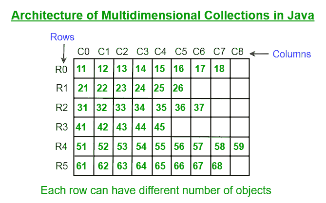

# Java 中的多维集合

> 原文:[https://www . geesforgeks . org/多维-collections-in-java/](https://www.geeksforgeeks.org/multidimensional-collections-in-java/)

在 Java 中，我们有一个[集合框架](https://www.geeksforgeeks.org/java-collection-tutorial/)，它提供了存储一组对象的功能。这被称为一维数组列表，其中一行中只能有一个元素。极客但是如果我们想制作一个多维数组列表呢，对于这个功能，我们在 Java 中有**多维集合(或嵌套集合)**。

多维集合(或嵌套集合)是对象组的集合，其中每个组可以动态地拥有任意数量的对象。因此，在这里我们可以随时在一个组中存储任意数量的元素。



插图:

```
Single dimensional ArrayList :
  [121, 432, 12, 56, 456, 3, 1023]
  [Apple, Orange, Pear, Mango]
```

**语法:**

```
ArrayList <Object> x = new ArrayList <Object>();
```

## 多维集合的需求

与数组不同，我们不受多维集合中任何行的大小的约束。因此，如果我们想使用一个多维架构，在其中我们可以动态地创建任意数量的对象，那么我们应该使用 java 中的多维集合。

**语法** : 多维集合

```
ArrayList<ArrayList<Object>> a = new ArrayList<ArrayList<Object>>();
```

插图:

```
Multidimensional ArrayList: [[3, 4], [12, 13, 14, 15], [22, 23, 24], [33]]
```

让我们快速浏览一下多维数组列表的 add()方法，如下所示:

*   **布尔 add( ArrayList <对象> e)** :用于插入指定集合中的元素。
*   **void add( int index，ArrayList < Object > e)** :用于插入集合中指定位置的元素。

**例 1:**

## Java 语言(一种计算机语言，尤用于创建网站)

```
// Java Program to Illustrate Multidimensional ArrayList

// Importing required classes
import java.util.*;

// Main class
// MultidimensionalArrayList
class GFG {

    // Method 1
    // To create and return 2D ArrayList
    static List create2DArrayList()
    {

        // Creating a 2D ArrayList of Integer type
        ArrayList<ArrayList<Integer> > x
            = new ArrayList<ArrayList<Integer> >();

        // One space allocated for R0
        x.add(new ArrayList<Integer>());

        // Adding 3 to R0 created above x(R0, C0)
        x.get(0).add(0, 3);

        // Creating R1 and adding values
        // Note: Another way for adding values in 2D
        // collections
        x.add(
            new ArrayList<Integer>(Arrays.asList(3, 4, 6)));

        // Adding 366 to x(R1, C0)
        x.get(1).add(0, 366);

        // Adding 576 to x(R1, C4)
        x.get(1).add(4, 576);

        // Now, adding values to R2
        x.add(2, new ArrayList<>(Arrays.asList(3, 84)));

        // Adding values to R3
        x.add(new ArrayList<Integer>(
            Arrays.asList(83, 6684, 776)));

        // Adding values to R4
        x.add(new ArrayList<>(Arrays.asList(8)));

        // Appending values to R4
        x.get(4).addAll(Arrays.asList(9, 10, 11));

        // Appending values to R1, but start appending from
        // C3
        x.get(1).addAll(3, Arrays.asList(22, 1000));

        // This method will return 2D array
        return x;
    }

    // Method 2
    // Main driver method
    public static void main(String args[])
    {
        // Display message prior for better readability
        System.out.println("2D ArrayList :");

        // Printing 2D ArrayList by calling Method 1
        System.out.println(create2DArrayList());
    }
}
```

**Output**

```
2D ArrayList :
[[3], [366, 3, 4, 22, 1000, 6, 576], [3, 84], [83, 6684, 776], [8, 9, 10, 11]]
```

现在让我们看看多维 LinkedHashSet 的相同实现，为了展示它的不同行为。同样，我们可以将任何其他集合实现为多维集合，如下所示:

**语法:**

```
HashSet< HashSet<Object> > a = new HashSet< HashSet<Object> >(); 
```

> **注意:** LinkedHashSet 类包含唯一元素&保持插入顺序。因此，在多维链接中，行内也将保持哈希集的唯一性。

**例 2:**

## Java 语言(一种计算机语言，尤用于创建网站)

```
// Java Program to Illustrate Multidimensional LinkedHashSet

// Importing required classes
import java.util.*;

// Main class
// Multidimensional LinkedHashSet
class GFG {

    // Method 1
    // To create and return 2D LinkedHashSet
    static Set create2DLinkedHashSet()
    {
        // Creating an empty 2D LinkedHashSet
        LinkedHashSet<LinkedHashSet<String> > x
            = new LinkedHashSet<LinkedHashSet<String> >();

        // Creating R0
        x.add(new LinkedHashSet<String>(
            Arrays.asList("Apple", "Orange")));

        // Creating R1, here "Coffee" will be considered as
        // only one object to maintain uniqueness
        x.add(new LinkedHashSet<String>(Arrays.asList(
            "Tea", "Coffee", "Milk", "Coffee", "Water")));

        // Creating R2
        x.add(new LinkedHashSet<String>(
            Arrays.asList("Tomato", "Potato", "Onion")));

        // Creating R3 but it will not be added as it
        // contains the same items as R2

        // Note: LinkedHashSet inserts only unique items

        x.add(new LinkedHashSet<String>(
            Arrays.asList("Tomato", "Potato", "Onion")));

        // Returning multidimensional LinkedHashSet
        return x;
    }

    // Method 2
    // Main driver method
    public static void main(String[] args)
    {
        // Display message for better readability
        System.out.println("2D LinkedHashSet :");

        // Printing 2D LinkedHashSet by
        // calling method 1
        System.out.println(create2DLinkedHashSet());
    }
}
```

**Output**

```
2D LinkedHashSet :
[[Apple, Orange], [Tea, Coffee, Milk, Water], [Tomato, Potato, Onion]]
```