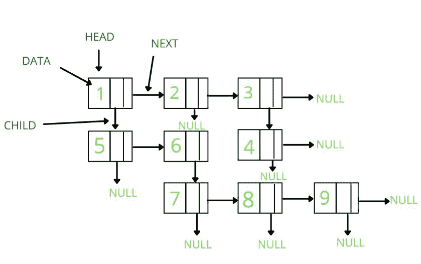

# 多级链表

> 原文:[https://www.geeksforgeeks.org/multilevel-linked-list/](https://www.geeksforgeeks.org/multilevel-linked-list/)

**多级链表**
多级链表是一种 2D 数据结构，由多个[链表](https://www.geeksforgeeks.org/data-structures/linked-list/)组成，多级链表中的每个节点都有一个 next 和 child 指针。所有的元素都是用指针链接的。



多级链表

**表示:**
多级链表由指向[链表第一个节点](https://www.geeksforgeeks.org/data-structures/linked-list/)的指针表示。类似于[链表](https://www.geeksforgeeks.org/data-structures/linked-list/)，第一个节点叫做头。如果多级链表为空，那么 head 的值为空。列表中的每个节点至少由三部分组成:
**1。**数据。
**2。**指向下一个节点的指针。
**3。**指向子节点的指针。

多级链表的每个节点表示为:

> 类节点
> {
> 公共:
> int 数据；
> 节点*下一个；
> 节点*子；
> }；

下面是多级链表的实现

## C++

```
// C++ program to implement
// a multilevel linked list

#include <bits/stdc++.h>
using namespace std;

// Representation of node
class Node {
public:
    int data;
    Node* next;
    Node* child;
};

// A function to create a linked list
// with n(size) nodes returns head pointer
Node* createList(int* arr, int n)
{
    Node* head = NULL;
    Node* tmp;

    // Traversing the passed array
    for (int i = 0; i < n; i++) {
        // Creating a node if the list
        // is empty
        if (head == NULL) {
            tmp = head = new Node();
        }
        else {
            tmp->next = new Node();
            tmp = tmp->next;
        }
        // Created a node with data and
        // setting child and next pointer
        // as NULL.
        tmp->data = arr[i];
        tmp->next = tmp->child = NULL;
    }
    return head;
}

// To print the linked list
void printMultiLevelList(Node* head)
{
    // While head is not null
    while (head) {
        if (head->child) {
            printMultiLevelList(head->child);
        }
        cout << head->data << " ";
        head = head->next;
    }
}

// Driver code
int main()
{
    // Initializing the data in arrays(row wise)
    int arr1[3] = { 1, 2, 3 };
    int arr2[2] = { 5, 6 };
    int arr3[1] = { 4 };
    int arr4[3] = { 7, 8, 9 };

    // creating Four linked lists
    // Passing array and size of array
    // as parameters
    Node* head1 = createList(arr1, 3);
    Node* head2 = createList(arr2, 2);
    Node* head3 = createList(arr3, 1);
    Node* head4 = createList(arr4, 3);

    // Initializing children and next pointers
    // as shown in given diagram
    head1->child = head2;
    head1->next->next->child = head3;
    head2->next->child = head4;

    // Creating a null pointer.
    Node* head = NULL;
    head = head1;

    // Function Call to print
    printMultiLevelList(head);

    return 0;
}
```

## Java 语言(一种计算机语言，尤用于创建网站)

```
/*package whatever //do not write package name here */
import java.io.*;

class GFG {
   public static class Node {
      int data;
        Node next;
        Node child;
    };

    // A function to create a linked list
    // with n(size) nodes returns head pointer
    public static Node createList(int arr[], int n)
    {
        Node head = null;
        Node tmp = null;

        // Traversing the passed array
        for (int i = 0; i < n; i++)
        {

            // Creating a node if the list
            // is empty
            if (head == null) {
                tmp = head = new Node();
            }
            else {
                tmp.next = new Node();
                tmp = tmp.next;
            }

            // Created a node with data and
            // setting child and next pointer
            // as NULL.
            tmp.data = arr[i];
            tmp.next = tmp.child = null;
        }
        return head;
    }

    // To print the linked list
    public static void printMultiLevelList(Node head)
    {

        // While head is not null
        while (head != null) {
            if (head.child != null) {
                printMultiLevelList(head.child);
            }
            System.out.print(head.data + " ");
            head = head.next;
        }
    }

    // Driver code
    public static void main(String[] args)
    {
        int arr1[] = { 1, 2, 3 };
        int arr2[] = { 5, 6 };
        int arr3[] = { 4 };
        int arr4[] = { 7, 8, 9 };

        // creating Four linked lists
        // Passing array and size of array
        // as parameters
        Node head1 = createList(arr1, 3);
        Node head2 = createList(arr2, 2);
        Node head3 = createList(arr3, 1);
        Node head4 = createList(arr4, 3);

        // Initializing children and next pointers
        // as shown in given diagram
        head1.child = head2;
        head1.next.next.child = head3;
        head2.next.child = head4;

        // Creating a null pointer.
        Node head = null;
        head = head1;

        // Function Call to print
        printMultiLevelList(head);
    }
}

// This code is contributed by maddler.
```

## C#

```
/*package whatever //do not write package name here */
using System;

public class GFG {
   public class Node {
          public int data;
        public Node next;
        public Node child;
    };

    // A function to create a linked list
    // with n(size) nodes returns head pointer
    public static Node createList(int []arr, int n)
    {
        Node head = null;
        Node tmp = null;

        // Traversing the passed array
        for (int i = 0; i < n; i++)
        {

            // Creating a node if the list
            // is empty
            if (head == null) {
                tmp = head = new Node();
            }
            else {
                tmp.next = new Node();
                tmp = tmp.next;
            }

            // Created a node with data and
            // setting child and next pointer
            // as NULL.
            tmp.data = arr[i];
            tmp.next = tmp.child = null;
        }
        return head;
    }

    // To print the linked list
    public static void printMultiLevelList(Node head)
    {

        // While head is not null
        while (head != null) {
            if (head.child != null) {
                printMultiLevelList(head.child);
            }
            Console.Write(head.data + " ");
            head = head.next;
        }
    }

    // Driver code
    public static void Main(String[] args)
    {
        int []arr1 = { 1, 2, 3 };
        int []arr2 = { 5, 6 };
        int []arr3 = { 4 };
        int []arr4 = { 7, 8, 9 };

        // creating Four linked lists
        // Passing array and size of array
        // as parameters
        Node head1 = createList(arr1, 3);
        Node head2 = createList(arr2, 2);
        Node head3 = createList(arr3, 1);
        Node head4 = createList(arr4, 3);

        // Initializing children and next pointers
        // as shown in given diagram
        head1.child = head2;
        head1.next.next.child = head3;
        head2.next.child = head4;

        // Creating a null pointer.
        Node head = null;
        head = head1;

        // Function Call to print
        printMultiLevelList(head);
    }
}

// This code is contributed by shikhasingrajput
```

**Output**

```
5 7 8 9 6 1 2 4 3 
```