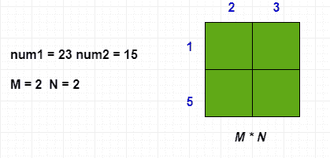
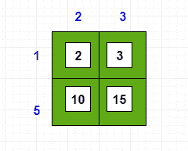
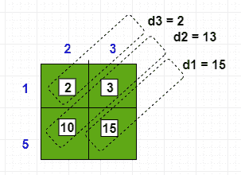
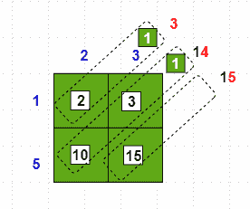

# 用网格法乘以大数

> 原文:[https://www . geeksforgeeks . org/乘法-大数-使用网格-方法/](https://www.geeksforgeeks.org/multiply-large-numbers-using-grid-method/)

给定两个大数 **A** 和 **B** ，任务是用网格法求这两个数的乘积。

**示例:**

> **输入:** A = 23，B = 15
> T3】输出: 345
> 
> **输入:** A = 321，B = 69
> T3】输出: 22149

**进场:**

*   创建由 N 行和 M 列组成的 2D 阵列，其中 N 是第一个数字中的位数，M 是第二个数字中的位数。
    [](https://media.geeksforgeeks.org/wp-content/cdn-uploads/20191107110656/Multiply-Large-Numbers-using-Grid-Method-Step1.png)
*   将行的每个元素乘以列的每个元素
    [](https://media.geeksforgeeks.org/wp-content/cdn-uploads/20191107112508/Multiply-Large-Numbers-using-Grid-Method-Step2.png)
*   Total Number of Diagonal = Row + Columns – 1
    = 2 + 2 -1
    = 3

    [](https://media.geeksforgeeks.org/wp-content/cdn-uploads/20191107112539/Multiply-Large-Numbers-using-Grid-Method-Step3.png)

*   Create 1D Array which contains the addition of elements in each diagonal
    d3 = 2
    d2 = 13
    d1 = 15

    对角线总和[] = {2，13，15}
    输出= "
    总计= 0
    i =对角线长度–1

    [](https://media.geeksforgeeks.org/wp-content/cdn-uploads/20191107112601/Multiply-Large-Numbers-using-Grid-Method-Step4.png)

*   Repeat in reverse order of insertion except for first element in Diagonal Sum[] Array
    total = total + DiagonalSum[i]. If total contain more than single digit then total = all digit from total except unit place digit. output = unit_place_digit + output else total = 0

    [](https://media.geeksforgeeks.org/wp-content/cdn-uploads/20191107112632/Multiply-Large-Numbers-using-Grid-Method-Step5.png)

*   total = total + DiagonalSum[0]
    output = total + output

    [](https://media.geeksforgeeks.org/wp-content/cdn-uploads/20191107112653/Multiply-Large-Numbers-using-Grid-Method-Step6.png)

下面是上述方法的实现:

```
// Java program to multiply Large
// numbers using the grid method

class GFG {

    // Function to return the multiplication of a and b
    public static String multiply(String a, String b)
    {
        boolean flag1 = false;
        boolean flag2 = false;
        a = a.trim();
        b = b.trim();

        // To check whether numbers are
        // negative or positive
        if (a.charAt(0) == '-') {
            a = a.replace("-", "");
            flag1 = true;
        }
        if (b.charAt(0) == '-') {
            b = b.replace("-", "");
            flag2 = true;
        }

        // To store the result of
        // multiplication
        String out = "";

        // To create matrix(Grid) of row * column
        int row = a.length();
        int column = b.length();
        int[][] c = new int[row][column];
        for (int i = 0; i < row; i++) {
            for (int j = 0; j < column; j++) {
                int n1
                    = Character
                          .getNumericValue(
                              a.charAt(i));
                int n2
                    = Character
                          .getNumericValue(
                              b.charAt(j));
                c[i][j] = n1 * n2;
            }
        }

        // To create 1D array of (row+column-1) size
        // which is equal to total number
        // of diagonal in matrix
        int[] sum = new int[row + column - 1];
        int m = 0;

        // To add elements of each diagonals
        for (int i = 0; i < row; i++) {
            int k = i;
            int add = 0;

            for (int j = 0; j < column && k >= 0; j++, k--) {
                add = add + c[k][j];
            }
            sum[m] = add;
            m = m + 1;
        }
        for (int k = 1; k < column; k++) {
            int i = row - 1;
            int j = k;
            int add = 0;
            while (j < column && i >= 0) {
                add = add + c[i][j];
                j = j + 1;
                i = i - 1;
            }
            sum[m] = add;
            m = m + 1;
        }

        // To check both numbers are not
        // single digit number
        if (sum.length != 1) {

            String temp
                = Integer
                      .toString(
                          sum[sum.length - 1]);
            int t = 0;

            // Repeat element in "sum" Array
            // in reverse order
            for (int n = sum.length - 1; n >= 1; n--) {

                // Add element with result "t"
                t = t + sum[n];

                // Convert integer element into String
                // which is sum of all elements
                // of particular diagonal
                temp = Integer.toString(t);
                if (temp.length() > 1) {

                    // If the number contains more than a single-digit
                    // then copy all the digit into "temp"
                    // as String except for the unit place digit
                    String str = temp.substring(0, temp.length() - 1);
                    t = Integer.parseInt(str);
                }
                else {
                    t = 0;
                }

                // Concat unit place digit at the
                // beginning of String "out"
                out = temp.charAt(temp.length() - 1) + out;
            }

            // Add first element with result "t"
            t = t + sum[0];
            temp = Integer.toString(t);
            out = temp + out;
        }
        else {
            out = out + sum[0];
        }

        StringBuffer s = new StringBuffer(out);

        // To remove Zero's from the beginning
        // of the multiplication result
        for (int i = 0; i < s.length() - 1; i++) {
            if (s.charAt(i) == '0') {
                s.deleteCharAt(i);
                i = i - 1;
            }
            else {
                break;
            }
        }
        out = s.toString();

        // Check if the result of multiplication
        // operation is zero
        if (!out.equals("0")) {

            // If one of two numbers is negative then
            // assign minus sign to the result of
            // multiplication operation
            if (flag1 == true && flag2 == false) {
                out = "-" + out;
            }
            else if (flag2 == true && flag1 == false) {
                out = "-" + out;
            }
        }
        return out;
    }

    // Driver code
    public static void main(String args[])
    {
        String str1 = "123456789";
        String str2 = "987654321";
        System.out.println(multiply(str1, str2));

        str1 = "1235421415454545454545454544";
        str2 = "1714546546546545454544548544544545";
        System.out.println(multiply(str1, str2));
    }
}
```

**Output:**

> 121932631112635269
> 21181875213972358815458318391832122152008384298 84298 838484806 62480