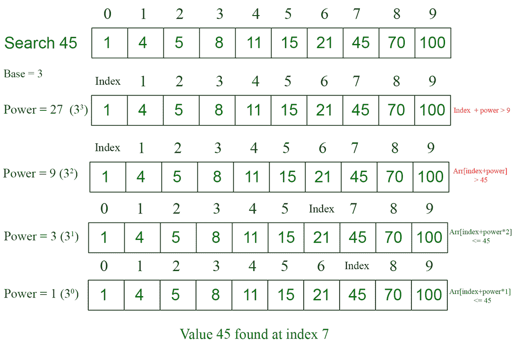

# N 基修正二分搜索法算法

> 原文:[https://www . geesforgeks . org/n-base-modified-binary-search-algorithm/](https://www.geeksforgeeks.org/n-base-modified-binary-search-algorithm/)

**N 基修正二分搜索法**是一种基于数字基的算法，可用于在排序的[数组](https://www.geeksforgeeks.org/array-data-structure/) arr[]中查找元素。这个算法**是 [**的扩展**比位运算](https://www.geeksforgeeks.org/binary-search/)** ，运行时间也差不多。

**示例:**

> **输入:** arr[] = {0，1，4，5，8，11，15，21，45，70，100}，目标= 45
> **输出:** 7
> **说明:**索引 7 中存在值 45
> 
> **输入:** arr[] = {1，6，8，10}，目标= 9
> **输出:** -1
> **解释:**给定数组中不存在值 9。

**直觉:**一个数系的所有数都可以用另一个以任意数(如 2、3、7)为基数的数系来表示。例如，十进制的 **7 可以表示为 **(21) <sub>3</sub>** 在以 3** 为基数的**数制中。因此，按位二分搜索法的概念可以使用任何数字 **N** 作为数字系统的基础来实现。**

**方法:**通过将基数的幂(从 2 开始的任何正整数)加到和(最初为 0)上来搜索目标元素的索引。当找到这样的幂时，进行计算以计算它可用于找到目标指数的次数，并将该值与总和相加。计算一个幂可以使用多少次的部分类似于[二分搜索法文章](https://www.geeksforgeeks.org/binary-search/)中的“逐位二分搜索法”。

1.  定义一个**基数**数，以及一个大于或等于基数的**二次幂(二次幂有助于计算一次基数的幂可以有效地加到最终指数上的次数)**
2.  计算大于数组大小的**基数(N)** 的一次幂。(**N<sup>k</sup>T5【其中 k 是大于或等于 1 的整数，X <sup>k</sup> 是大于或等于数组大小的基数的一次幂)。**
3.  初始化一个索引 **(finId)** 为 0，它将存储**最终位置**，目标元素应该在所有迭代的末尾。
4.  当计算的功率大于 0 时循环，每次除以基值。
    1.  检查这个功率可以使用多少次，并将该值添加到 finId 中。
    2.  要检查这一点，请使用下面提到的条件:

> *   Finidi+base force < array size (m)
> *   Value in finidi+base force ≤ target

迭代完成后，检查最终索引处的值是否与目标值相同。如果不是，则数组中不存在该值。

**图解:**为了更好的理解，请看下图。



> **图解:** arr[] = {1，4，5，8，11，15，21，45，70，100}，数组大小(M) = 10，目标= 45，基数(N) = 3
> 
> **步骤:**
> 
> 1.  计算大于 10 (M)的 3 ( **基数**)的第一次幂(**幂**)，在这种情况下，**幂= 27** 。
> 2.  将最终索引( **finId** )初始化为 0(arr[]中目标值应该在末尾的位置)。
> 3.  现在迭代小于或等于 27 的 3 的幂( **Base** )，并将它们添加到索引中，如下所示:
>     1.  第一次迭代: **finId** = 0。 ***功率*** 为 27，不能使用，因为 **finId +功率> M.** 所以， **finId = 0** 。
>     2.  第二次迭代: **f** ***inId*** = 0。 ***威力*** 为 9，不能使用，因为**处的元素 finId +威力>目标**
>         即 arr【finId+威力】>目标。所以 **finId = 0** 。
>     3.  第三次迭代: **f** ***inId*** = 0。 ***力量*** 是 3，这个时候力量可以使用是因为**arr【finId+力量】<目标。**现在数一下 3 可以加多少次到 finId。在这种情况下，3 可以相加两次。**fi*****nId***第 3 次迭代后会是 6 (finId += 3 + 3)。3 不能添加超过 2 次，因为 finId 将通过目标值所在的索引。所以 **finId = 0 + 3 + 3 = 6** 。
>     4.  第 4 次迭代:**f*****iID***= 6。 ***功率*** 为 1， ***功率*** 可以使用，因为**arr【finId+power】≤target(45)。**再次数一数 **1** 可以使用多少次。在这种情况下，1 只能使用一次。所以用 finId 只加 1 一次。所以， **finId = 6+1 = 7** 。
> 4.  第四次迭代后，功率为 0，因此退出循环。
> 5.  arr[7] =目标。所以这个值是在索引 7 找到的。

**备注:**

1.  在每次迭代中，功率可以使用最大**(基数-1)**次
2.  Base 可以是从 2 开始的任何正整数
3.  需要对数组进行排序才能执行此搜索算法

下面是上述方法的实现(与经典的二分搜索法算法相比):

## C++

```
// C++ code to implement the above approach
#include<bits/stdc++.h>
using namespace std;

#define N 3
#define PowerOf2 4

int Numeric_Base_Search(int arr[], int M, 
                        int target){
    unsigned long long i, step1, 
    step2 = PowerOf2, times;

    // Find the first power of N 
    // greater than the array size
    for (step1 = 1; step1 < M; step1 *= N);

    for (i = 0; step1; step1 /= N)

        // Each time a power can be used
        // count how many times 
        // it can be used
        if (i + step1 < M && arr[i + step1] 
            <= target){
            for (times = 1; step2; 
                 step2 >>= 1)
                if (i + 
                    (step1 * (times + step2)) 
                    < M && 
                    arr[i + 
                      (step1 * (times + step2))] 
                    <= target)
                    times += step2;

            step2 = PowerOf2;

            // Add to final result 
            // how many times 
            // can the power be used
            i += times * step1;
        }

    // Return the index 
    // if the element is present in array
    // else return -1
    return arr[i] == target ? i : -1;
}

// Driver code
int main(){
    int arr[10] = 
    {1, 4, 5, 8, 11, 15, 21, 45, 70, 100};
    int target = 45, M = 10;
    int answer  = Numeric_Base_Search(arr, M, target);
    cout<<answer;
    return 0;
}
```

## Java 语言(一种计算机语言，尤用于创建网站)

```
// Java code to implement the above approach
class GFG {

    static int N = 3;
    static int PowerOf2 = 4;

    static int Numeric_Base_Search(int[] arr, int M,
                                   int target)
    {
        int i, step1, step2 = PowerOf2, times;

        // Find the first power of N
        // greater than the array size
        for (step1 = 1; step1 < M; step1 *= N)
            ;

        for (i = 0; step1 > 0; step1 /= N) {

            // Each time a power can be used
            // count how many times
            // it can be used
            if (i + step1 < M && arr[i + step1] <= target) {
                for (times = 1; step2 > 0; step2 >>= 1)
                    if (i + (step1 * (times + step2)) < M
                        && arr[i
                               + (step1 * (times + step2))]
                               <= target)
                        times += step2;

                step2 = PowerOf2;

                // Add to final result
                // how many times
                // can the power be used
                i += times * step1;
            }
        }

        // Return the index
        // if the element is present in array
        // else return -1
        return arr[i] == target ? i : -1;
    }

    // Driver code
    public static void main(String args[])
    {
        int[] arr = { 1, 4, 5, 8, 11, 15, 21, 45, 70, 100 };
        int target = 45, M = 10;
        int answer = Numeric_Base_Search(arr, M, target);
        System.out.println(answer);
    }
}

// This code is contributed by Saurabh Jaiswal
```

## 蟒蛇 3

```
# Python code for the above approach
N = 3
PowerOf2 = 4

def Numeric_Base_Search(arr, M, target):
    i = None
    step1 = None
    step2 = PowerOf2
    times = None

    # Find the first power of N
    # greater than the array size
    step1 = 1
    while(step1 < M):
        step1 *= N

    i = 0
    while(step1):
        step1 = step1 // N

        # Each time a power can be used
        # count how many times
        # it can be used
        if (i + step1 < M and arr[i + step1] <= target):
            times=1
            while(step2):
                step2 >>= 1
                if (i + (step1 * (times + step2)) < M and arr[i + (step1 * (times + step2))] <= target):
                    times += step2;

            step2 = PowerOf2;

            # Add to final result
            # how many times
            # can the power be used
            i += times * step1

    # Return the index
    # if the element is present in array
    # else return -1
    return i if arr[i] == target else -1

   # Driver code
arr = [1, 4, 5, 8, 11, 15, 21, 45, 70, 100]
target = 45
M = 10
answer = Numeric_Base_Search(arr, M, target)
print(answer)

  # This code is contributed by Saurabh Jaiswal
```

## C#

```
// C# code to implement the above approach
using System;
class GFG {

    static int N = 3;
    static int PowerOf2 = 4;

    static int Numeric_Base_Search(int[] arr, int M,
                                   int target)
    {
        int i, step1, step2 = PowerOf2, times;

        // Find the first power of N
        // greater than the array size
        for (step1 = 1; step1 < M; step1 *= N)
            ;

        for (i = 0; step1 > 0; step1 /= N) {

            // Each time a power can be used
            // count how many times
            // it can be used
            if (i + step1 < M && arr[i + step1] <= target) {
                for (times = 1; step2 > 0; step2 >>= 1)
                    if (i + (step1 * (times + step2)) < M
                        && arr[i
                               + (step1 * (times + step2))]
                               <= target)
                        times += step2;

                step2 = PowerOf2;

                // Add to final result
                // how many times
                // can the power be used
                i += times * step1;
            }
        }
        // Return the index
        // if the element is present in array
        // else return -1
        return arr[i] == target ? i : -1;
    }

    // Driver code
    public static void Main()
    {
        int[] arr = { 1, 4, 5, 8, 11, 15, 21, 45, 70, 100 };
        int target = 45, M = 10;
        int answer = Numeric_Base_Search(arr, M, target);
        Console.WriteLine(answer);
    }
}

// This code is contributed by ukasp.
```

## java 描述语言

```
<script>
    // JavaScript code for the above approach
    let N = 3
    let PowerOf2 = 4

    function Numeric_Base_Search(arr, M,
      target) {
      let i, step1,
        step2 = PowerOf2, times;

      // Find the first power of N 
      // greater than the array size
      for (step1 = 1; step1 < M; step1 *= N);

      for (i = 0; step1; step1 /= N)

        // Each time a power can be used
        // count how many times 
        // it can be used
        if (i + step1 < M && arr[i + step1]
          <= target) {
          for (times = 1; step2;
            step2 >>= 1)
            if (i +
              (step1 * (times + step2))
              < M &&
              arr[i +
              (step1 * (times + step2))]
              <= target)
              times += step2;

          step2 = PowerOf2;

          // Add to final result 
          // how many times 
          // can the power be used
          i += times * step1;
        }

      // Return the index 
      // if the element is present in array
      // else return -1
      return arr[i] == target ? i : -1;
    }

    // Driver code
    let arr =
      [1, 4, 5, 8, 11, 15, 21, 45, 70, 100];
    let target = 45, M = 10;
    let answer = Numeric_Base_Search(arr, M, target);
    document.write(answer);

  // This code is contributed by Potta Lokesh
  </script>
```

**Output**

```
7
```

**时间复杂度:**O(log<sub>N</sub>M<sub>T5 * log<sub>2</sub>N)
T9】辅助空间: O(1)</sub>