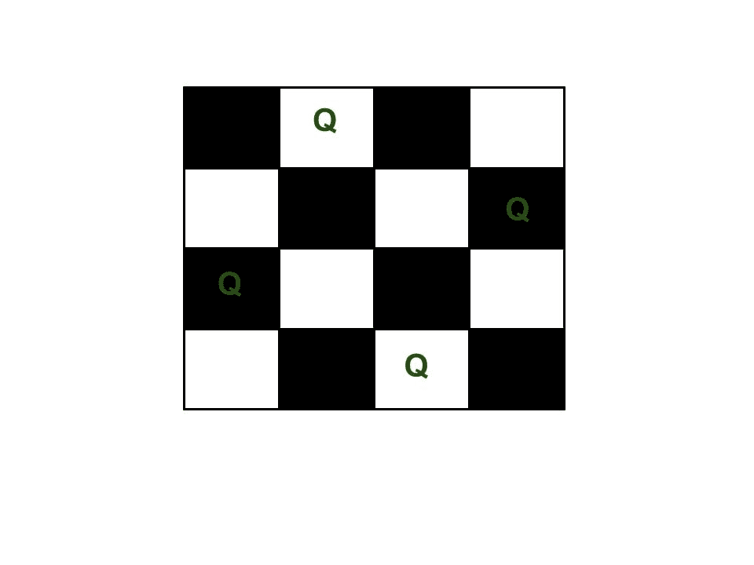

# N 皇后问题|回溯-3

> 原文:[https://www . geesforgeks . org/n-queen-problem-backtrack-3/](https://www.geeksforgeeks.org/n-queen-problem-backtracking-3/)

我们分别在[第 1 集](https://www.geeksforgeeks.org/backtracking-set-1-the-knights-tour-problem/)和[第 2 集](https://www.geeksforgeeks.org/backttracking-set-2-rat-in-a-maze/)中讨论了骑士之旅和迷宫中的老鼠问题。让我们讨论 N 皇后作为另一个例子问题，可以使用回溯来解决。

N 皇后是把 N 个象棋皇后放在 N×N 个棋盘上，使得没有两个皇后互相攻击的问题。例如，以下是 4 皇后问题的解决方案。

[](https://media.geeksforgeeks.org/wp-content/uploads/N_Queen_Problem.jpg)

预期的输出是一个二进制矩阵，其中皇后所在的块有 1。例如，以下是上述 4 皇后解决方案的输出矩阵。

```
              { 0,  1,  0,  0}
              { 0,  0,  0,  1}
              { 1,  0,  0,  0}
              { 0,  0,  1,  0}
```

**朴素算法**
生成船上皇后的所有可能配置，并打印满足给定约束的配置。

```
while there are untried configurations
{
   generate the next configuration
   if queens don't attack in this configuration then
   {
      print this configuration;
   }
}
```

**回溯算法**
想法是从最左边一列开始，将皇后一个接一个地放置在不同的列中。当我们在一列中放置一个皇后时，我们检查与已经放置的皇后的冲突。在当前列中，如果我们找到没有冲突的行，我们将该行和列标记为解决方案的一部分。如果由于冲突我们没有找到这样的行，那么我们回溯并返回 false。

```
1) Start in the leftmost column
2) If all queens are placed
    return true
3) Try all rows in the current column. 
   Do following for every tried row.
    a) If the queen can be placed safely in this row 
       then mark this [row, column] as part of the 
       solution and recursively check if placing
       queen here leads to a solution.
    b) If placing the queen in [row, column] leads to
       a solution then return true.
    c) If placing queen doesn't lead to a solution then
       unmark this [row, column] (Backtrack) and go to 
       step (a) to try other rows.
3) If all rows have been tried and nothing worked,
   return false to trigger backtracking.
```

**实施回溯解决方案**

## C/C++

```
/* C/C++ program to solve N Queen Problem using
   backtracking */
#define N 4
#include <stdbool.h>
#include <stdio.h>

/* A utility function to print solution */
void printSolution(int board[N][N])
{
    for (int i = 0; i < N; i++) {
        for (int j = 0; j < N; j++)
            printf(" %d ", board[i][j]);
        printf("\n");
    }
}

/* A utility function to check if a queen can
   be placed on board[row][col]. Note that this
   function is called when "col" queens are
   already placed in columns from 0 to col -1.
   So we need to check only left side for
   attacking queens */
bool isSafe(int board[N][N], int row, int col)
{
    int i, j;

    /* Check this row on left side */
    for (i = 0; i < col; i++)
        if (board[row][i])
            return false;

    /* Check upper diagonal on left side */
    for (i = row, j = col; i >= 0 && j >= 0; i--, j--)
        if (board[i][j])
            return false;

    /* Check lower diagonal on left side */
    for (i = row, j = col; j >= 0 && i < N; i++, j--)
        if (board[i][j])
            return false;

    return true;
}

/* A recursive utility function to solve N
   Queen problem */
bool solveNQUtil(int board[N][N], int col)
{
    /* base case: If all queens are placed
      then return true */
    if (col >= N)
        return true;

    /* Consider this column and try placing
       this queen in all rows one by one */
    for (int i = 0; i < N; i++) {
        /* Check if the queen can be placed on
          board[i][col] */
        if (isSafe(board, i, col)) {
            /* Place this queen in board[i][col] */
            board[i][col] = 1;

            /* recur to place rest of the queens */
            if (solveNQUtil(board, col + 1))
                return true;

            /* If placing queen in board[i][col]
               doesn't lead to a solution, then
               remove queen from board[i][col] */
            board[i][col] = 0; // BACKTRACK
        }
    }

    /* If the queen cannot be placed in any row in
        this colum col  then return false */
    return false;
}

/* This function solves the N Queen problem using
   Backtracking. It mainly uses solveNQUtil() to 
   solve the problem. It returns false if queens
   cannot be placed, otherwise, return true and
   prints placement of queens in the form of 1s.
   Please note that there may be more than one
   solutions, this function prints one  of the
   feasible solutions.*/
bool solveNQ()
{
    int board[N][N] = { { 0, 0, 0, 0 },
                        { 0, 0, 0, 0 },
                        { 0, 0, 0, 0 },
                        { 0, 0, 0, 0 } };

    if (solveNQUtil(board, 0) == false) {
        printf("Solution does not exist");
        return false;
    }

    printSolution(board);
    return true;
}

// driver program to test above function
int main()
{
    solveNQ();
    return 0;
}
```

## Java 语言(一种计算机语言，尤用于创建网站)

```
/* Java program to solve N Queen Problem using
   backtracking */
public class NQueenProblem {
    final int N = 4;

    /* A utility function to print solution */
    void printSolution(int board[][])
    {
        for (int i = 0; i < N; i++) {
            for (int j = 0; j < N; j++)
                System.out.print(" " + board[i][j]
                                 + " ");
            System.out.println();
        }
    }

    /* A utility function to check if a queen can
       be placed on board[row][col]. Note that this
       function is called when "col" queens are already
       placeed in columns from 0 to col -1\. So we need
       to check only left side for attacking queens */
    boolean isSafe(int board[][], int row, int col)
    {
        int i, j;

        /* Check this row on left side */
        for (i = 0; i < col; i++)
            if (board[row][i] == 1)
                return false;

        /* Check upper diagonal on left side */
        for (i = row, j = col; i >= 0 && j >= 0; i--, j--)
            if (board[i][j] == 1)
                return false;

        /* Check lower diagonal on left side */
        for (i = row, j = col; j >= 0 && i < N; i++, j--)
            if (board[i][j] == 1)
                return false;

        return true;
    }

    /* A recursive utility function to solve N
       Queen problem */
    boolean solveNQUtil(int board[][], int col)
    {
        /* base case: If all queens are placed
           then return true */
        if (col >= N)
            return true;

        /* Consider this column and try placing
           this queen in all rows one by one */
        for (int i = 0; i < N; i++) {
            /* Check if the queen can be placed on
               board[i][col] */
            if (isSafe(board, i, col)) {
                /* Place this queen in board[i][col] */
                board[i][col] = 1;

                /* recur to place rest of the queens */
                if (solveNQUtil(board, col + 1) == true)
                    return true;

                /* If placing queen in board[i][col]
                   doesn't lead to a solution then
                   remove queen from board[i][col] */
                board[i][col] = 0; // BACKTRACK
            }
        }

        /* If the queen can not be placed in any row in
           this colum col, then return false */
        return false;
    }

    /* This function solves the N Queen problem using
       Backtracking.  It mainly uses solveNQUtil () to
       solve the problem. It returns false if queens
       cannot be placed, otherwise, return true and
       prints placement of queens in the form of 1s.
       Please note that there may be more than one
       solutions, this function prints one of the
       feasible solutions.*/
    boolean solveNQ()
    {
        int board[][] = { { 0, 0, 0, 0 },
                          { 0, 0, 0, 0 },
                          { 0, 0, 0, 0 },
                          { 0, 0, 0, 0 } };

        if (solveNQUtil(board, 0) == false) {
            System.out.print("Solution does not exist");
            return false;
        }

        printSolution(board);
        return true;
    }

    // driver program to test above function
    public static void main(String args[])
    {
        NQueenProblem Queen = new NQueenProblem();
        Queen.solveNQ();
    }
}
// This code is contributed by Abhishek Shankhadhar
```

## 蟒蛇 3

```
# Python3 program to solve N Queen 
# Problem using backtracking
global N
N = 4

def printSolution(board):
    for i in range(N):
        for j in range(N):
            print (board[i][j], end = " ")
        print()

# A utility function to check if a queen can
# be placed on board[row][col]. Note that this
# function is called when "col" queens are
# already placed in columns from 0 to col -1.
# So we need to check only left side for
# attacking queens
def isSafe(board, row, col):

    # Check this row on left side
    for i in range(col):
        if board[row][i] == 1:
            return False

    # Check upper diagonal on left side
    for i, j in zip(range(row, -1, -1), 
                    range(col, -1, -1)):
        if board[i][j] == 1:
            return False

    # Check lower diagonal on left side
    for i, j in zip(range(row, N, 1), 
                    range(col, -1, -1)):
        if board[i][j] == 1:
            return False

    return True

def solveNQUtil(board, col):

    # base case: If all queens are placed
    # then return true
    if col >= N:
        return True

    # Consider this column and try placing
    # this queen in all rows one by one
    for i in range(N):

        if isSafe(board, i, col):

            # Place this queen in board[i][col]
            board[i][col] = 1

            # recur to place rest of the queens
            if solveNQUtil(board, col + 1) == True:
                return True

            # If placing queen in board[i][col
            # doesn't lead to a solution, then
            # queen from board[i][col]
            board[i][col] = 0

    # if the queen can not be placed in any row in
    # this colum col then return false
    return False

# This function solves the N Queen problem using
# Backtracking. It mainly uses solveNQUtil() to
# solve the problem. It returns false if queens
# cannot be placed, otherwise return true and
# placement of queens in the form of 1s.
# note that there may be more than one
# solutions, this function prints one of the
# feasible solutions.
def solveNQ():
    board = [ [0, 0, 0, 0],
              [0, 0, 0, 0],
              [0, 0, 0, 0],
              [0, 0, 0, 0] ]

    if solveNQUtil(board, 0) == False:
        print ("Solution does not exist")
        return False

    printSolution(board)
    return True

# Driver Code
solveNQ()

# This code is contributed by Divyanshu Mehta
```

## C#

```
// C# program to solve N Queen Problem 
// using backtracking 
using System;

class GFG 
{
    readonly int N = 4;

    /* A utility function to print solution */
    void printSolution(int [,]board)
    {
        for (int i = 0; i < N; i++) 
        {
            for (int j = 0; j < N; j++)
                Console.Write(" " + board[i, j]
                                  + " ");
            Console.WriteLine();
        }
    }

    /* A utility function to check if a queen can
    be placed on board[row,col]. Note that this
    function is called when "col" queens are already
    placeed in columns from 0 to col -1\. So we need
    to check only left side for attacking queens */
    bool isSafe(int [,]board, int row, int col)
    {
        int i, j;

        /* Check this row on left side */
        for (i = 0; i < col; i++)
            if (board[row,i] == 1)
                return false;

        /* Check upper diagonal on left side */
        for (i = row, j = col; i >= 0 && 
             j >= 0; i--, j--)
            if (board[i,j] == 1)
                return false;

        /* Check lower diagonal on left side */
        for (i = row, j = col; j >= 0 && 
                      i < N; i++, j--)
            if (board[i, j] == 1)
                return false;

        return true;
    }

    /* A recursive utility function to solve N
    Queen problem */
    bool solveNQUtil(int [,]board, int col)
    {
        /* base case: If all queens are placed
        then return true */
        if (col >= N)
            return true;

        /* Consider this column and try placing
        this queen in all rows one by one */
        for (int i = 0; i < N; i++) 
        {
            /* Check if the queen can be placed on
            board[i,col] */
            if (isSafe(board, i, col))
            {
                /* Place this queen in board[i,col] */
                board[i, col] = 1;

                /* recur to place rest of the queens */
                if (solveNQUtil(board, col + 1) == true)
                    return true;

                /* If placing queen in board[i,col]
                doesn't lead to a solution then
                remove queen from board[i,col] */
                board[i, col] = 0; // BACKTRACK
            }
        }

        /* If the queen can not be placed in any row in
        this colum col, then return false */
        return false;
    }

    /* This function solves the N Queen problem using
    Backtracking. It mainly uses solveNQUtil () to
    solve the problem. It returns false if queens
    cannot be placed, otherwise, return true and
    prints placement of queens in the form of 1s.
    Please note that there may be more than one
    solutions, this function prints one of the
    feasible solutions.*/
    bool solveNQ()
    {
        int [,]board = {{ 0, 0, 0, 0 },
                        { 0, 0, 0, 0 },
                        { 0, 0, 0, 0 },
                        { 0, 0, 0, 0 }};

        if (solveNQUtil(board, 0) == false)
        {
            Console.Write("Solution does not exist");
            return false;
        }

        printSolution(board);
        return true;
    }

    // Driver Code
    public static void Main(String []args)
    {
        GFG Queen = new GFG();
        Queen.solveNQ();
    }
}

// This code is contributed by Princi Singh
```

**Output:** The 1 values indicate placements of queens

```
 0  0  1  0 
 1  0  0  0 
 0  0  0  1 
 0  1  0  0 

```

**is _ safe()函数中的优化**
思想是不检查左右对角线中的每个元素，而是使用对角线的属性:
1。对于每个右对角线，I 和 j 的和是恒定且唯一的，其中 I 是元素的行，j 是元素的
列。
2。对于每个左对角线，I 和 j 的差是恒定且唯一的，其中 I 和 j 分别是元素的行和列。

**回溯解的实现(带优化)**

## C/C++

```
/* C/C++ program to solve N Queen Problem using
   backtracking */
#define N 4
#include <stdbool.h>
#include <stdio.h>
/* ld is an array where its indices indicate row-col+N-1
 (N-1) is for shifting the difference to store negative 
 indices */
int ld[30] = { 0 };
/* rd is an array where its indices indicate row+col
   and used to check whether a queen can be placed on 
   right diagonal or not*/
int rd[30] = { 0 };
/*column array where its indices indicates column and 
  used to check whether a queen can be placed in that
    row or not*/
int cl[30] = { 0 };
/* A utility function to print solution */
void printSolution(int board[N][N])
{
    for (int i = 0; i < N; i++) {
        for (int j = 0; j < N; j++)
            printf(" %d ", board[i][j]);
        printf("\n");
    }
}

/* A recursive utility function to solve N
   Queen problem */
bool solveNQUtil(int board[N][N], int col)
{
    /* base case: If all queens are placed
      then return true */
    if (col >= N)
        return true;

    /* Consider this column and try placing
       this queen in all rows one by one */
    for (int i = 0; i < N; i++) {
        /* Check if the queen can be placed on
          board[i][col] */
        /* A check if a queen can be placed on 
           board[row][col].We just need to check
           ld[row-col+n-1] and rd[row+coln] where
           ld and rd are for left and right 
           diagonal respectively*/
        if ((ld[i - col + N - 1] != 1 &&
                  rd[i + col] != 1) && cl[i] != 1) {
            /* Place this queen in board[i][col] */
            board[i][col] = 1;
            ld[i - col + N - 1] =
                          rd[i + col] = cl[i] = 1;

            /* recur to place rest of the queens */
            if (solveNQUtil(board, col + 1))
                return true;

            /* If placing queen in board[i][col]
               doesn't lead to a solution, then
               remove queen from board[i][col] */
            board[i][col] = 0; // BACKTRACK
            ld[i - col + N - 1] =
                         rd[i + col] = cl[i] = 0;
        }
    }

    /* If the queen cannot be placed in any row in
        this colum col  then return false */
    return false;
}
/* This function solves the N Queen problem using
   Backtracking. It mainly uses solveNQUtil() to 
   solve the problem. It returns false if queens
   cannot be placed, otherwise, return true and
   prints placement of queens in the form of 1s.
   Please note that there may be more than one
   solutions, this function prints one  of the
   feasible solutions.*/
bool solveNQ()
{
    int board[N][N] = { { 0, 0, 0, 0 },
                        { 0, 0, 0, 0 },
                        { 0, 0, 0, 0 },
                        { 0, 0, 0, 0 } };

    if (solveNQUtil(board, 0) == false) {
        printf("Solution does not exist");
        return false;
    }

    printSolution(board);
    return true;
}

// driver program to test above function
int main()
{
    solveNQ();
    return 0;
}
```

## Java 语言(一种计算机语言，尤用于创建网站)

```
/* Java program to solve N Queen Problem 
using backtracking */
import java.util.*;

class GFG 
{
static int N = 4;

/* ld is an array where its indices indicate row-col+N-1
(N-1) is for shifting the difference to store negative 
indices */
static int []ld = new int[30];

/* rd is an array where its indices indicate row+col
and used to check whether a queen can be placed on 
right diagonal or not*/
static int []rd = new int[30];

/*column array where its indices indicates column and 
used to check whether a queen can be placed in that
    row or not*/
static int []cl = new int[30];

/* A utility function to print solution */
static void printSolution(int board[][])
{
    for (int i = 0; i < N; i++)
    {
        for (int j = 0; j < N; j++)
            System.out.printf(" %d ", board[i][j]);
        System.out.printf("\n");
    }
}

/* A recursive utility function to solve N
Queen problem */
static boolean solveNQUtil(int board[][], int col)
{
    /* base case: If all queens are placed
    then return true */
    if (col >= N)
        return true;

    /* Consider this column and try placing
    this queen in all rows one by one */
    for (int i = 0; i < N; i++)
    {

        /* Check if the queen can be placed on
        board[i][col] */
        /* A check if a queen can be placed on 
        board[row][col].We just need to check
        ld[row-col+n-1] and rd[row+coln] where
        ld and rd are for left and right 
        diagonal respectively*/
        if ((ld[i - col + N - 1] != 1 &&
             rd[i + col] != 1) && cl[i] != 1)
        {
            /* Place this queen in board[i][col] */
            board[i][col] = 1;
            ld[i - col + N - 1] =
            rd[i + col] = cl[i] = 1;

            /* recur to place rest of the queens */
            if (solveNQUtil(board, col + 1))
                return true;

            /* If placing queen in board[i][col]
            doesn't lead to a solution, then
            remove queen from board[i][col] */
            board[i][col] = 0; // BACKTRACK
            ld[i - col + N - 1] =
            rd[i + col] = cl[i] = 0;
        }
    }

    /* If the queen cannot be placed in any row in
        this colum col then return false */
    return false;
}
/* This function solves the N Queen problem using
Backtracking. It mainly uses solveNQUtil() to 
solve the problem. It returns false if queens
cannot be placed, otherwise, return true and
prints placement of queens in the form of 1s.
Please note that there may be more than one
solutions, this function prints one of the
feasible solutions.*/
static boolean solveNQ()
{
    int board[][] = {{ 0, 0, 0, 0 },
                     { 0, 0, 0, 0 },
                     { 0, 0, 0, 0 },
                     { 0, 0, 0, 0 }};

    if (solveNQUtil(board, 0) == false) 
    {
        System.out.printf("Solution does not exist");
        return false;
    }

    printSolution(board);
    return true;
}

// Driver Code
public static void main(String[] args)
{
    solveNQ();
}
}

// This code is contributed by Princi Singh
```

## 蟒蛇 3

```
""" Python3 program to solve N Queen Problem using 
backtracking """
N = 4

""" ld is an array where its indices indicate row-col+N-1 
(N-1) is for shifting the difference to store negative 
indices """
ld = [0] * 30

""" rd is an array where its indices indicate row+col 
and used to check whether a queen can be placed on 
right diagonal or not"""
rd = [0] * 30

"""column array where its indices indicates column and 
used to check whether a queen can be placed in that 
    row or not"""
cl = [0] * 30

""" A utility function to print solution """
def printSolution(board): 
    for i in range(N):
        for j in range(N):
            print(board[i][j], end = " ")
        print() 

""" A recursive utility function to solve N 
Queen problem """
def solveNQUtil(board, col): 

    """ base case: If all queens are placed
        then return True """
    if (col >= N):
        return True

    """ Consider this column and try placing
        this queen in all rows one by one """
    for i in range(N):

        """ Check if the queen can be placed on board[i][col] """
        """ A check if a queen can be placed on board[row][col].
        We just need to check ld[row-col+n-1] and rd[row+coln] 
        where ld and rd are for left and right diagonal respectively"""
        if ((ld[i - col + N - 1] != 1 and 
             rd[i + col] != 1) and cl[i] != 1):

            """ Place this queen in board[i][col] """
            board[i][col] = 1
            ld[i - col + N - 1] = rd[i + col] = cl[i] = 1

            """ recur to place rest of the queens """
            if (solveNQUtil(board, col + 1)):
                return True

            """ If placing queen in board[i][col] 
            doesn't lead to a solution, 
            then remove queen from board[i][col] """
            board[i][col] = 0 # BACKTRACK 
            ld[i - col + N - 1] = rd[i + col] = cl[i] = 0

            """ If the queen cannot be placed in
            any row in this colum col then return False """
    return False

""" This function solves the N Queen problem using 
Backtracking. It mainly uses solveNQUtil() to 
solve the problem. It returns False if queens 
cannot be placed, otherwise, return True and 
prints placement of queens in the form of 1s. 
Please note that there may be more than one 
solutions, this function prints one of the 
feasible solutions."""
def solveNQ():
    board = [[0, 0, 0, 0], 
             [0, 0, 0, 0],
             [0, 0, 0, 0],
             [0, 0, 0, 0]]
    if (solveNQUtil(board, 0) == False):
        printf("Solution does not exist")
        return False
    printSolution(board)
    return True

# Driver Code
solveNQ() 

# This code is contributed by SHUBHAMSINGH10
```

## C#

```
/* C# program to solve N Queen Problem 
using backtracking */
using System;

class GFG 
{
static int N = 4;

/* ld is an array where its indices indicate row-col+N-1
(N-1) is for shifting the difference to store negative 
indices */
static int []ld = new int[30];

/* rd is an array where its indices indicate row+col
and used to check whether a queen can be placed on 
right diagonal or not*/
static int []rd = new int[30];

/*column array where its indices indicates column and 
used to check whether a queen can be placed in that
    row or not*/
static int []cl = new int[30];

/* A utility function to print solution */
static void printSolution(int [,]board)
{
    for (int i = 0; i < N; i++)
    {
        for (int j = 0; j < N; j++)
            Console.Write(" {0} ", board[i, j]);
        Console.Write("\n");
    }
}

/* A recursive utility function to solve N
Queen problem */
static bool solveNQUtil(int [,]board, int col)
{
    /* base case: If all queens are placed
    then return true */
    if (col >= N)
        return true;

    /* Consider this column and try placing
    this queen in all rows one by one */
    for (int i = 0; i < N; i++)
    {

        /* Check if the queen can be placed on
        board[i,col] */
        /* A check if a queen can be placed on 
        board[row,col].We just need to check
        ld[row-col+n-1] and rd[row+coln] where
        ld and rd are for left and right 
        diagonal respectively*/
        if ((ld[i - col + N - 1] != 1 &&
             rd[i + col] != 1) && cl[i] != 1)
        {
            /* Place this queen in board[i,col] */
            board[i, col] = 1;
            ld[i - col + N - 1] =
            rd[i + col] = cl[i] = 1;

            /* recur to place rest of the queens */
            if (solveNQUtil(board, col + 1))
                return true;

            /* If placing queen in board[i,col]
            doesn't lead to a solution, then
            remove queen from board[i,col] */
            board[i, col] = 0; // BACKTRACK
            ld[i - col + N - 1] =
            rd[i + col] = cl[i] = 0;
        }
    }

    /* If the queen cannot be placed in any row in
        this colum col then return false */
    return false;
}

/* This function solves the N Queen problem using
Backtracking. It mainly uses solveNQUtil() to 
solve the problem. It returns false if queens
cannot be placed, otherwise, return true and
prints placement of queens in the form of 1s.
Please note that there may be more than one
solutions, this function prints one of the
feasible solutions.*/
static bool solveNQ()
{
    int [,]board = {{ 0, 0, 0, 0 },
                    { 0, 0, 0, 0 },
                    { 0, 0, 0, 0 },
                    { 0, 0, 0, 0 }};

    if (solveNQUtil(board, 0) == false) 
    {
        Console.Write("Solution does not exist");
        return false;
    }

    printSolution(board);
    return true;
}

// Driver Code
public static void Main(String[] args)
{
    solveNQ();
}
}

// This code is contributed by Rajput-Ji
```

**Output:** The 1 values indicate placements of queens

```
 0  0  1  0 
 1  0  0  0 
 0  0  0  1 
 0  1  0  0 

```

[打印 N 皇后问题](https://www.geeksforgeeks.org/printing-solutions-n-queen-problem/)中的所有解决方案

**来源:**
[http://see . Stanford . edu/materials/icpacs 106 b/H19-rec 回溯示例. pdf](http://see.stanford.edu/materials/icspacs106b/H19-RecBacktrackExamples.pdf)
[http://en.literateprograms.org/Eight_queens_puzzle_%28C%29](http://en.literateprograms.org/Eight_queens_puzzle_%28C%29)
http://en.wikipedia.org/wiki/Eight_queens_puzzle

如果你发现任何不正确的地方，或者你想分享更多关于上面讨论的话题的信息，请写评论。