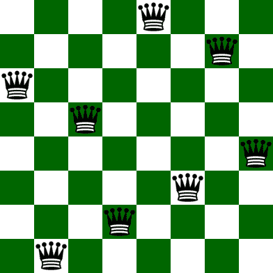

# N-Queen 问题|使用随机邻居爬山进行局部搜索

> 原文:[https://www . geesforgeks . org/n-queen-problem-local-search-use-hill-爬山-与随机邻居/](https://www.geeksforgeeks.org/n-queen-problem-local-search-using-hill-climbing-with-random-neighbour/)

**N** 皇后的问题是把 **N** 个象棋皇后放在 **N×N** 个棋盘上，这样就不会有两个皇后互相攻击。
比如下面是 **8** 皇后问题的解决方案。



> **输入:** N = 4
> **输出:**
> 0 1 0 0
> 0 0 0 1
> 1 0 0 0
> 0 0 1 0
> **解释:**
> 蚁后的位置为:
> 1 –{ 1，2 }
> 2 –{ 2，4 }
> 3 –{ 3，1 }
> 4 –{ 4，3}
> 正如我们看到的
> 那么，输出是正确的
> 
> **输入:** N = 8
> **输出:**
> 0 0 0 0 0 1 0 0 0 0
> 0 1 0 0 0 0 0 0 0
> 0 0 0 1 0 0 0 0
> 0 1 0 0 0 0 0
> 1 0 0 0 0 0 0 0 0
> 0 0 0 1 0 0 0 0 0
> 0 0 0 0 0 0 1
> 0 0 0 0 1 0 0 0 0 0 0 0 0 0 0 0

**方法:**思路是使用[爬山算法](https://www.geeksforgeeks.org/introduction-hill-climbing-artificial-intelligence/)。

*   虽然有像[回溯这样的算法来解决 N 皇后问题](https://www.geeksforgeeks.org/n-queen-problem-backtracking-3/)，但让我们采取人工智能的方法来解决这个问题。
*   很明显，人工智能并不能始终保证一个全局正确的解决方案，但它有相当好的成功率，约为 97%，这还不错。
*   问题中使用的所有术语的概念描述如下
    *   **状态的概念**–这里上下文中的状态是 N×N 板上 N 个皇后的任何配置。此外，为了减少搜索空间，让我们添加一个额外的约束，即在特定的列中只能有一个女王。程序中的状态是使用长度为 N 的数组实现的，这样，如果**状态[i]=j** ，则在列索引 **i** 和行索引 **j** 处有一个皇后。
    *   **邻居的概念**–一个状态的邻居是其他状态，其板配置与当前状态的板配置仅在单个皇后的位置上不同。这位与邻国不同的女王可能会被安排在同一列的任何地方。
    *   **优化函数或目标函数**–我们知道局部搜索是一种优化算法，它搜索局部空间来优化一个以状态为输入并给出某个值作为输出的函数。在这种情况下，状态目标函数的值是相互攻击的皇后对的数量。我们这里的目标是找到一个目标值最小的状态。该函数的最大值为 NC2，最小值为 0。

**算法:**

1.  从随机状态(即电路板的随机配置)开始。
2.  扫描当前状态的所有可能邻居，并跳转到具有最高目标值的邻居(如果找到)。如果不存在目标严格高于当前状态的邻居，但存在目标相等的邻居，则跳到任意随机邻居(避开路肩和/或局部最优)。
3.  重复步骤 2，直到找到一个目标严格高于其所有邻居目标的州，然后进入步骤 4。
4.  这样在局部搜索之后找到的状态要么是局部最优，要么是全局最优。没有办法摆脱局部最优，但是每次遇到局部最优时添加一个随机邻居或随机重启会增加获得全局最优(我们问题的解决方案)的机会。
5.  输出状态并返回。

*   很容易看出，在我们的例子中，全局最优值是 0，因为它是可以相互攻击的最小数量的皇后对。此外，随机重启有更高的机会实现全局最优，但我们仍然使用随机邻居，因为我们的 N 皇后问题没有大量的局部最优解，随机邻居比随机重启更快。
*   **结论:**
    1.  **随机邻居**逃不过肩膀，但是逃脱局部最优的几率很小。
    2.  **随机重启**都逃不过肩膀，有很高的几率逃脱局部最优。

下面是爬山算法的实现:

## 卡片打印处理机（Card Print Processor 的缩写）

```
// C++ implementation of the
// above approach
#include <iostream>
#include <math.h>

#define N 8
using namespace std;

// A utility function that configures
// the 2D array "board" and
// array "state" randomly to provide
// a starting point for the algorithm.
void configureRandomly(int board[][N],
                       int* state)
{

    // Seed for the random function
    srand(time(0));

    // Iterating through the
    // column indices
    for (int i = 0; i < N; i++) {

        // Getting a random row index
        state[i] = rand() % N;

        // Placing a queen on the
        // obtained place in
        // chessboard.
        board[state[i]][i] = 1;
    }
}

// A utility function that prints
// the 2D array "board".
void printBoard(int board[][N])
{

    for (int i = 0; i < N; i++) {
        cout << " ";
        for (int j = 0; j < N; j++) {
            cout << board[i][j] << " ";
        }
        cout << "\n";
    }
}

// A utility function that prints
// the array "state".
void printState(int* state)
{

    for (int i = 0; i < N; i++) {
        cout << " " << state[i] << " ";
    }
    cout << endl;
}

// A utility function that compares
// two arrays, state1 and state2 and
// returns true if equal
// and false otherwise.
bool compareStates(int* state1,
                   int* state2)
{

    for (int i = 0; i < N; i++) {
        if (state1[i] != state2[i]) {
            return false;
        }
    }
    return true;
}

// A utility function that fills
// the 2D array "board" with
// values "value"
void fill(int board[][N], int value)
{
    for (int i = 0; i < N; i++) {
        for (int j = 0; j < N; j++) {
            board[i][j] = value;
        }
    }
}

// This function calculates the
// objective value of the
// state(queens attacking each other)
// using the board by the
// following logic.
int calculateObjective(int board[][N],
                       int* state)
{

    // For each queen in a column, we check
    // for other queens falling in the line
    // of our current queen and if found,
    // any, then we increment the variable
    // attacking count.

    // Number of queens attacking each other,
    // initially zero.
    int attacking = 0;

    // Variables to index a particular
    // row and column on board.
    int row, col;

    for (int i = 0; i < N; i++) {

        // At each column 'i', the queen is
        // placed at row 'state[i]', by the
        // definition of our state.

        // To the left of same row
        // (row remains constant
        // and col decreases)
        row = state[i], col = i - 1;
        while (col >= 0
               && board[row][col] != 1) {
            col--;
        }
        if (col >= 0
            && board[row][col] == 1) {
            attacking++;
        }

        // To the right of same row
        // (row remains constant
        // and col increases)
        row = state[i], col = i + 1;
        while (col < N
               && board[row][col] != 1) {
            col++;
        }
        if (col < N
            && board[row][col] == 1) {
            attacking++;
        }

        // Diagonally to the left up
        // (row and col simultaneously
        // decrease)
        row = state[i] - 1, col = i - 1;
        while (col >= 0 && row >= 0
               && board[row][col] != 1) {
            col--;
            row--;
        }
        if (col >= 0 && row >= 0
            && board[row][col] == 1) {
            attacking++;
        }

        // Diagonally to the right down
        // (row and col simultaneously
        // increase)
        row = state[i] + 1, col = i + 1;
        while (col < N && row < N
               && board[row][col] != 1) {
            col++;
            row++;
        }
        if (col < N && row < N
            && board[row][col] == 1) {
            attacking++;
        }

        // Diagonally to the left down
        // (col decreases and row
        // increases)
        row = state[i] + 1, col = i - 1;
        while (col >= 0 && row < N
               && board[row][col] != 1) {
            col--;
            row++;
        }
        if (col >= 0 && row < N
            && board[row][col] == 1) {
            attacking++;
        }

        // Diagonally to the right up
        // (col increases and row
        // decreases)
        row = state[i] - 1, col = i + 1;
        while (col < N && row >= 0
               && board[row][col] != 1) {
            col++;
            row--;
        }
        if (col < N && row >= 0
            && board[row][col] == 1) {
            attacking++;
        }
    }

    // Return pairs.
    return (int)(attacking / 2);
}

// A utility function that
// generates a board configuration
// given the state.
void generateBoard(int board[][N],
                   int* state)
{

    fill(board, 0);
    for (int i = 0; i < N; i++) {
        board[state[i]][i] = 1;
    }
}

// A utility function that copies
// contents of state2 to state1.
void copyState(int* state1, int* state2)
{

    for (int i = 0; i < N; i++) {
        state1[i] = state2[i];
    }
}

// This function gets the neighbour
// of the current state having
// the least objective value
// amongst all neighbours as
// well as the current state.
void getNeighbour(int board[][N],
                  int* state)
{
    // Declaring and initializing the
    // optimal board and state with
    // the current board and the state
    // as the starting point.

    int opBoard[N][N];
    int opState[N];

    copyState(opState,
              state);
    generateBoard(opBoard,
                  opState);

    // Initializing the optimal
    // objective value

    int opObjective
        = calculateObjective(opBoard,
                             opState);

    // Declaring and initializing
    // the temporary board and
    // state for the purpose
    // of computation.

    int NeighbourBoard[N][N];
    int NeighbourState[N];

    copyState(NeighbourState,
              state);
    generateBoard(NeighbourBoard,
                  NeighbourState);

    // Iterating through all
    // possible neighbours
    // of the board.

    for (int i = 0; i < N; i++) {
        for (int j = 0; j < N; j++) {

            // Condition for skipping the
            // current state

            if (j != state[i]) {

                // Initializing temporary
                // neighbour with the
                // current neighbour.

                NeighbourState[i] = j;
                NeighbourBoard[NeighbourState[i]][i]
                    = 1;
                NeighbourBoard[state[i]][i]
                    = 0;

                // Calculating the objective
                // value of the neighbour.

                int temp
                    = calculateObjective(
                        NeighbourBoard,
                        NeighbourState);

                // Comparing temporary and optimal
                // neighbour objectives and if
                // temporary is less than optimal
                // then updating accordingly.

                if (temp <= opObjective) {
                    opObjective = temp;
                    copyState(opState,
                              NeighbourState);
                    generateBoard(opBoard,
                                  opState);
                }

                // Going back to the original
                // configuration for the next
                // iteration.

                NeighbourBoard[NeighbourState[i]][i]
                    = 0;
                NeighbourState[i] = state[i];
                NeighbourBoard[state[i]][i] = 1;
            }
        }
    }

    // Copying the optimal board and
    // state thus found to the current
    // board and, state since c++ doesn't
    // allow returning multiple values.

    copyState(state, opState);
    fill(board, 0);
    generateBoard(board, state);
}

void hillClimbing(int board[][N],
                  int* state)
{

    // Declaring  and initializing the
    // neighbour board and state with
    // the current board and the state
    // as the starting point.

    int neighbourBoard[N][N] = {};
    int neighbourState[N];

    copyState(neighbourState, state);
    generateBoard(neighbourBoard,
                  neighbourState);

    do {

        // Copying the neighbour board and
        // state to the current board and
        // state, since a neighbour
        // becomes current after the jump.

        copyState(state, neighbourState);
        generateBoard(board, state);

        // Getting the optimal neighbour

        getNeighbour(neighbourBoard,
                     neighbourState);

        if (compareStates(state,
                          neighbourState)) {

            // If neighbour and current are
            // equal then no optimal neighbour
            // exists and therefore output the
            // result and break the loop.

            printBoard(board);
            break;
        }
        else if (calculateObjective(board,
                                    state)
                 == calculateObjective(
                        neighbourBoard,
                        neighbourState)) {

            // If neighbour and current are
            // not equal but their objectives
            // are equal then we are either
            // approaching a shoulder or a
            // local optimum, in any case,
            // jump to a random neighbour
            // to escape it.

            // Random neighbour
            neighbourState[rand() % N]
                = rand() % N;
            generateBoard(neighbourBoard,
                          neighbourState);
        }

    } while (true);
}

// Driver code
int main()
{

    int state[N] = {};
    int board[N][N] = {};

    // Getting a starting point by
    // randomly configuring the board
    configureRandomly(board, state);

    // Do hill climbing on the
    // board obtained
    hillClimbing(board, state);

    return 0;
}
```

**Output:** 

```
 0 0 1 0 0 0 0 0 
 0 0 0 0 0 1 0 0 
 0 0 0 0 0 0 0 1 
 1 0 0 0 0 0 0 0 
 0 0 0 1 0 0 0 0 
 0 0 0 0 0 0 1 0 
 0 0 0 0 1 0 0 0 
 0 1 0 0 0 0 0 0
```

**复杂性分析**

*   该算法的时间复杂度可分为三个部分:
    1.  **计算目标**–目标的计算包括遍历船上所有蚁后并检查攻击蚁后的数量，这是由我们在 **O(N <sup>2</sup> )** 时间中的*计算目标*功能完成的。

    2.  **邻居选择和邻居数量**–我们的问题中的邻居描述给出了当前状态的总共 **N(N-1)** 个邻居。选择程序是*最适合*的，因此需要遍历所有邻居，也就是 **O(N <sup>2</sup> )** 。

    3.  **搜索空间**–我们问题的搜索空间总共由**N<sup>N</sup>T5<sup>T7】状态组成，对应船上 **N** 皇后的所有可能配置。请注意，这是在考虑了每列一个皇后的附加约束之后。</sup>** 
*   因此，我们算法的最坏情况时间复杂度是 **O(N <sup>N</sup> )** 。但是，这种最坏的情况在实践中很少发生，因此我们可以有把握地认为它与针对 N 皇后问题的任何其他算法一样好。因此，有效时间复杂度仅包括计算达到某一深度的所有邻居的目标(搜索跳数)，这不依赖于 **N.** 因此，如果搜索深度为 **d** ，则时间复杂度为**O(N<sup>2</sup>* N<sup>2</sup>* d)**，即 **O(d*N <sup>4</sup> )。**