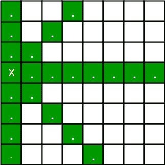
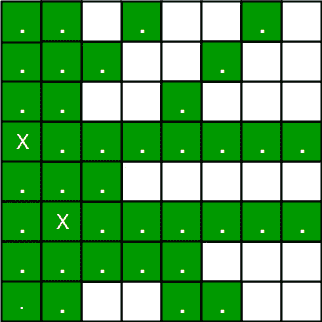
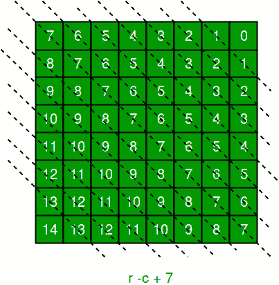
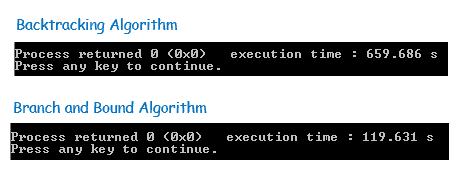

# 使用分支和界限的 N 皇后问题

> 原文:[https://www . geesforgeks . org/n-queen-problem-use-branch-and-bound/](https://www.geeksforgeeks.org/n-queen-problem-using-branch-and-bound/)

**N 皇后难题**是将 N [棋](https://en.wikipedia.org/wiki/Chess) [皇后](https://en.wikipedia.org/wiki/Queen_%28chess%29)放在 N×N 棋盘上，这样就不会有两个皇后互相威胁的问题。因此，解决方案要求没有两个皇后共享同一行、列或对角线。

N 皇后的回溯算法已经在[这里](https://www.geeksforgeeks.org/backtracking-set-3-n-queen-problem/)讨论过了。在回溯解决方案中，当我们遇到死胡同时，我们就回溯。 ***在分支和绑定解决方案中，在构建了部分解决方案后，我们发现没有必要再深入了，因为我们将陷入死胡同**。*

让我们从描述回溯解决方案开始。“想法是将皇后一个接一个地放在不同的列中，从最左边的列开始。当我们在一列中放置一个皇后时，我们检查与已经放置的皇后的冲突。在当前列中，如果我们找到没有冲突的行，我们将该行和列标记为解决方案的一部分。如果由于冲突而没有找到这样的行，那么我们就回溯并返回 false。”

[ ](https://media.geeksforgeeks.org/wp-content/uploads/backqueen.jpg) [ ](https://media.geeksforgeeks.org/wp-content/uploads/queen.jpg)

1.  对于第一个女王，总共有 8 种可能性，因为我们可以将第一个女王放在第一列的任何一行。让我们把女王 1 号放在第 3 排。
2.  放置第一个女王后，第二个女王还有 7 种可能。但是等等，我们真的没有 7 种可能性。我们不能将女王 2 放在第 2、3 或 4 行，因为这些细胞受到女王 1 的攻击。因此，皇后 2 只剩下 8–3 = 5 个有效位置。
3.  在为女王 2 选择位置后，女王 3 的选择就更少了，因为其列中的大多数细胞都受到了前 2 位女王的攻击。

我们需要找到一种有效的方法来跟踪哪些细胞受到攻击。在以前的解决方案中，我们保留了一个 8 乘 8 的布尔矩阵，并在每次放置皇后时更新它，但这需要线性时间来更新，因为我们需要检查安全单元。
基本上我们要保证 4 件事:
1。没有两个女王共用一个专栏。
2。没有两个皇后共用一排。
3。没有两个女王共用一条从右上方到左下方的对角线。
4。没有两个女王共用一条从左上角到右下角的对角线。

第一个是自动的，因为我们存储解决方案的方式。对于数字 2、3 和 4，我们可以在 O(1)时间内执行更新。想法是保留**三个布尔数组，告诉我们哪些行和哪些对角线被占用**。

让我们先做一些预处理。让我们创建两个 N×N 矩阵，一个用于/对角线，另一个用于\对角线。让我们分别称它们为 slashCode 和 backslashCode。诀窍是以这样的方式填充它们:共享相同/对角线的两个皇后将在矩阵 slashCode 中具有相同的值，如果它们共享相同\对角线，它们将在 backslashCode 矩阵中具有相同的值。
对于 N×N 矩阵，使用以下公式填充斜线代码和反斜线代码矩阵–
斜线代码[行][列] =行+列
反斜线代码[行][列] =行–列+ (N-1)

使用上述公式将得到以下矩阵

[](https://media.geeksforgeeks.org/wp-content/uploads/king.jpg)

[](https://media.geeksforgeeks.org/wp-content/uploads/kingqueen.jpg)

反斜杠代码中的“N–1”是为了确保代码永远不会是负数，因为我们将使用代码作为数组中的索引。
现在，在将 queen i 放置在行 j 之前，我们首先检查是否使用了行 j(使用数组存储行信息)。然后我们检查是否使用了斜杠代码(j + i)或反斜杠代码(j–I+7)(保留两个数组，告诉我们哪些对角线被占用)。如果是，那么我们必须为皇后 I 尝试一个不同的位置。如果不是，那么我们将该行和两条对角线标记为已使用，并在皇后 i + 1 上递归。在递归调用返回之后，在我们尝试 queen i 的另一个位置之前，我们需要再次将行、斜杠代码和反斜杠代码重置为未使用的，就像前面注释中的代码一样。

以下是上述想法的实施–

## C++

```
/* C++ program to solve N Queen Problem using Branch
   and Bound */
#include <iostream>
# include <string.h>
using namespace std;
#define N 8

/* A utility function to print solution */
void printSolution(int board[N][N])
{
    for (int i = 0; i < N; i++)
    {
        for (int j = 0; j < N; j++)
            cout << " "<< board[i][j];
        cout << "\n";
    }
}

/* A Optimized function to check if a queen can
be placed on board[row][col] */
bool isSafe(int row, int col, int slashCode[N][N],
            int backslashCode[N][N], bool rowLookup[],
      bool slashCodeLookup[], bool backslashCodeLookup[] )
{
    if (slashCodeLookup[slashCode[row][col]] ||
        backslashCodeLookup[backslashCode[row][col]] ||
        rowLookup[row])
    return false;

    return true;
}

/* A recursive utility function
to solve N Queen problem */
bool solveNQueensUtil(int board[N][N], int col,
    int slashCode[N][N], int backslashCode[N][N],
                                  bool rowLookup[N],
                            bool slashCodeLookup[],
                           bool backslashCodeLookup[] )
{
    /* base case: If all queens are placed
    then return true */
    if (col >= N)
        return true;

    /* Consider this column and try placing
       this queen in all rows one by one */
    for (int i = 0; i < N; i++)
    {
        /* Check if queen can be placed on
           board[i][col] */
        if ( isSafe(i, col, slashCode,
                    backslashCode, rowLookup,
          slashCodeLookup, backslashCodeLookup) )
        {
            /* Place this queen in board[i][col] */
            board[i][col] = 1;
            rowLookup[i] = true;
            slashCodeLookup[slashCode[i][col]] = true;
            backslashCodeLookup[backslashCode[i][col]] = true;

            /* recur to place rest of the queens */
            if ( solveNQueensUtil(board, col + 1,
                                  slashCode, backslashCode,
             rowLookup, slashCodeLookup, backslashCodeLookup) )
                return true;

            /* If placing queen in board[i][col]
            doesn't lead to a solution, then backtrack */

            /* Remove queen from board[i][col] */
            board[i][col] = 0;
            rowLookup[i] = false;
            slashCodeLookup[slashCode[i][col]] = false;
            backslashCodeLookup[backslashCode[i][col]] = false;
        }
    }

    /* If queen can not be place in any row in
        this column col then return false */
    return false;
}

/* This function solves the N Queen problem using
Branch and Bound. It mainly uses solveNQueensUtil() to
solve the problem. It returns false if queens
cannot be placed, otherwise return true and
prints placement of queens in the form of 1s.
Please note that there may be more than one
solutions, this function prints one of the
feasible solutions.*/
bool solveNQueens()
{
    int board[N][N];
    memset(board, 0, sizeof board);

    // helper matrices
    int slashCode[N][N];
    int backslashCode[N][N];

    // arrays to tell us which rows are occupied
    bool rowLookup[N] = {false};

    //keep two arrays to tell us
    // which diagonals are occupied
    bool slashCodeLookup[2*N - 1] = {false};
    bool backslashCodeLookup[2*N - 1] = {false};

    // initialize helper matrices
    for (int r = 0; r < N; r++)
        for (int c = 0; c < N; c++) {
          slashCode[r] = r + c,
            backslashCode[r] = r - c + 7;
        }

    if (solveNQueensUtil(board, 0,
                          slashCode, backslashCode,
      rowLookup, slashCodeLookup, backslashCodeLookup) ==
                                                 false )
    {
        cout << "Solution does not exist";
        return false;
    }

    // solution found
    printSolution(board);
    return true;
}

// Driver program to test above function
int main()
{
    solveNQueens();

    return 0;
}

// this code is contributed by shivanisinghss2110
```

## C

```
/* C++ program to solve N Queen Problem using Branch
   and Bound */
#include<stdio.h>
#include<string.h>
#include<stdbool.h>
#define N 8

/* A utility function to print solution */
void printSolution(int board[N][N])
{
    for (int i = 0; i < N; i++)
    {
        for (int j = 0; j < N; j++)
            printf("%2d ", board[i][j]);
        printf("\n");
    }
}

/* A Optimized function to check if a queen can
be placed on board[row][col] */
bool isSafe(int row, int col, int slashCode[N][N],
            int backslashCode[N][N], bool rowLookup[],
      bool slashCodeLookup[], bool backslashCodeLookup[] )
{
    if (slashCodeLookup[slashCode[row][col]] ||
        backslashCodeLookup[backslashCode[row][col]] ||
        rowLookup[row])
    return false;

    return true;
}

/* A recursive utility function
to solve N Queen problem */
bool solveNQueensUtil(int board[N][N], int col,
    int slashCode[N][N], int backslashCode[N][N],
                                  bool rowLookup[N],
                            bool slashCodeLookup[],
                           bool backslashCodeLookup[] )
{
    /* base case: If all queens are placed
    then return true */
    if (col >= N)
        return true;

    /* Consider this column and try placing
       this queen in all rows one by one */
    for (int i = 0; i < N; i++)
    {
        /* Check if queen can be placed on
           board[i][col] */
        if ( isSafe(i, col, slashCode,
                    backslashCode, rowLookup,
          slashCodeLookup, backslashCodeLookup) )
        {
            /* Place this queen in board[i][col] */
            board[i][col] = 1;
            rowLookup[i] = true;
            slashCodeLookup[slashCode[i][col]] = true;
            backslashCodeLookup[backslashCode[i][col]] = true;

            /* recur to place rest of the queens */
            if ( solveNQueensUtil(board, col + 1,
                                  slashCode, backslashCode,
             rowLookup, slashCodeLookup, backslashCodeLookup) )
                return true;

            /* If placing queen in board[i][col]
            doesn't lead to a solution, then backtrack */

            /* Remove queen from board[i][col] */
            board[i][col] = 0;
            rowLookup[i] = false;
            slashCodeLookup[slashCode[i][col]] = false;
            backslashCodeLookup[backslashCode[i][col]] = false;
        }
    }

    /* If queen can not be place in any row in
        this column col then return false */
    return false;
}

/* This function solves the N Queen problem using
Branch and Bound. It mainly uses solveNQueensUtil() to
solve the problem. It returns false if queens
cannot be placed, otherwise return true and
prints placement of queens in the form of 1s.
Please note that there may be more than one
solutions, this function prints one of the
feasible solutions.*/
bool solveNQueens()
{
    int board[N][N];
    memset(board, 0, sizeof board);

    // helper matrices
    int slashCode[N][N];
    int backslashCode[N][N];

    // arrays to tell us which rows are occupied
    bool rowLookup[N] = {false};

    //keep two arrays to tell us
    // which diagonals are occupied
    bool slashCodeLookup[2*N - 1] = {false};
    bool backslashCodeLookup[2*N - 1] = {false};

    // initialize helper matrices
    for (int r = 0; r < N; r++)
        for (int c = 0; c < N; c++) {
          slashCode[r] = r + c,
            backslashCode[r] = r - c + 7;
        }

    if (solveNQueensUtil(board, 0,
                          slashCode, backslashCode,
      rowLookup, slashCodeLookup, backslashCodeLookup) ==
                                                 false )
    {
        printf("Solution does not exist");
        return false;
    }

    // solution found
    printSolution(board);
    return true;
}

// Driver program to test above function
int main()
{
    solveNQueens();

    return 0;
}
```

## Java 语言(一种计算机语言，尤用于创建网站)

```
// Java program to solve N Queen Problem
// using Branch and Bound
import java.io.*;
import java.util.Arrays;

class GFG{

static int N = 8;

// A utility function to print solution
static void printSolution(int board[][])
{
    int N = board.length;
    for(int i = 0; i < N; i++)
    {
        for(int j = 0; j < N; j++)
            System.out.printf("%2d ", board[i][j]);

        System.out.printf("\n");
    }
}

// A Optimized function to check if a queen
// can be placed on board[row][col]
static boolean isSafe(int row, int col,
                      int slashCode[][],
                      int backslashCode[][],
                      boolean rowLookup[],
                      boolean slashCodeLookup[],
                      boolean backslashCodeLookup[])
{
    if (slashCodeLookup[slashCode[row][col]] ||
        backslashCodeLookup[backslashCode[row][col]] ||
        rowLookup[row])
        return false;

    return true;
}

// A recursive utility function to
// solve N Queen problem
static boolean solveNQueensUtil(
    int board[][], int col, int slashCode[][],
    int backslashCode[][], boolean rowLookup[],
    boolean slashCodeLookup[],
    boolean backslashCodeLookup[])
{

    // Base case: If all queens are placed
    // then return true
    int N = board.length;

    if (col >= N)
        return true;

    // Consider this column and try placing
    // this queen in all rows one by one
    for(int i = 0; i < N; i++)
    {
        // Check if queen can be placed on board[i][col]
        if (isSafe(i, col, slashCode, backslashCode,
                   rowLookup, slashCodeLookup,
                   backslashCodeLookup))
        {

            // Place this queen in board[i][col]
            board[i][col] = 1;
            rowLookup[i] = true;
            slashCodeLookup[slashCode[i][col]] = true;
            backslashCodeLookup[backslashCode[i][col]] = true;

            // recur to place rest of the queens
            if (solveNQueensUtil(
                    board, col + 1, slashCode,
                    backslashCode, rowLookup,
                    slashCodeLookup,
                    backslashCodeLookup))
                return true;

            // If placing queen in board[i][col] doesn't
            // lead to a solution, then backtrack

            // Remove queen from board[i][col]
            board[i][col] = 0;
            rowLookup[i] = false;
            slashCodeLookup[slashCode[i][col]] = false;
            backslashCodeLookup[backslashCode[i][col]] = false;
        }
    }

    // If queen can not be place in any row
    // in this column col then return false
    return false;
}

/*
 * This function solves the N Queen problem using Branch
 * and Bound. It mainly uses solveNQueensUtil() to solve
 * the problem. It returns false if queens cannot be
 * placed, otherwise return true and prints placement of
 * queens in the form of 1s. Please note that there may
 * be more than one solutions, this function prints one
 * of the feasible solutions.
 */
static boolean solveNQueens()
{
    int board[][] = new int[N][N];

    // Helper matrices
    int slashCode[][] = new int[N][N];
    int backslashCode[][] = new int[N][N];

    // Arrays to tell us which rows are occupied
    boolean[] rowLookup = new boolean[N];

    // Keep two arrays to tell us
    // which diagonals are occupied
    boolean slashCodeLookup[] = new boolean[2 * N - 1];
    boolean backslashCodeLookup[] = new boolean[2 * N - 1];

    // Initialize helper matrices
    for(int r = 0; r < N; r++)
        for(int c = 0; c < N; c++)
        {
            slashCode[r] = r + c;
            backslashCode[r] = r - c + 7;
        }

    if (solveNQueensUtil(board, 0, slashCode,
                         backslashCode, rowLookup,
                         slashCodeLookup,
                         backslashCodeLookup) == false)
    {
        System.out.printf("Solution does not exist");
        return false;
    }

    // Solution found
    printSolution(board);
    return true;
}

// Driver code
public static void main(String[] args)
{
    solveNQueens();
}
}

// This code is contributed by sujitmeshram
```

## 蟒蛇 3

```
""" Python3 program to solve N Queen Problem
using Branch or Bound """

N = 8

""" A utility function to prsolution """
def printSolution(board):
    for i in range(N):
        for j in range(N):
            print(board[i][j], end = " ")
        print()

""" A Optimized function to check if
a queen can be placed on board[row][col] """
def isSafe(row, col, slashCode, backslashCode,
           rowLookup, slashCodeLookup,
                       backslashCodeLookup):
    if (slashCodeLookup[slashCode[row][col]] or
        backslashCodeLookup[backslashCode[row][col]] or
        rowLookup[row]):
        return False
    return True

""" A recursive utility function
   to solve N Queen problem """
def solveNQueensUtil(board, col, slashCode, backslashCode,
                     rowLookup, slashCodeLookup,
                     backslashCodeLookup):

    """ base case: If all queens are
       placed then return True """
    if(col >= N):
        return True
    for i in range(N):
        if(isSafe(i, col, slashCode, backslashCode,
                  rowLookup, slashCodeLookup,
                  backslashCodeLookup)):

            """ Place this queen in board[i][col] """
            board[i][col] = 1
            rowLookup[i] = True
            slashCodeLookup[slashCode[i][col]] = True
            backslashCodeLookup[backslashCode[i][col]] = True

            """ recur to place rest of the queens """
            if(solveNQueensUtil(board, col + 1,
                                slashCode, backslashCode,
                                rowLookup, slashCodeLookup,
                                backslashCodeLookup)):
                return True

            """ If placing queen in board[i][col]
            doesn't lead to a solution,then backtrack """

            """ Remove queen from board[i][col] """
            board[i][col] = 0
            rowLookup[i] = False
            slashCodeLookup[slashCode[i][col]] = False
            backslashCodeLookup[backslashCode[i][col]] = False

    """ If queen can not be place in any row in
    this column col then return False """
    return False

""" This function solves the N Queen problem using
Branch or Bound. It mainly uses solveNQueensUtil()to
solve the problem. It returns False if queens
cannot be placed,otherwise return True or
prints placement of queens in the form of 1s.
Please note that there may be more than one
solutions,this function prints one of the
feasible solutions."""
def solveNQueens():
    board = [[0 for i in range(N)]
                for j in range(N)]

    # helper matrices
    slashCode = [[0 for i in range(N)]
                    for j in range(N)]
    backslashCode = [[0 for i in range(N)]
                        for j in range(N)]

    # arrays to tell us which rows are occupied
    rowLookup = [False] * N

    # keep two arrays to tell us
    # which diagonals are occupied
    x = 2 * N - 1
    slashCodeLookup = [False] * x
    backslashCodeLookup = [False] * x

    # initialize helper matrices
    for rr in range(N):
        for cc in range(N):
            slashCode[rr][cc] = rr + cc
            backslashCode[rr][cc] = rr - cc + 7

    if(solveNQueensUtil(board, 0, slashCode, backslashCode,
                        rowLookup, slashCodeLookup,
                        backslashCodeLookup) == False):
        print("Solution does not exist")
        return False

    # solution found
    printSolution(board)
    return True

# Driver Cde
solveNQueens()

# This code is contributed by SHUBHAMSINGH10
```

## java 描述语言

```
<script>

// JavaScript program to solve N Queen Problem
// using Branch and Bound

let N = 8;

// A utility function to print solution
function printSolution(board)
{
    let N = board.length;
    for(let i = 0; i < N; i++)
    {
        for(let j = 0; j < N; j++)
            document.write(board[i][j]+" ");

        document.write("<br>");
    }
}

// A Optimized function to check if a queen
// can be placed on board[row][col]
function isSafe(row,col,slashCode,backslashCode,rowLookup,slashCodeLookup,backslashCodeLookup)
{
    if (slashCodeLookup[slashCode[row][col]] ||
        backslashCodeLookup[backslashCode[row][col]] ||
        rowLookup[row])
        return false;

    return true;
}

// A recursive utility function to
// solve N Queen problem
function solveNQueensUtil(board,col,slashCode,
backslashCode,rowLookup,slashCodeLookup,backslashCodeLookup)
{
    // Base case: If all queens are placed
    // then return true
    //let N = board.length;

    if (col >= N)
        return true;

    // Consider this column and try placing
    // this queen in all rows one by one
    for(let i = 0; i < N; i++)
    {
        // Check if queen can be placed on board[i][col]
        if (isSafe(i, col, slashCode, backslashCode,
                   rowLookup, slashCodeLookup,
                   backslashCodeLookup))
        {

            // Place this queen in board[i][col]
            board[i][col] = 1;
            rowLookup[i] = true;
            slashCodeLookup[slashCode[i][col]] = true;
            backslashCodeLookup[backslashCode[i][col]] = true;

            // recur to place rest of the queens
            if (solveNQueensUtil(
                    board, col + 1, slashCode,
                    backslashCode, rowLookup,
                    slashCodeLookup,
                    backslashCodeLookup))
                return true;

            // If placing queen in board[i][col] doesn't
            // lead to a solution, then backtrack

            // Remove queen from board[i][col]
            board[i][col] = 0;
            rowLookup[i] = false;
            slashCodeLookup[slashCode[i][col]] = false;
            backslashCodeLookup[backslashCode[i][col]] = false;
        }
    }

    // If queen can not be place in any row
    // in this column col then return false
    return false;
}

/*
 * This function solves the N Queen problem using Branch
 * and Bound. It mainly uses solveNQueensUtil() to solve
 * the problem. It returns false if queens cannot be
 * placed, otherwise return true and prints placement of
 * queens in the form of 1s. Please note that there may
 * be more than one solutions, this function prints one
 * of the feasible solutions.
 */
function solveNQueens()
{
    let board = new Array(N);

    // Helper matrices
    let slashCode = new Array(N);
    let backslashCode = new Array(N);

    for(let i=0;i<N;i++)
    {
        board[i]=new Array(N);
        slashCode[i]=new Array(N);
        backslashCode[i]=new Array(N);
        for(let j=0;j<N;j++)
        {
            board[i][j]=0;
            slashCode[i][j]=0;
            backslashCode[i][j]=0;
        }
    }

    // Arrays to tell us which rows are occupied
    let rowLookup = new Array(N);
     for(let i=0;i<N;i++)
        rowLookup[i]=false;

    // Keep two arrays to tell us
    // which diagonals are occupied
    let slashCodeLookup = new Array(2 * N - 1);
    let backslashCodeLookup = new Array(2 * N - 1);
     for(let i=0;i<2*N-1;i++)
    {
        slashCodeLookup[i]=false;
        backslashCodeLookup[i]=false;
    }

    // Initialize helper matrices
    for(let r = 0; r < N; r++)
        for(let c = 0; c < N; c++)
        {
            slashCode[r] = r + c;
            backslashCode[r] = r - c + 7;
        }

    if (solveNQueensUtil(board, 0, slashCode,
                         backslashCode, rowLookup,
                         slashCodeLookup,
                         backslashCodeLookup) == false)
    {
        document.write("Solution does not exist");
        return false;
    }

    // Solution found
    printSolution(board);
    return true;
}

// Driver code
solveNQueens();

// This code is contributed by avanitrachhadiya2155

</script>
```

**输出:**

```
 1  0  0  0  0  0  0  0 
 0  0  0  0  0  0  1  0 
 0  0  0  0  1  0  0  0 
 0  0  0  0  0  0  0  1 
 0  1  0  0  0  0  0  0 
 0  0  0  1  0  0  0  0 
 0  0  0  0  0  1  0  0 
 0  0  1  0  0  0  0  0
```

**性能:**
在本地机器上运行 N = 32 时，回溯解耗时 659.68 秒，而以上分支定界解耗时仅 119.63 秒。对于更大的数值
，差异甚至会更大

[](https://media.geeksforgeeks.org/wp-content/cdn-uploads/image111.png)

**参考文献:**
[【https://en.wikipedia.org/wiki/Eight_queens_puzzle】](https://en.wikipedia.org/wiki/Eight_queens_puzzle)
[【www.cs.cornell.edu/~wdtseng/icpc/notes/bt2.pdf】](http://www.cs.cornell.edu/~wdtseng/icpc/notes/bt2.pdf)
本文由**阿迪蒂亚·戈埃尔**供稿。如果你喜欢极客博客并想投稿，你也可以写一篇文章并把你的文章邮寄到 review-team@geeksforgeeks.org。看到你的文章出现在极客博客主页上，帮助其他极客。
如果发现任何不正确的地方，或者你想分享更多关于上述话题的信息，请写评论