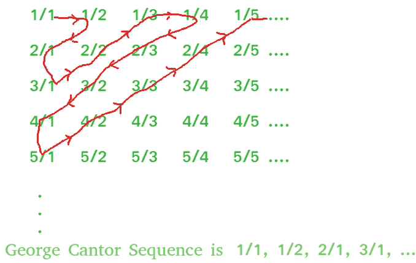

# 乔治·康托有理数集的第 N 项

> 原文:[https://www . geesforgeks . org/n-th-term-of-George-cantor-set-of-rational-numbers/](https://www.geeksforgeeks.org/n-th-term-of-george-cantor-set-of-rational-numbers/)

名叫数学家乔治·康托给出了有理数集是可枚举的一个证明。我们不需要在这里证明，而是需要确定有理数集合中的第 n 项。
**例:**

```
Input : N = 8
Output : 2/3

Input : N = 15
Output : 1/5
See image for reference of counting.
```

有理数的集合如下图所示:



这里第一项是 1/1，第二项是 1/2，第三项是 2/1，第四项是 3/1，第五项是 2/2，第六项是 1/3 以此类推……

> 1.将此视为一个**矩阵(二维数组)**，其中**行从 1 到 n，列从 1 到 n。**
> 2。**行/列**会给出有理数。
> 3。从上图观察图案，可以清楚如何穿过矩阵，即**从左到右向上倾斜，然后从右到左向下，直到我们到达第 N 个位置。**
> 4。有 4 个规则的重复模式
> 5。每次迭代后，移动到下一个数字，继续使用计数器 k 计算其位置，然后与 N 进行比较

## C++

```
// C++ program to find N-th term in
// George Cantor set of rational numbers
#include <bits/stdc++.h>
using namespace std;

void georgeCantor(int n)
{    
    int i = 1; // let i = numerator
    int j = 1; // let j = denominator
    int k = 1; // to keep the check of no. of terms

    // loop till k is not equal to n
    while (k < n)
    {
        j++ , k++;

        // check if k is already equal to N
        // then the first term is the required
        // rational number
        if (k == n)
            break;

        // loop for traversing from right to left
        // downwards diagonally
        while (j > 1 && k < n) {
            i++, j--, k++;
        }

        if (k == n)
           break;

        i++, k++;

        if (k == n)
           break;

        // loop for traversing from left
        // to right upwards diagonally
        while (i > 1 && k < n) {
            i--, j++, k++;
        }       
    }   
    cout << "N-th term : "<<i<<" / "<<j;
}

// driver code
int main()
{
    int n = 15;   
    georgeCantor(n);  
    return 0;
}
```

## Java 语言(一种计算机语言，尤用于创建网站)

```
// Java program to find N-th term in
// George Cantor set of rational number
import java.io.*;

class GFG
{
    static void georgeCantor(int n)
    {
        // let i = numerator
        int i = 1;

        // let j = denominator
        int j = 1;

        // to keep the check of no. of terms
        int k = 1;

        // loop till k is not equal to n
        while (k < n)
        {
            j++ ;
            k++;

            // check if k is already equal to N
            // then the first term is the required
            // rational number
            if (k == n)
                break;

            // loop for traversing from right to left
            // downwards diagonally
            while (j > 1 && k < n) {
                i++;
                j--;
                k++;
            }

            if (k == n)
            break;

            i++;
            k++;

            if (k == n)
            break;

            // loop for traversing from left
            // to right upwards diagonally
            while (i > 1 && k < n) {
                i--;
                j++;
                k++;
            }
        }
        System.out.println("N-th term : "+i +"/" +j);
    }

    // Driver code
    public static void main (String[] args)
    {
        int n = 15;
        georgeCantor(n);

    }
}

// This code is contributed by vt_m
```

## 蟒蛇 3

```
# Python3 program to find N-th term in
# George Cantor set of rational numbers

def georgeCantor(n):

    # let i = numerator
    i = 1

    # let j = denominator
    j = 1 

    # to keep the check of no. of terms
    k = 1 

    # loop till k is not equal to n
    while k < n:
        j += 1
        k += 1

        # check if k is already equal to N
        # then the first term is the
        # required rational number
        if k == n:
            break

        # loop for traversing from right
        # to left downwards diagonally
        while j > 1 and k < n:
            i += 1
            j -= 1
            k += 1

        if k == n:
            break

        i += 1
        k += 1

        if k == n:
            break

        # loop for traversing from left
        # to right upwards diagonally
        while i > 1 and k < n:
            i -= 1
            j += 1
            k += 1
    print ("N-th term : %d/%d"%(i, j))

# Driver code
n = 15
georgeCantor(n)

# This code is contributed
# by Shreyanshi Arun
```

## C#

```
// C# program to find N-th term in
// George Cantor set of rational number
using System;

class GFG
{
    static void georgeCantor(int n)
    {
        // let i = numerator
        int i = 1;

        // let j = denominator
        int j = 1;

        // to keep the check of no. of terms
        int k = 1;

        // loop till k is not equal to n
        while (k < n)
        {
            j++ ;
            k++;

            // check if k is already equal to N
            // then the first term is the required
            // rational number
            if (k == n)
                break;

            // loop for traversing from right to left
            // downwards diagonally
            while (j > 1 && k < n)
            {
                i++;
                j--;
                k++;
            }

            if (k == n)
            break;

            i++;
            k++;

            if (k == n)
            break;

            // loop for traversing from left
            // to right upwards diagonally
            while (i > 1 && k < n)
            {
                i--;
                j++;
                k++;
            }
        }
        Console.WriteLine("N-th term : "+i +"/" +j);
    }

    // Driver code
    public static void Main ()
    {
        int n = 15;
        georgeCantor(n);

    }
}

// This code is contributed by vt_m
```

## 服务器端编程语言（Professional Hypertext Preprocessor 的缩写）

```
<?php
// PHP program to find N-th
// term in George Cantor set
// of rational numbers

function georgeCantor($n)
{
    $i = 1; // let i = numerator
    $j = 1; // let j = denominator

    // to keep the check
    // of no. of terms
    $k = 1;

    // loop till k is
    // not equal to n
    while ($k < $n)
    {
        $j++ ; $k++;

        // check if k is already equal
        // to N then the first term is
        // the required rational number
        if ($k == $n)
            break;

        // loop for traversing from right
        // to left downwards diagonally
        while ($j > 1 && $k < $n)
        {
            $i++; $j--; $k++;
        }

        if ($k == $n)
        break;

        $i++; $k++;

        if ($k == $n)
        break;

        // loop for traversing from left
        // to right upwards diagonally
        while ($i > 1 && $k < $n)
        {
            $i--; $j++; $k++;
        }
    }
    echo "N-th term : ", $i, "/", $j;
}

// Driver Code
$n = 15;
georgeCantor($n);

// This code is contributed by ajit
?>
```

## java 描述语言

```
<script>
// JavaScript program to find N-th term in
// George Cantor set of rational number

    function georgeCantor(n)
    {
        // let i = numerator
        let i = 1;

        // let j = denominator
        let j = 1;

        // to keep the check of no. of terms
        let k = 1;

        // loop till k is not equal to n
        while (k < n)
        {
            j++ ;
            k++;

            // check if k is already equal to N
            // then the first term is the required
            // rational number
            if (k == n)
                break;

            // loop for traversing from right to left
            // downwards diagonally
            while (j > 1 && k < n) {
                i++;
                j--;
                k++;
            }

            if (k == n)
            break;

            i++;
            k++;

            if (k == n)
            break;

            // loop for traversing from left
            // to right upwards diagonally
            while (i > 1 && k < n) {
                i--;
                j++;
                k++;
            }
        }
        document.write("N-th term : "+i +"/" +j);
    }

// Driver Code

        let n = 15;
        georgeCantor(n);

// This code is contributed by susmitakundugoaldanga.
</script>
```

**输出:**

```
N-th term : 1/5
```