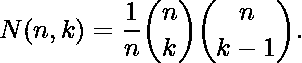

# 纳拉亚娜号

> 原文:[https://www.geeksforgeeks.org/narayana-number/](https://www.geeksforgeeks.org/narayana-number/)

在组合学中，[纳拉亚纳数](https://en.wikipedia.org/wiki/Narayana_number) **N(n，k)** ，n = 1，2，3 …，1 ≤ k ≤ n，组成自然数的三角数组，称为纳拉亚纳三角。由:

给出纳拉亚纳数 N(n，k)可用于查找包含括号的 *n 对*的表达式的数量，这些表达式匹配正确且包含 k 个不同的嵌套。
例如，N(4，2) = 6，使用四对括号，可以创建六个序列，每个序列包含两次子模式“()”:

```
()((()))  (())(())  (()(()))  ((()()))  ((())())  ((()))()
```

示例:

```
Input : n = 6, k = 2
Output : 15

Input : n = 8, k = 5
Output : 490
```

下面是求 N(n，k)的实现:

## C++

```
// CPP program to find Narayana number N(n, k)
#include<bits/stdc++.h>
using namespace std;

// Return product of coefficient terms in formula
int productofCoefficiet(int n, int k)
{
    int C[n + 1][k + 1];

    // Calculate value of Binomial Coefficient
    // in bottom up manner
    for (int i = 0; i <= n; i++)
    {
        for (int j = 0; j <= min(i, k); j++)
        {
            // Base Cases
            if (j == 0 || j == i)
                C[i][j] = 1;

            // Calculate value using previously
            // stored values
            else
                C[i][j] = C[i - 1][j - 1] + C[i - 1][j];
        }
    }

    return C[n][k] * C[n][k - 1];
}

// Returns Narayana number N(n, k)
int findNN(int n, int k)
{
    return (productofCoefficiet(n, k)) / n;
}

// Driven Program
int main()
{
    int n = 8, k = 5;
    cout << findNN(n, k) << endl;
    return 0;
}
```

## Java 语言(一种计算机语言，尤用于创建网站)

```
// Java program to find
// Narayana number N(n, k)
class GFG
{

    // Return product of coefficient
    // terms in formula
    static int productofCoefficiet(int n,
                                    int k)
    {
        int C[][] = new int[n + 1][k + 1];

        // Calculate value of Binomial
        // Coefficient in bottom up manner
        for (int i = 0; i <= n; i++)
        {
            for (int j = 0;
                    j <= Math.min(i, k); j++)
            {
                // Base Cases
                if (j == 0 || j == i)
                    C[i][j] = 1;

                // Calculate value using
                // previously stored values
                else
                    C[i][j] = C[i - 1][j - 1]
                                + C[i - 1][j];
            }
        }

        return C[n][k] * C[n][k - 1];
    }

    // Returns Narayana number N(n, k)
    static int findNN(int n, int k)
    {
        return (productofCoefficiet(n, k)) / n;
    }

    // Driver code
    public static void main (String[] args)
    {
        int n = 8, k = 5;
        System.out.println(findNN(n, k));
    }
}

// This code is contributed by Anant Agarwal.
```

## 蟒蛇 3

```
# Python3 program to find Narayana number N(n, k)

# Return product of coefficient terms in formula
def productofCoefficiet(n, k):
    C = [[0 for x in range(k+1)] for y in range(n+1)]

    # Calculate value of Binomial Coefficient
    # in bottom up manner
    for i in range(0, n+1):
        for j in range(0, min(i+1,k+1)):

            # Base Cases
            if (j == 0 or j == i):
                C[i][j] = 1

            # Calculate value using previously
            # stored values
            else :
                C[i][j] = C[i - 1][j - 1] + C[i - 1][j]

    return C[n][k] * C[n][k - 1]

# Returns Narayana number N(n, k)
def findNN(n, k):   
    return (productofCoefficiet(n, k)) / n

# Driven Program
n = 8
k = 5
print(int(findNN(n, k)))

# This code is contributed by Prasad Kshirsagar
```

## C#

```
// C# program to find
// Narayana number N(n, k)
using System;

class GFG {

    // Return product of coefficient
    // terms in formula
    static int productofCoefficiet(int n,
                                int k)
    {
        int[, ] C = new int[n + 1, k + 1];

        // Calculate value of Binomial
        // Coefficient in bottom up manner
        for (int i = 0; i <= n; i++) {
            for (int j = 0;
                j <= Math.Min(i, k); j++) {

                // Base Cases
                if (j == 0 || j == i)
                    C[i, j] = 1;

                // Calculate value using
                // previously stored values
                else
                    C[i, j] = C[i - 1, j - 1]
                            + C[i - 1, j];
            }
        }

        return C[n, k] * C[n, k - 1];
    }

    // Returns Narayana number N(n, k)
    static int findNN(int n, int k)
    {
        return (productofCoefficiet(n, k)) / n;
    }

    // Driver code
    public static void Main()
    {
        int n = 8, k = 5;
        Console.WriteLine(findNN(n, k));
    }
}

// This code is contributed by vt_m.
```

## 服务器端编程语言（Professional Hypertext Preprocessor 的缩写）

```
<?php
// PHP program to find
// Narayana number N(n, k)

// Return product of
// coefficient terms
// in formula
function productofCoefficiet($n, $k)
{
    $C = array(array());

    // Calculate value of
    // Binomial Coefficient
    // in bottom up manner
    for ($i = 0; $i <= $n; $i++)
    {
        for ($j = 0; $j <= min($i, $k); $j++)
        {

            // Base Cases
            if ($j == 0 || $j == $i)
                $C[$i][$j] = 1;

            // Calculate value
            // using previously
            // stored values
            else
                $C[$i][$j] = $C[$i - 1][$j - 1] +
                             $C[$i - 1][$j];
        }
    }

    return $C[$n][$k] * $C[$n][$k - 1];
}

// Returns Narayana
// number N(n, k)
function findNN( $n, $k)
{
    return (productofCoefficiet($n, $k)) /$n;
}

    // Driver Program
    $n = 8;
    $k = 5;
    echo findNN($n, $k) ;

// This code is contributed by anuj_67.
?>
```

## java 描述语言

```
<script>
// javascript program to find
// Narayana number N(n, k)

    // Return product of coefficient
    // terms in formula
    function productofCoefficiet(n, k)
    {
        let C = new Array(n + 1);
        // Loop to create 2D array using 1D array
    for (var i = 0; i < C.length; i++) {
    C[i] = new Array(2);
    }

        // Calculate value of Binomial
        // Coefficient in bottom up manner
        for (let i = 0; i <= n; i++)
        {
            for (let j = 0;
                    j <= Math.min(i, k); j++)
            {
                // Base Cases
                if (j == 0 || j == i)
                    C[i][j] = 1;

                // Calculate value using
                // previously stored values
                else
                    C[i][j] = C[i - 1][j - 1]
                                + C[i - 1][j];
            }
        }

        return C[n][k] * C[n][k - 1];
    }

    // Returns Narayana number N(n, k)
    function findNN(n, k)
    {
        return (productofCoefficiet(n, k)) / n;
    }

// Driver code

        let n = 8, k = 5;
        document.write(findNN(n, k));

</script>
```

输出:

```
490
```