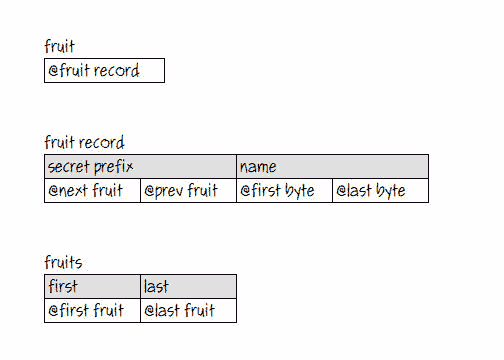
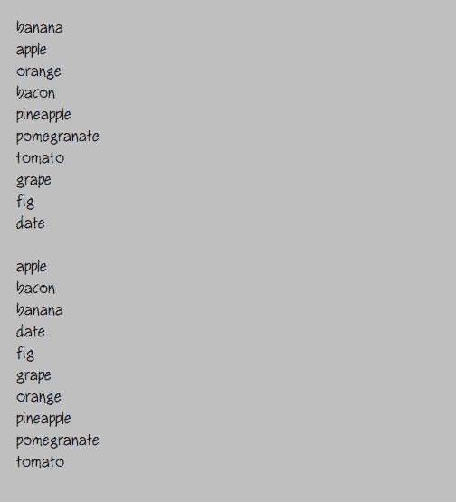

# 排序|自然语言编程

> 原文:[https://www . geesforgeks . org/自然语言-编程-排序/](https://www.geeksforgeeks.org/natural-language-programming-sorting/)

Osmosian 纯英语中唯一的复合数据类型是记录和双链表。当我们需要对列表进行排序时，我们使用简单的递归合并排序，我将在下面描述。但首先我们需要一些东西来分类。让我们对水果进行分类，并从类型定义开始:

```
A fruit is a thing with a name.
```

当“thing”一词出现在类型定义中时，我们的编译器会在幕后施展一点魔法，让 things(双关语)更加强大和灵活。例如，上面的定义实际上导致定义了以下数据类型:



所以水果实际上只是一个包含水果记录地址的指针。

每个 16 字节的水果记录都有一个隐藏的 8 字节前缀，带有两个指针，用于将这些记录与水果名称(字符串)链接到列表中。纯英语字符串存储在堆中，可以是任何长度。因此，水果记录中的名称实际上只是分别指向堆中字符串的第一个和最后一个字节的两个指针。*字符串*内存是自动管理的，但是*东西*内存是程序员管理的。

编译器生成的第三种类型充当水果记录列表的锚点。这样的列表简单地(直观地)被称为水果，水果的复数。

现在让我们将一些水果随机添加到列表中，并对它们进行排序。以下是我们测试程序中的顶级句子:

```
To run:
Start up.
Create some fruits.
Write the fruits on the console.
Skip a line on the console.
Sort the fruits.
Write the fruits on the console.
Destroy the fruits.
Wait for the escape key.
Shut down.
```

以下是被称为“创造一些果实”的程序:

```
To create some fruits:
Add "banana" to the fruits.
Add "apple" to the fruits.
Add "orange" to the fruits.
Add "bacon" to the fruits.
Add "pineapple" to the fruits.
Add "pomegranate" to the fruits.
Add "tomato" to the fruits.
Add "grape" to the fruits.
Add "fig" to the fruits.
Add "date" to the fruits.

To add a name to some fruits:
Allocate memory for a fruit.
Put the name into the fruit's name.
Append the fruit to the fruits.
```

现在我们准备分类了。这是排序例程:

```
To sort some fruits:
If the fruits' first is the fruits' last, exit.
Split the fruits into some left fruits and some right fruits.
Sort the left fruits.
Sort the right fruits.
Loop.
Put the left fruits' first into a left fruit.
Put the right fruits' first into a right fruit.
If the left fruit is nil, append the right fruits to the fruits; exit.
If the right fruit is nil, append the left fruits to the fruits; exit.
If the left fruit's name is greater than the right fruit's name,
  move the right fruit from the right fruits to the fruits; repeat.
Move the left fruit from the left fruits to the fruits.
Repeat.
```

当我们运行这个程序时，控制台上的输出如下所示:



但是它快吗？让我们看看如何使用这个修改后的测试程序:

```
To run:
Start up.
Write "Working..." on the console.
Put 10000 into a count.
Create some fruits using "apple" and the count.
Start a timer. Sort the fruits. Stop the timer.
Write the timer then " milliseconds for " then the count on the console.
Destroy the fruits.
Put 100000 into the count.
Create the fruits using "apple" and the count.
Start the timer. Sort the fruits. Stop the timer.
Write the timer then " milliseconds for " then the count on the console.
Destroy the fruits.
Put 1000000 into the count.
Create the fruits using "apple" and the count.
Start the timer. Sort the fruits. Stop the timer.
Write the timer then " milliseconds for " then the count on the console.
Destroy the fruits.
Wait for the escape key.
Shut down.
```

这一次的果实，在开始的时候，是这样的:

```
apple 0010000
apple 0009999
apple 0009998
...
```

控制台上的输出如下所示:


我承认，不太线性。但也不是指数级的糟糕。十倍的记录大约需要*十倍的时间来排序。用大的“0”和小的“n”和“日志”之类的东西有一种技术上的说法，但是普通英语程序员通常不这么认为。正如一个简单英语程序员所期望的那样，它是稳定的——具有重复排序值的记录保持它们的原始序列。*

好的，简单的，有用的东西。